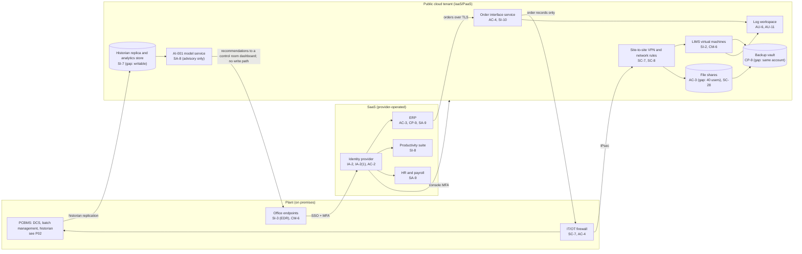

# Cloud Architecture and Control Placement: Cris Santos Company | Chemical | Small

**Organization:** Cris Santos Company, LLC (specialty chemical formulator and packager) | **Tier:** Small | **Provider:** Vendor-agnostic public cloud (IaaS/PaaS) plus SaaS (see section 3)
**Scope:** the cloud tenant (SYS-10) and the SaaS services (SYS-08, SYS-11, SYS-12, SYS-15), plus the data paths between the tenant and the plant's OT network (SSP, P02) | **Prepared:** 2026-07-24 by the IT Manager | **Approved:** VP Operations, 2026-09-04

## 1. Diagram

**Two data paths cross into OT.** Both are the reason this cloud map matters for process safety:
1. **Inbound:** the order interface sends production orders into the batch management system. It carries order records only (product code, quantity, due date). The batch management system rejects batch sizes outside the recipe limits, and the order interface validates the same fields first (SI-10).
2. **Outbound:** the historian replicates process data to the replica. The target design makes this one-way from a replica in the OT DMZ (P02 section 7).

No cloud service can write setpoints or recipes to the DCS. AI-001 recommendations appear on a read-only dashboard, and operators enter any accepted change by hand (P10).

## 2. Layers
| Layer | Components | Key controls | Responsibility |
|---|---|---|---|
| Identity | Identity provider, cloud IAM roles, service accounts | AC-2, AC-6, IA-2, IA-2(1) | Customer (configuration); provider (service) |
| Network / edge | Site-to-site VPN, cloud network rules, IT/OT firewall | SC-7, SC-8, AC-4 | Customer |
| Compute / application | LIMS virtual machines (IaaS); order interface and AI-001 on managed platforms (PaaS) | CM-6, SI-2, SI-10, SA-8 | IaaS: customer owns the guest OS and application. PaaS: provider owns the platform runtime; customer owns code, configuration, and identities |
| Data | Historian replica, file shares, backup vault | SC-28, CP-9, SI-7, AC-3 | Shared: provider encrypts storage; customer sets access, retention, isolation, and integrity checks |
| Logging / monitoring | Cloud audit logs, identity sign-in logs, log workspace | AU-6, AU-11, AU-12 | Shared: provider generates control-plane events; customer retains and reviews |
| SaaS applications | ERP, productivity suite, HR and payroll | AC-3, CP-9, SA-9, SI-8 | Provider (application and infrastructure); customer (users, roles, data, vendor oversight) |
| Physical / hypervisor | Provider data centers | PE family | Provider (inherited) |

`cloud-control-map.csv` has 26 rows: 18 customer, 5 shared, and 3 provider responsibilities.

## 3. Service categories and provider equivalents
The design does not depend on the provider. This table gives each provider's name for each service category, for reading its shared responsibility documentation.

| Service category | AWS | Microsoft Azure | Google Cloud |
|---|---|---|---|
| Virtual machines | Amazon EC2 | Azure Virtual Machines | Compute Engine |
| Container platform (order interface) | Amazon ECS | Azure Container Apps | Cloud Run |
| Managed ML platform (AI-001) | Amazon SageMaker AI | Azure Machine Learning | Vertex AI |
| Object storage (historian replica) | Amazon S3 | Azure Blob Storage | Cloud Storage |
| Managed file service | Amazon FSx | Azure Files | Filestore |
| Backup service | AWS Backup | Azure Backup | Backup and DR Service |
| Identity and access management | AWS IAM | Azure role-based access control with Microsoft Entra ID | Cloud IAM |
| Audit logging | AWS CloudTrail | Azure Monitor activity log | Cloud Audit Logs |
| Log workspace | Amazon CloudWatch Logs | Azure Monitor Logs (Log Analytics workspace) | Cloud Logging |
| Site-to-site VPN | AWS Site-to-Site VPN | Azure VPN Gateway | Cloud VPN |
| Network filtering | Security groups | Network security groups | VPC firewall rules |

Shared responsibility sources: SRC-AWS-SRM, SRC-AZURE-SRM, and SRC-GCP-SRM in `00_universal-framework/sources/source-register.csv`. All three agree on the split used here:
- **IaaS:** the provider owns the facilities, hosts, and virtualization layer. The customer owns the guest OS, applications, network configuration, identities, and data.
- **PaaS:** the provider also owns the platform runtime. The customer keeps its code, configuration, identities, and data.
- **SaaS:** the provider also owns the application. The customer keeps identities, access, data, and devices.

## 4. Findings from the mapping
1. **Backup isolation (CP-9, CP-9(8)).** The backup vault shares the production account and administrators. An attacker with cloud administrator rights could delete production and backups together. Fix: a separate backup account with immutable retention and a break-glass administrator. Tracked as P01 R-017 and R-024.
2. **Historian replica integrity (SI-7).** The AI-001 analytics service account can write to the replica. Tampered training data could skew AI-001 recommendations. Fix: one-way replication, a read-only service account, and integrity checks (P01 R-019; P10).
3. **Over-shared file share (AC-3).** Legacy CVI, the old Site Security Plan, and formulation files are open to 40 users. Fix: restrict to 6 named users with access logging and label per POL-04 (P01 R-014; P03 G-025).
4. **Order path into OT (AC-4).** The order interface is the only cloud-to-OT inbound flow. It is necessary, but today it passes through the broad firewall rules. Fix: a relay in the OT DMZ that accepts only order records from the interface's address (P02 connection C-4).
5. **No tenant configuration baseline (CM-6).** No written baseline and no posture checks. Fix: weekly posture checks against a baseline (P01 R-016).
6. **Logs kept 90 days and not reviewed (AU-6, AU-11).** Fix: 1-year retention and a weekly review, adding OT firewall and remote access logs from the plant (P02 AU-6).
7. **Inherited controls depend on vendor SOC 2 reports.** ERP controls marked Provider or Shared rely on the vendor's SOC 2 Type 2 report, reviewed for the first time in P09 Part B. The HR vendor's report has not been obtained yet (P01 R-031).
