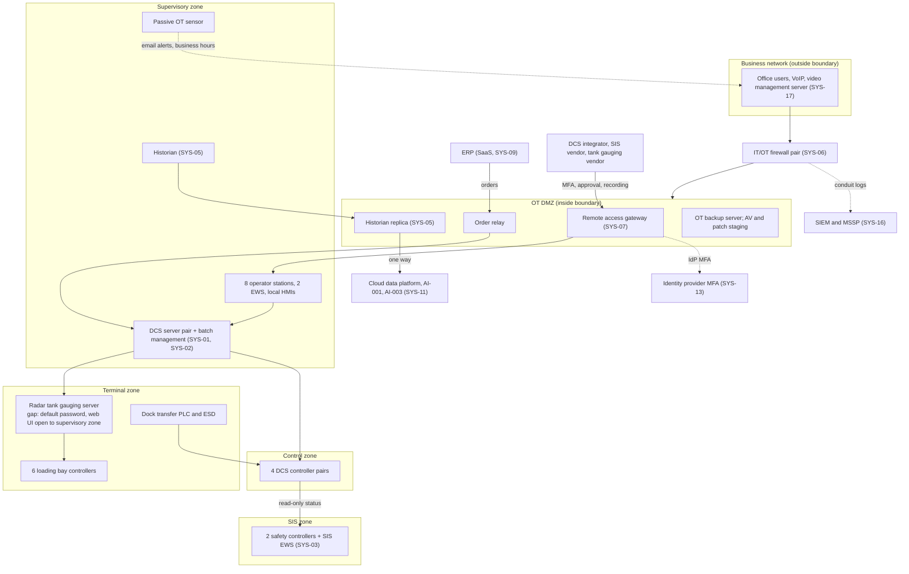

# System Security Plan: Process Control and Batch Management System (PCBMS)

**Organization:** Cris Santos Company, Inc. (PE-backed specialty chemical formulator and packager) | **Tier:** Mid-Market | **Vertical:** Chemical
**Outline:** NIST SP 800-18 Rev. 2, System Security Plan Outline Example (June 2026), with OT guidance from NIST SP 800-82 Rev. 3 | **Version:** 1.0, 2026-09-22

## 1. System Name and Identifier
Process Control and Batch Management System (**PCBMS**), identifier CSC-PCBMS-01. The PCBMS is the Port plant's process control system: SYS-01 to SYS-07 and the 52 Port plant OT workstations in SYS-15 (`../00_company-facts.md` section 3).

## 2. System Overview
The PCBMS runs every production unit at the Port plant: the bulk tank farm and marine terminal, the Ammonia Unit, the Peroxide Unit, Blend Hall 1 (12 blend reactors), packaging, and the 6 truck loading bays. It executes about 55 batches a day from about 600 master recipes. It supports 7 of the 10 High-criticality processes in the BIA (P05: BP-02 to BP-06, BP-08, and BP-10 in support), the Moderate recipe process BP-16, and about 70% of company revenue.

**Users:** about 150 operators on 4 shifts and their shift supervisors (operator stations and local HMIs); 30 terminal and tank farm staff; 3 Port controls engineers and the Controls Engineering Manager; 55 maintenance and I&E staff (read-only and maintenance screens); technical services chemists (recipe authoring); the OT Security Engineer; and three contracted vendors through the remote access gateway (DCS integrator, SIS vendor, tank gauging vendor).

**Major components:**
| ID | Component | Technology |
|---|---|---|
| SYS-01 | Distributed control system (DCS) | 4 redundant controller pairs (tank farm and terminal, Ammonia Unit, Peroxide Unit, Blend Hall 1), a redundant server pair, 8 operator stations, 2 engineering workstations (EWS). One major release behind the vendor's current release |
| SYS-02 | Batch management system | On the DCS server pair; about 600 master recipes; receives production orders from the ERP through the order relay in the OT DMZ |
| SYS-03 | Safety instrumented systems (SIS) | Two safety controllers (Ammonia Unit; Peroxide Unit and tank farm high-level trips) on a separate SIS network, with a dedicated SIS engineering workstation and keyswitch. Proof-tested yearly (last 2025-11-04) |
| SYS-04 | Terminal and loading automation | Dock transfer PLC with emergency shutdown, radar tank gauging system and server, 6 loading bay controllers with driver card readers, 5 packaging line PLCs |
| SYS-05 | Process historian | Primary in the supervisory zone (2023); replica in the OT DMZ that feeds the cloud data platform one way |
| SYS-06 | OT networks and IT/OT firewalls | Control, supervisory, terminal, SIS, and OT DMZ zones behind a firewall pair (2023 redesign) |
| SYS-07 | OT remote access gateway | In the OT DMZ: named accounts, MFA, per-session approval, recording (2024) |
| SYS-15 (Port OT part) | 52 OT workstations | 8 operator stations, 2 DCS EWS, 1 SIS EWS, 12 Blend Hall 1 local HMIs, 5 packaging line HMIs, 3 terminal HMIs, 6 loading bay terminals, 9 historian clients, 2 recipe workstations, 2 operator training stations, 2 I&E maintenance laptops |

**Why this system is High.** A changed setpoint, alarm limit, recipe, or safety function can release anhydrous ammonia whose worst-case endpoint reaches public receptors (RMP Program 3), cause a hydrogen peroxide decomposition, or overfill a bulk acid tank at the dock. Loss of the SIS removes the last automated safeguard (P05 BP-06, MTD 8 hours).

## 3. Laws, Regulations, and Policies Affecting the System
| ID | Requirement | Citation | How it applies to the PCBMS |
|---|---|---|---|
| C-CHEMICAL-R02 | USCG cybersecurity rule | 33 CFR Part 101 Subpart F (101.600-101.670) | **Binding.** The Port plant has a Facility Security Plan under 33 CFR Part 105, so the rule applies (101.605(a)). Most PCBMS components will be critical OT systems in the Cybersecurity Plan, which is due with the Cybersecurity Assessment by 2027-07-16 (101.650(e)(1); 101.655). Mapped in `control-implementation.csv` |
| (none) | MTSA reporting | 33 CFR 6.16-1; 33 CFR 101.305 | **Binding.** Actual or threatened cyber incidents are reported immediately to the FBI, CISA, and the Captain of the Port; breaches of security and suspicious activity to the National Response Center without delay (P08) |
| (none) | EPA Risk Management Program, Program 3 | 40 CFR Part 68 (68.65-68.87; 68.90-68.96) | **Binding.** The PCBMS carries the safe operating limits, alarms, interlocks, and emergency shutdown that the Ammonia Unit PHA relies on. Controls and emergency shutdown systems are mechanical integrity equipment (68.73(a)(4)-(5)); control changes go through MOC (68.75) |
| (none) | OSHA Process Safety Management | 29 CFR 1910.119 | **Binding.** Ammonia Unit and Peroxide Unit; parallel to the RMP elements ((d), (e), (j), (l), (m), (n)) |
| (none) | CERCLA and EPCRA release reporting | 40 CFR 302.6; 40 CFR 355.40-355.43 | **Binding.** Immediate notice of releases at or above the reportable quantity; the PCBMS supplies the release data |
| (none) | DOT hazmat security plan | 49 CFR 172.800-172.804 | **Binding.** The loading bays and driver cards are part of the unauthorized access measures for 50% hydrogen peroxide shipments (172.802(a)(2)) |
| C-CHEMICAL-R01 | CFATS RBPS 8 (Cyber) | 6 CFR 27.230(a)(8) | **Voluntary benchmark.** CFATS authority expired 2023-07-28 and has not been reauthorized; legacy RBPS 8 measures are kept |
| (none) | OT benchmark | NIST CSF 2.0 with NIST SP 800-82 Rev. 3 | **Voluntary.** Zones, tailoring, and safety-first decisions in this plan follow SP 800-82 Rev. 3 |
| C-CHEMICAL-R03 | CIRCIA (proposed 6 CFR Part 226) | 89 FR 23644 (2024-04-04) | **Not in effect.** Tracked in P03 only |
| (none) | Sensitive Security Information | 49 CFR Part 1520 | **Binding.** The FSP, the Facility Security Assessment, and the future Cybersecurity Plan (101.630(b)) are SSI. PCBMS network maps and critical system lists will be part of the Cybersecurity Plan and are handled as SSI |
| Internal | Policies POL-01 to POL-05 and standards STD-01 to STD-08 | P06 | All apply to OT |

## 4. System Status
### 4.1 System Security Plan Approval
Approved on 2026-09-22 by the Port Plant Manager (system owner) and the Chief Operating Officer (risk acceptor for Moderate risks), after the control assessment (P07). The Information Security Manager, as Cybersecurity Officer, confirmed that the plan will form the core of Sections 6 to 9 of the Cybersecurity Plan.

### 4.2 System Authorization Decision
The company is not a federal agency, so there is no formal authorization to operate. The equivalent internal decision:
- **Decision:** continued operation of the PCBMS accepted with conditions, 2026-09-22.
- **Authorizing official equivalent:** Chief Executive Officer for High and Very High risks; Chief Operating Officer for Moderate and below (P01 acceptance authorities). The Port Plant Manager, as RMP qualified person (40 CFR 68.15(b)), confirmed that the interim measures are adequate for the toxic release scenarios.
- **Conditions:**
  1. The tank gauging server web interface is restricted to the terminal HMIs by 2026-10-15, and all Port OT devices are swept for default passwords by 2026-10-31 (POAM-001).
  2. Gateway session approvals are logged in the gateway, not by phone, from 2026-10-01.
  3. OT sensor alerts reach the 24x7 control room until the MSSP OT monitoring service starts (2027-01-31).
  4. The full DCS restore test on spare hardware happens by 2026-11-10.
  5. Re-decision by 2027-07-16, when the Cybersecurity Plan is submitted, or after a major change (the 2027 DCS upgrade).

### 4.3 System Operational Status
Operational. Major modifications planned:
- DCS upgrade to the current release at the 2027 turnaround (2027-10), handled as an RMP and PSM management of change, with the 9 end-of-support workstations replaced.
- Unique operator accounts with badge-tap login on the operator stations (2027-03-31).
- MSSP OT monitoring service with 24x7 review of sensor alerts and conduit logs (2027-01-31).

## 5. Role Identification and Responsible Personnel
| Role | Title | Responsibility |
|---|---|---|
| System owner | Port Plant Manager | Overall accountability; RMP qualified person (40 CFR 68.15(b)); process incident commander |
| Authorizing official equivalent | Chief Executive Officer (High and Very High); Chief Operating Officer (Moderate and below) | Accept residual risk per POL-01 |
| Cybersecurity Officer (CySO) | Information Security Manager | Designated in writing 2025-10-01 (33 CFR 101.620(b)(3)); develops the Cybersecurity Plan; security program day to day |
| Alternate CySO and OT security lead | OT Security Engineer | OT firewalls, gateway, OT sensor, OT monitoring |
| OT implementation lead | Controls Engineering Manager | DCS, batch, SIS, terminal automation, OT networks; approves control system configuration |
| Process safety lead | Process Safety Manager (Port plant) | PHA, MOC, mechanical integrity, SIS proof tests |
| Facility Security Officer | Facility Security Officer (Port plant) | FSP, physical access, TWIC; MTSA reporting |
| Recipe owner | Director of Technical Services | Master recipes and the recipe release workflow |
| Program strategy | Virtual CISO | Risk appetite, board reporting, SSP review |
| Corporate EHS | VP EHS and Process Safety | RMP, PSM, EPCRA, DOT security plan; release reporting |
| Independent assessment | Co-sourced internal audit firm with an OT specialist subcontractor | P07 assessment; annual Cybersecurity Plan audit (101.630(f)(4)) |
| External support | DCS integrator, SIS vendor, tank gauging vendor | Remote and on-site support through the gateway and under escort |

**Role overlaps and compensation.** The CySO also runs the corporate security program. The rule allows this (101.625(a)), and the OT Security Engineer is the designated alternate so that one of them is reachable 24 hours a day (101.620(b)(3)). The controls engineers both build and support the DCS configuration; MOC review by the Process Safety Manager and the two-person load rule (AC-5) separate design from approval.

## 6. System Information Types and System Categorization
NIST SP 800-60 Vol. 2 Rev. 1 has no information type for industrial process control. These organization-defined types were rated against the FIPS 199 impact definitions, following SP 800-82 Rev. 3 (sec. 4.3.2, Categorize).

| Information type | Confidentiality | Integrity | Availability | Rationale |
|---|---|---|---|---|
| Process control logic and limits (setpoints, alarm limits, interlocks) | Low | **High** | **High** | An unauthorized change could cause a toxic ammonia release that reaches the public (catastrophic). Loss of control stops the Port plant (P05 BP-02 MTD 12 hours; BP-03 and BP-05 MTD 24 hours) |
| Safety instrumented functions (SIS logic and runtime) | Low | **High** | **High** | Loss or alteration removes the last automated safeguard; the units must be isolated within one shift (P05 BP-06 MTD 8 hours, RPO 0) |
| Master recipes and formulations | Moderate | **High** | Moderate | Trade secrets; an altered recipe can create an incompatible mixture; needed to restart Blend Hall 1 (P05 BP-16 MTD 48 hours) |
| Terminal, tank level, and load data | Low | **High** | **High** | False levels can overfill a bulk tank or a barge transfer; loading must keep water utilities supplied (P05 BP-01, BP-02, BP-08) |
| Process history (historian) | Low | Moderate | Low | Reports, AI-001, and AI-003; not needed to run the process |
| Security-sensitive OT information (network maps, critical system lists, vulnerabilities) | Moderate | Moderate | Low | SSI once in the Cybersecurity Plan (49 CFR Part 1520); disclosure would help an attacker plan an intrusion |
| **PCBMS category (high-water mark)** | **Moderate** | **High** | **High** | **High system** |

**Baseline and tailoring.** The PCBMS uses the NIST SP 800-53B **High** baseline (370 controls and enhancements), tailored for OT per SP 800-82 Rev. 3 (sec. 4.3.3, Select). The tier default is a Moderate system; the PCBMS is High because a manipulated control or safety function can cause a release that reaches the public.
- **Documented here: 110 controls** in `control-implementation.csv`. They cover every requirement of the USCG cybersecurity rule (101.650(a) to (i)) and the Cybersecurity Plan sections in 101.630(c), the RMP and PSM elements that depend on the control system, the RBPS 8 benchmark, and the controls behind the Moderate-or-higher risks in P01.
- **Added by tailoring (not in the High baseline):** CP-12 (safe mode, the SIS), SI-17 (fail-safe procedures), SC-41 (port and I/O device access, for 101.650(i)(2)), and PM-9 (risk management strategy).
- **Safety over lockout:** AC-7 and AC-11 are tailored on operator consoles so an operator is never locked out during an upset. The staffed, badge-controlled control room compensates. Lockout stays on IT systems, as 101.650(a)(1) requires.
- **Technically infeasible, compensated:** SC-8 for controller-to-server protocols (not supported by the DCS release; zone and physical controls compensate, which 101.650(c)(2) allows "when technically feasible").
- **Inherited without separate statements:** physical and environmental controls for the cloud and SaaS services the PCBMS exchanges data with (P04), evidenced by their SOC 2 Type 2 reports (P09).
- **Deferred:** High-baseline controls for software development (for example SA-11, SA-15, SA-17), because the company does not develop control system software; and federal-only PM controls. Recorded as tailoring decisions and reviewed yearly.

## 7. Authorization Boundary Description
**Inside the boundary:** SYS-01 to SYS-07 and the 52 Port OT workstations, including the OT DMZ (historian replica, remote access gateway, order relay, OT backup server, antivirus and patch staging server) and the passive OT sensor.

**Outside, interconnected:** the business network and its users; the ERP (SaaS); the cloud data platform and AI-001 and AI-003 model services (SYS-11); the identity provider (SYS-13), used for gateway MFA only; the SIEM and MSSP (SYS-16); physical security systems (SYS-17); the vendors' own networks; and the Inland plant batch control system (SYS-08, separate SSP planned for 2027).

**Connection register (summary).** Full register with ports and owners is due 2026-12-31 (CA-3, CA-9).

| Connection | From | To | Status |
|---|---|---|---|
| C-01 | ERP (SaaS) | Order relay (DMZ), then batch management | Allowed; encrypted; internal terms in the 2023 design record |
| C-02 | Historian | Historian replica (DMZ) | Allowed; replication only |
| C-03 | Historian replica | Cloud data platform | Allowed; one way (outbound only) |
| C-04 | Vendors and engineers | Remote access gateway, then named targets | Allowed; MFA, approval, recording; 2 integrator accounts too broad (fixed 2026-09-15) |
| C-05 | Business network | Historian clients via replica | Allowed; read-only |
| C-06 | OT backup server (DMZ) | DCS, batch, SIS exports | Allowed; pull only |
| C-07 | AV and patch staging (DMZ) | DCS stations | Allowed; scheduled |
| C-08 | DCS controllers | SIS | Read-only status; keep |
| C-09 | SIS EWS | SIS controllers | SIS zone only; keyswitch |
| C-10 | Supervisory zone | Tank gauging server web interface | **To be restricted to terminal HMIs (2026-10-15)** |
| C-11 | IT/OT firewall pair | SIEM | Logs sent; **not reviewed** |

## 8. Information Exchanges Summary
| Connected system / party | Direction | Data | Agreement |
|---|---|---|---|
| ERP (SaaS, SYS-09) through the order relay | Inbound | Production orders, batch sizes; load confirmations outbound | ERP vendor contract and SOC 2 (P09); internal interface record |
| Cloud data platform (SYS-11) | Outbound only | Historian data for reports, AI-001, AI-003 | Internal; one-way design (2023) |
| AI-001 process-optimization model | Recommendations shown on a control room dashboard | Advisory setpoint suggestions | Internal (P10). **No write path to the DCS**; operators enter any accepted change by hand under the operating procedure |
| DCS integrator | Bidirectional (gateway session) | Configuration, logic, diagnostics | Service agreement; **no vulnerability or incident notice clause** (gap, SR-8) |
| SIS vendor | Bidirectional (gateway session) | SIS diagnostics; logic changes only on site under MOC | Service agreement; same gap |
| Tank gauging vendor | Bidirectional (gateway session) | Gauge configuration, diagnostics | Service agreement; same gap |
| SIEM and MSSP (SYS-16) | Outbound logs | Firewall, gateway, historian, and DCS server logs | MSSP contract; OT excluded from monitoring scope |
| Identity provider (SYS-13) | Authentication | Gateway MFA | Identity vendor contract; SOC 2 (P09) |
| National Response Center, Captain of the Port, FBI, CISA, county fire rescue, LEPC, SERC | Outbound (phone, radio) | Release and incident notifications | FSP; emergency response plan (68.95); P08 notification matrix |

## 9. System Component Inventory
This is the summary inventory. The full register (412 assets found by the OT sensor; 340 reconciled) is in the controls team's asset register. Firmware versions for 72 devices and the critical system designations required by 101.650(b)(3) are due 2026-12-31 (CM-8).

| Component | Type | Location | Owner | Critical OT system (draft) |
|---|---|---|---|---|
| DCS controller pairs (4) | Controller | Rack rooms: tank farm, Ammonia Unit, Peroxide Unit, Blend Hall 1 | Controls Engineering Manager | Yes |
| DCS server pair with batch management | Server | OT server room | Controls Engineering Manager | Yes |
| Operator stations (8), EWS (2) | OT workstation | Central control room | Controls Engineering Manager | Yes |
| SIS safety controllers (2) and SIS EWS | Safety system | SIS cabinets; control room | Controls Engineering Manager | Yes |
| Dock transfer PLC and emergency shutdown | PLC | Barge dock | Terminal Manager | Yes |
| Radar tank gauging system and server | Instrument system and server | Tank farm; terminal control room | Terminal Manager | Yes |
| Loading bay controllers (6) with driver card readers | PLC | Truck loading bays | Port Plant Manager | Yes |
| Packaging line PLCs (5) and HMIs (5) | PLC and HMI | Packaging hall | Port Plant Manager | No |
| Blend Hall 1 local HMIs (12) | HMI | Blend Hall 1 | Controls Engineering Manager | Yes |
| Historian and historian clients (9) | Server and workstation | OT server room; offices | Controls Engineering Manager | No |
| IT/OT firewall pair and OT switches (38) | Network | OT server room; field cabinets | OT Security Engineer | Yes |
| Remote access gateway | Server (DMZ) | OT server room | OT Security Engineer | Yes |
| Order relay, historian replica, OT backup server, AV and patch staging | Servers (DMZ) | OT server room | OT Security Engineer | Order relay: yes |
| Passive OT sensor | Network monitor | OT server room | OT Security Engineer | No |
| UPS units (4) and control room generator | Power | Control room; rack rooms | Controls Engineering Manager | Supporting |

## 10. Control Implementation Details
### 10.1 Control implementation status
See `control-implementation.csv`. Summary of the 110 documented controls:

| Status | Count |
|---|---|
| Implemented | 28 |
| Partially implemented | 79 |
| Planned | 3 |
| Not applicable | 0 |

| Inheritance | Count | Main providers |
|---|---|---|
| System-specific | 93 | Company (controls engineering, OT security, Port plant) |
| Hybrid | 11 | Identity provider vendor, MSSP, training platform |
| Common/Inherited | 6 | Identity provider (IA-2(1), IA-2(2), PS-4), MSSP and insurer panel (IR-7), HR screening (PS-3), corporate contracts (SR-8) |

Most controls are Partially implemented because the 2023-2024 investments (OT DMZ, gateway, named engineering accounts, allowlisting, offline backups) cover the core of the PCBMS but not the terminal equipment, the operators, or the evidence the USCG rule expects (documented lists, logs reviewed, tests done). The gaps trace to `../00_company-facts.md` section 4 (gaps 1 to 9, 14, 15).

### 10.2 Control assessment status
The co-sourced internal audit firm, with an OT specialist subcontractor, assessed 36 controls (32 PCBMS controls and 4 inherited common controls) from 2026-08-10 to 2026-08-28, with OT testing on 2026-08-19 during a planned Blend Hall 1 outage. See P07 `assessment-plan.md`, `assessment-results.csv`, and `poam.csv`. Weaknesses are tracked in the POA&M (22 items, 15 High) and reported to the audit committee each quarter.

## 11. Digital Identity Acceptance Statement
- **Remote access (vendors and engineers):** authenticator assurance level 2 (AAL2) in NIST SP 800-63B terms through the identity provider today (push with number matching). Phishing-resistant authenticators (FIDO2 security keys) are required for any session that can change DCS, SIS, or terminal configuration by 2027-03-31 (P01 R-001). Remote access is the most likely path to the toxic release scenario, so the bar is higher than for office systems.
- **Local console access:** unique accounts with badge-tap login replace shared console accounts by 2027-03-31. MFA at the console is not required, because operators must act within seconds during an upset; physical access to the TWIC-controlled, staffed control room is the second factor in practice.
- **Engineering and SIS access:** named accounts, physical presence in the control room, and for the SIS the keyswitch in program under two-person verification and MOC.
- **Separate credentials:** OT accounts never reuse IT credentials (101.650(a)(6)).

## 12. Referenced Artifacts
- Scenario facts (`../00_company-facts.md`)
- BIA (P05), risk register (P01), gap analysis and roadmap (P03), cloud control map (P04)
- Policies and standards index (P06)
- Assessment, results, and POA&M (P07)
- Incident response runbooks (P08)
- SOC 2 readiness and vendor reviews (P09)
- AI governance assessment, AI-001 and AI-003 (P10)
- Facility Security Plan and Facility Security Assessment (SSI, held by the FSO)
- RMP and PSM process safety information, HAZOPs (Ammonia Unit 2023-05-18; Peroxide Unit 2022-10-12), operating procedures, and SIS safety requirements specification (Process Safety Manager)

## 13. Acronym List and Glossary
- **CySO:** Cybersecurity Officer (33 CFR 101.615)
- **DCS:** distributed control system
- **DMZ:** demilitarized zone (a network zone between IT and OT)
- **ESD:** emergency shutdown
- **EWS:** engineering workstation
- **FSP, FSA:** Facility Security Plan, Facility Security Assessment (33 CFR Part 105)
- **HMI:** human-machine interface
- **KEV:** CISA Known Exploited Vulnerabilities catalog
- **MOC:** management of change
- **PCBMS:** Process Control and Batch Management System
- **PSM:** OSHA Process Safety Management (29 CFR 1910.119)
- **RMP:** EPA Risk Management Program (40 CFR Part 68)
- **SIS:** safety instrumented system
- **SSI:** Sensitive Security Information (49 CFR Part 1520)
- **TSI:** transportation security incident
- **TWIC:** Transportation Worker Identification Credential

## 14. System Security Plan Review and Change Records
| Version | Date | Change | Author |
|---|---|---|---|
| 0.9 | 2026-07-31 | Draft from BIA, risk, and gap fieldwork | OT Security Engineer with the Controls Engineering Manager |
| 0.95 | 2026-08-28 | Updated with P07 results (tank gauging finding, gateway approvals) | Information Security Manager (CySO) |
| 1.0 | 2026-09-22 | Approved by the Port Plant Manager and the Chief Operating Officer | Information Security Manager (CySO) |

Next review: when the Cybersecurity Assessment is complete (before 2027-07-16), before the 2027 DCS upgrade MOC, or annually by 2027-09-22.
