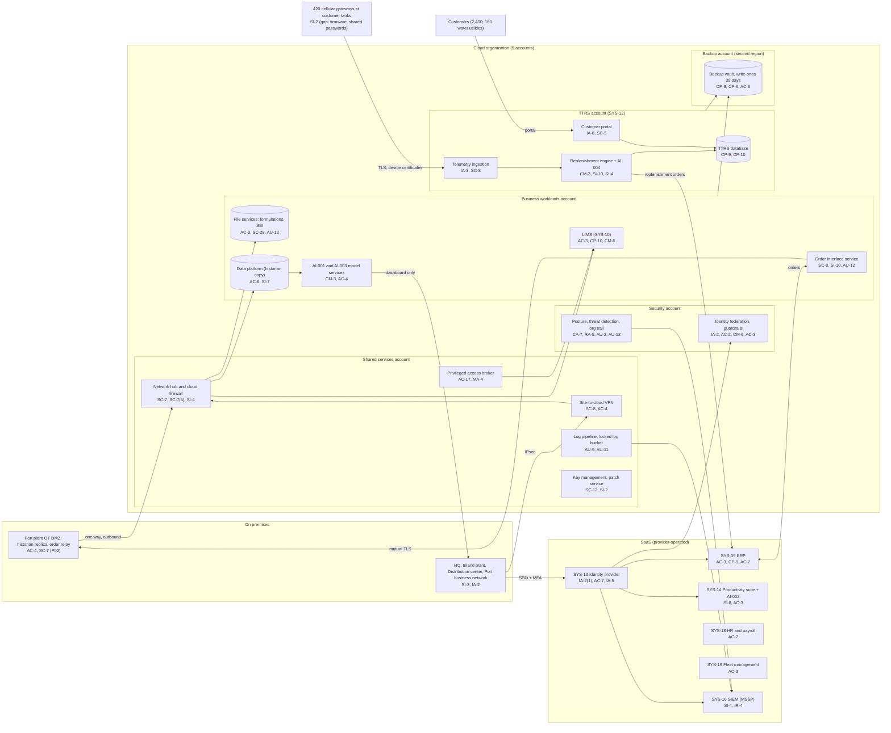

# Cloud Architecture and Control Placement: Cris Santos Company | Chemical | Mid-Market

**Organization:** Cris Santos Company, Inc. | **Tier:** Mid-Market | **Provider:** Vendor-agnostic public cloud (see section 4), plus SaaS
**Scope:** the 5-account cloud landing zone (SYS-11), TTRS (SYS-12), the SaaS services (SYS-09, SYS-13, SYS-14, SYS-16, SYS-18, SYS-19), and the one-way data path from the Port plant OT DMZ | **Prepared:** 2026-07-31 by the IT Director and the Information Security Manager; updated 2026-09-22 with P07 results
**Control map:** `cloud-control-map.csv` (59 rows, 30 components)

The process control system itself (PCBMS) is on premises and documented in the SSP (P02). This mapping covers the cloud and SaaS services the plants depend on, and shows where they touch OT.

## 1. Diagram

## 2. Landing zone design
The landing zone separates duties across 5 accounts (subscriptions or projects, depending on the provider) under one cloud organization. Each account limits what an attacker can do from any other.

| Account | Purpose | Who administers | Key design decisions |
|---|---|---|---|
| **Security** | Organization root, identity federation to SYS-13, guardrails, posture and threat detection, organization audit trail | Information Security Manager and Security Analyst | No workloads. Root credentials sealed. Guardrails apply to every other account and cannot be disabled from them |
| **Shared services** | Network hub, cloud firewall, site-to-cloud VPN, DNS, privileged access broker, patch service, key management, log pipeline and locked log bucket | IT Director's infrastructure team (4 cloud engineers) | All traffic between sites, accounts, and the internet passes the hub. Logs from all accounts land in a write-once bucket |
| **Business workloads** | LIMS, order interface service, file services, the data platform (historian copy), AI-001 and AI-003 model services | Infrastructure team; Director of Data and Analytics for the data platform and models | Separate subnets per workload. No internet ingress. The model services have no path to OT |
| **TTRS** | Customer portal, telemetry ingestion, replenishment engine, AI-004 forecasting, TTRS database | Customer Solutions engineering team (5 people) with the infrastructure team | Isolated from business workloads; only the replenishment engine's ERP API call leaves the account. This account is the core of the SOC 2 system boundary (P09) |
| **Backup** | Backup vault with 35-day write-once retention in a second region | 2 named backup administrators | Separate administrator credentials, not federated to everyday accounts. Jobs use a cross-account role that can write but not delete |

**Where the cloud touches OT.** Only two flows connect the cloud to the Port plant PCBMS, both through the OT DMZ (P02 connections C-01 and C-03): ERP orders reach the order relay over mutual TLS, and the historian replica sends process data out to the data platform. There is no inbound path from the cloud to the supervisory, control, terminal, or SIS zones. The Inland plant batch system receives orders over the corporate VPN, which is one reason its flat network matters (P01 R-004).

## 3. Layers and shared responsibility per service
| Layer | Components | Key controls | Service model | Responsibility |
|---|---|---|---|---|
| Identity | Federation, break-glass accounts, privileged access broker, SYS-13 | IA-2, IA-2(1), AC-2, AC-6(5), AC-17, AC-7, IA-5 | PaaS / SaaS / IaaS | Customer configures identities, roles, MFA, and reviews; provider runs the identity services |
| Network | Hub, cloud firewall, VPN, DNS | SC-7, SC-7(5), SC-8, AC-4, SC-20, SI-4 | IaaS / PaaS | Customer designs routes, rules, and segmentation; provider runs the gateway and DNS services |
| Compute | LIMS, order interface, model services, AI-004, patch service | CM-6, CM-3, SI-2, SI-10, CP-10 | IaaS / PaaS | Customer (guest OS, applications, code, models); provider for hosts and managed runtimes |
| Application | TTRS portal, telemetry ingestion, replenishment engine | IA-8, IA-3, SC-5, SC-8, CM-3, SI-10 | PaaS | Customer owns the code, rules, and customer identities; provider runs the managed services |
| Data | File services, data platform, TTRS database, keys, backup vault | SC-28, SC-12, CP-9, CP-6, AC-3, AC-6, SI-7 | PaaS | Shared: provider encrypts and operates storage and databases; customer controls keys, access, retention, isolation, and restore testing |
| Logging and monitoring | Organization trail, posture service, log bucket, SIEM | AU-2, AU-9, AU-11, AU-12, CA-7, RA-5, SI-4, IR-4 | PaaS / SaaS | Shared: provider generates logs and detections; customer enables, retains, forwards, and acts on them; MSSP monitors |
| SaaS applications | ERP, identity provider, productivity suite and AI-002, HR, fleet, SIEM | AC-2, AC-3, CP-9, AC-7, IA-5, SI-8 | SaaS | Provider runs the application and infrastructure; customer keeps users, roles, review, and data |
| Edge devices | 420 TTRS cellular gateways at customer sites | SI-2 | Company-owned devices | Customer (the company) owns firmware and credentials; not a cloud service |

**Responsibility counts in `cloud-control-map.csv`:** 36 Customer, 19 Shared, 4 Provider. By service model: 34 PaaS, 13 IaaS, 11 SaaS, and 1 company-owned device row. The customer side is always identity, data protection, and logging, as the three providers' shared responsibility models agree.

**Regulatory drivers in the cloud layer.** The USCG cybersecurity rule covers critical IT systems, including business support services whose compromise could result in a transportation security incident (33 CFR 101.615). The CySO's draft list designates the order interface service and the backup vault as critical IT for the Port plant, so their rows cite C-CHEMICAL-R02. The ERP is a critical business system in RBPS 8 terms because it holds hydrogen peroxide inventory and orders (C-CHEMICAL-R01, voluntary). TTRS rows cite the SOC 2 commitments to customers (P09).

## 4. Service categories and provider equivalents
The design is independent of the provider. This table gives each provider's name for the service category, for reading its shared responsibility documentation (SRC-AWS-SRM, SRC-AZURE-SRM, SRC-GCP-SRM in `00_universal-framework/sources/source-register.csv`).

| Service category | AWS | Microsoft Azure | Google Cloud |
|---|---|---|---|
| Multi-account organization and guardrails | AWS Organizations, service control policies | Management groups, Azure Policy | Resource Manager folders, organization policies |
| Account, subscription, or project | Account | Subscription | Project |
| Cloud identity federation | IAM Identity Center | Microsoft Entra ID with Azure RBAC | Cloud Identity with IAM |
| Network hub and cloud firewall | Transit Gateway, AWS Network Firewall | Virtual WAN hub, Azure Firewall | Network Connectivity Center, Cloud NGFW |
| Site-to-cloud VPN | Site-to-Site VPN | VPN Gateway | Cloud VPN |
| Device messaging for telemetry | AWS IoT Core | Azure IoT Hub | Pub/Sub with a device gateway (Google retired its IoT Core service) |
| Managed database | Amazon RDS or Aurora | Azure SQL or Azure Database for PostgreSQL | Cloud SQL |
| Object storage with write-once retention | S3 with Object Lock | Blob Storage with immutability policies | Cloud Storage with bucket lock |
| Managed file shares | Amazon FSx | Azure Files | Filestore |
| Backup service | AWS Backup (vault lock) | Azure Backup (immutable vault) | Backup and DR Service |
| Key management | AWS KMS | Azure Key Vault | Cloud KMS |
| Audit logging | CloudTrail | Azure Monitor activity log | Cloud Audit Logs |
| Posture and threat detection | Security Hub, GuardDuty | Microsoft Defender for Cloud | Security Command Center |
| DDoS protection and web application firewall | AWS Shield, AWS WAF | Azure DDoS Protection, Azure WAF | Cloud Armor |

**Service model split used here (all three providers agree):**
- **IaaS** (virtual machines, networks): the provider owns facilities, hosts, and virtualization. The customer owns the guest OS, applications, network configuration, identities, and data.
- **PaaS** (managed database, device messaging, file shares, backup, key service): the provider also owns the platform software and its patching. The customer owns access, keys, data, and configuration.
- **SaaS** (ERP, identity provider, SIEM): the provider also owns the application. The customer keeps identities, roles, review, and data.

## 5. Findings from the mapping
1. **The cloud-to-OT paths are narrow and one way, as designed.** Only the order relay and the historian replica cross into the cloud, both through the OT DMZ. The model services that produce AI-001 and AI-003 recommendations have no route to OT. This is the main reason a cloud compromise is rated below an OT remote access compromise in P01 (R-003 versus R-001).
2. **Sensitive files are the weak point in the business workloads account.** The FSP, the Facility Security Assessment, legacy CVI, and formulations sit in shares open to 65 users, and AI-002 can surface them to anyone with access (gap 10; P01 R-025, R-040). Fix: restricted shares for 14 named users and SSI labels by 2026-11-30, then data loss prevention in 2027.
3. **TTRS is the SOC 2 system, and it has three gaps:** single-region deployment with no tested failover (P01 R-021), no change management for the replenishment engine (R-023), and outdated firmware with shared credentials on 37% of the gateways (R-022). All three are in the P09 readiness plan.
4. **Access to the ERP depends on the identity provider.** If SSO is down, nobody can sign in to the ERP even though the vendor is up. Break-glass ERP accounts are due 2026-11-30 (P01 R-020).
5. **Recovery is designed and partly proven.** Backups are isolated (separate account, second region, write-once, separate credentials). LIMS was restored in 6 hours in 2026-04. TTRS and file services have not been restore-tested.
6. **Boundary check.** Every cloud, SaaS, and edge component in the diagram has at least one row in the control map (the on-premises sites and the OT DMZ are covered by the SSP, P02). Every account either implements controls from the AC, AU, CM, IA, SC, and SI families or inherits them from the security and shared services accounts, whose organization trail (AU-2), guardrails (CM-6), federation (IA-2), hub firewall (SC-7), and posture service (CA-7, SI-4) apply to all 5 accounts. The gateways are company-owned edge devices with one row (SI-2) until the P09 gateway hardening adds IA-5 and CM-6 rows.
7. **Inherited controls rely on SOC 2 reports.** Provider and Shared rows for the ERP, identity provider, productivity suite, HR, fleet, and MSSP depend on their SOC 2 Type 2 reports and complementary user entity controls. Only 3 of 11 key SaaS reports have been reviewed (gap 7); the review program is in P09 `vendor-soc2-review.csv`.
