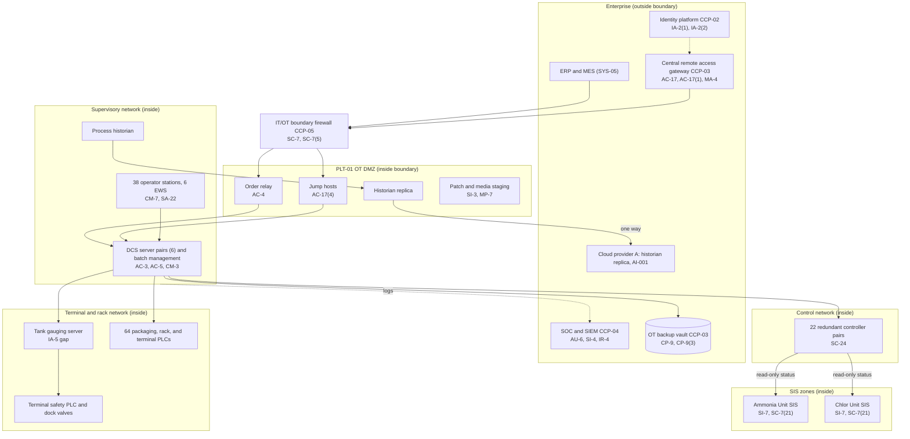

# System Security Plan: Gulf Coast Complex Process Control and Batch Management System (GC-PCBMS)

**Organization:** Cris Santos Company, Inc. (publicly traded specialty chemical formulator and packager) | **Tier:** Enterprise | **Vertical:** Chemical
**Outline:** NIST SP 800-18 Rev. 2, System Security Plan Outline Example (June 2026), with OT guidance from NIST SP 800-82 Rev. 3 | **Version:** 2.0, 2026-09-08

## 1. System Name and Identifier
Gulf Coast Complex Process Control and Batch Management System (**GC-PCBMS**), identifier CSC-SYS-OT-PL01. Tier-1 OT system in the enterprise application and OT asset inventory, and a critical OT system under the PLT-01 MTSA Cybersecurity Plan (33 CFR 101.615 definition of critical IT or OT systems).

## 2. System Overview
The GC-PCBMS runs the PLT-01 Gulf Coast Complex in Florida, the company's flagship plant (about 19% of company production volume, about $2.5 million of production a day; P05 BP-01). It controls three blend halls and the additives unit, the anhydrous ammonia unit, the chlorine and sodium hypochlorite unit (the "Chlor Unit"), a tank farm of about 140 tanks, packaging lines, a 12-bay truck rack, rail loading, and a marine terminal with two barge docks that receives petroleum base oils. It executes about 260 batches a day from about 1,900 master recipes, including customer-owned recipes for the SL-2 toll manufacturing service line.

**Why integrity and safety come first.** A changed setpoint, alarm limit, recipe, or safety function can overfill the anhydrous ammonia vessel, release chlorine, or mix incompatible chemicals. The ammonia unit and the Chlor Unit are covered by OSHA PSM and EPA RMP Program 3, and their worst-case releases reach public receptors (`../00_company-facts.md` section 1). The safety instrumented systems (SIS) are the last automated safeguard, so their programs must always match the copy approved through management of change (P05 BP-02, RPO "approved logic").

**Users:** about 412 OT user accounts: about 310 operators, 26 shift supervisors, 22 controls engineers and I&E technicians, and maintenance, laboratory, and integrator accounts. Two of the six enterprise DCS and PLC integrators support PLT-01 through the central remote access gateway.

**Major components:**
- **DCS:** one DCS platform with 22 redundant controller pairs, 6 redundant server pairs, 38 operator stations, and 6 engineering workstations (EWS)
- **Batch management system** on the DCS server pairs (master recipes, batch execution, electronic batch records)
- **Ammonia Unit SIS and Chlor Unit SIS:** separate safety logic solvers with gas detection, high-level and high-pressure trips, and remote isolation valves
- **Marine terminal automation and emergency shutdown:** dock valve control, tank gauging server, and a safety PLC for the terminal emergency shutdown
- **64 PLCs** for packaging, the truck rack, and the terminal; about 140 tanks with radar level gauging
- **Process historian** with one-way replication to Cloud provider A for analytics and the AI-001 process-optimization model
- **PLT-01 control and supervisory networks, the SIS and terminal zone networks, and the PLT-01 OT DMZ** (order relay, historian replica, patch and media staging, remote access jump hosts)

## 3. Laws, Regulations, and Policies Affecting the System
| ID | Requirement | Citation | How it affects the GC-PCBMS |
|---|---|---|---|
| C-CHEMICAL-R02 | USCG MTSA cybersecurity rule | 33 CFR Part 101 Subpart F (101.600-101.670) | **Binding at PLT-01.** The marine terminal is a 33 CFR Part 154 facility (154.100(a)), so it must have a Facility Security Plan under Part 105 (105.105(a)(1)), and Subpart F applies (101.605(a)). The GC-PCBMS is the main set of critical OT systems in the Cybersecurity Plan. Training was due 2026-01-12 (101.650(d)(4)); the Cybersecurity Assessment and Plan are due by 2027-07-16 (101.650(e)(1); 101.655) |
| (none) | EPA Risk Management Program, Program 3 | 40 CFR Part 68 (68.65-68.87 prevention program; 68.90-68.96 emergency response) | **Binding.** The GC-PCBMS implements the safe operating limits, alarms, interlocks, and shutdowns that the process safety information, PHA, operating procedures, mechanical integrity, and MOC elements rely on |
| (none) | OSHA Process Safety Management | 29 CFR 1910.119 | **Binding** for the ammonia unit and the Chlor Unit. Same elements as RMP Program 3 from the worker safety side |
| (none) | CERCLA and EPCRA release reporting | 40 CFR 302.6; 40 CFR 355.40-355.43 | **Binding.** Notification must work when the control system or business network does not (P08) |
| (none) | DOT hazmat security plan | 49 CFR 172.800-172.804 | **Binding.** The truck rack and rail loading are where large bulk quantities of Class 3 PG II solvent blends and 50% hydrogen peroxide are prepared for transport (172.802(a)(2), unauthorized access) |
| SEC | Cybersecurity disclosure | Form 8-K Item 1.05; 17 CFR 229.106 | A material GC-PCBMS incident goes through the P08 materiality step |
| C-CHEMICAL-R01 | CFATS RBPS 8 (Cyber) | 6 CFR 27.230(a)(8) | **Voluntary benchmark.** CFATS statutory authority expired on July 28, 2023, and has not been reauthorized; CISA cannot enforce it. PLT-01 keeps its legacy Site Security Plan measures, and legacy CVI is still protected |
| (none) | OT benchmark | NIST CSF 2.0 with NIST SP 800-82 Rev. 3 | **Voluntary.** The baseline tailoring in section 6 follows SP 800-82 Rev. 3 |
| C-CHEMICAL-R03 | CIRCIA (proposed 6 CFR Part 226) | 89 FR 23644 (2024-04-04) | **Not in effect.** Tracked only (P03) |
| Contract | SL-2 toll agreements | P09 | Confidentiality and processing integrity of customer recipes and batch records |
| Internal | POL-01 to POL-05 and standards | P06 | Enterprise policy hierarchy applies to OT |

**Sensitive information.** The Cybersecurity Plan, Facility Security Plan, and security assessments are Sensitive Security Information under 49 CFR Part 1520 (101.630(b)) and are kept outside this SSP. This SSP summarizes them and refers to them by name only.

## 4. System Status
### 4.1 System Security Plan Approval
Prepared by the PLT-01 Cybersecurity Officer (CySO) and the PLT-01 Controls Engineering Manager with the GRC team. Reviewed by the Director of OT Security, the CISO, the PLT-01 Plant Manager (system owner and RMP qualified person), and the Vice President, Process Safety and EHS. Approved by the Chief Operating Officer on 2026-09-08.

### 4.2 System Authorization Decision
The company is not a federal agency, so there is no formal ATO. The equivalent internal decision:
- **Authorizing official equivalent:** Chief Operating Officer, with the CISO's recommendation and the Vice President, Process Safety and EHS's concurrence on safety-related conditions.
- **Decision (2026-09-08):** continue operation with conditions, based on the Internal Audit assessment (P07) and the enterprise risk register (P01). The CEO and CFO accepted the treatment plans for the Very High risks on the same date (P01).
- **Conditions:**
  1. Integrator access to PLT-01 uses named accounts only; the 3 shared integrator accounts are disabled and replaced (POAM-005, by 2026-10-31).
  2. Documented compensating controls for every open KEV on PLT-01 critical OT systems (POAM-002, by 2026-10-31).
  3. Default passwords on the tank gauging server and truck rack PLCs changed (POAM-013, by 2026-09-30).
  4. SIEM alerts on alarm limit changes on safety-relevant tags and on SIS keyswitch position (POAM-022, by 2026-11-30).
  5. Restore tests for the Chlor Unit and blend hall DCS areas (POAM-003, by 2027-02-28).
  6. MTSA Cybersecurity Assessment and Cybersecurity Plan submitted to the Captain of the Port before the 2027-07-16 deadline (POAM-008, internal target 2027-03-31).
- **Reauthorization:** annually, after any change that triggers an MTSA Cybersecurity Plan amendment (101.630(e)), or at the 2027 DCS console upgrade.

### 4.3 System Operational Status
Operational. Planned major modifications: the 2027 DCS operator console upgrade in Blend Hall 1 (removes 9 unsupported operator stations; handled through MOC and a pre-startup safety review, 40 CFR 68.77), automated configuration comparison (CM-3(1)), and automated SIS program comparison (SI-7(1)).

## 5. Role Identification and Responsible Personnel
| Role | Title | Responsibility |
|---|---|---|
| System owner | PLT-01 Plant Manager | Accountable for the GC-PCBMS; RMP qualified person for PLT-01 (40 CFR 68.15(b)); incident commander for process emergencies |
| Authorizing official (equivalent) | Chief Operating Officer | Accepts residual risk to operate; CEO and CFO accept Very High risks |
| Cybersecurity Officer (MTSA) | PLT-01 Cybersecurity Officer (CySO), the PLT-01 OT Security Lead | Designated in writing under 101.620(b)(3); accessible 24x7; owns the Cybersecurity Plan, Assessment, drills, and KEV mitigation (101.625(d)) |
| Alternate CySO and OT security program | Director of OT Security | Enterprise OT security services (CCP-03); OT Center of Excellence |
| Facility Security Officer | PLT-01 Facility Security Officer (FSO) | MTSA Facility Security Plan; physical security and TWIC |
| System administrator | PLT-01 Controls Engineering Manager | DCS, batch, SIS, terminal automation engineering; approves control system changes |
| Process safety | Process Safety Manager, PLT-01; Vice President, Process Safety and EHS | PHA, MOC, pre-startup review, incident investigation, compliance audits |
| Information security | CISO; Director of Security Operations | Program oversight; SOC monitoring; incident response |
| Common control providers | See section 10.3 | Operate inherited controls |
| Independent assessor | Chief Audit Executive (Internal Audit) | Annual assessment (P07); independent of the PLT-01 cybersecurity duties, as 101.630(f)(4) requires for Cybersecurity Plan audits |

**Role overlap and compensation.** The CySO reports to the Director of OT Security, who also runs the common control provider CCP-03 that the GC-PCBMS inherits from. The CySO therefore does not assess CCP-03: Internal Audit does (P07), and the CISO reviews CCP-03 metrics quarterly.

## 6. System Information Types and System Categorization
NIST SP 800-60 Vol. 2 Rev. 1 has no information type for industrial process control. These organization-defined types were rated against the FIPS 199 impact definitions, following SP 800-82 Rev. 3 (sec. 4.3.2, Categorize).

| Information type | Confidentiality | Integrity | Availability | Rationale |
|---|---|---|---|---|
| Process control and safety logic (setpoints, alarm limits, interlocks, control logic) | Moderate | **High** | **High** | Unauthorized change could cause a toxic release of ammonia or chlorine that reaches the public (catastrophic). Loss of control stops about $2.5 million of production a day (P05 BP-01, BP-03) |
| Safety instrumented functions (SIS runtime and programs) | Low | **High** | **High** | Loss of the SIS removes the last automated safeguard; the PSM units must be isolated within one shift (P05 BP-02, MTD 8 h) |
| Master recipes and formulations (including SL-2 customer recipes) | **High** | **High** | Moderate | Trade secrets and customer-owned formulations; an altered recipe can create an incompatible mixture or an off-spec toll batch (P05 BP-11) |
| Marine terminal and tank gauging data | Moderate | **High** | Moderate | Wrong tank levels can cause an overfill during a barge transfer; MTSA critical OT (P05 BP-04) |
| Process history (historian data) | Moderate | Moderate | Low | Used for reports, investigations, and AI-001; not needed to run the process |
| Security information (Cybersecurity Plan content, network maps, credentials) | **High** | Moderate | Moderate | SSI under 49 CFR Part 1520; would help an attacker |
| **GC-PCBMS category (high-water mark)** | **High** | **High** | **High** | |

**Baseline:** the NIST SP 800-53B **High** baseline, tailored for OT per SP 800-82 Rev. 3 (sec. 4.3.3, Select). `control-implementation.csv` documents **208 controls**: all 188 base controls of the High baseline and 20 High-baseline enhancements that carry the OT-specific design (remote access, change control, backups, MFA, boundary protection, monitoring, and integrity). The remaining High-baseline enhancements are fully inherited from the common control catalog (section 10.3) and are listed there rather than repeated here.

**Tailoring decisions (approved by the Chief Operating Officer, 2026-09-08):**
- **Safety over lockout.** AC-7 and AC-11 are tailored on operator stations so an operator is never locked out during an upset (exceptions EXC-OT-003 and EXC-OT-004). The staffed, badge-controlled control room is the compensating control.
- **MFA where it matters.** IA-2(1) is met for all remote and privileged IT access to OT. Local console logon to EWS is protected by physical access (EXC-OT-002). This matches 101.650(a)(4), which requires MFA on remotely accessible OT.
- **Encryption where feasible.** SC-8 is met between the OT DMZ and the enterprise; controller protocols are not encrypted because the controllers do not support it (EXC-OT-007, 101.650(c)(2)).
- **Fail safe.** SC-24 is met by the SIS and controller safe-state design.
- **Tailored out (4):** AC-22 (no public content), CP-7 (a chemical process cannot move to an alternate site; volume transfer to PLT-03 and PLT-06 is the equivalent), PE-17 (no alternate work site), and SC-15 (no collaborative computing devices on OT hosts).

## 7. Authorization Boundary Description
**Inside the boundary:** the PLT-01 DCS and batch management system, the Ammonia Unit SIS and Chlor Unit SIS, the marine terminal automation, tank gauging, and terminal safety PLC, the packaging and truck rack PLCs, the process historian, the PLT-01 control, supervisory, SIS, and terminal networks with their zone firewalls, the PLT-01 OT DMZ, and the OT workstations at PLT-01.

**Outside the boundary (common control providers and interconnected systems):**
- Enterprise OT security services (central remote access gateway, OT backup vault, OT monitoring platform, patch and media staging): CCP-03
- Identity platform (SYS-04): CCP-02
- SOC, SIEM, EDR, vulnerability management: CCP-04
- IT/OT boundary firewalls and the SD-WAN (SYS-08): CCP-05
- Cloud provider A historian replica and AI-001 (SYS-07, SYS-14)
- ERP and MES (SYS-05), LIMS (SYS-06), SL-2 customer portal, transportation management system (SYS-11), badge and TWIC systems (SYS-12)

The enterprise multi-cloud diagram, including the historian replication path, is in P04 `cloud-architecture.md`.

**Connection register (summary).**
| Connection | From | To | Control |
|---|---|---|---|
| C-1 | ERP (SYS-05) | Batch management, through the order relay in the OT DMZ | Relay accepts only signed production orders; no inbound session to the control network |
| C-2 | Process historian | Historian replica in the OT DMZ, then Cloud provider A | One way; no return path |
| C-3 | Central remote access gateway | Jump hosts in the OT DMZ | Named accounts, MFA, per-session approval, recording |
| C-4 | DCS controllers | Ammonia Unit SIS and Chlor Unit SIS | Read-only status interface |
| C-5 | DCS servers | Tank gauging server and terminal PLCs | Zone firewall; not covered by passive monitoring (POAM-011) |
| C-6 | DCS servers and OT DMZ | OT backup vault | Backup traffic only, initiated from the OT side |
| C-7 | OT DMZ log collector | SIEM | Logs out only |

## 8. Information Exchanges Summary
| Connected system / party | Direction | Data | Agreement |
|---|---|---|---|
| ERP and MES (SYS-05) | Inbound to batch management | Production orders, batch sizes, material lots | Internal interface specification |
| Cloud provider A historian replica | Outbound (one way) | Process data for analytics and AI-001 | Internal data sharing agreement; Cloud provider A contract |
| AI-001 process-optimization model (SYS-14) | Outbound data; advisory setpoints shown on a control room dashboard | Advisory setpoints | Internal (P10). **No write path to the DCS**; operators enter accepted changes by hand. A closed-loop pilot is proposed and not approved |
| SL-2 customer portal (Cloud provider A) | Outbound (batch records exported from the batch system) | Batch records for toll customers | Toll agreements |
| PLT-01 DCS integrators (2) | Bidirectional (gateway sessions) | Configuration and diagnostics | Integrator agreements; **one of the two has no security clauses (POAM-010)** |
| DCS vendor | Remote support through the gateway; patches through staging | Diagnostics; qualified patches | Support contract; **no vulnerability or incident notification clause (POAM-010)** |
| SIS vendor | On-site proof-test support | Proof-test data | Service agreement |
| Barge operator and vessels at the dock | Voice and radio; Declaration of Security | Transfer coordination | MTSA Facility Security Plan |
| National Response Center, Captain of the Port, LEPC, SERC, county fire rescue | Outbound (phone and radio) | Release and cyber incident reports | RMP emergency response program; Facility Security Plan (P08) |

## 9. System Component Inventory
The full inventory with firmware versions is in the OT asset inventory (CM-8); the terminal and rack PLC records are being completed under POAM-006.

| Component | Type | Location | Owner |
|---|---|---|---|
| DCS controllers (22 redundant pairs) | Controller | Rack rooms in the control building and unit substations | PLT-01 Controls Engineering Manager |
| DCS server pairs (6) with batch management | Server | Control building rack room | PLT-01 Controls Engineering Manager |
| Operator stations (38; 9 on an unsupported OS in Blend Hall 1) | OT workstation | Central control room and Blend Hall 1 local room | PLT-01 Controls Engineering Manager |
| Engineering workstations (6) | OT workstation | Engineering office in the control building | PLT-01 Controls Engineering Manager |
| Ammonia Unit SIS and Chlor Unit SIS | Safety logic solvers, detectors, isolation valves | Unit substations | PLT-01 Controls Engineering Manager (with the Process Safety Manager) |
| Terminal automation, tank gauging server, terminal safety PLC | Server and safety PLC | Marine terminal control house | PLT-01 Controls Engineering Manager |
| PLCs (64) | Controller | Packaging halls, truck rack, terminal | PLT-01 Controls Engineering Manager |
| Process historian | Server | Control building rack room | PLT-01 Controls Engineering Manager |
| OT DMZ servers (order relay, historian replica, jump hosts, staging, log collector) | Servers | Control building rack room | PLT-01 CySO |
| Zone firewalls and OT switches | Network | Control building and unit substations | PLT-01 Controls Engineering Manager (rules managed with CCP-05) |
| Time servers (2, GPS) | Network service | Control building | PLT-01 Controls Engineering Manager |
| UPS and generators | Power | Control building and substations | PLT-01 Plant Manager |

## 10. Control Implementation Details
### 10.1 Control implementation status
See `control-implementation.csv` (208 controls).

| Status | Count |
|---|---|
| Implemented | 170 |
| Partially implemented | 31 |
| Planned | 3 |
| Not applicable (tailored out) | 4 |
| **Total** | **208** |

| Inheritance | Count |
|---|---|
| Common (fully inherited from a common control provider) | 84 |
| Hybrid (shared between a provider and the PLT-01 team) | 55 |
| System-specific | 69 |

The Planned controls are CA-8 (OT penetration test before the Cybersecurity Plan submission), CM-3(1) (automated configuration comparison), and SI-7(1) (automated SIS program comparison). Partially implemented controls: AC-2, AC-2(1), AT-2, AU-6, CM-2, CM-3, CM-7, CM-7(5), CM-8, CP-2, CP-4, CP-9, CP-10, CP-10(4), IA-5, IR-8, MP-7, PL-2, PS-4, RA-3, RA-5, SA-4, SA-9, SA-22, SC-7, SI-2, SI-4, SI-7, SR-3, SR-6, SR-8.

### 10.2 Control assessment status
Internal Audit assessed 42 of these controls from 2026-07-13 to 2026-08-28 (OT testing at PLT-01 on 2026-08-11 to 2026-08-13, during a planned ammonia unit outage) using SP 800-53A Rev. 5 procedures and statistical sampling (P07 `assessment-plan.md`, `assessment-results.csv`). Weaknesses are in P07 `poam.csv`.

### 10.3 Common control providers and inheritance
Common and hybrid controls are inherited from enterprise providers. Each provider publishes its controls in the enterprise **common control catalog** (maintained by the GRC team) and is assessed on its own cycle; the GC-PCBMS inherits the results.

| Provider | Name | Accountable role | Controls provided | Rows in this plan | Evidence of operation |
|---|---|---|---|---|---|
| CCP-01 | Enterprise GRC program | CISO (with the Chief Risk Officer and Chief Audit Executive for assessment) | Policies and standards (P06), risk method, assessment, POA&M, continuous monitoring | 18 | Annual Internal Audit assessment (P07); GRC platform |
| CCP-02 | Identity platform (SYS-04) | Director of Identity and Access Management | SSO, MFA, PAM, identity governance, gateway authentication | 11 | SOX IT general control testing; P07 AC-2 and IA-5 results |
| CCP-03 | Enterprise OT security services (SYS-03) | Director of OT Security | Remote access gateway, OT backup vault, OT monitoring, patch and media staging, OT hardening baselines, OT reference architecture | 26 | Gateway and vault reports; P07 AC-17, CP-4, SI-2 results |
| CCP-04 | Security operations | Director of Security Operations | 24x7 SOC with OT analysts, SIEM, EDR, vulnerability management, incident response, threat intelligence | 19 | SOC metrics; P07 AU-6, SI-4, IR results |
| CCP-05 | Enterprise network (SYS-08) | Director of Network Engineering | IT/OT boundary firewalls, SD-WAN, DNS | 10 | Firewall reviews |
| CCP-06 | Cloud landing zone (Cloud provider A) | Director of Cloud Platform Engineering | Key management, PKI, cryptography for replication | 3 | Posture management reports; provider SOC 2 Type 2 |
| CCP-07 | Corporate security (SYS-12) | Vice President, Corporate Security | Physical access, video, TWIC readers, media disposal | 19 | Badge reviews; FSP audit |
| CCP-08 | Human resources and workforce training | Chief Human Resources Officer | Screening, terminations, training records, agreements | 13 | HR and learning system reports |
| CCP-09 | Third-party risk management | Director of Third-Party Risk Management | Vendor tiering, contract security clauses, supplier assessments, SCRM | 16 | Vendor register; assessments |
| CCP-10 | Process safety management program | Vice President, Process Safety and EHS | MOC system, PHA, mechanical integrity, records retention | 4 | PSM compliance audits (29 CFR 1910.119(o); 40 CFR 68.79) |

**Inheritance rules:**
- A Common control is fully inherited; the PLT-01 team verifies only that PLT-01 is onboarded (for example, gateway targets and log forwarding).
- A Hybrid control names both parts in the implementation statement: the provider's part and the PLT-01 part.
- If a provider's assessment finds a weakness, the finding is linked to every inheriting system's POA&M. Example: POAM-011 (OT monitoring coverage) is a CCP-03 and CCP-04 weakness that affects PLT-01's terminal network and five other plants.

## 11. Digital Identity Acceptance Statement
- **Remote access (employees, integrators, vendors):** authenticator assurance comparable to NIST SP 800-63B AAL2 at minimum, through the identity platform and the gateway, with phishing-resistant authenticators for any session that can reach an EWS. Each session also needs approval by the shift supervisor. Remote access is the most likely path to the toxic release scenario (P01 R-001), so the bar is higher than for office systems.
- **Local operator access:** unique operator accounts with a password or badge tap. MFA at the operator station is not required, because operators must act within seconds during an upset; the badge-controlled, staffed control room is the second factor in practice.
- **Engineering and SIS access:** unique named accounts plus physical presence. The SIS also requires the keyswitch in program under two-person verification.
- **Local panel HMIs (truck rack and terminal):** role logons with compensating physical controls and video (EXC-OT-011).

## 12. Referenced Artifacts
Scenario facts (`../00_company-facts.md`), BIA and dependency map (P05), multi-cloud architecture and control map (P04), enterprise risk register (P01), regulatory gap analysis (P03), policy hierarchy and policies (P06), Internal Audit assessment and POA&M (P07), OT intrusion runbook (P08), SOC 2 readiness (P09), AI-001 assessment (P10), PLT-01 OT contingency plan v2, PLT-01 OT configuration management plan v3, MTSA Facility Security Plan and draft Cybersecurity Plan (SSI, held by the FSO and CySO), PHA and process safety information (Process Safety Manager), enterprise common control catalog, exception register.

## 13. Acronym List and Glossary
- **AO:** authorizing official
- **CCP:** common control provider
- **COTP:** Captain of the Port (U.S. Coast Guard)
- **CySO:** Cybersecurity Officer under 33 CFR 101.620 and 101.625
- **DCS:** distributed control system
- **EWS:** engineering workstation
- **FSO:** Facility Security Officer (33 CFR Part 105)
- **KEV:** known exploited vulnerability (CISA catalog)
- **MOC:** management of change
- **PHA:** process hazard analysis
- **PSM:** OSHA Process Safety Management (29 CFR 1910.119)
- **RMP:** EPA Risk Management Program (40 CFR Part 68)
- **SIS:** safety instrumented system
- **SSI:** Sensitive Security Information (49 CFR Part 1520)
- **TWIC:** Transportation Worker Identification Credential

## 14. System Security Plan Review and Change Records
| Version | Date | Change | Author |
|---|---|---|---|
| 1.0 | 2025-06-30 | Initial plan for the PLT-01 DCS (Moderate baseline) | PLT-01 Controls Engineering Manager |
| 1.1 | 2026-01-09 | Added MTSA cybersecurity training measures and CySO designation | PLT-01 CySO |
| 2.0 | 2026-09-08 | High baseline with OT tailoring; common control provider mapping; terminal and SIS zones added; 2026 assessment results | PLT-01 CySO and Controls Engineering Manager with the GRC team |
