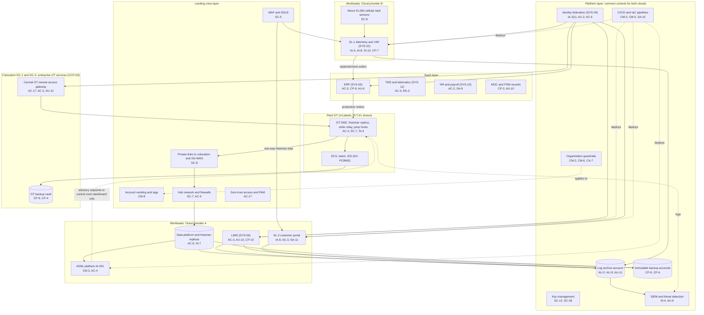

# Cloud Architecture and Control Placement: Cris Santos Company | Chemical | Enterprise

**Organization:** Cris Santos Company, Inc. (publicly traded specialty chemical formulator and packager) | **Tier:** Enterprise | **Provider:** Multi-cloud, vendor-agnostic: two public cloud providers (called Cloud provider A and Cloud provider B), two colocation data centers (DC-1 Florida, DC-2 Ohio), and SaaS (see section 4)
**Owner:** Director of Cloud Platform Engineering, with the Director of OT Security and the CISO | **Date:** 2026-08-31 | **Related:** GC-PCBMS SSP (P02), enterprise BIA (P05)

## 1. Architecture in layers
The estate is organized in four cloud layers plus the paths that connect plant OT to the cloud. Each lower layer provides **common controls** that the layers above inherit, so a workload team configures only what is specific to its system.

| Layer | What it is | Examples | Who runs it |
|---|---|---|---|
| **Platform** | Organization-wide services in both clouds | Cloud organization guardrails, identity federation, key management, log archive, SIEM feeds, vulnerability and posture management, immutable backup accounts, CI/CD pipelines | Cloud Platform Engineering; Security Operations; Identity team |
| **Landing zone** | The standard account (subscription or project) pattern every workload lands in | Account vending with mandatory tags (including an OT-data tag), hub-and-spoke network with cloud firewalls, private connectivity to colocation and the SD-WAN, WAF and DDoS protection, private DNS, zero-trust and PAM access | Cloud Platform Engineering; Network Engineering |
| **Workload** | Systems built or run by the company | Cloud A: LIMS, data platform with historian replicas, AI/ML platform (AI-001), SL-2 customer portal. Cloud B: SL-1 tank telemetry and VMI platform | Application and data teams |
| **SaaS** | Vendor-operated applications | ERP, transportation management and fleet telematics, HR and payroll, productivity suite, MOC and PSM records, SDS authoring | Vendors, with the company's configuration and oversight |
| **OT-to-cloud paths and enterprise OT services** | The only places where plant OT meets the enterprise and the cloud | Historian one-way replication from each plant OT DMZ; ERP production order relay into each OT DMZ; central OT remote access gateway and OT backup vault in DC-1 and DC-2 | Director of OT Security (CCP-03) with Network Engineering |

**Design rule that matters most in a chemical company:** no cloud account, SaaS application, or AI model can open a session into a plant control network. Data leaves the plants one way through the OT DMZ, and production orders enter only through a relay that the batch system pulls from. Remote people reach OT only through the central OT remote access gateway, never through the cloud zero-trust access service.

## 2. Diagram

## 3. Responsibility by service model
Sources: SRC-AWS-SRM, SRC-AZURE-SRM, and SRC-GCP-SRM in `00_universal-framework/sources/source-register.csv`. The three published models agree on the split used here, so the design does not depend on which two providers the company uses.

| Service model | Provider | Company (customer) | Shared |
|---|---|---|---|
| IaaS (LIMS servers, hub network) | Facilities, hosts, hypervisor, physical network | Guest OS, applications, identities, data, network policy | Encryption (provider service, customer keys), logging |
| PaaS (data platform, AI/ML platform, containers for SL-1 and SL-2) | Also the platform runtime and its patching | Data, access, configuration, keys, application code, model versions | Backups, availability configuration |
| SaaS (ERP, TMS, HR and payroll, MOC records) | Also the application | Users, roles, data, oversight of the vendor | Audit review (complementary user entity controls) |
| Colocation (DC-1, DC-2) | Building, power, cooling, perimeter | Racks, equipment, cage access lists, the OT gateway and vault | None |
| Plant OT and OT DMZ | Not applicable: no cloud provider operates plant OT | Everything | None |

## 4. Service categories and provider equivalents
| Service category | AWS | Microsoft Azure | Google Cloud |
|---|---|---|---|
| Organization guardrails | AWS Organizations service control policies | Azure Policy with management groups | Organization Policy Service |
| Account vending | AWS Control Tower account factory | Azure landing zone subscription vending | Resource Manager project creation |
| Key management | AWS KMS | Azure Key Vault | Cloud KMS |
| Audit logging | AWS CloudTrail | Azure Monitor activity log | Cloud Audit Logs |
| Threat detection and posture | Amazon GuardDuty; AWS Security Hub | Microsoft Defender for Cloud | Security Command Center |
| IoT device connectivity (SL-1 sensors) | AWS IoT Core | Azure IoT Hub | Partner IoT platforms on Google Cloud |
| Managed containers | Amazon EKS | Azure Kubernetes Service | Google Kubernetes Engine |
| Machine learning platform | Amazon SageMaker AI | Azure Machine Learning | Vertex AI |
| Web application firewall | AWS WAF | Azure Web Application Firewall | Cloud Armor |
| Backup service | AWS Backup | Azure Backup | Backup and DR Service |

This table is for reading provider documentation only. The architecture, control map, and SSP describe service categories.

## 5. Common controls
`cloud-control-map.csv` has **71 rows** across 30 components: Platform 21, Landing zone 7, Workload 20, SaaS 11, Colocation 7, OT-to-cloud 5. Responsibility: Customer 53, Shared 14, Provider 4.

**36 rows are published as common controls** (`common_control` = Yes) in the enterprise common control catalog. They map to the common control providers in the GC-PCBMS SSP (P02 section 10.3): identity (CCP-02), enterprise OT security services (CCP-03, the gateway and vault), security operations (CCP-04), network (CCP-05), and the cloud landing zone (CCP-06). A cloud workload inherits them by being deployed through account vending, which applies the guardrails, logging, network, key, and backup policies automatically. A plant inherits the OT services by being onboarded to the gateway and vault, which 11 of 14 plants are.

**Rules for inheriting:**
1. A workload may claim a common control only if its account was created by account vending and passes the posture baseline.
2. Customer-side identity, data protection, and logging stay explicit at every layer: even a SaaS application has Customer rows for access (AC-3, AU-6) because those are always the company's responsibility.
3. SaaS rows cite the vendor's SOC 1 or SOC 2 report, reviewed by the third-party risk team (P09 evidence map).
4. Any account tagged OT-data (historian replicas, AI-001 training data) must also pass the OT-to-cloud flow review by the Director of OT Security.

## 6. Validation against the GC-PCBMS SSP (P02)
The GC-PCBMS itself runs on premises at PLT-01. These are the cloud and colocation components it depends on, with controls from each required family, directly or inherited:

| GC-PCBMS dependency | AC | AU | CM | IA | SC | SI / CP |
|---|---|---|---|---|---|---|
| Central OT remote access gateway | AC-17, AC-2 | AU-12 | CM-6 (inherited, CCP-03 baseline) | IA-2(1) (inherited) | SC-7 (PLT-01 OT DMZ) | SI-4 (inherited) |
| OT backup vault | AC-6 (inherited) | AU-2 (inherited) | CM-5 (inherited) | IA-2(1) (inherited) | SC-28 (P02) | CP-9, CP-4 |
| Historian replication path | AC-4 | AU-2 (inherited) | CM-3 (inherited) | Not applicable (no interactive users) | SC-7 | SI-4, SI-7 |
| ERP production order relay | AC-4 | AU-6 (ERP) | CM-3 (inherited) | IA-2(1) (inherited for ERP users) | SC-8 (inherited) | SI-10 |
| AI-001 on the AI/ML platform | AC-4 | AU-2 (inherited) | CM-3 | IA-2(1) (inherited) | SC-28 (inherited) | SI-4 |

## 7. Findings from the mapping
1. **The one-way design holds at PLT-01.** The firewall review on 2026-08-12 confirmed that the historian path is outbound-only and that no cloud route reaches a plant control network. AI-001 can only display advisory setpoints; the proposed closed-loop pilot would break this rule and is held for committee review (P10).
2. **Shared integrator accounts on the gateway.** Three PLT-01 integrator accounts were shared by several integrator staff (P07 AC-2; POAM-005). This is a weakness in a common control, so it affects every plant behind the gateway.
3. **Acquired plants are outside the common OT services.** PLT-12 to PLT-14 are not on the gateway or the vault; integrators use their own remote tools and backups are local (POAM-014; POAM-015). Until they are onboarded, those plants cannot claim CCP-03 controls.
4. **Two clouds, one control set.** Guardrails, logging, and key policies are written once as code and applied to both clouds. Differences are limited to service names (section 4).
5. **TMS and telematics carry en route security data** but are not yet in the DOT security plan risk assessment (POAM-018).
6. **Restore proof for OT lags the cloud.** Cloud workloads met their RTOs in the 2026 tests (LIMS 6.2 h of 8 h; SL-1 3.1 h of 4 h). The OT vault has proven a restore for 1 of 3 PLT-01 DCS areas (POAM-003).
