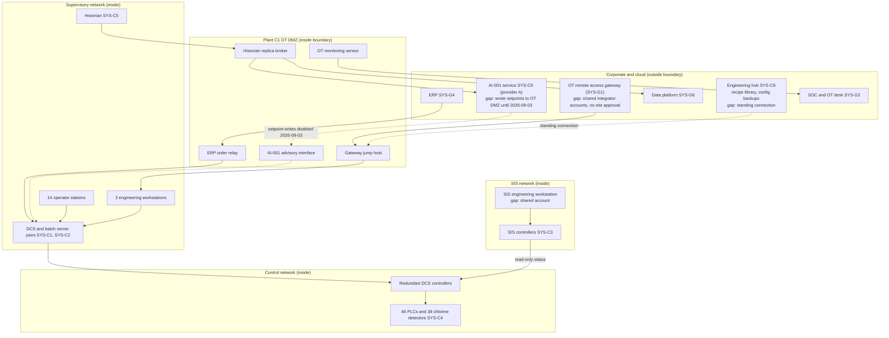

# System Security Plan: Plant C1 Process Control and Batch Management System (PCBMS)

**Organization:** Cris Santos Company Holdings, Inc. (Specialty Chemicals division, Plant C1, inheriting common controls from corporate shared services) | **Tier:** Multi-Sector | **Vertical:** Chemical
**Outline:** NIST SP 800-18 Rev. 2, System Security Plan Outline Example (June 2026), with OT guidance from NIST SP 800-82 Rev. 3 | **Version:** 1.0, 2026-09-17

> **Why this system.** At this tier the SSP can cover one system per division or a shared corporate system. The group chose the **Plant C1 PCBMS**, the focus division's primary system, because it controls the group's largest toxic inventory (up to 360,000 lb of chlorine in an RMP Program 3 process), it is reachable through the shared OT remote access gateway that carries the top group risk (P01 GR-01), and it inherits about half of its controls from corporate. The plan is paired with a **common control catalog** (`common-control-catalog.csv`, 116 controls) that every division system inherits from. Terminal T1 (SYS-D1) and the Hazmat Transport TMS (SYS-T1) keep division plans that inherit from the same catalog.

## 1. System Name and Identifier
Plant C1 Process Control and Batch Management System (**PCBMS**), identifier CSCH-SC-C1-OT-001. Covers SYS-C1 to SYS-C5 in `../00_company-facts.md` section 3.

## 2. System Overview
The PCBMS runs Plant C1, the Specialty Chemicals flagship in Florida. It controls:
- **chlorine rail unloading** from up to 2 connected 90-ton tank cars;
- **two sodium hypochlorite reactor trains** (chlorine and 50% caustic soda);
- the **bulk tank farm** (hypochlorite, caustic soda, 50% hydrogen peroxide) and the **truck loading rack**;
- **three blend halls** that run about 2,300 master recipes for cleaning, sanitation, and process chemicals.

Plant C1 makes about 900 tons a day and ships about 140 truckloads a day. About 60% of its hypochlorite goes to drinking water and wastewater utilities (P05 BP-SC01).

**Users:** about 96 operators and shift superintendents across 4 shifts (14 operator stations), Plant C1 Controls Engineering (3 engineering workstations), 6 I&E technicians (SIS engineering workstation), process engineers (recipes), the central Process Control Engineering hub (SYS-C8), and 3 integrator teams with remote and on-site support through the group gateway.

**Major components:**
- **SYS-C1 DCS:** redundant controllers and server pairs, 14 operator stations, 3 EWS; one major release behind the vendor's current release (still supported)
- **SYS-C2 batch management and recipe system** on the DCS server pairs, synchronized from the division recipe library in SYS-C8
- **SYS-C3 SIS:** separate safety controllers and a separate SIS engineering workstation; chlorine car emergency isolation, reactor high-temperature and feed-ratio trips, scrubber trips, and the hydrogen peroxide tank high-temperature trip
- **SYS-C4:** 46 PLCs for rail unloading, the tank farm, and the loading rack, and 38 chlorine detectors alarmed in the control room and at the Group ERC
- **SYS-C5:** process historian and the OT DMZ (historian replica broker, gateway jump host, ERP order relay, AI-001 advisory interface)
- the Plant C1 control, supervisory, and SIS networks and their firewalls

**Why integrity and availability are High.** A changed setpoint, alarm limit, or recipe can overfeed chlorine into a reactor, overheat it, or mix incompatible chemicals. The chlorine process is covered by OSHA PSM and therefore by **RMP Program 3** (40 CFR 68.10(l)(2)), and a release could reach the public. The SIS must be available whenever chlorine is connected (P05 BP-SC02, MTD 2 hours).

## 3. Laws, Regulations, and Policies Affecting the System
| ID | Requirement | Citation | How it applies to the PCBMS |
|---|---|---|---|
| (none) | EPA Risk Management Program, **Program 3** | 40 CFR Part 68, Subparts A to E (68.15, 68.65 to 68.87, 68.90 to 68.96) | **Binding.** The PCBMS implements the safe upper and lower limits (68.65(c)(1)(iv)), safety systems (68.65(d)(1)(viii)), and emergency shutdown (68.69(a)(1)(iv)) the RMP relies on. Control system changes go through MOC (68.75). Monitoring equipment needs standby power by 2027-05-10 (68.67(c)(3); 68.10(g)(1)) |
| (none) | OSHA Process Safety Management | 29 CFR 1910.119 | **Binding** for the chlorine process (Appendix A threshold 1,500 lb). Its elements parallel RMP Program 3; this plan cites the RMP sections |
| (none) | CERCLA and EPCRA release reporting | 40 CFR 302.6; 40 CFR 355.40 to 355.43 | **Binding.** Chlorine RQ is 10 lb (40 CFR 302.4). The gas detection system and notification path must work with the business network down |
| C-CHEMICAL-R01 | CFATS RBPS 8 (Cyber) | 6 CFR 27.230(a)(8) | **Voluntary benchmark.** CFATS authority expired on 2023-07-28 and has not been reauthorized (checked 2026-10-05). Plant C1 was tiered before the lapse and keeps its legacy measures (P03) |
| OT-BM | OT benchmark | NIST CSF 2.0 with NIST SP 800-82 Rev. 3 | **Voluntary.** The group OT security standard (2025) is built on it |
| (none) | DOT hazmat security plan (offeror) | 49 CFR 172.800 to 172.804 | **Binding** for the division. The loading rack and shipping paper data support the Specialty Chemicals security plan for 50% hydrogen peroxide and Class 3 solvents (P03) |
| N42-R07 | SEC cybersecurity disclosure | Reg S-K Item 106; Form 8-K Item 1.05 | A PCBMS incident could be material to the group (P08) |
| C-CHEMICAL-R03 | CIRCIA (proposed 6 CFR Part 226) | NPRM 89 FR 23644 (2024-04-04) | **Not in effect.** Tracked only |
| Internal | Group policies POL-01 to POL-05, the group OT security standard, and the Specialty Chemicals supplement | P06 | All apply to the PCBMS |

Not applicable: **C-CHEMICAL-R02** (USCG Subpart F) applies only to facilities that must have a 33 CFR Part 105 security plan (101.605(a)); Plant C1 is inland and rail-served. It applies to Terminal T1 (P03).

## 4. System Status
### 4.1 System Security Plan Approval
Approved on 2026-09-17 by the Plant C1 Plant Manager (system owner and RMP qualified person), the Specialty Chemicals Vice President of Manufacturing Technology, and the Group CISO, after the board risk committee review.

### 4.2 System Authorization Decision
The group is not a federal agency, so there is no formal authorization. The equivalent internal decision:
- **Decision:** authorized to operate with conditions, 2026-09-17, by the Group CISO and the Group Chief Risk Officer (acceptance authority for High risks), with the Plant Manager confirming as RMP qualified person that the interim measures are adequate for the chlorine release scenarios.
- **Conditions:**
  1. AI-001 stays advisory, and the firewall rule that allowed writes from provider A into the OT DMZ is removed by 2026-12-31 (POAM-005). Done in part: writes disabled 2026-09-03.
  2. Until per-session site approval is built into the gateway (POAM-001), every remote engineering session to Plant C1 needs a phone approval from the shift superintendent, logged in the control room. The standing hub connection to the Plant C1 EWS is disabled by 2026-10-31.
  3. Recipe pushes from SYS-C8 to Plant C1 are held in a staging area until the plant MOC screen is done (interim manual hold, then POAM-003).
  4. The control system compromise scenarios are added to the next PHA revalidation (POAM-004).
- **Reauthorization:** annually, or at completion of the gateway redesign.

### 4.3 System Operational Status
Operational. **Major modifications planned:** DCS upgrade at the 2027 turnaround (an RMP major change with a pre-startup safety review, 68.77); per-session approval and named accounts on the gateway (POAM-001).

## 5. Role Identification and Responsible Personnel
| Role | Title | Responsibility |
|---|---|---|
| System owner | Plant C1 Plant Manager | Accountable for the PCBMS and this SSP; RMP qualified person (40 CFR 68.15(b)); incident commander for process emergencies |
| Authorizing official equivalent | Group CISO with the Group Chief Risk Officer | Authorization decision; High risk acceptance (process safety High risks must be treated, not accepted) |
| Business owner (standard for all plants) | Specialty Chemicals Vice President of Manufacturing Technology | Plant control system standard |
| OT implementation lead | Plant C1 Controls Engineering Manager | DCS, SIS, PLCs, and OT network; approves control system configuration changes |
| Process safety lead | Plant C1 Process Safety Manager | PHA, MOC, pre-startup safety reviews, compliance audits |
| Central engineering | Specialty Chemicals Director of Process Control Engineering | SYS-C8 hub, recipe library, configuration repositories |
| Common control providers | Group identity director and Group OT Security Director (SYS-G1 and the gateway), Group SOC director (SYS-G2), Group cloud platform director (SYS-G3) | Operate inherited controls (`common-control-catalog.csv`) |
| Independent assessor | Group internal audit | Assesses common controls once and samples division controls (P07) |

**Where roles overlap and how that is compensated.** The Controls Engineering Manager both approves and often makes control system changes. The MOC sign-off by the Process Safety Manager and the weekly configuration comparison reviewed by the OT desk are the independent checks.

## 6. System Information Types and System Categorization
NIST SP 800-60 Vol. 2 Rev. 1 has no information type for industrial process control. These organization-defined types were rated against the FIPS 199 impact definitions, following SP 800-82 Rev. 3 (sec. 4.3.2, Categorize).

| Information type | Confidentiality | Integrity | Availability | Rationale |
|---|---|---|---|---|
| Process control and safety logic (setpoints, alarm limits, interlocks, sequences) | Moderate | **High** | High | An unauthorized change could cause a chlorine release that reaches the public (catastrophic). Logic details would help an attacker plan one |
| Safety instrumented functions (runtime) | Low | **High** | **High** | Loss of the SIS removes the last automated safeguard while chlorine is connected (P05 BP-SC02) |
| Master recipes and formulations | **Moderate** | **High** | Moderate | Trade secrets for about 2,300 products; an altered recipe can create an incompatible mixture (P05 BP-SC03) |
| Process history and gas detection records | Low | Moderate | Moderate | Needed for incident investigation (68.81) and release reports; production does not need them (P05 BP-SC06) |
| Security and legacy CVI information (Site Security Plan, network diagrams) | Moderate | Moderate | Low | Would help an attacker; legacy CVI still protected as a precaution |
| **PCBMS category (high-water mark)** | **Moderate** | **High** | **High** | Overall **High** |

**Baseline:** the NIST SP 800-53B **High** baseline, tailored for OT per SP 800-82 Rev. 3 (sec. 4.3.3, Select). The plan documents **230 controls** in `control-implementation.csv`:
- 224 from the High baseline;
- 5 added from the SP 800-82 Rev. 3 OT overlay and good practice (CP-12 safe mode, SC-41 port and I/O device access, SC-45 time synchronization, SI-13 predictable failure prevention, SI-17 fail-safe procedures);
- 1 program management control (PM-9).

**Tailoring decisions** (group tailoring register):
- **Safety over lockout.** AC-2(5), AC-7, and AC-11 are tailored on operator HMIs so an operator is never locked out during an upset. The staffed, badge-controlled control room compensates.
- **Fail safe.** CP-12, SC-24, and SI-17 are met by the SIS design.
- **Not applicable (2):** CP-7, because a chemical process cannot move to an alternate processing site (sister plants and safe shutdown are the continuity strategy), and SC-15, because no collaborative computing devices exist on OT hosts.
- Other High-baseline controls that apply only to federal systems or to services the group does not run (for example, most PM controls and public-facing DNS controls) are recorded as out of scope in the tailoring register.

## 7. Authorization Boundary Description
**Inside the boundary:** SYS-C1 to SYS-C5, the Plant C1 control, supervisory, and SIS networks, the OT DMZ and its firewalls, and the OT workstations.

**Outside, inherited (common control providers):** SYS-G1 (identity, PAM, and the OT remote access gateway), SYS-G2 (SOC, SIEM, and OT monitoring console; the sensors at Plant C1 are owned by SYS-G2), and SYS-G3 (WAN and the immutable backup vault).

**Outside, interconnected:** SYS-C8 (central engineering hub and recipe library), SYS-C9 (AI-001 service on provider A), SYS-G4 (ERP production orders), and SYS-G6 (group data platform, via the historian replica).

Dotted lines are the paths behind scenario gaps 1 and 9. **Target design:** gateway sessions to Plant C1 only with named accounts and per-session approval by the shift superintendent; no standing hub connection; recipe and configuration transfers from SYS-C8 land in a DMZ staging share for plant MOC review; the AI-001 interface is read-only to the plant (operators enter any change by hand).

**Conduit register (summary).**
| Conduit | From | To | Status |
|---|---|---|---|
| C1-01 | OT remote access gateway | Jump host, then EWS | Allowed; **per-session approval missing** (POAM-001) |
| C1-02 | SYS-C8 hub | Jump host (standing connection) | **To be removed by 2026-10-31** |
| C1-03 | ERP | Order relay, then batch servers | Allowed |
| C1-04 | Historian | Replica broker, then SYS-G6 and SYS-C9 | Allowed; one-way |
| C1-05 | SYS-C9 AI-001 service | Advisory interface, then DCS | **Writes disabled 2026-09-03; rule removal by 2026-12-31** (POAM-005) |
| C1-06 | DCS controllers | SIS | Read-only status; keep |
| C1-07 | OT sensors | SOC | Allowed; outbound only |

## 8. Information Exchanges Summary
| Connected system / party | Direction | Data | Agreement |
|---|---|---|---|
| SYS-C8 central engineering hub | Bidirectional | Recipes, configuration backups, engineering sessions | Interconnection agreement (2025); **recipe pushes bypass the plant MOC screen** (POAM-003) |
| SYS-G4 ERP | Inbound | Production orders, batch sizes | Interconnection agreement (2025) |
| SYS-G6 group data platform | Outbound | Historian data for analytics and AI training | Interconnection agreement (2025); one-way |
| SYS-C9 AI-001 service | Outbound data; inbound advisory setpoints | Process data; recommended caustic feed ratio and temperature setpoints | **None** (POAM-005). Automatic writes from 2026-06 to 2026-09-03 without MOC or AI council approval (P10) |
| 3 integrator teams (via the gateway) | Bidirectional (remote session) | Configuration, logic, diagnostics | Service agreements; 1 of the 3 lacks security clauses (POAM-022) |
| DCS and SIS vendors | Inbound (media) | Software updates and patches | Support contracts; hashes verified (SR-11) |
| County fire rescue, LEPC, SERC, National Response Center | Outbound (phone) | Release notifications | Emergency response plan; 68.93 coordination records |
| Group ERC | Outbound (alarm repeat) | Chlorine detector alarms | Internal |

## 9. System Component Inventory
The full inventory (412 devices, with firmware versions and criticality) is kept from passive monitoring and reconciled quarterly (CM-8).

| Component | Type | Location | Owner |
|---|---|---|---|
| DCS controllers (redundant pairs) | Controller | Process area control cabinets | Controls Engineering Manager |
| DCS and batch server pairs | Server | Control building server room | Controls Engineering Manager |
| Operator stations (14) | OT workstation | Central control room | Controls Engineering Manager |
| Engineering workstations (3) | OT workstation | Engineering room in the control building | Controls Engineering Manager |
| SIS controllers and SIS engineering workstation | Safety system | SIS cabinets; locked SIS room | Controls Engineering Manager |
| Rail unloading, tank farm, and rack PLCs (46) | Controller | Field cabinets | Controls Engineering Manager |
| Chlorine detectors (38) and alarm panel | Safety instrument | Unloading area, reactors, control room air intake | Controls Engineering Manager |
| Process historian | Server | Server room | Controls Engineering Manager |
| OT DMZ servers (jump host, replica broker, order relay, advisory interface) | Server | Server room | Group OT Security Director (pattern); Controls Engineering Manager (operation) |
| OT firewalls (3) and switches | Network | Server room and field cabinets | Controls Engineering Manager |
| OT monitoring sensors (2) | Sensor | Supervisory and control networks | Group SOC director |
| UPS and standby generator | Power | Control building | Plant C1 Plant Manager |

## 10. Control Implementation Details
### 10.1 Control implementation status
See `control-implementation.csv` (230 controls) and `common-control-catalog.csv` (116 group common controls).

| Status | Controls |
|---|---|
| Implemented | 187 |
| Partially implemented | 41 |
| Planned | 0 |
| Not applicable | 2 |
| **Total** | **230** |

| Inheritance | Controls |
|---|---|
| Common/Inherited (from SYS-G1, SYS-G2, SYS-G3, or group functions) | 94 |
| Hybrid (group provides the mechanism; Plant C1 configures or operates part) | 22 |
| System-specific | 114 |

**The 41 partially implemented controls** cluster in five places:
- **Remote access and accounts** (scenario gap 1): AC-2, AC-2(1), AC-2(12), AC-6, AC-17, AC-17(1), AC-17(4), IA-2(5), IA-5, IA-8, MA-4, MA-5.
- **Change management and process safety** (gaps 3 and 9): AC-4, AC-5, CA-3, CA-9, CM-2(2), CM-3, CM-3(4), CM-4, CM-5, RA-3.
- **Monitoring and integrity:** AU-6, IA-3, SC-8, SC-8(1), SI-2, SI-7, SI-7(1).
- **Supply chain and third parties:** AT-3, PS-7, RA-3(1), SA-4, SA-9, SR-3, SR-6, SR-8.
- **Exercises and notification** (gap 8): CP-4, IR-3, IR-3(2), IR-6.

### 10.2 Common control inheritance by division
The common control catalog lists the 116 controls the PCBMS inherits fully or in part from corporate. Inheritance is **documented for Specialty Chemicals** (2025 inheritance matrix) and **for Distribution** (2026 matrix). It is **not documented for Hazmat Transport** (scenario gap 7). Until POAM-017 closes, Hazmat Transport cannot show which of its security plan and FMCSA record controls are met by group services, and P07 found CA-2 statements other than satisfied for this reason. Gateway and OT standard controls are marked not applicable to Hazmat Transport, which has no plant or terminal OT.

### 10.3 Control assessment status
Common controls were assessed once, and PCBMS and division controls sampled, from 2026-07-06 to 2026-08-28 by group internal audit, with OT tests at Plant C1 on 2026-08-12 during a planned turnaround. See P07 `assessment-results.csv` and `poam.csv`.

## 11. Digital Identity Acceptance Statement
- **Remote access (employees, central engineers, integrators):** authenticator assurance level 2 (AAL2) in NIST SP 800-63B terms at minimum through SYS-G1 and the gateway, with phishing-resistant authenticators required for any session that can change DCS or SIS configuration from 2027-03-31 (POAM-001). Remote access is the most likely path to a chlorine release scenario (P01 SC-001), which is why the bar is higher than for office systems.
- **Local HMI access:** unique operator accounts with a badge tap. MFA at the HMI is not required, because operators must act within seconds during an upset. Physical access to the staffed, badge-and-PIN control room is the second factor in practice.
- **Engineering access (EWS, SIS):** unique named accounts plus physical presence. The SIS also requires the keyswitch in program, with two-person verification. The shared SIS EWS account is being replaced by named accounts (POAM-002).

## 12. Referenced Artifacts
Scenario facts (`../00_company-facts.md`), group and division risk registers (P01), gap analyses and the regulation-by-division matrix (P03), cloud architecture and control map (P04), BIA (P05), group policies and division supplements (P06), assessment and POA&M (P07), incident runbook and notification matrix (P08), SOC 2 readiness (P09), AI governance (P10), and the Plant C1 RMP documents (process safety information, PHA 2024, operating procedures, compliance audit 2025-05-14).

## 13. Acronym List and Glossary
- **CVI:** Chemical-terrorism Vulnerability Information (legacy CFATS)
- **DCS:** distributed control system
- **EWS:** engineering workstation
- **MOC:** management of change (40 CFR 68.75)
- **OT DMZ:** the network zone between the business network and the plant networks that holds the only allowed conduits
- **PHA:** process hazard analysis (40 CFR 68.67)
- **SIS:** safety instrumented system
- **RQ:** reportable quantity (40 CFR 302.4)

## 14. System Security Plan Review and Change Records
| Version | Date | Change | Author |
|---|---|---|---|
| 0.9 | 2026-08-28 | Draft after P07 fieldwork | Plant C1 Controls Engineering Manager |
| 1.0 | 2026-09-17 | Approved with authorization conditions | Group CISO |
