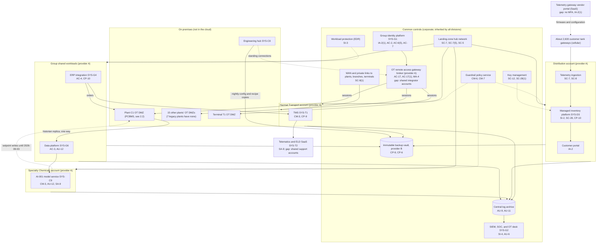
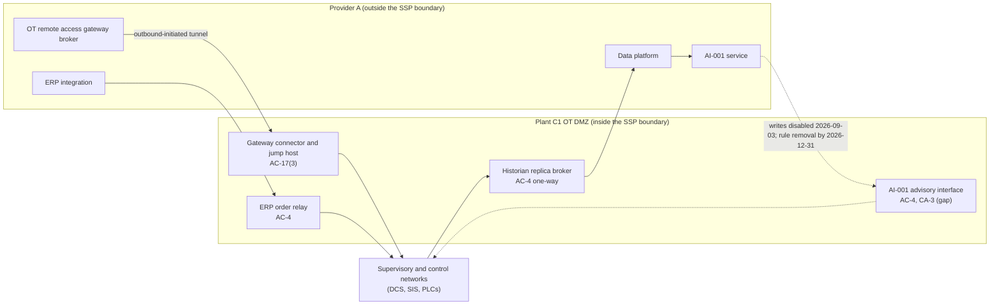

# Cloud Architecture and Control Placement: Cris Santos Company Holdings | Chemical | Multi-Sector

**Organization:** Cris Santos Company Holdings, Inc. | **Tier:** Multi-Sector | **Providers:** two public cloud providers, called provider A and provider B (vendor-agnostic; see section 6)
**Scope:** the shared corporate cloud platform (SYS-G3 landing zones, the OT remote access gateway broker, ERP integration, the data platform) plus the division workloads that run on it, and every conduit between the cloud and the Plant C1 PCBMS (the P02 SSP system, which itself runs on premises).

## 1. Design in one paragraph
Corporate runs one **landing zone** per provider: identity federation from SYS-G1, a hub network, guardrail policies, a central log archive, key management, EDR, and an immutable backup vault in provider B. Divisions get their own **accounts** inside the landing zone and inherit these guardrails. Provider A hosts the corporate hub, the **OT remote access gateway broker**, ERP integration services (SYS-G4), the group data platform (SYS-G6), the AI-001 model service (SYS-C9), the Distribution managed inventory service (SYS-D3), and the Hazmat Transport TMS (SYS-T1). Provider B hosts disaster recovery replicas and the backup vault. **The plants and Terminal T1 stay on premises:** SYS-C1 to SYS-C5, SYS-C8, SYS-D1, and SYS-D2 never run in the cloud. The cloud touches them only through five conduits that end in each site's OT DMZ.

## 2. Diagrams
### 2.1 Group landing zone and division workloads

### 2.2 Conduits between the cloud and the PCBMS (SSP boundary)

**Target state (POAM-001, POAM-005):** the gateway connector requires a per-session approval from the Plant C1 shift superintendent and named integrator accounts; the AI-001 interface is read-only from the plant side, so operators see recommendations and enter any change by hand under the operating procedure; recipe and configuration transfers from SYS-C8 land in a DMZ staging share for the plant MOC screen.

## 3. Tenancy and identity decision
**Decision.** All three divisions federate to the group identity platform (SYS-G1) and get their own accounts inside the SYS-G3 landing zone. No division has a separate cloud tenant with its own identity. Plant and terminal OT is the boundary that matters here: the plants and Terminal T1 stay on premises, keep separate OT domains that are reconciled monthly, and are reached from the cloud only through five conduits that end in each site's OT DMZ.

**Reason.** One identity platform, one SIEM with an OT desk, one backup design, and one gateway let group internal audit assess common controls once. Anything that crosses into a plant or terminal OT DMZ is placed per site, because it depends on that site's process safety and regulators.

**What limits blast radius.** Administrators and central engineers use phishing-resistant MFA and just-in-time PAM with session recording, and OT domain administrator credentials are held in PAM. The OT remote access gateway is the single path for vendor, integrator, and engineering sessions. The historian replica feed to the data platform is one-way, with no inbound path. Backups use a separate backup identity, and Plant C1 restores do not depend on the cloud.

**Known gaps.** The gateway has shared integrator accounts and no per-session site approval, and 8 of 17 sites do not record sessions (POAM-001). The telemetry gateway vendor portal has no MFA (POAM-019). The 7 legacy plants have flat networks and no OT monitoring (GR-05).

Cross-division risks: GR-01 (stolen integrator credential on the shared OT gateway reaches several plants and Terminal T1), GR-03 (ransomware on ERP-connected servers stops all three divisions), GR-05 (spread through legacy plant networks).

## 4. Common versus division-specific controls
`cloud-control-map.csv` has 53 rows across 28 components. The `control_scope` column shows who owns each placement:

| Scope | Rows | What it means |
|---|---|---|
| Common (group) | 25 | Provided once by corporate (SYS-G1 including the gateway, SYS-G2, SYS-G3) and inherited by every division account. Listed in the P02 common control catalog |
| Group shared workload | 4 | ERP integration and the data platform, owned by corporate and used by all divisions |
| PCBMS interface (SSP system) | 6 | The conduits between the cloud and the Plant C1 OT DMZ, documented in the P02 SSP |
| Division-specific (Specialty Chemicals) | 5 | AI-001 model service, LIMS, formulation assistant |
| Division-specific (Distribution) | 8 | Managed inventory platform, telemetry, vendor portal, customer portal |
| Division-specific (Hazmat Transport) | 5 | TMS, telematics and ELDs, driver records |

| Responsibility | Rows |
|---|---|
| Customer (the group or a division) | 40 |
| Shared (provider and group) | 7 |
| Provider | 6 |

**Rule of thumb.** Identity, the OT remote access gateway, network guardrails, logging, keys, backups, and EDR are **common**. A division cannot opt out of them, only request an exception through POL-01. Application behavior and anything that crosses into a plant or terminal OT DMZ are **division-specific or PCBMS interface** placements, because they depend on that site's process safety and regulators.

## 5. Layers
| Layer | Common components | Division components | Key controls | Responsibility |
|---|---|---|---|---|
| Identity | SYS-G1, OT gateway broker and connectors | Customer portal identity; ELD accounts; telemetry vendor portal accounts | AC-2, AC-6(5), AC-17, AC-17(3), IA-2, IA-2(1) | Customer (configuration); vendor (service) |
| Network | Hub network, WAN, private links | Telemetry private access point; OT DMZ conduits | SC-5, SC-7, SC-7(5), SC-8, SC-8(1), AC-4 | Customer, with provider DDoS protection shared |
| Compute | EDR on all cloud hosts; gateway broker hosts | AI-001 service, managed inventory containers, TMS | SI-2, SI-3, CM-3 | Customer (guest OS, containers, code, models) |
| Data | Keys, backup vault | Data platform sets, managed inventory database, plant configuration copies | SC-12, SC-28, SC-28(1), CP-6, CP-9, CP-10, AC-3 | Shared: provider encrypts; group owns keys, retention, and restores |
| Logging and monitoring | Log archive, SIEM, OT desk | AI-001 recommendation log; data platform query logs | AU-6, AU-9, AU-11, AU-12, SI-4 | Shared: providers generate platform logs; group retains and reviews |
| Governance | Guardrail policies | AI-001 interconnection agreement | CM-6, CM-7, CA-3 | Customer |
| SaaS dependencies | Identity, SIEM, EDR vendors | LIMS, telematics and ELD, driver records, telemetry vendor portal, hosted model provider | SA-9, AC-21 | Provider for the service; customer for use and oversight |
| Physical | Provider data centers | none | PE-3, MP-6 | Provider (inherited) |

## 6. Service categories and provider equivalents
The design does not depend on a provider. This table gives each provider's name for each service category, for reading its shared responsibility documentation.

| Service category | AWS | Microsoft Azure | Google Cloud |
|---|---|---|---|
| Account structure and guardrails | AWS Organizations with service control policies | Management groups with Azure Policy | Resource hierarchy with Organization Policy |
| Hub network and private connectivity | Transit Gateway; AWS Direct Connect | Virtual WAN; Azure ExpressRoute | Network Connectivity Center; Cloud Interconnect |
| Managed containers | Amazon EKS | Azure Kubernetes Service | Google Kubernetes Engine |
| Managed machine learning | Amazon SageMaker AI | Azure Machine Learning | Vertex AI |
| IoT telemetry ingestion | AWS IoT Core | Azure IoT Hub | Pub/Sub with a partner IoT platform |
| Key management | AWS KMS | Azure Key Vault | Cloud KMS |
| Audit logging | AWS CloudTrail | Azure Monitor activity log | Cloud Audit Logs |
| Backup with immutability | AWS Backup (vault lock) | Azure Backup (immutable vault) | Backup and DR Service |

Shared responsibility sources: SRC-AWS-SRM, SRC-AZURE-SRM, SRC-GCP-SRM in `00_universal-framework/sources/source-register.csv`. All three agree on the split used here: for IaaS the provider owns facilities, hosts, and virtualization; for PaaS the provider also owns the runtime; for SaaS the provider owns the application. The customer always keeps identities, access decisions, data, and anything it connects to its own plants.

## 7. Findings from the mapping
1. **The cloud's biggest risk to the plants is a conduit, not a workload.** The gateway broker runs in provider A and reaches every plant and Terminal T1. Its controls are common (AC-17, MA-4), so one weakness (shared integrator accounts, no site approval) repeats at 17 sites (P01 GR-01; POAM-001).
2. **A cloud service wrote into a chemical plant's OT DMZ.** From 2026-06 to 2026-09-03, AI-001 in provider A wrote setpoints to the Plant C1 advisory interface, and the DCS applied them within bounded ranges (AC-4, CA-3, CM-3; P01 SC-007; P10). No other cloud workload has any write path into OT.
3. **The managed inventory service depends on a vendor portal outside both landing zones.** The portal that configures about 2,600 customer gateways has no MFA (IA-2(1); scenario gap 6; POAM-019). It is the only path in the map where a stolen password could change what customers' tanks report.
4. **Common controls are strong and reused.** One identity platform, one SIEM with an OT desk, one backup design, and one gateway. This is what lets group internal audit assess them once (P07). Documentation of inheritance for Hazmat Transport is the weak link (P02; POAM-017).
5. **Plant configuration backups use the cloud vault, but restores do not depend on the cloud.** Plant C1 keeps offline copies on site; the vault is the third copy. The 7 legacy plants have neither (P05; POAM-007).
