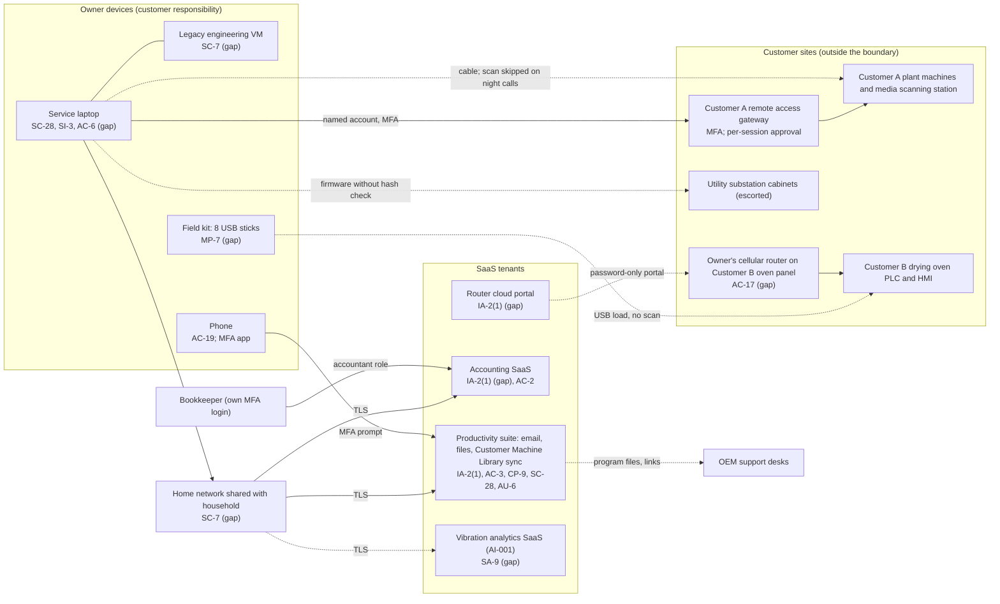

# SaaS Architecture and Control Placement: Cris Santos Company | Critical Manufacturing | Sole Proprietorship

**Organization:** Cris Santos Company (owner-operated industrial equipment repair service) | **Tier:** Sole Proprietorship | **Provider:** SaaS only (no IaaS or PaaS)
**System:** Field Service Business Systems (FSBS), as defined in the system profile (P02) | **Prepared:** 2026-08-25 by the owner-technician with the IT consultant; adopted 2026-09-11

## 1. Diagram
Control IDs on each node are the ones in `cloud-control-map.csv`. Dashed lines are paths with a gap. The customer plants and substations are outside the boundary; the arrows into them are where the FSBS touches operational technology.

## 2. Layers
| Layer | Components | Key controls | Responsibility |
|---|---|---|---|
| Identity | Suite, accounting, router portal, and AI trial accounts | IA-2(1), AC-2 | Customer configures; provider supplies MFA |
| Data | Customer Machine Library, drawings, password spreadsheet, invoices, vibration data | AC-3, CP-9, SC-28, SA-9, MP-7 | Provider protects data inside its service; the owner decides where customer data goes, who it is shared with, and whether a copy exists that ransomware cannot reach |
| Endpoints | Laptop and virtual machine, phone, USB sticks | SC-28, SI-3, AC-6, AC-19, MP-7 | Customer |
| Network | Home network; the router at Customer B; cables into customer machines | SC-7, AC-17 | Customer (the owner's own devices); the customers run their plant networks |
| Logging | Suite sign-in and sharing history; router portal log | AU-6 | Shared: provider records, owner reviews |
| SaaS applications and hosting | All four SaaS platforms | Inherited (platform security, availability, facilities) | Provider |

## 3. Shared responsibility for SaaS
All three major cloud providers' shared responsibility models (SRC-AWS-SRM, SRC-AZURE-SRM, SRC-GCP-SRM) agree on the SaaS split: the provider runs the application, the platform, and the facilities; **the customer always keeps its identities and accounts, its data, and its devices.** That is why 14 of the 17 rows in the control map are the owner's alone, 2 are shared, and 1 is the provider's. No provider SOC 2 report covers sharing links, sync behavior, or what the laptop plugs into. No IaaS provider equivalents table is needed, because the business runs no infrastructure.

One point is specific to this business: **sync is not backup.** Version history protects against a deleted file; it does not protect against ransomware that encrypts the library on the laptop and syncs every changed file within minutes. The P07 test restore on 2026-08-26 also showed that the plan restores one file at a time. Offline encrypted drives (CP-9) close that gap (P01 R-001).

## 4. Findings from the mapping
1. **Three open sharing links to customer program folders** were found during this mapping (made for OEM support desks in 2025 and 2026). They were removed on 2026-08-25 and default sharing was set to named people only. The disclosures themselves are counted under exhibit S1 (P03 G-036).
2. **MFA is off where it is free to turn on** (accounting SaaS administrator account, router portal). Tracked with P01 R-003 and R-006.
3. **The owner's router at Customer B is a cloud-managed path into a drying oven.** It is the one place where a SaaS account controls access to customer OT. Tracked as P01 R-003 (High).
4. **The AI trial is a fourth SaaS holding customer data** under terms nobody read. Tracked as P01 R-007 and P10.
5. **The phone is part of the security boundary.** It holds the only MFA codes and equipment photos. Losing it is a lockout risk (R-008).
