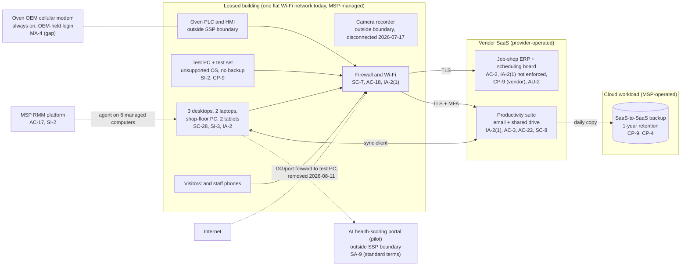

# Cloud Architecture and Control Placement: Cris Santos Company | Critical Manufacturing | Micro

**Organization:** Cris Santos Company, LLC (transformer repair and remanufacturing shop, Florida) | **Tier:** Micro | **Provider:** Vendor-agnostic SaaS (see section 3)
**System:** ERP and Job Scheduling Platform (EJSP), as defined in the SSP (P02) | **Prepared:** 2026-07-24 by the Office Manager with the MSP lead technician; updated 2026-08-12 after P07 testing | **Approved:** Owner, 2026-08-31

## 1. Diagram
The shop runs no servers and no IaaS tenant. Its "cloud" is a set of SaaS services plus one cloud workload the MSP operates for it: the SaaS-to-SaaS backup of the productivity suite (SYS-08). The on-premises side matters as much as the cloud side, because the office, the shop equipment, and visitors share one network.

## 2. Layers and who is responsible
| Layer | Components | Key controls | Customer (the shop) | MSP (on the shop's behalf) | Provider (SaaS vendor) |
|---|---|---|---|---|---|
| Identity | ERP, suite, backup, and AI portal accounts; firewall login; shared shop and test PC logins | AC-2, IA-2, IA-2(1), IA-5 | Decides who gets access; enforces ERP MFA; replaces shared logins | Creates and disables suite and computer accounts; holds firewall and backup admin logins | Runs sign-in and MFA services |
| Network | Firewall, Wi-Fi, internet line | SC-7, AC-18, AU-11 | Approves changes and any port forwarding | Configures, patches, segments, keeps logs | Not applicable |
| Endpoints | 6 managed computers, 2 tablets, test PC | SC-28, SI-2, SI-3, CM-8 | Keeps the inventory; owns the test PC decisions with the Shop Manager | Encryption, antivirus, patching on managed computers | Not applicable |
| SaaS applications | ERP, suite, AI portal | AC-3, AC-22, AU-2, SC-8 | Roles, sharing settings, data entered | Suite administration on request | Application, platform, data centers |
| Data | ERP records, shared drive, backups, test database | CP-9, CP-4, SC-28 | Decides what is backed up and tests restores; sets up the ERP export | Operates the suite backup; runs restore tests | Backs up and encrypts its own platform |
| Logging | ERP audit trail, suite logs, firewall logs | AU-2, AU-6, AU-11 | **Reviews logs monthly (gap today)** | Keeps firewall logs (7 days today) | Generates and stores logs |
| Vendor governance | ERP SOC 2 review, MSP terms, AI vendor terms, OEM access | SA-9, MA-4 | Reviews SOC 2 report; sets contract terms | Reports its own access and subcontractors | Provides SOC 2 reports and terms |

**The MSP is not a cloud provider in the shared responsibility sense.** It performs customer-side duties for the shop. Anything marked "Customer (performed by MSP)" in `cloud-control-map.csv` stays the shop's responsibility: the shop must direct the work, receive evidence, and check it (SA-9). The FAR 52.204-21 safeguards on covered contractor information systems are the shop's duty under its purchase order, whoever performs them.

## 3. Service categories and provider equivalents
The design is vendor-agnostic. For SaaS, the shared responsibility split is the same in all three major cloud providers' models: the provider runs the application, platform, and infrastructure; the customer keeps identities, access, data, and devices (SRC-AWS-SRM, SRC-AZURE-SRM, SRC-GCP-SRM in `00_universal-framework/sources/source-register.csv`). For the shop's vendors, the SOC 2 report or vendor documentation is the evidence for the provider side.

| Service category used | What it is here | Equivalent category in the large cloud providers (for reading their documentation) |
|---|---|---|
| Line-of-business SaaS | Job-shop ERP with scheduling board | Industry SaaS built on any provider |
| Productivity suite | Email, calendar, file storage, sync client | Productivity and collaboration SaaS |
| SaaS-to-SaaS backup | Daily backup of mail and the shared drive | Backup service or third-party SaaS backup |
| Analytics SaaS | AI health-scoring portal for oil test results | Managed machine learning or analytics SaaS |
| Remote monitoring and management | MSP device management | Device management SaaS |

## 4. Findings from the mapping
1. **The cloud side is in better shape than the building.** The SaaS vendors' controls are strong and, for the ERP, evidenced by a SOC 2 report. The weak layer is on-premises: one flat Wi-Fi network joins office computers, the unsupported test PC, the oven HMI, and visitors' phones (SC-7, AC-18). Fix: separate networks for office, shop equipment, and guests by 2026-11-30 (POAM-003; P01 R-001, R-016).
2. **An internet-facing door was open for two years (SC-7, AC-17).** P07 testing found a port-forwarding rule, left from a 2024 test set vendor support session, that exposed remote desktop on the test PC to the internet. The MSP removed it on 2026-08-11. The firewall keeps only 7 days of logs, so earlier use cannot be ruled out (P01 R-024; POAM-005).
3. **The ERP holds the business but is protected by a password alone (IA-2(1)).** MFA is available and off. A stolen password would let an attacker change supplier bank details, customer records, or delete jobs. Fix: enforce MFA and separate administrator accounts by 2026-09-30 (POAM-002; P01 R-010).
4. **The shop holds no copy of its ERP data, and nothing protects the test database (CP-9).** The ERP vendor's backups protect against the vendor's failures, not against an attacker who deletes data with a stolen administrator password, or the loss of the account. Fix: the vendor's scheduled full export to the shared drive (so the suite backup keeps a year of copies), and a nightly copy of the test PC database (POAM-007; P01 R-002, R-011).
5. **Two outside parties can reach shop computers or equipment with no oversight (AC-17, MA-4).** The MSP's RMM tool can run commands on every managed computer, and the oven OEM's modem can reach the oven controls at any time. Fix: MSP contract terms and a technician list (POAM-012), and a modem that is powered only during an approved session (POAM-006).
6. **The AI portal sits outside the boundary on purpose.** It is a pilot under vendor standard terms. It is mapped here only to show the SA-9 gap; P10 sets the conditions for keeping it.
