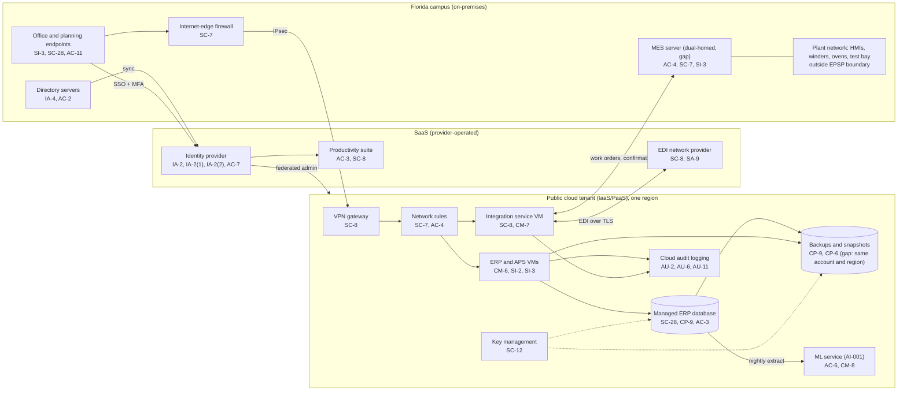

# Cloud Architecture and Control Placement: Cris Santos Company | Critical Manufacturing | Small

**Organization:** Cris Santos Company, LLC (power and distribution transformer manufacturer, Florida) | **Tier:** Small | **Provider:** Vendor-agnostic public cloud (IaaS/PaaS) plus SaaS (see section 3)
**System:** the cloud part of the ERP and Production Scheduling Platform (EPSP), as defined in the SSP (P02), plus the SaaS services around it
**Prepared:** IT Manager, 2026-08-07 (updated after P07, 2026-09-04)

## 1. Diagram

The line from the integration service to the MES runs through the VPN and the office network. Because the MES is dual-homed, that line continues into the plant network (finding 2).

## 2. Layers
| Layer | Components | Key controls | Responsibility |
|---|---|---|---|
| Identity | Identity provider, cloud IAM roles, directory servers | AC-2, AC-6, AC-7, IA-2, IA-2(1), IA-2(2) | Customer (configuration, accounts); provider (service) |
| Network / edge | Internet-edge firewall, site-to-site VPN, cloud network rules | SC-7, SC-8, AC-4 | Customer; provider runs the VPN gateway service |
| Compute / application | ERP and APS VMs, integration service VM, ML service job | CM-6, CM-7, SI-2, SI-3, CM-8 | Customer (guest OS, ERP software, integration software, model) |
| Data | Managed database, VM disks, backups, key management | SC-28, SC-12, CP-9, CP-6, CP-4, AC-3 | Shared: provider encrypts and runs backups; customer sets keys, retention, isolation, and restore tests |
| Logging / monitoring | Cloud audit logs, identity provider sign-in logs, ERP audit log | AU-2, AU-6, AU-11 | Shared: provider generates; customer retains and reviews |
| SaaS applications | Identity provider, EDI network provider, productivity suite | AC-3, SC-8, SA-9 | Provider (application and infrastructure); customer (users, sharing settings, data) |
| Physical / hypervisor | Provider data centers | PE-3, PE-11 | Provider (inherited) |

`cloud-control-map.csv` has 34 control placements across 14 components: 22 customer, 7 shared, and 5 provider.

## 3. Service categories and provider equivalents
The company's design does not depend on one provider. This table gives each provider's name for each service category, to use when reading its shared responsibility documentation.

| Service category | AWS | Microsoft Azure | Google Cloud |
|---|---|---|---|
| Virtual machines | Amazon EC2 | Azure Virtual Machines | Compute Engine |
| Managed relational database | Amazon RDS | Azure SQL Database | Cloud SQL |
| Backup service | AWS Backup | Azure Backup | Backup and DR Service |
| Identity and access management | AWS IAM | Azure role-based access control with Microsoft Entra ID | Cloud IAM |
| Key management | AWS KMS | Azure Key Vault | Cloud KMS |
| Audit logging | AWS CloudTrail | Azure Monitor activity log | Cloud Audit Logs |
| Site-to-site VPN | AWS Site-to-Site VPN | Azure VPN Gateway | Cloud VPN |
| Network filtering | Security groups | Network security groups | VPC firewall rules |
| Machine learning platform | Amazon SageMaker AI | Azure Machine Learning | Vertex AI |

Shared responsibility sources: SRC-AWS-SRM, SRC-AZURE-SRM, SRC-GCP-SRM in `00_universal-framework/sources/source-register.csv`. All three models agree on the split used here:
- **IaaS:** the provider owns physical facilities, hosts, and the virtualization layer. The customer owns the guest operating system, applications, network configuration, identities, and data.
- **PaaS (managed database, ML service):** the provider also patches the database engine or platform. The customer still owns access, data, keys it chooses to manage, and backup settings.
- **SaaS:** the provider owns the application. The customer keeps identities, access, sharing settings, data, and devices.

## 4. Findings from the mapping
1. **Backup isolation (CP-9, CP-6, CP-4).** ERP database backups and VM snapshots share the production account, region, and administrator roles, and they are not immutable. An attacker with cloud administrator rights could delete them before encrypting the ERP. No restore has ever been tested. **Fix:** copy backups to a separate account in a second region with write-once retention, and run a restore test every quarter. Tracked as P01 R-002 and P07 POAM-002 and POAM-007.
2. **The cloud tenant has a path into the plant (AC-4, SC-7).** The integration service reaches the MES over the VPN, and the MES has a second network interface on the plant network. A compromise of the cloud tenant or the VPN therefore reaches HMIs and ovens. **Fix:** terminate the ERP to MES link in the planned OT DMZ, allow only the integration service's address and port, and remove MES dual-homing. Tracked as P01 R-001 and P07 POAM-001.
3. **Log retention and review (AU-6, AU-11).** Cloud logs keep 90 days and identity provider logs 30 days, and nobody reviews them. A slow intrusion would age out before anyone looked. **Fix:** export to a log workspace with 1-year retention, with weekly review now and 24x7 managed detection later (P07 POAM-006, POAM-015).
4. **Single region (CP-7).** The ERP runs in one region. A regional outage longer than the 24-hour RTO for BP-01 has no tested answer (P01 R-020). **Fix:** use the second-region backup copy from finding 1 as the restore target and test it in 2027.
5. **Inherited controls rest on assurance reports the company has not read.** Only the MSP's SOC 2 report has been reviewed (P09). The provider rows above for the cloud provider, identity provider, and EDI provider need their current SOC 2 or equivalent reports, reviewed with the P09 method (P03 G-016).
6. **AI-001 is outside every inventory (CM-8).** The forecasting job reads a nightly ERP extract under its own service identity, which is good practice. But the model and its data are not inventoried. See P10.

The AI-002 predictive maintenance service is a vendor SaaS fed from the plant historian. It is outside this tenant and the EPSP boundary and is covered in P10.
