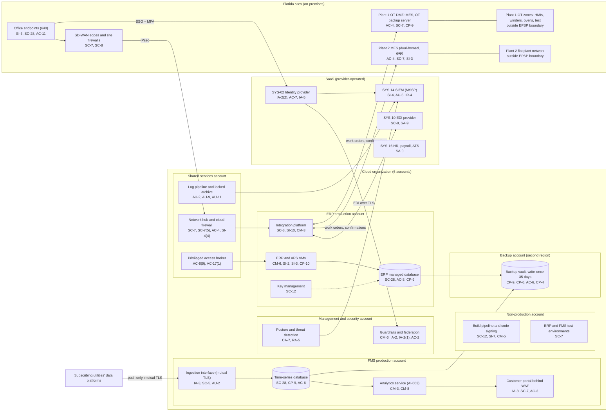

# Cloud Architecture and Control Placement: Cris Santos Company | Critical Manufacturing | Mid-Market

**Organization:** Cris Santos Company, Inc. (PE-backed power and distribution transformer manufacturer, Florida) | **Tier:** Mid-Market | **Provider:** Vendor-agnostic public cloud (see section 4), plus SaaS
**Systems:** the cloud part of the ERP and Production Scheduling Platform (EPSP, P02), the Fleet Monitoring Service (FMS), and the product software pipeline | **Prepared:** 2026-07-31 by the IT Director and the Security Manager; updated 2026-09-15 with P07 results
**Control map:** `cloud-control-map.csv` (65 rows, 27 components)

## 1. Diagram

The link from the integration platform to the Plant 2 MES runs across the SD-WAN. Because the Plant 2 MES is dual-homed, that link continues into the Plant 2 plant network (finding 2). The Plant 1 link ends in the OT DMZ.

## 2. Landing zone design
The landing zone separates duties across 6 accounts (subscriptions or projects, depending on the provider) under one cloud organization, so that a compromise of one account cannot easily reach another.

| Account | Purpose | Who administers | Key design decisions |
|---|---|---|---|
| **Management and security** | Organization root, guardrails, cloud identity federation to SYS-02, posture management and threat detection | Security Manager and 1 analyst | No workloads. Root credentials sealed. Guardrails apply to every other account and cannot be disabled from them |
| **Shared services** | Network hub and cloud firewall, SD-WAN termination, DNS, privileged access broker, patch service, log pipeline and locked log archive | IT Director's infrastructure team | All traffic between sites, accounts, and the internet passes the hub; logs from all accounts land in a write-once archive |
| **ERP production** | ERP and APS virtual machines, managed database, integration platform, key management | Infrastructure team and the ERP applications manager | No internet ingress; company-managed keys; vendor support only through the broker |
| **FMS production** | Ingestion interface, time-series database, analytics service (AI-003), customer portal | Digital Services cloud engineers | The only account with internet ingress (portal and ingestion interface, both behind provider edge protection); utility data separated by tenant key; no route to the ERP account or the plants |
| **Non-production** | ERP and FMS test environments, the product software build pipeline and code signing, the firmware library | Infrastructure team; product software team | No routes to production accounts or plants; masked ERP test data |
| **Backup** | Backup vault with 35-day write-once retention in a second region for ERP, FMS, and PLM copies | 2 named backup administrators | Separate administrator credentials not federated to everyday accounts; copy role can write but not delete |

## 3. Layers and shared responsibility per service
| Layer | Components | Key controls | Service model | Responsibility |
|---|---|---|---|---|
| Identity | Guardrails, cloud federation, privileged access broker, SYS-02, FMS customer identity | IA-2, IA-2(1), IA-2(2), IA-8, AC-2, AC-6(5), AC-7, IA-5 | PaaS / SaaS | Customer configures identities, roles, MFA, and reviews; provider runs the identity services |
| Network | Hub, cloud firewall, SD-WAN termination, FMS ingestion interface and web application firewall, on-premises links to both MES | SC-7, SC-7(5), SC-8, AC-4, SC-5, IA-3 | IaaS / PaaS | Customer designs routes, rules, and segmentation; provider runs gateways and edge protection |
| Compute | ERP and APS VMs, integration platform, analytics service, build pipeline | CM-6, CM-3, CM-5, SI-2, SI-3, SI-10, CP-10 | IaaS / PaaS | Customer owns guest operating systems, applications, models, and the pipeline; provider owns hosts and virtualization |
| Data | ERP database, time-series database, keys, backup vault | SC-28, SC-12, CP-9, CP-6, CP-4, AC-3, AC-6 | PaaS | Shared: provider encrypts and operates storage and engines; customer controls keys, access, retention, isolation, and restore testing |
| Logging and monitoring | Log pipeline and archive, posture service, SIEM | AU-2, AU-9, AU-11, AU-12, CA-7, RA-5, SI-4, SI-4(4), AU-6, IR-4 | PaaS / SaaS | Shared: provider generates logs and detections; customer enables, retains, forwards, and acts on them; the MSSP monitors |
| SaaS applications | Identity provider, SIEM, EDI, productivity suite, HR and applicant tracking, AI vendor services | AC-3, AC-20, SA-9, SC-8, AU-12 | SaaS | Provider runs the application and infrastructure; customer keeps users, sharing settings, data, and vendor oversight |
| Physical | Provider data centers | PE-3, PE-13 | All | Provider (inherited, evidenced by SOC 2 reports) |

**Responsibility counts in `cloud-control-map.csv`:** 42 Customer, 19 Shared, 4 Provider (65 rows). By service model: 30 PaaS, 22 IaaS, 13 SaaS. The two on-premises connection rows are labeled IaaS because they extend the hub network into the plants. The customer side is always identity, data protection, and logging, as the three providers' shared responsibility models agree.

## 4. Service categories and provider equivalents
The design is independent of the provider. This table gives each provider's name for the service category, for reading its shared responsibility documentation (SRC-AWS-SRM, SRC-AZURE-SRM, SRC-GCP-SRM in `00_universal-framework/sources/source-register.csv`).

| Service category | AWS | Microsoft Azure | Google Cloud |
|---|---|---|---|
| Multi-account organization and guardrails | AWS Organizations, service control policies | Management groups, Azure Policy | Resource Manager folders, organization policies |
| Account, subscription, or project | Account | Subscription | Project |
| Cloud identity federation | IAM Identity Center | Microsoft Entra ID with Azure RBAC | Cloud Identity with IAM |
| Network hub | Transit Gateway | Virtual WAN hub or hub virtual network | Network Connectivity Center or shared VPC |
| Cloud firewall | AWS Network Firewall | Azure Firewall | Cloud NGFW |
| Managed API gateway with mutual TLS | Amazon API Gateway | Azure API Management | Apigee or API Gateway |
| Web application firewall | AWS WAF | Azure Web Application Firewall | Cloud Armor |
| Virtual machines | EC2 | Virtual Machines | Compute Engine |
| Managed relational database | Amazon RDS | Azure SQL Database | Cloud SQL |
| Managed time-series database | Amazon Timestream | Azure Data Explorer | Bigtable |
| Machine learning platform | Amazon SageMaker AI | Azure Machine Learning | Vertex AI |
| Backup service with immutable vault | AWS Backup (vault lock) | Azure Backup (immutable vault) | Backup and DR Service |
| Key management | AWS KMS | Azure Key Vault | Cloud KMS |
| Audit logging | CloudTrail | Azure Monitor activity log | Cloud Audit Logs |
| Posture and threat detection | Security Hub, GuardDuty | Microsoft Defender for Cloud | Security Command Center |

**Service model split used here (all three providers agree):**
- **IaaS** (virtual machines, networks): the provider owns facilities, hosts, and virtualization. The customer owns the guest operating system, applications, network configuration, identities, and data.
- **PaaS** (managed databases, API gateway, ML platform, backup, key service): the provider also owns the platform software and its patching. The customer owns access, keys, data, and configuration.
- **SaaS** (identity provider, SIEM, EDI, productivity, HR): the provider also owns the application. The customer keeps identities, roles, sharing settings, data, and vendor oversight.

## 5. Findings from the mapping
1. **Backups are well isolated but recovery is unproven (CP-9, CP-6, CP-4, CP-10).** The backup account in a second region with write-once retention and separate credentials is the strongest control in the environment. But only a 2025 file-level ERP restore has been tested, and the ERP has never been rebuilt from templates in a clean account. **Fix:** quarterly restores into an isolated recovery network, starting with the ERP database on 2026-10-27 (P01 R-002; P07 POAM-005).
2. **The cloud has a path into the Plant 2 plant floor (AC-4, SC-7).** The integration platform reaches the Plant 2 MES across the SD-WAN, and that MES is dual-homed on the Plant 2 plant network. A compromise of the ERP account or the SD-WAN could reach Plant 2 HMIs and ovens. Plant 1 does not have this problem because the link ends in its OT DMZ. **Fix:** build the Plant 2 OT DMZ and end the link there (P01 R-001; P07 POAM-001).
3. **The FMS cannot meet its own commitments yet (CP-9, AU-2, CM-3).** Daily backups do not meet the 1-hour RPO in the BIA (BP-14), FMS application logs are not monitored, and AI-003 model updates are deployed without change records. These are the first things a SOC 2 auditor will test (P09; P07 POAM-019).
4. **The code signing key is exposed (SC-12, SI-7).** The key that signs the TMU configuration software sits as a file on the build server, where 6 developers can log in. A stolen key would let an attacker sign malicious software that utilities trust. **Fix:** move signing to the hardware-backed key service with a 2-person release approval (P01 R-012; POAM-017).
5. **Boundary check.** Every in-scope EPSP component in P02 section 9 that lives in the cloud appears in the diagram and has at least one row in the control map. Every account has controls from at least 2 of the AC, AU, CM, IA, SC, and SI families or inherits them. The on-premises MES components are mapped in P02 rather than here.
6. **Inherited controls rely on SOC 2 reports.** Provider and Shared rows for the cloud provider, identity provider, and MSSP depend on their SOC 2 Type 2 reports and complementary user entity controls, reviewed each year in P09 `vendor-soc2-review.csv`. The EDI provider has no report on file yet (POAM-012).
