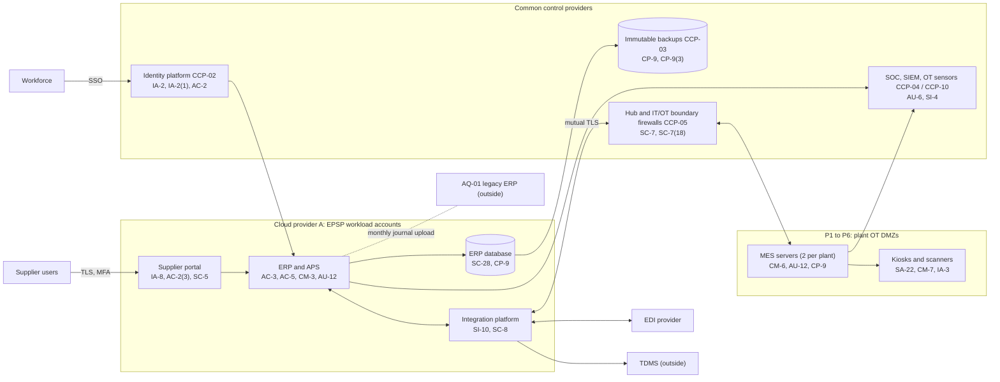

# System Security Plan: Enterprise ERP and Production Scheduling Platform (EPSP)

**Organization:** Cris Santos Company, Inc. (publicly traded power and distribution transformer manufacturer) | **Tier:** Enterprise | **Vertical:** Critical Manufacturing
**Outline:** NIST SP 800-18 Rev. 2, System Security Plan Outline Example (June 2026) | **Version:** 2.0, 2026-09-14

## 1. System Name and Identifier
Enterprise ERP and Production Scheduling Platform (**EPSP**), identifier CSC-SYS-EPSP-001. Tier-1 system in the enterprise application inventory and a SOX-relevant system.

## 2. System Overview
The EPSP runs the order-to-delivery chain for plants P1 to P6. It takes utility and developer orders, configures and prices transformers, builds the finite-capacity production schedule across six plants, reserves storm-restoration slots, releases about 46,000 work orders a month to the plant MES, collects labor, material, and test confirmations, buys steel, copper, fluids, bushings, and TMU electronics, screens and documents exports, and closes the books. If the EPSP stops, plants run on printed schedules and paper travelers for about one shift before shipments start to slip (P05 BP-02, BP-03).

**Why availability and integrity matter most.** An outage stops the flow of work orders to six plants that ship about $15.9 million of transformers per production day. A wrong routing, bill of materials, or scheduling rule builds the wrong unit or misses a storm-restoration commitment. Confidentiality matters too: the EPSP holds bills of materials, supplier pricing, export classifications, and federal contract information (FCI), so FAR 52.204-21 applies to it.

**Major components:**
- ERP application servers and the advanced planning and scheduling (APS) engine (commercial ERP software, customer-managed) on Cloud provider A virtual machines
- ERP database on the provider's managed relational database service
- Integration platform (managed integration service) for ERP to MES, EDI, and TDMS messages
- Supplier collaboration portal (web application behind the landing zone web application firewall)
- MES application servers (2 per plant) in the OT DMZ at each of P1 to P6, and about 1,100 shop-floor kiosks and scanners
- About 180 planning, purchasing, quality, and finance endpoints used mainly for EPSP work

Users: about 5,600 workforce ERP users (including about 140 AQ-01 staff who use the enterprise ERP for customer orders and purchasing), about 420 supplier portal users, and about 3,800 MES users (badge and PIN) at P1 to P6.

## 3. Laws, Regulations, and Policies Affecting the System
| ID | Requirement | Citation | How it affects the EPSP |
|---|---|---|---|
| FAR 52.204-21 | Basic safeguarding of covered contractor information systems | 48 CFR 52.204-21 | The EPSP stores and processes FCI (delivery schedules, agency specifications); the 15 safeguards apply (P03 G-107 to G-123) |
| FAR 52.204-25, -23, -30 | Covered telecommunications, Kaspersky, and FASCSA prohibitions | 48 CFR 52.204-25, 52.204-23, 52.204-30 | Component and supplier checks; reporting clocks in P08 |
| SEC | Cybersecurity disclosure | Form 8-K Item 1.05; 17 CFR 229.106 | A material EPSP incident goes through the P08 materiality step; the EPSP is in the Item 106 program description |
| SOX 404 | Internal control over financial reporting | Separate SOX program | IT general controls over the ERP are tested by the SOX program; this plan references them, not repeats them |
| C-CRITICAL-MFG-R03 | EAR recordkeeping and screening | 15 CFR 762.6(a); 15 CFR Part 744 | Restricted-party screening before export release; export records kept 5 years (the ERP keeps 7) |
| Contract | Utility Supplier Cyber Security Addenda (CIP-013-2 R1.2 flow-down) | 88 utility contracts | Storm-restoration commitments and incident notices draw on EPSP data; access-revocation notices depend on HR and identity events |
| Contract | SL-2 member agreements | STRS agreements | The spare asset registry lives in the ERP (P09) |
| State | State breach notification laws | Each state where affected individuals reside (Florida worked example: Fla. Stat. 501.171) | Employee and supplier contact data in the ERP |
| Internal | POL-01 to POL-05 and standards | P06 | Enterprise policy hierarchy |

Not applicable: C-CRITICAL-MFG-R01 (CIRCIA is proposed only; the P08 runbook includes a voluntary CISA report), C-CRITICAL-MFG-R02 (no connected vehicles), C-CRITICAL-MFG-R04 (no DoD contracts; no CUI in the EPSP), NERC CIP (not a registered entity; duties come only through the addenda). DOE certification records (10 CFR 429.71) are held in the TDMS, which is outside this boundary.

## 4. System Status
### 4.1 System Security Plan Approval
Prepared by the ERP Platform Manager and the GRC team. Reviewed by the CISO, the Director of OT Security, and the Vice President, Enterprise Applications. Approved by the Chief Operating Officer on 2026-09-14.
### 4.2 System Authorization Decision
The company is not a federal agency, so there is no formal ATO. The equivalent internal decision:
- **Authorizing official equivalent:** Chief Operating Officer, with the CISO's recommendation.
- **Decision (2026-09-14):** continue operation with conditions, based on the Internal Audit assessment (P07) and the risk register (P01).
- **Conditions:** demonstrate the 8-hour RTO in the 2027-01 retest (POAM-006); enforce approval for master data and scheduling rule changes and remove separation-of-duties conflicts (POAM-003 by 2026-12-31); restrict, then remove, the AQ-01 two-way domain trust and single-home the AQ-01 MES (POAM-004, interim milestones by 2026-12-31); route OT alerts from the MES zones to the 24x7 SOC (POAM-005 by 2026-11-15).
- **Reauthorization:** annually, or after a major change (for example, the AQ-01 migration onto the EPSP planned for 2027-06).
### 4.3 System Operational Status
Operational. Planned major modifications: AQ-01 onto the enterprise ERP and MES (2027-06-30); automated failover to the standby region (CP-7(4), CP-10(4)).

## 5. Role Identification and Responsible Personnel
| Role | Title | Responsibility |
|---|---|---|
| Business owner and authorizing official (equivalent) | Chief Operating Officer | Accepts residual risk to operate; owns manufacturing outcomes |
| System owner | Vice President, Enterprise Applications | Accountable for the EPSP; approves role templates and changes |
| System administrator | ERP Platform Manager | Day-to-day administration, transports, change control |
| Plant MES owners | Plant managers (P1 to P6) with the Vice President, Manufacturing Operations | MES use, paper fallback, kiosk custody |
| Information security | CISO; Director of Security Operations; Director of OT Security | Program oversight; SOC monitoring; OT DMZ and remote access |
| Common control providers | See section 10.3 | Operate inherited controls |
| Independent assessor | Chief Audit Executive (Internal Audit, with a co-sourced OT specialist) | Annual assessment (P07) |

## 6. System Information Types and System Categorization
Information types follow NIST SP 800-60 Vol. 2 Rev. 1 where a matching type exists; the design data type is company-defined. Impact levels follow FIPS 199.

| Information type | Confidentiality | Integrity | Availability | Rationale |
|---|---|---|---|---|
| Supply chain management (inventory control, logistics management, goods acquisition) | Moderate | Moderate | **Moderate** | An outage stops work order release to six plants; the MTD for BP-03 is 24 hours and the RTO 4 hours at the plant tier, 8 hours for the ERP (P05). Manual travelers keep critical work going for a shift, so availability stays Moderate |
| Financial management (accounting, payments, collections) | Moderate | Moderate | Low | SOX-relevant; the close can wait 72 hours outside quarter end (P05 BP-16) |
| Proprietary design and production data (bills of materials, routings, export classifications) and FCI | Moderate | Moderate | Moderate | Disclosure helps competitors and breaches NDAs and FAR 52.204-21; a wrong routing builds the wrong unit |
| Information security (audit logs, credentials, configurations) | Moderate | Moderate | Moderate | Protects the evidence for change control and SOX |
| **EPSP category** | **Moderate** | **Moderate** | **Moderate** | High-water mark |

**Tailoring decision.** The EPSP uses the **SP 800-53B Moderate baseline**. Because the BIA shows that EPSP downtime stops six plants and the 2026 failover test missed its RTO, the executive risk committee approved **8 High-baseline supplements** for resilience against ransomware and regional outages on 2026-09-08: AU-9(2), CP-2(5), CP-6(2), CP-7(4), CP-9(2), CP-9(3), CP-10(4), SC-7(18). The decision is reviewed annually.

**Documented controls.** `control-implementation.csv` documents **151 controls**: 143 from the Moderate baseline and 8 High-baseline supplements. The remaining Moderate-baseline enhancements are fully inherited from the enterprise common control catalog (section 10.3) and are listed there rather than repeated here. Privacy-baseline controls are covered by the enterprise privacy program.

## 7. Authorization Boundary Description
**Inside the boundary:** the ERP application servers, APS engine, and database in the EPSP workload accounts (Cloud provider A); the integration platform interfaces that serve the EPSP; the supplier collaboration portal; the MES application servers in the OT DMZs at P1 to P6 and their kiosks and scanners; and the EPSP-focused endpoints.

**Outside the boundary (common control providers and interconnected systems):**
- Landing zone services (hub network, key management, log archive, backup accounts, standby region): CCP-03
- Identity platform (SYS-02): CCP-02
- SOC, SIEM, EDR, scanners, OT sensors: CCP-04 and CCP-10
- Interconnected systems: plant control systems (SYS-06), TDMS (SYS-07), PLM, EDI provider, STRS portal (SYS-12), HR and payroll SaaS, and the AQ-01 legacy ERP and MES

The enterprise multi-cloud diagram is in P04 `cloud-architecture.md`.

## 8. Information Exchanges Summary
| Connected system / party | Direction | Data | Agreement |
|---|---|---|---|
| Plant MES at P1 to P6 (inside boundary) | Bidirectional (mutual TLS through the IT/OT boundary firewalls) | Work orders, routings, confirmations | Internal interface specification |
| TDMS (SYS-07) | Inbound | Test completion status and certified report references | Internal interface agreement |
| PLM | Inbound | Released bills of materials and drawings references | Internal interface agreement |
| EDI network provider | Bidirectional | Purchase orders, ship notices, invoices | Service agreement; **SOC report expired (POAM-014)** |
| Supplier collaboration portal users (about 420) | Bidirectional | Schedules, ship notices, quality documents | Supplier agreements with portal terms |
| STRS portal (SYS-12) | Bidirectional | Spare asset registry, reservations | Internal interface agreement |
| HR and payroll SaaS | Inbound | Joiner, mover, leaver events (through identity governance) | Vendor agreement |
| AQ-01 legacy ERP | Outbound monthly | Consolidated journal upload; shared customer master extract | Interim integration agreement (until 2027-06) |
| ERP software vendor | Remote support (through PAM) | Troubleshooting access | Support agreement |
| MES software vendor | Remote support (through the OT remote access gateway) | Troubleshooting access | Support agreement |
| Restricted-party screening data service | Inbound | Screening list updates | Service agreement |

## 9. System Component Inventory
| Component | Type | Location / provider | Owner |
|---|---|---|---|
| ERP application servers and APS engine (6) | IaaS virtual machines | Cloud provider A, primary region; standby in second region | ERP Platform Manager |
| ERP database | Managed relational database (PaaS) | Cloud provider A | ERP Platform Manager |
| Integration platform (2 nodes) | Managed integration service | Cloud provider A (EPSP account) | Vice President, Enterprise Applications |
| Supplier collaboration portal | Web application on managed containers | Cloud provider A | Chief Supply Chain Officer (business owner) |
| MES application servers (12) | On-premises servers | OT DMZ at P1 to P6 | Plant managers with the ERP Platform Manager |
| Shop-floor kiosks and scanners (about 1,100; 37 at P3 on an unsupported operating system) | Endpoints | Plant floors at P1 to P6 | Director of Endpoint Engineering |
| EPSP-focused endpoints (about 180) | Laptops and desktops | Offices | Director of Endpoint Engineering |

## 10. Control Implementation Details
### 10.1 Control implementation status
See `control-implementation.csv` (151 controls).

| Status | Count |
|---|---|
| Implemented | 121 |
| Partially implemented | 28 |
| Planned | 2 |
| **Total** | **151** |

| Inheritance | Count |
|---|---|
| Common (fully inherited from a common control provider) | 100 |
| Hybrid (shared between a provider and the EPSP team) | 22 |
| System-specific | 29 |

The Planned controls are High-baseline supplements tied to the RTO fix: CP-7(4) and CP-10(4). Partially implemented controls: AC-2, AC-2(3), AC-5, AC-17, AT-3, AU-6, CM-3, CM-6, CM-8, CP-2, CP-2(5), CP-4, CP-9, CP-9(2), CP-10, IA-5, IA-8, IR-6, IR-8, MA-4, PS-4, RA-5, SA-9, SA-22, SC-7, SI-2, SI-4, SR-6.

### 10.2 Control assessment status
Internal Audit assessed 44 of these controls from 2026-07-13 to 2026-08-28 using SP 800-53A Rev. 5 procedures and statistical sampling (P07 `assessment-plan.md`, `assessment-results.csv`). Weaknesses are in P07 `poam.csv`.

### 10.3 Common control providers and inheritance
Common and hybrid controls are inherited from the enterprise platform. Each provider publishes its controls in the enterprise **common control catalog** (maintained by the GRC team in the GRC platform) and is assessed on its own cycle; the EPSP inherits the results.

| Provider | Name | Accountable role | Controls provided | Rows in this plan | Evidence of operation |
|---|---|---|---|---|---|
| CCP-01 | Enterprise GRC program | CISO (with the Chief Risk Officer and Chief Audit Executive for assessment) | Policies and standards (P06), risk method, assessment, POA&M, continuous monitoring, incident reporting procedures | 26 | Annual Internal Audit assessment (P07); GRC platform |
| CCP-02 | Identity platform (SYS-02) | Director of Identity and Access Management | SSO, MFA, PAM, identity governance, account lifecycle | 15 | SOX IT general control testing; P07 AC-2, IA-2 results |
| CCP-03 | Cloud landing zone (Cloud provider A) | Director of Cloud Platform Engineering | Guardrails, key management, encryption, backups, log archive, standby region | 21 | Posture reports; provider SOC 2 Type 2 (physical and hypervisor) |
| CCP-04 | Security operations | Director of Security Operations | 24x7 SOC, SIEM, SOAR, EDR, vulnerability management, incident response, threat intelligence | 19 | SOC metrics; P07 SI-4, RA-5, IR results |
| CCP-05 | Enterprise network and IT/OT boundary | Director of Network Engineering | SD-WAN, hub and boundary firewalls, wireless, transport encryption | 10 | Firewall reviews; P07 SC-7 results |
| CCP-06 | Endpoint engineering | Director of Endpoint Engineering | Workstation and kiosk baselines, EDR agents, device control, unsupported component tracking | 7 | Configuration compliance reports |
| CCP-07 | Facilities and physical security; colocation providers | Vice President, Corporate Facilities and Security | Server room and OT DMZ cabinet access, media destruction, colocation physical controls | 5 | Badge reviews; colocation SOC 2 reports |
| CCP-08 | Human resources and workforce training | Chief Human Resources Officer | Screening, terminations, sanctions, training, acknowledgments | 9 | HR and learning system reports |
| CCP-09 | Third-party risk management | Director of Third-Party Risk Management | Supplier tiering, contract terms, assessments, SOC report reviews, supply chain risk plan | 7 | Vendor register; SOC report reviews |
| CCP-10 | OT security program | Director of OT Security | OT remote access gateway, OT credential management, OT maintenance controls for the plant zones that host the MES | 3 | Gateway records; P07 AC-17, IA-5, MA-4 results |

**Inheritance rules:**
- A Common control is fully inherited; the EPSP team verifies only that the EPSP is onboarded (for example, SSO integration and log forwarding).
- A Hybrid control names both parts in the implementation statement: the provider's part and the EPSP team's part.
- If a provider's assessment finds a weakness, the finding is linked to every inheriting system's POA&M. Example: POAM-012 (OEM default passwords on drying oven HMIs) is a CCP-10 weakness that affects the EPSP because the HMIs share plant zones with the MES servers.

## 11. Digital Identity Acceptance Statement
- **Workforce users:** SSO with MFA (authenticator app with number matching, or a FIDO2 security key). Privileged users use phishing-resistant FIDO2 keys through PAM. This is comparable to NIST SP 800-63 AAL2 for users and AAL3-like protection for privileged users.
- **MES kiosk users:** badge plus PIN on kiosks that sit inside the plant OT DMZ and accept no remote logins. The kiosk role is limited to the user's plant and work center, which the system owner accepts as proportionate.
- **Supplier users:** identity is vouched for by each supplier's administrator under the supplier agreement. MFA is required by policy; enforcement for all accounts is due with POAM-002 by 2026-12-31. Shared supplier logins are prohibited.

## 12. Referenced Artifacts
Scenario facts (`../00_company-facts.md`), BIA (P05), multi-cloud architecture and control map (P04), enterprise risk register (P01), regulatory gap analysis (P03), policy hierarchy and policies (P06), Internal Audit assessment and POA&M (P07), ransomware runbook (P08), SOC 2 readiness (P09), AI portfolio including AI-001 demand forecasting, which reads a nightly ERP extract (P10), EPSP contingency plan v5, SOX IT general controls workpapers, enterprise common control catalog.

## 13. Acronym List and Glossary
- **APS:** advanced planning and scheduling (finite-capacity scheduling module of the ERP)
- **CCP:** common control provider
- **EDI:** electronic data interchange
- **EPSP:** Enterprise ERP and Production Scheduling Platform
- **FCI:** federal contract information (FAR 52.204-21)
- **MES:** manufacturing execution system
- **OT DMZ:** the network zone between a plant's IT network and its control networks
- **PAM:** privileged access management
- **POA&M:** plan of action and milestones
- **TDMS:** Test Data Management System

## 14. System Security Plan Review and Change Records
| Version | Date | Change | Author |
|---|---|---|---|
| 1.0 | 2025-03-14 | Initial plan (Moderate baseline) after the ERP move to Cloud provider A | ERP Platform Manager |
| 1.1 | 2025-10-10 | Added AQ-01 interconnection and the 140 AQ-01 EPSP users | ERP Platform Manager |
| 2.0 | 2026-09-14 | High-baseline availability supplements; common control provider mapping including CCP-10; 2026 assessment results | ERP Platform Manager with GRC team |
