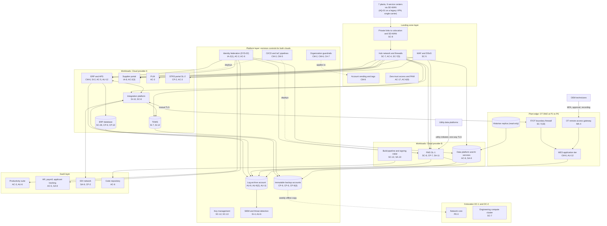

# Cloud Architecture and Control Placement: Cris Santos Company | Critical Manufacturing | Enterprise

**Organization:** Cris Santos Company, Inc. (publicly traded power and distribution transformer manufacturer) | **Tier:** Enterprise | **Provider:** Multi-cloud, vendor-agnostic: two public cloud providers (called Cloud provider A and Cloud provider B), two colocation data centers, SaaS, and the plant OT DMZs that connect to them (see section 4)
**Owner:** Director of Cloud Platform Engineering, with the CISO and the Director of OT Security | **Date:** 2026-08-31 | **Related:** EPSP SSP (P02), enterprise BIA (P05)

## 1. Architecture in layers
The estate is organized in layers. Each lower layer provides **common controls** that the layers above inherit, so a workload team configures only what is specific to its system.

| Layer | What it is | Examples | Who runs it |
|---|---|---|---|
| **Platform** | Organization-wide services in both clouds | Organization guardrails, identity federation, key management, log archive, SIEM feeds, vulnerability and posture management, immutable backup accounts, CI/CD and infrastructure-as-code pipelines | Cloud Platform Engineering; Security Operations; Identity team |
| **Landing zone** | The standard account pattern every workload lands in | Account vending with mandatory tags, hub-and-spoke network with cloud firewalls, private links to colocation and the SD-WAN, WAF and DDoS protection, zero-trust access and PAM | Cloud Platform Engineering; Network Engineering |
| **Workload** | Systems the company builds or runs | Cloud A: ERP and APS, ERP database, integration platform, supplier portal, PLM, TDMS, STRS portal. Cloud B: FMS, enterprise data platform and AI services, product build pipeline and code signing HSM | Application teams (for example, the ERP Platform Manager) |
| **SaaS** | Vendor-operated applications | Identity platform, productivity suite, HR and payroll with applicant tracking, EDI network, code repository, SIEM | Vendors, with the company's configuration and oversight |
| **Colocation** | DC-1 (Florida) and DC-2 (Texas) | Network core, engineering compute cluster, offline backup copies | Network Engineering; colocation providers |
| **Plant edge** | The OT DMZ at each of P1 to P6 | MES application tier, IT/OT boundary firewalls, OT remote access gateway, historian replicas | Director of OT Security; plant controls teams |

Plant control networks (Purdue levels 0 to 2) never connect to the clouds directly. The only cloud-bound OT data is the read-only historian replica in each OT DMZ, which feeds the enterprise data platform for AI-002.

## 2. Diagram

## 3. Responsibility by service model
Sources: SRC-AWS-SRM, SRC-AZURE-SRM, and SRC-GCP-SRM in `00_universal-framework/sources/source-register.csv`. The three published models agree on the split used here, so the design does not depend on which two providers the company uses.

| Service model | Provider | Company (customer) | Shared |
|---|---|---|---|
| IaaS (ERP servers, TDMS, network appliances) | Facilities, hosts, hypervisor, physical network | Guest OS, applications, identities, data, network policy | Encryption (provider service, customer keys), logging |
| PaaS (ERP database, integration, containers, data platform, HSM) | Also the platform runtime and its patching | Data, access, configuration, keys, application code | Backups, availability configuration |
| SaaS (identity, productivity, HR and payroll, EDI, code repository, SIEM) | Also the application | Users, roles, data, oversight of the vendor | Audit review (complementary user entity controls) |
| Colocation | Building, power, cooling, perimeter | Racks, equipment, cage access lists | None |
| Plant edge (on premises) | None | Everything | None |

## 4. Service categories and provider equivalents
| Service category | AWS | Microsoft Azure | Google Cloud |
|---|---|---|---|
| Organization guardrails | AWS Organizations service control policies | Azure Policy with management groups | Organization Policy Service |
| Account vending | AWS Control Tower account factory | Azure landing zone subscription vending | Resource Manager project creation |
| Key management | AWS KMS | Azure Key Vault | Cloud KMS |
| Hardware security module | AWS CloudHSM | Azure Managed HSM | Cloud HSM |
| Audit logging | AWS CloudTrail | Azure Monitor activity log | Cloud Audit Logs |
| Threat detection and posture | Amazon GuardDuty; AWS Security Hub | Microsoft Defender for Cloud | Security Command Center |
| Managed relational database | Amazon RDS | Azure SQL Database | Cloud SQL |
| Managed containers | Amazon EKS | Azure Kubernetes Service | Google Kubernetes Engine |
| Web application firewall | AWS WAF | Azure Web Application Firewall | Cloud Armor |
| Backup service | AWS Backup | Azure Backup | Backup and DR Service |

This table is for reading provider documentation only. The architecture, control map, and SSP describe service categories.

## 5. Common controls
`cloud-control-map.csv` has **65 rows** across 33 components: Platform 20, Landing zone 8, Workload 23, SaaS 8, Colocation 2, Plant edge 4. Responsibility: Customer 53, Shared 10, Provider 2.

**32 rows are published as common controls** (`common_control` = Yes) in the enterprise common control catalog. They map to the common control providers in the EPSP SSP (P02 section 10.3): GRC program guardrails and monitoring (CCP-01), identity (CCP-02), landing zone (CCP-03), security operations (CCP-04), network and IT/OT boundary (CCP-05), colocation (CCP-07), and the OT security program (CCP-10). A workload inherits them by being deployed through account vending, which applies guardrails, logging, network, key, and backup policies automatically; an MES instance inherits the plant edge controls by being placed in a standard OT DMZ.

**Rules for inheriting:**
1. A workload may claim a common control only if its account was created by account vending and passes the posture baseline. An MES instance may claim the plant edge controls only if its plant has a standard OT DMZ (P1 to P6; not yet AQ-01).
2. Customer-side identity, data protection, and logging stay explicit at every layer: even a SaaS application has Customer rows for access (AC-3, AU-6) because those are always the company's responsibility.
3. SaaS rows cite the vendor's SOC 2 report, reviewed by the third-party risk team (P09 evidence map).

## 6. Validation against the EPSP SSP (P02)
Every EPSP component in the SSP boundary appears here with controls from each required family, directly or inherited:

| EPSP component | AC | AU | CM | IA | SC | SI |
|---|---|---|---|---|---|---|
| ERP and APS application servers | AC-5 | AU-12; AU-9 (inherited) | CM-6; CM-2 (inherited) | IA-2(1) (inherited) | SC-7 (inherited) | SI-2 |
| ERP database | AC-6 (inherited) | AU-9 (inherited) | CM-6 (inherited) | IA-2(1) (inherited) | SC-28 | SI-4 (inherited) |
| Integration platform | AC-4 (inherited) | AU-6 (inherited) | CM-3 (inherited) | IA-2(1) (inherited) | SC-8 | SI-10 |
| Supplier portal | AC-2(3) | AU-6 (inherited) | CM-3 (inherited) | IA-8 | SC-5 (inherited) | SI-4 (inherited) |
| MES application tier (P1 to P6) | AC-17 (inherited through MA-4 gateway) | AU-12 | CM-6 | IA-2 (inherited) | SC-7(18) (inherited) | SI-3 (inherited) |

## 7. Findings from the mapping
1. **AQ-01 sits outside the pattern.** The Ohio plant reaches the hub over a legacy site VPN with one carrier, its MES is dual-homed, and its directory trusts the corporate domain both ways. None of the plant edge common controls apply there yet (POAM-004, POAM-008).
2. **Recovery is a workload responsibility.** Backup immutability is a platform control, but the ERP failover runbook is the EPSP team's; the 11-hour test result is a workload gap (POAM-006).
3. **Two clouds, one control set.** Guardrails, logging, and key policies are written once as code and applied to both clouds. Differences are limited to service names (section 4).
4. **Log coverage stops at some plants.** Platform logging covers every cloud account, but MES logs at P3 and P4 and all AQ-01 systems are not in the SIEM (POAM-005).
5. **The FMS boundary is one-way by design.** Utilities push data to the FMS; there is no path from the FMS into utility networks or to TMUs, which limits what a compromise of the FMS could reach and keeps the addenda duties for SL-1 simple.
6. **Supplier-facing SaaS needs contract controls.** The EDI provider has no platform fallback beyond email and the portal, and its assurance report expired (POAM-014).
