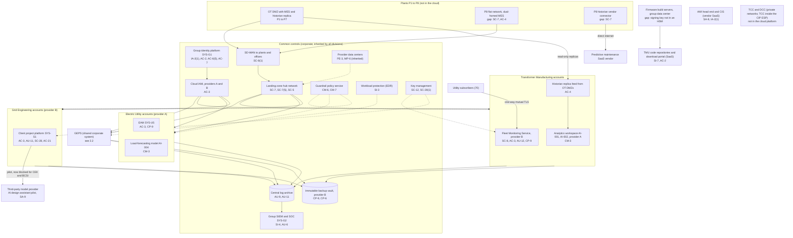
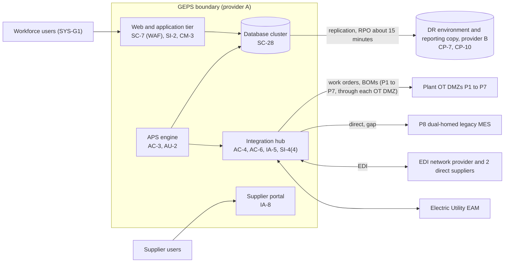

# Cloud Architecture and Control Placement: Cris Santos Company Holdings | Critical Manufacturing | Multi-Sector

**Organization:** Cris Santos Company Holdings, Inc. | **Tier:** Multi-Sector | **Providers:** two public cloud providers, called provider A and provider B (vendor-agnostic; see section 5)
**Scope:** the shared corporate cloud platform (SYS-G3 landing zones) plus the division workloads that run on it. The SSP system (P02) is the Group ERP and Production Scheduling Platform (GEPS), a shared corporate system.

## 1. Design in one paragraph
Corporate runs one **landing zone** per provider: identity federation from SYS-G1, a hub network, guardrail policies, a central log archive, key management, EDR, and an immutable backup vault. Divisions get their own **accounts** inside the landing zone and inherit these guardrails. Provider A hosts the corporate hub, the **GEPS**, the data platform (AI-001, AI-002, AI-004), and the Electric Utility's EAM. Provider B hosts the **Fleet Monitoring Service** (FMS), Grid Engineering's **client project platform**, the GEPS disaster recovery environment, and the backup vault. Three groups of systems sit **outside** the cloud platform on purpose: plant OT and MES at the 8 plants (behind OT DMZs at P1 to P7), the Electric Utility's TCC and DCC (private networks; the TCC inside its CIP Electronic Security Perimeter), and the TMU firmware build servers in the group data center.

## 2. Diagrams
### 2.1 Group landing zone and division workloads

### 2.2 GEPS (SSP boundary)

**Target state (POAM-002, POAM-004, POAM-007; due 2026-12-31 to 2027-03-31):** one hub service account per plant with keys in the secret store; hub-to-plant traffic baselined and alerted; the P8 MES behind an OT DMZ like P1 to P7; a tested full restore of APS and the hub in provider B, including how each plant MES re-synchronizes its work order queue.

## 3. Common versus division-specific controls
`cloud-control-map.csv` has 54 rows across 27 components. The `control_scope` column shows who owns each placement:

| Scope | Rows | What it means |
|---|---|---|
| Common (group) | 22 | Provided once by corporate (SYS-G1, SYS-G2, SYS-G3) and inherited by every division account. Listed in the P02 common control catalog |
| Shared system (GEPS) | 13 | Controls of the shared corporate system documented in the P02 SSP |
| Division-specific (Transformer Manufacturing) | 9 | FMS, analytics workspace, historian feeds, P8 connector, firmware repositories |
| Division-specific (Electric Utility) | 5 | EAM, load-forecasting model, AMI and CIS SaaS |
| Division-specific (Grid Engineering) | 5 | Client project platform and the AI design assistant pilot |

| Responsibility | Rows |
|---|---|
| Customer (the group or a division) | 44 |
| Shared (provider and group) | 6 |
| Provider | 4 |

**Rule of thumb.** Identity, network guardrails, logging, keys, backups, and EDR are **common**. A division cannot opt out of them, only request an exception through POL-01. Application behavior, tenant isolation, and customer-facing identity are **division-specific**, because they depend on each division's regulators and customers (utility addenda, client CIP terms, NERC CIP).

## 4. Layers
| Layer | Common components | Division components | Key controls | Responsibility |
|---|---|---|---|---|
| Identity | SYS-G1, cloud IAM | Supplier portal identity, FMS subscriber identities, code repository access | AC-2, AC-3, AC-6(5), IA-2(1), IA-8 | Customer (configuration); vendor (service) |
| Network | Hub network, SD-WAN | Integration hub to plants, FMS ingestion, P8 connector | SC-7, SC-7(5), SC-8, SC-8(1), AC-4, SC-5 | Customer, with provider DDoS protection shared |
| Compute | EDR on all hosts | GEPS tiers, APS, analytics workspace, FMS | SI-2, SI-3, CM-3, CM-6, CM-7 | Customer (guest OS, containers, code) |
| Data | Keys, backup vault | GEPS database, FMS data, project platform | SC-12, SC-28, SC-28(1), CP-9, CP-6, CP-7, AC-21 | Shared: provider encrypts; group owns keys and retention |
| Logging and monitoring | Log archive, SIEM | GEPS application logs, FMS decision logs, project platform logs | AU-2, AU-6, AU-9, AU-11, AU-12, SI-4, SI-4(4) | Shared: providers generate platform logs; group retains and reviews |
| SaaS dependencies | Identity and SIEM vendors | Code repositories, AMI and CIS, predictive maintenance vendor, model provider | SA-9, SI-7 | Provider for the service; customer for use and oversight |
| Physical | Provider data centers | none | PE-3, MP-6 | Provider (inherited) |

## 5. Service categories and provider equivalents
The design does not depend on a provider. This table gives each provider's name for each service category, for reading its shared responsibility documentation.

| Service category | AWS | Microsoft Azure | Google Cloud |
|---|---|---|---|
| Account structure and guardrails | AWS Organizations with service control policies | Management groups with Azure Policy | Resource hierarchy with Organization Policy |
| Managed relational database | Amazon RDS | Azure SQL Database | Cloud SQL |
| Managed message broker (integration hub) | Amazon MQ | Azure Service Bus | Pub/Sub |
| Key management | AWS KMS | Azure Key Vault | Cloud KMS |
| Audit logging | AWS CloudTrail | Azure Monitor activity log | Cloud Audit Logs |
| Backup with immutability | AWS Backup (vault lock) | Azure Backup (immutable vault) | Backup and DR Service |
| Private connectivity | AWS Direct Connect / PrivateLink | Azure ExpressRoute / Private Link | Cloud Interconnect / Private Service Connect |

Shared responsibility sources: SRC-AWS-SRM, SRC-AZURE-SRM, SRC-GCP-SRM in `00_universal-framework/sources/source-register.csv`. All three agree on the split used here: for IaaS the provider owns facilities, hosts, and virtualization; for PaaS the provider also owns the runtime; for SaaS the provider owns the application. The customer always keeps identities, access decisions, data classification, and data.

## 6. Findings from the mapping
1. **The integration hub is the GEPS's weak point, not the cloud.** Encryption, keys, guardrails, and backups are sound (SC-28, SC-12, CM-6, CP-9). The gap is that one hub with 6 over-privileged service accounts with static keys can write work orders to every plant (AC-6, IA-5; P01 GR-02; POAM-002).
2. **The cloud boundary stops at the OT DMZ, except at P8.** At P1 to P7 nothing in the cloud can reach a controller directly. At P8 the hub reaches a dual-homed MES and a vendor connector sends historian data straight to the internet (SC-7, AC-4; P01 MF-001; POAM-007).
3. **Recovery is designed but unproven** (CP-7, CP-10). Database replication to provider B works, but APS and the hub have never been restored in a test (POAM-004).
4. **Common controls are strong and reused.** One identity platform, one SIEM, one backup design. This is what lets group internal audit assess them once (P07). The weak link is documentation of inheritance for Grid Engineering (P02, POAM-014), and its project platform's 90-day log retention (POAM-022).
5. **Two critical systems are deliberately outside the cloud.** The Electric Utility's TCC (NERC CIP medium impact) and the plant controllers. Neither depends on SYS-G1 or the GEPS to run, which limits how far a cloud or identity incident can spread (P08).
