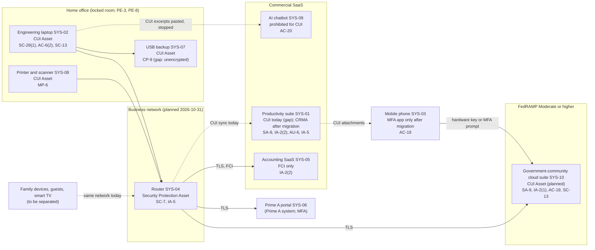

# SaaS Architecture and Control Placement: Cris Santos Company | Defense Industrial Base | Sole Proprietorship

**Organization:** Cris Santos Company (engineering subcontractor handling CUI drawings) | **Tier:** Sole Proprietorship | **Provider:** SaaS only (no IaaS or PaaS)
**System:** Engineering Office Systems (EOS), as defined in the SSP (P02) | **Prepared:** 2026-07-20; updated after P07 tests on 2026-08-05; adopted 2026-08-31

## 1. Diagram (target state after 2026-11-30, with today's gaps marked)
Control IDs on each node are the ones in `cloud-control-map.csv`. Dashed lines are paths that must stop carrying CUI. This diagram is also the CMMC scope network diagram that 32 CFR 170.19(c) asks for.

## 2. Layers
| Layer | Components | Key controls | Responsibility |
|---|---|---|---|
| Identity | SYS-01, SYS-05, SYS-10 accounts; Prime A portal account; laptop accounts | IA-2(1), IA-2(2), IA-5, AC-6(2) | Owner configures; providers supply MFA |
| Data | Project files in SYS-01 (today) and SYS-10 (target); laptop disk; USB backup; prints | SA-9, SC-28(1), SC-13, CP-9, MP-6 | Provider protects data inside its service; the owner decides where CUI may go |
| Endpoints | Laptop, phone, printer | SC-28(1), AC-6(2), AC-19, MP-6 | Owner |
| Network | Home router and Wi-Fi | SC-7, IA-5 | Owner (the internet service provider supplies the equipment) |
| Logging | SYS-01 and SYS-10 audit logs; laptop security log | AU-2 (provider), AU-6 (owner) | Shared: provider records, owner reviews |
| SaaS applications and hosting | SYS-01, SYS-05, SYS-10 platforms | Inherited from each provider; for SYS-10, as listed in its CRM | Provider |

## 3. Shared responsibility for SaaS, and the DFARS twist
All three major cloud providers' shared responsibility models (SRC-AWS-SRM, SRC-AZURE-SRM, SRC-GCP-SRM) agree on the SaaS split: the provider runs the application, the platform, and the facilities; **the customer always keeps its identities, its data, and its devices.** That is why 13 of the 17 rows in the control map are the owner's.

The defense contract adds one rule the SaaS model cannot solve by configuration: **which provider is allowed to hold CUI at all.** DFARS 252.204-7012(b)(2)(ii)(D) requires a cloud provider that stores, processes, or transmits covered defense information to meet security requirements equivalent to the FedRAMP Moderate baseline and to comply with the clause's incident paragraphs (c) to (g). For a CMMC Level 2 self-assessment, 32 CFR 170.16(c)(2) accepts an offering that is FedRAMP authorized at Moderate or higher, or one that meets equivalent requirements, and says the owner's devices that connect to it are in scope and that the provider's customer responsibility matrix must be documented or referred to in the SSP. SYS-01 is a commercial offering with neither, so the fix is a different service (SYS-10), not a setting.

**ITAR note.** Storing ITAR technical data in a cloud is not an export only if the conditions in 22 CFR 120.54(a)(5) are met, including end-to-end encryption with FIPS 140-2 (or successor) modules and no storage in a country listed in 22 CFR 126.1. SYS-01 holds the provider's keys, so that carve-out cannot be relied on, and where the provider stores or supports the data is unknown. SYS-10 is chosen in part because the offering's data stays in the United States with U.S.-person support. A full IaaS provider equivalents table is not needed, because the business runs no infrastructure.

## 4. Findings from the mapping
1. **CUI sits in a service that may not hold it** (SYS-01). Only a move to SYS-10 fixes this. Tracked as P01 R-002 and P03 G-111.
2. **MFA is present but phishable** (SYS-01 authenticator codes), and missing where it is free (SYS-05). Tracked with R-001 and R-009.
3. **The home network is part of the boundary.** Family devices, guests, and a smart TV share it with the laptop and printer, and the router still used its default administrator password (found in P07 testing on 2026-08-05 and changed that day). Tracked as R-008 and R-015.
4. **The phone becomes a security device, not a work device.** After migration it holds only the MFA app and non-CUI email; CUI on the phone is R-010.
5. **Secrets were stored with the data they protect:** the password spreadsheet and the disk recovery key were in SYS-01. Tracked with R-001 and R-005.
