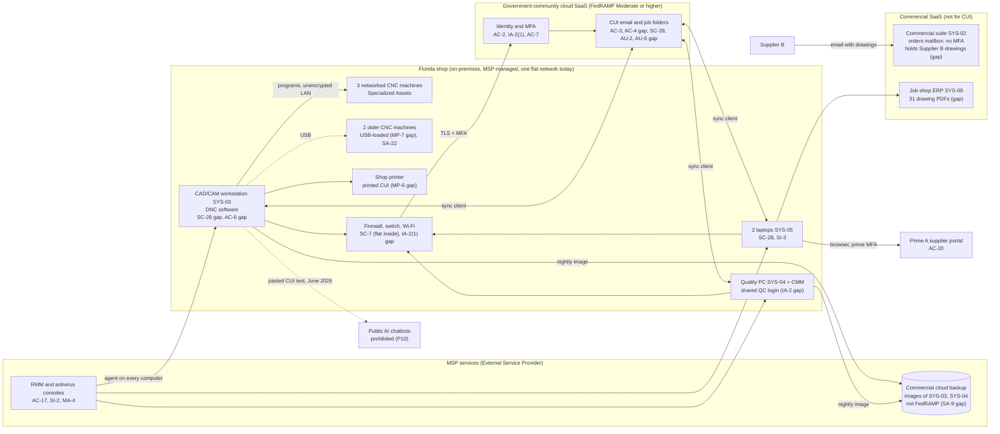

# Cloud Architecture and Control Placement: Cris Santos Company | Defense Industrial Base | Micro

**Organization:** Cris Santos Company, LLC (aircraft parts machine shop, DoD subcontractor) | **Tier:** Micro | **Provider:** Vendor-agnostic government-community cloud SaaS, FedRAMP authorized at Moderate or higher (see section 3)
**System:** CUI Machining Enclave (CME), as defined in the SSP (P02) | **Prepared:** 2026-07-24 by the Office Manager with the MSP lead technician | **Approved:** President, 2026-08-31
**Control map:** `cloud-control-map.csv` (33 rows: 13 Customer, 8 Customer performed by the MSP, 8 Shared, 4 Provider)

## 1. Diagram
The shop runs no servers and no IaaS tenant. Its cloud is a set of SaaS services plus one cloud workload that the MSP operates for it: the nightly image backup of the CAM workstation and quality PC. The diagram shows the state at fieldwork (2026-07-24), including where CUI sits outside the intended boundary.

**Target state (2026-11-30):** SYS-03, SYS-04, the printer, and the 3 networked machines on an enclave VLAN with deny-by-default rules; laptops and phones on an office VLAN; Supplier B sending to SYS-01; no CUI in the commercial suite, the ERP, or the commercial backup; SYS-01 job folders backed up by a service inside the government-community offering.

## 2. Layers and who is responsible
| Layer | Components | Key controls | Customer (company) | MSP (on the company's behalf) | Provider |
|---|---|---|---|---|---|
| Identity | SYS-01 accounts and MFA; local Windows accounts; firewall, RMM, and backup logins | AC-2, IA-2, IA-2(1), IA-2(2), AC-7 | Decides who gets access; requests removal; sets MFA and device rules | Creates and disables accounts; holds admin logins (one shared account today) | Runs the sign-in and MFA service |
| Network | Firewall, switch, Wi-Fi, internet line | SC-7, AC-18, SC-8 | Approves rules and the VLAN design | Configures, patches, and monitors | Not applicable |
| Endpoints | SYS-03, SYS-04, 2 laptops | SC-28, SI-3, SI-2, AC-6, AC-11 | Keeps the inventory; approves exceptions | Encryption, antivirus, patching, screen lock | Not applicable |
| SaaS application | CUI email and job folders | AC-3, AC-4, AU-2, SC-8 | Users, folder permissions, external sharing, data | Tenant administration on request | Application, platform, data centers |
| Data | Job folders, file versions, backups, USB and paper copies | SC-28, CP-9, MP-7, SC-13 | Decides retention, restore testing, and where CUI may live | Operates the backup | Encrypts stored data with validated modules |
| Logging | SYS-01 audit logs, RMM session log, firewall log | AU-2, AU-6, AU-11 | **Reviews logs monthly (gap today)** | Keeps firewall and RMM logs; forwards alerts | Generates and stores SYS-01 logs |
| Operational technology | 5 CNC machines, CMM | SA-22, MP-7 | Owns them as Specialized Assets | Network isolation (planned) | Machine builders (service only) |
| Supplier governance | Cloud provider CRM, MSP contract, backup subcontractor | SA-9 | Obtains the CRM and a responsibility matrix; checks FedRAMP status yearly | Discloses subcontractors | Provides the FedRAMP package and CRM |

**The MSP is not a cloud provider in the shared responsibility sense.** It performs customer-side duties for the company. Anything marked "Customer (performed by MSP)" in `cloud-control-map.csv` remains the company's responsibility under DFARS 252.204-7012 and in a CMMC assessment. Because the MSP handles Security Protection Data (administrator passwords, RMM, logs), its services are in the assessment scope as Security Protection Assets (32 CFR 170.19(c)(2), Table 4), and the relationship must be described in the SSP and in a responsibility matrix (170.19(c)(2)(ii)).

## 3. Service categories and provider equivalents
DFARS 252.204-7012(b)(2)(ii)(D) requires a cloud service provider that stores, processes, or transmits covered defense information to meet security requirements equivalent to the FedRAMP Moderate baseline and to comply with the clause's incident reporting, malware, media preservation, forensic access, and damage assessment paragraphs ((c) to (g)). Under 32 CFR 170.19(c)(2), Table 4, a CSP that processes CUI must meet those FedRAMP requirements. The company's CUI suite is a government-community offering authorized at Moderate or higher. The commercial suite, the ERP, and the commercial backup cloud are not, so they may not hold CUI.

The design is vendor-agnostic. For SaaS, all three major providers' shared responsibility models agree: the provider runs the application, platform, and infrastructure; the customer keeps identities, access, data, and devices (SRC-AWS-SRM, SRC-AZURE-SRM, SRC-GCP-SRM in `00_universal-framework/sources/source-register.csv`). The provider's CRM is the primary source once it is on file.

| Service category used | What it is here | AWS | Microsoft Azure | Google Cloud |
|---|---|---|---|---|
| Government-community offering | CUI email, files, identity (SaaS) | AWS GovCloud (US) (suites from third parties) | Azure Government with Microsoft 365 GCC High | Assured Workloads (U.S. regions and support controls) |
| Backup inside that offering | Backup of the job folders | AWS Backup in AWS GovCloud (US) | Azure Backup in Azure Government | Backup and DR Service under Assured Workloads |
| Commercial productivity suite, ERP, RMM | Business email, orders, MSP device management (no CUI) | Commercial SaaS; no equivalent needed | Commercial SaaS; no equivalent needed | Commercial SaaS; no equivalent needed |

Equivalents are listed only to help read each provider's documentation. The company's controls do not depend on which provider is chosen, but the CUI offering must stay at FedRAMP Moderate or higher.

## 4. Findings from the mapping
1. **CUI sits in a backup cloud that is not FedRAMP authorized (SA-9, CP-9).** The MSP's nightly image backup of SYS-03 and SYS-04 copies the synced job folders into a commercial backup cloud. That breaks DFARS 252.204-7012(b)(2)(ii)(D). Counsel and the President documented on 2026-07-28 why it is a compliance gap and not a cyber incident. Fix: a backup inside the government-community offering and a settings folder by 2026-09-15, then stop the commercial backup and get a deletion confirmation by 2026-09-30 (P01 R-003; P07 POAM-010).
2. **The boundary is where CUI actually lives, not where it should live (AC-4).** Supplier B's drawings land in the commercial orders mailbox, which has no MFA, and 31 ERP job records carry drawing PDFs. Until cleaned, both systems are covered contractor information systems that fail the FedRAMP condition and many SP 800-171 requirements. This is the path in the P08 scenario (P01 R-001, R-020).
3. **MSP-held logins are the strongest keys in the shop (IA-2(1), AC-17).** One shared MSP administrator account reaches both suites, and the RMM tool can run commands on every computer. One technician's RMM console login had no MFA (P07). Fix: named MSP accounts with MFA, a written responsibility matrix, and U.S.-person confirmation for technicians (P01 R-007, R-023).
4. **The flat network puts CNC machines next to office email (SC-7).** A phishing infection on a laptop could reach the CAM workstation and the networked machine controls. Fix: enclave VLAN by 2026-11-30 (P01 R-008).
5. **Provider-side controls are strong; customer-side settings are at defaults.** External sharing, audit retention, log review, and device rules in SYS-01 are untouched since the MSP set it up. These are quick wins that need no new spending.
