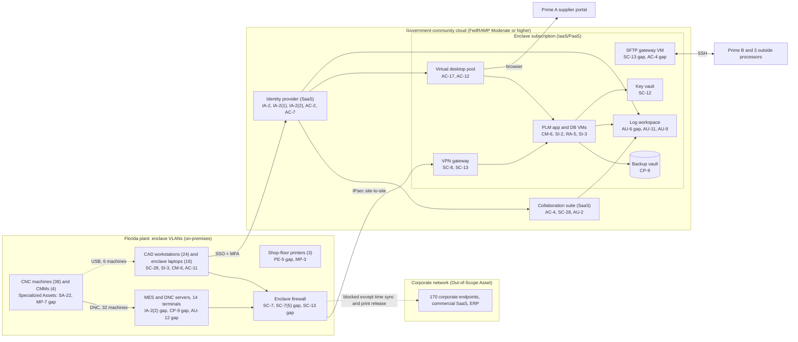

# Cloud Architecture and Control Placement: Cris Santos Company | Defense Industrial Base | Small

**Organization:** Cris Santos Company, LLC (aircraft parts manufacturer, DoD subcontractor) | **Tier:** Small | **Provider:** Vendor-agnostic government-community cloud offering, FedRAMP authorized at Moderate or higher (see section 3)
**System:** CUI Engineering Enclave (CEE), as defined in the SSP (P02) | **Control map:** `cloud-control-map.csv` (37 rows: 22 Customer, 11 Shared, 4 Provider)

## 1. Diagram

The 6 legacy CNC machines are loaded from USB drives written on an engineering workstation (dashed line). The corporate network, ERP, and payroll are outside the boundary; the enclave firewall permits only time synchronization and print release toward corporate services.

## 2. Layers
| Layer | Components | Key controls | Responsibility |
|---|---|---|---|
| Identity | Enclave identity provider, cloud subscription roles, MES local accounts | AC-2, AC-5, AC-6(2), AC-7, IA-2, IA-2(1), IA-2(2) | Customer configures; provider runs the identity service. MES accounts are fully customer |
| Network / edge | Plant enclave firewall and VLANs, site-to-site VPN, cloud network security groups | SC-7, SC-7(5), SC-8, SC-12, SC-13 | Customer, except the provider-run VPN gateway service (shared) |
| Compute / application | Virtual desktop pool, PLM VMs, SFTP gateway VM, MES and DNC servers, CNC controllers | AC-17, AC-12, CM-6, SI-2, SI-3, RA-5, SA-22 | Customer owns guest OS and applications on IaaS; provider owns the desktop brokering service (PaaS) |
| Data | Collaboration suite storage, PLM storage, key vault, backup vault, MES backups | SC-28, SC-12, CP-9, AC-4, MP-7 | Shared: provider encrypts with validated modules; customer controls access, keys, retention, and backups of on-premises servers |
| Logging / monitoring | Log workspace, identity sign-in logs, suite audit logs, firewall and MES logs | AU-2, AU-6, AU-9, AU-11, AU-12 | Shared: provider generates cloud events; customer collects on-premises logs, retains, and reviews |
| SaaS applications | Identity provider, collaboration suite | AC-4, AU-2, SC-28 | Provider (application and infrastructure); customer (users, sharing settings, data) |
| Physical / hypervisor | Provider data centers and personnel | PE-3, PS-3 | Provider (inherited through the FedRAMP authorization and CRM) |

## 3. Service categories and provider equivalents
DFARS 252.204-7012(b)(2)(ii)(D) requires a cloud service provider that stores, processes, or transmits covered defense information to meet security requirements equivalent to the FedRAMP Moderate baseline and to comply with the clause's incident reporting, malware, media preservation, and forensic access paragraphs. The company uses one provider's government-community offering, which is FedRAMP authorized at Moderate or higher and supports U.S.-person-only support staff for ITAR data. The provider's customer responsibility matrix (CRM) is the primary source for the responsibility column; the general shared responsibility models below confirm the IaaS and SaaS split.

| Service category | AWS | Microsoft Azure | Google Cloud |
|---|---|---|---|
| Government-community region or offering | AWS GovCloud (US) | Azure Government with Microsoft 365 GCC High | Assured Workloads (U.S. regions and support controls) |
| Virtual machines | Amazon EC2 | Azure Virtual Machines | Compute Engine |
| Virtual desktops | Amazon WorkSpaces | Azure Virtual Desktop | Third-party desktop service on Compute Engine |
| Key management | AWS KMS | Azure Key Vault | Cloud KMS |
| Backup service | AWS Backup | Azure Backup | Backup and DR Service |
| Log workspace | Amazon CloudWatch Logs | Azure Monitor Log Analytics | Cloud Logging |
| Site-to-site VPN | AWS Site-to-Site VPN | Azure VPN Gateway | Cloud VPN |
| Network filtering | Security groups | Network security groups | VPC firewall rules |

Shared responsibility sources: the provider CRM, plus SRC-AWS-SRM, SRC-AZURE-SRM, and SRC-GCP-SRM in `00_universal-framework/sources/source-register.csv`. All agree:
- **IaaS:** the provider owns facilities, hosts, and the virtualization layer. The customer owns guest operating systems, applications, network configuration, identities, and data.
- **PaaS:** the provider also owns the platform service (desktop brokering, key storage, backup, log storage). The customer owns configuration, access, and data.
- **SaaS:** the provider also owns the application. The customer keeps identities, access, sharing settings, data, and devices.

Equivalents are listed only to help read each provider's documentation. The company's controls do not depend on which provider is chosen, but the offering must stay at FedRAMP Moderate or higher (32 CFR 170.19(c)(2)).

## 4. Findings from the mapping
1. **Cryptography on two CUI paths (SC-13).** The provider side is covered by the CRM. The company side is not: the SFTP gateway VM and the plant firewall VPN have not been confirmed to run FIPS-validated modules. Without that, SP 800-171 3.13.11 is not met and the ITAR and EAR encrypted-data carve-outs (22 CFR 120.54(a)(5); 15 CFR 734.18(a)(5)) cannot be relied on. Fix by 2026-11-30 (P01 R-004; P07 POAM-005).
2. **Bulk sync from the suite is not detected (AC-4, AU-6).** Logs are collected but not reviewed and there is no mass-download alert. This is how the P08 exfiltration scenario goes unnoticed. Fix: weekly review and alerts from 2026-11 (P01 R-002).
3. **The enclave is only as strong as its on-premises end.** Everything in the cloud subscription has MFA; the MES does not, its backups sit next to it, and the engineering VLAN can reach any website. The customer rows in the map carry almost all the gaps (P01 R-006, R-011, R-014).
4. **Separation of administrator duties (AC-5, AU-9).** The same two people run production, backups, and logging. An attacker with one administrator session could delete backups and logs. Fix: a log and backup role held by the IT Manager, with break-glass alerts.
5. **Inherited controls depend on the CRM staying current.** Controls marked Provider or Shared rely on the provider's FedRAMP authorization. The IT Manager checks the FedRAMP Marketplace listing and the CRM version each year and after any provider notice.
