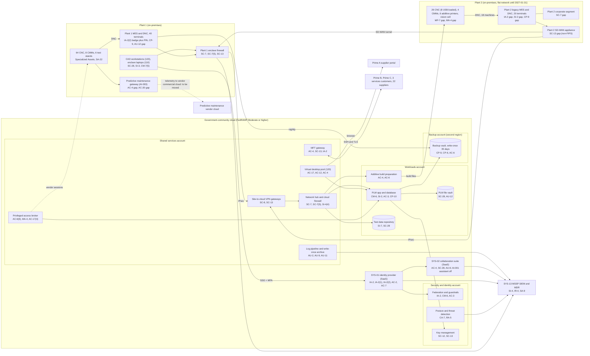

# Cloud Architecture and Control Placement: Cris Santos Company | Defense Industrial Base | Mid-Market

**Organization:** Cris Santos Company, Inc. | **Tier:** Mid-Market | **Provider:** Vendor-agnostic government-community cloud offering, FedRAMP authorized at Moderate or higher (see section 4), plus the MSSP's SIEM
**System:** CUI Engineering Enclave (CEE), as defined in the SSP (P02) | **Prepared:** 2026-07-31 by the IT Director and the Security Manager; updated 2026-09-17 with P07 results
**Control map:** `cloud-control-map.csv` (56 rows, 22 components)

## 1. Diagram

Dashed lines are flows that must change: the AI-003 telemetry path leaves the enclave today, and vendor sessions to Plant 1 OT run through the broker (the additive printer vendor at Plant 2 does not yet). Plant 2 is drawn as it is today: its MES shares a network with the Plant 2 corporate segment, and its logs do not reach the SIEM.

## 2. Landing zone design
The landing zone was built in 2025 with 4 accounts (subscriptions or projects, depending on the provider) under one cloud organization in the government-community offering. Each account limits the damage an attacker can do from any other.

| Account | Purpose | Who administers | Key design decisions |
|---|---|---|---|
| **Security and identity** | Organization root, federation to SYS-01, guardrails, posture management and threat detection, key management | Security Manager and 1 analyst | No workloads. Root credentials sealed. Guardrails apply to every account, keep resources in government-community regions, and cannot be disabled from member accounts |
| **Shared services** | Network hub and cloud firewall, VPN gateways for both plants, virtual desktop pool, MFT gateway, privileged access broker, log pipeline and write-once archive | IT Director's infrastructure team (4 engineers) | All traffic between plants, workloads, partners, and the internet passes the hub. Partners reach only the MFT gateway subnet |
| **Workloads** | PLM application and database, PLM file vault, CAD license servers, additive build preparation, test data repository | Infrastructure team; Director of Engineering owns the data | Separate subnets per workload; no internet ingress; company-managed keys |
| **Backup** | Write-once backup vault (35 days) in a second region | 2 named backup administrators | Separate credentials not federated to everyday accounts; the backup role can write but not delete |

## 3. Layers and shared responsibility per service
| Layer | Components | Key controls | Service model | Responsibility |
|---|---|---|---|---|
| Identity | Federation, break-glass accounts, privileged access broker, SYS-01 | IA-2, IA-2(1), IA-2(2), AC-2, AC-6(2), AC-6(9), AC-7, MA-4 | PaaS / SaaS / IaaS | Customer configures identities, roles, MFA, and reviews; provider runs the identity services |
| Network | Hub, cloud firewall, VPN gateways, plant firewalls, SD-WAN | SC-7, SC-7(5), SC-8, SC-13, SI-4(4) | IaaS / PaaS | Customer designs routes, rules, and segmentation (including Plant 2); provider runs the gateway services |
| Compute | Virtual desktops, MFT gateway, PLM servers, CAD license servers, build preparation | AC-17, AC-12, AC-4, CM-6, CM-7, SI-2, SI-3, CP-10 | IaaS / PaaS | Customer owns guest operating systems and applications on IaaS; provider owns desktop brokering (PaaS) and hosts |
| Data | PLM vault, test repository, key management, backup vault, suite storage | SC-28, SC-12, SC-13, CP-9, CP-6, CP-4, SI-7, AU-12 | PaaS / SaaS | Shared: provider encrypts with validated modules and runs storage; customer controls keys, access, retention, and restore tests |
| Logging and monitoring | Log pipeline, posture service, SIEM | AU-2, AU-6, AU-9, AU-11, CA-7, RA-5, SI-4, IR-4 | PaaS / SaaS | Shared: provider generates events; company enables, forwards, and retains them; MSSP monitors and responds |
| SaaS applications | Identity provider, collaboration suite, AI-001 assistant | AC-2, AC-4, AU-6, SC-28, SA-9 | SaaS | Provider runs the application; customer keeps users, sharing, data, and feature decisions |
| Physical | Provider data centers | PE-3, PS-3 | All | Provider (inherited through the FedRAMP authorization and CRM) |

**Responsibility counts in `cloud-control-map.csv`:** 31 Customer, 18 Shared, 7 Provider. By service model: 19 IaaS, 27 PaaS, 10 SaaS rows. As the providers' shared responsibility models agree, the customer side is identity, data protection, configuration of guest systems, and logging.

## 4. Service categories and provider equivalents
DFARS 252.204-7012(b)(2)(ii)(D) requires a cloud service provider that stores, processes, or transmits covered defense information to meet security requirements equivalent to the FedRAMP Moderate baseline and to comply with the clause's incident reporting, malware, media preservation, and forensic access paragraphs. The company uses one provider's government-community offering, which is FedRAMP authorized at Moderate or higher and supports U.S.-person support staff for ITAR data. The provider's customer responsibility matrix (CRM) is the primary source for the responsibility column. This table gives each provider's name for the service category, only to help read the documentation (SRC-AWS-SRM, SRC-AZURE-SRM, SRC-GCP-SRM in `00_universal-framework/sources/source-register.csv`).

| Service category | AWS | Microsoft Azure | Google Cloud |
|---|---|---|---|
| Government-community region or offering | AWS GovCloud (US) | Azure Government with Microsoft 365 GCC High | Assured Workloads (U.S. regions and support controls) |
| Multi-account organization and guardrails | AWS Organizations, service control policies | Management groups, Azure Policy | Resource Manager folders, organization policies |
| Account, subscription, or project | Account | Subscription | Project |
| Network hub and cloud firewall | Transit Gateway, AWS Network Firewall | Hub virtual network, Azure Firewall | Shared VPC, Cloud NGFW |
| Site-to-cloud VPN | Site-to-Site VPN | VPN Gateway | Cloud VPN |
| Virtual desktops | Amazon WorkSpaces | Azure Virtual Desktop | Third-party desktop service on Compute Engine |
| Virtual machines | EC2 | Virtual Machines | Compute Engine |
| Object storage with write-once retention | S3 with Object Lock | Blob Storage with immutability policies | Cloud Storage with bucket lock |
| Backup service | AWS Backup (vault lock) | Azure Backup (immutable vault) | Backup and DR Service |
| Key management | AWS KMS | Azure Key Vault | Cloud KMS |
| Audit logging | CloudTrail | Azure Monitor activity log | Cloud Audit Logs |
| Posture and threat detection | Security Hub, GuardDuty | Microsoft Defender for Cloud | Security Command Center |

**Service model split used here (all three providers agree):**
- **IaaS** (virtual machines, networks): the provider owns facilities, hosts, and virtualization. The customer owns the guest OS, applications, network configuration, identities, and data.
- **PaaS** (desktop brokering, backup, key service, managed storage): the provider also owns the platform software and its patching. The customer owns access, keys, data, and configuration.
- **SaaS** (identity provider, collaboration suite, SIEM): the provider also owns the application. The customer keeps identities, roles, sharing settings, audit review, and data.

The company's controls do not depend on which provider is chosen, but the offering must stay at FedRAMP Moderate or higher (32 CFR 170.19(c)(2)).

## 5. Findings from the mapping
1. **The cloud is the strongest part of the enclave; the plants are the weakest.** Every cloud component has MFA, logging, encryption, and backups. The gaps sit on premises: Plant 2 has no boundary, no named sign-in, unsupported servers, and no logs in the SIEM (P01 R-004, R-005, R-011). The landing zone design is ready for Plant 2: its VPN gateway and firewall rules exist, so the remaining work is on the Plant 2 side (enclave firewall and VLANs by 2027-01-31).
2. **One CUI path is not FIPS-validated (SC-13).** The Plant 2 SD-WAN appliance encrypts the tunnel between the plants but runs in non-FIPS mode. Until fixed, SP 800-171 3.13.11 is not met and the ITAR and EAR encrypted-data carve-outs (22 CFR 120.54(a)(5); 15 CFR 734.18(a)(5)) cannot be relied on for that path. Fix by 2026-11-30 (P01 R-007).
3. **A flow leaves the boundary (AC-4, AC-20).** The AI-003 predictive maintenance gateway sits on the Plant 1 shop-floor VLAN and sends telemetry, including active program names, to a vendor's commercial cloud. It must move to an OT DMZ with program names removed, or be switched off (P10; P01 R-026).
4. **The MSSP is part of the assessed scope.** Under 32 CFR 170.19(c)(2), an ESP that handles Security Protection Data is assessed as Security Protection Assets, and its services and CRM must be documented in the SSP. SSP v4.0 documents the MSSP; its CRM is still missing (P03 G-128).
5. **Backups are isolated, but recovery is unproven.** The backup account (separate credentials, second region, write-once) is the strongest recovery control. Only PLM has been restore-tested (2025-04), and Plant 2 is not in the vault yet (P05 findings 1 to 3).
6. **Boundary check.** Every in-scope component in the SSP (P02 section 9) appears in the diagram. Every cloud component has at least one row in the control map, and each account has controls from at least 2 of the AC, AU, CM, IA, SC, and SI families or inherits them.
7. **Inherited controls depend on the CRMs staying current.** Rows marked Provider or Shared rely on the provider's FedRAMP authorization and CRM. The Security Manager checks the FedRAMP Marketplace listing and the CRM version each year and after any provider notice (P09 vendor assurance review).
