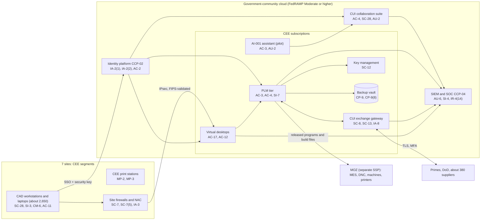

# System Security Plan: CUI Engineering Enclave (CEE)

**Organization:** Cris Santos Company, Inc. (publicly traded tier-1 aerostructures and aircraft components manufacturer) | **Tier:** Enterprise | **Vertical:** Defense Industrial Base
**Outline:** NIST SP 800-18 Rev. 2, System Security Plan Outline Example (June 2026) | **Version:** 3.1, 2026-09-14
**Requirement set:** NIST SP 800-171 Rev. 2 (110 requirements), as required by DFARS 252.204-7012(b)(2) and CMMC Level 2 (32 CFR 170.14(c)(3)); readiness against the 24 CMMC Level 3 requirements (32 CFR 170.14(c)(4)) is tracked in the same files

## 1. System Name and Identifier
CUI Engineering Enclave (**CEE**), identifier CSC-SYS-CEE-001. Tier-1 system in the enterprise application inventory. This SSP satisfies SP 800-171 requirement 3.12.4 for the CEE. Together with the Manufacturing Operations Zone (MOZ) SSP (CSC-SYS-MOZ-001), it describes the CMMC Assessment Scope "CEE and MOZ" that holds Final Level 2 (C3PAO) status (CMMC Status Date 2026-03-20).

## 2. System Overview
The CEE is where the company receives, creates, stores, and shares controlled technical information (CTI) for its DoD prime contracts and its subcontracts with Prime A to Prime D: drawings, 3D models, specifications, NC programs, additive build files, process specifications, and test data. Most of it is also ITAR technical data. About 3,600 named users hold CEE accounts at 7 sites; engineers work in CAD on workstations or virtual desktops, release data through PLM, and exchange CUI with primes, DoD, and about 380 suppliers.

**Major components** (IDs from `../00_company-facts.md` section 3):
- **SYS-02:** CUI collaboration suite (email, file storage, chat) in a government-community cloud
- **SYS-03:** CEE cloud subscriptions: PLM application tier, CAD virtual desktop pool (1,400 concurrent sessions), CUI exchange gateway (managed file transfer), log analytics, key management, backup vault, and the AI-001 assistant (pilot, P10)
- **SYS-04:** CAD/PLM (about 2.4 million controlled documents; about 3,100 named PLM users)
- **SYS-05:** about 2,650 CAD workstations and enclave laptops
- **SYS-07 (CEE segments):** engineering segments at FL-1, FL-2, FL-3, GA-1, AL-1, TX-1, and AZ-1, and IPsec tunnels to SYS-03

Inherited from the enterprise platform: SYS-01 identity platform, SYS-07 networks, and SYS-08 security operations (section 10.3). Cloud services are described by service category and are vendor-agnostic (P04).

## 3. Laws, Regulations, and Policies Affecting the System
| ID | Requirement | Citation | How it affects the CEE |
|---|---|---|---|
| C-DIB-R01 | DFARS 252.204-7012 (MAY 2024) | 48 CFR 252.204-7012 | SP 800-171 on covered contractor information systems; FedRAMP Moderate-equivalent cloud; 72-hour reporting; malware to DC3; 90-day image preservation; flowdown |
| C-DIB-R02 | CMMC Program and DFARS 252.204-7021 (NOV 2025) | 32 CFR Part 170; 48 CFR 252.204-7021 | Final Level 2 (C3PAO) since 2026-03-20; annual affirmation (170.22); scoping (170.19); Level 3 (DIBCAC) planned for Program H (170.18) |
| C-DIB-R03 | DFARS 252.204-7019 and 252.204-7020 (NOV 2023) | 48 CFR 252.204-7019, 252.204-7020 | Current assessment in SPRS for each covered system; Government assessment access |
| C-DIB-R04 | FAR 52.204-21 (NOV 2021) | 48 CFR 52.204-21 | Basic safeguarding for FCI (also ERP and corporate systems outside this boundary) |
| C-DIB-R05 | ITAR | 22 CFR Parts 120-130 | Release of technical data to a foreign person is an export (22 CFR 120.56); U.S.-person access control; encrypted-data carve-out conditions (22 CFR 120.54(a)(5)) |
| C-DIB-R06 | EAR | 15 CFR Parts 730-774 | Deemed exports of technology to foreign-person employees (15 CFR 734.13(a)(2)); licenses for the 90 foreign-person employees on commercial programs; encrypted-data carve-out (15 CFR 734.18(a)(5)) |
| CUI program | CUI Basic safeguarding | 32 CFR 2002.14 | CUI Basic protected at no less than moderate confidentiality (2002.14(a)(3)) |
| SEC | Cybersecurity disclosure | Form 8-K Item 1.05; 17 CFR 229.106 | A material CEE incident goes through the P08 materiality step |
| State | State breach notification laws | Each state where affected individuals reside (Florida worked example: Fla. Stat. 501.171) | Only if personal information is involved; the CEE holds little (P08) |
| Internal | POL-01 to POL-05 and standards | P06 | Enterprise policy hierarchy |

Not applicable to this system:
- **NISPOM (C-DIB-R07, 32 CFR Part 117):** applies to the classified information system at FL-1 (SYS-13), which is stand-alone, authorized by DCSA, and outside this boundary. Cleared staff who are also CEE users follow both programs.
- **CIRCIA (6 U.S.C. 681b):** the final rule is not published; nothing is required yet.

## 4. System Status
### 4.1 System Security Plan Approval
Prepared by the Director, CMMC Program Office with the PLM Platform Manager and the common control providers. Reviewed by the CISO, the Vice President, Engineering (CUI data owner), and the Vice President, Trade Compliance. Approved by the Chief Operating Officer on 2026-09-14.
### 4.2 System Authorization Decision
The company is not a federal agency, so there is no authorization to operate. The equivalent internal decision:
- **Authorizing official equivalent:** Chief Operating Officer (also the CMMC Affirming Official), with the CISO's recommendation.
- **Decision (2026-09-14):** continue operation with conditions, based on the Internal Audit assessment (P07), the gap analysis (P03), and the risk register (P01).
- **Conditions:**
  - close the requirements that would be NOT MET today in the certified sites before the annual affirmation due 2027-03-20, starting with the items that cannot be on a CMMC POA&M (visitor escort and logs at TX-1, POAM-003, by 2026-10-31);
  - fix the export attribute gap in PLM (POAM-002, by 2026-11-30);
  - keep contracts that include DFARS 252.204-7021 away from AZ-1 until AZ-1 is covered by a certification assessment;
  - isolate the AZ-1 printer segment and bring AZ-1 build-prep workstations to baseline (POAM-004, POAM-005, by 2026-12-15).
- **Reauthorization:** annually, after any change in the CMMC Assessment Scope, and before the Level 2 assessment of the expanded scope (target 2027-05-03 to 2027-05-14).
### 4.3 System Operational Status
Operational. Planned major changes: KS-1 CUI migrated into the CEE and MOZ (2027-03-31); controlled transfer service from AZ-1 build-prep workstations to printers (2027-01-31); Level 3 scope decision (2026-12-15) and Level 3 readiness work (P03).

## 5. Role Identification and Responsible Personnel
| Role | Title | Responsibility |
|---|---|---|
| System owner | Vice President, Engineering | Accountable for the CEE and PLM; CUI data owner |
| Authorizing official (equivalent) and CMMC Affirming Official | Chief Operating Officer | Accepts residual risk; annual affirmation in SPRS (32 CFR 170.22) |
| SSP owner | Director, CMMC Program Office | SSP, scope changes, SPRS entries, C3PAO and DIBCAC liaison |
| System administrator | PLM Platform Manager | Day-to-day PLM and CEE application administration |
| Information security | CISO; Director of Security Operations | Program oversight; SOC monitoring; incident response |
| Export compliance | Vice President, Trade Compliance (Senior Empowered Official) | Export attributes, foreign-person access decisions, voluntary disclosures |
| Contracts | Vice President, Contracts | DFARS and CMMC clauses, DIBNet reports, CMMC UIDs to contracting officers |
| Common control providers | See section 10.3 | Operate inherited controls |
| Independent assessor | Chief Audit Executive (Internal Audit) | Annual assessment (P07) |

## 6. System Information Types and System Categorization
Information types come from NIST SP 800-60 Vol. 2 Rev. 1. Impact levels follow FIPS 199. CUI Basic cannot be protected below moderate confidentiality (32 CFR 2002.14(a)(3)).

| Information type | Confidentiality | Integrity | Availability | Rationale |
|---|---|---|---|---|
| Controlled technical information (drawings, models, NC programs, build files) | Moderate | Moderate | Moderate | Disclosure harms DoD programs and violates export controls; a wrong dimension or build file produces nonconforming flight parts; outage delays programs (P05 BP-06: MTD 72 h) |
| Supplier and prime exchange records | Moderate | Moderate | Moderate | Gateway outage stops outside processing (P05 BP-08: MTD 48 h, RTO 12 h) |
| Information security (logs, keys, credentials) | Moderate | Moderate | Moderate | Protects the evidence DoD may request (DFARS 252.204-7012(e)) |
| **CEE category (high-water mark)** | **Moderate** | **Moderate** | **Moderate** | |

**Baseline and tailoring.** The binding requirement set is the 110 SP 800-171 Rev. 2 requirements. Each requirement's implementation statement is in `sp800-171-requirement-statements.csv` (134 rows: the 110 Level 2 requirements and the 24 Level 3 requirements, each linked to its P03 gap row). `control-implementation.csv` documents **175 SP 800-53 Rev. 5 controls**: 160 from the Moderate baseline, PM-9 tailored in for risk strategy, and **14 supplements** chosen because they support the CMMC Level 3 requirements (author mapping): AC-4(21), AT-2(1), CA-8, CA-8(1), CM-8(2), IA-3(1), IR-4(14), PM-16, PS-3(3), RA-3(3), RA-10, SC-7(21), SI-7(9), SI-7(15). The executive risk committee approved this tailoring on 2026-09-10. If the Level 3 scope decision (2026-12-15) selects the whole CEE, these supplements become required for every CEE component.

## 7. Authorization Boundary Description
The boundary follows the CMMC Level 2 asset categories in 32 CFR 170.19(c)(1):

| Category | Assets in the CEE | Treatment |
|---|---|---|
| CUI Assets | SYS-02, SYS-03 (PLM tier, virtual desktops, CUI exchange gateway, backup vault, AI-001 assistant), SYS-04, SYS-05, CEE print stations, printed drawings | Assessed against all 110 requirements |
| Security Protection Assets | SYS-01 (government-community tenant), SYS-07 CEE segments and firewalls, SYS-08 (SIEM, EDR, scanners, PAM), key management | Assessed against the requirements relevant to their function |
| Specialized Assets | None in the CEE. Machines, printers, CMMs, and test equipment are Specialized Assets in the MOZ SSP | Documented in the MOZ SSP |
| Contractor Risk Managed Assets | None designated | Not used |
| Out-of-Scope Assets | SYS-09 ERP (FCI only), SYS-10 corporate network and endpoints, SYS-11 commercial cloud platforms | Separated by firewalls and tenant boundaries; no CUI by policy |
| Outside the certified scope | SYS-12 KS-1 legacy environment (CUI, own SPRS entry); SYS-13 classified system (NISPOM) | KS-1 joins the scope by migration (2027-03-31); SYS-13 stays separate |

**AZ-1 status.** AZ-1 engineering segments and build-prep workstations joined the CEE and MOZ on 2026-05-18. They are documented here and assessed in P07, but they were not part of the 2026-02 certification assessment, so contracts that include DFARS 252.204-7021 are not routed to AZ-1 until the expanded scope is assessed (target 2027-05).

**External service providers.** The government-community cloud provider is a CSP that processes CUI, so it must meet the FedRAMP requirements in DFARS 252.204-7012 (32 CFR 170.19(c)(2)). Its offering is FedRAMP authorized at Moderate or higher, and its customer responsibility matrix (CRM) is referenced in this SSP. Equipment manufacturers with remote support access are ESPs handling Security Protection Data and are in scope through the PAM vendor gateway.

The enterprise multi-cloud diagram is in P04 `cloud-architecture.md`.

## 8. Information Exchanges Summary
| Connected system or party | Direction | Data | Path | Agreement |
|---|---|---|---|---|
| Prime A to Prime D supplier portals | Bidirectional | Drawings, models, quality data | Browser from CEE virtual desktops (prime-hosted) | Subcontracts (DFARS 252.204-7012 and, from 2025-11-10, 252.204-7021) |
| DoD customers (spares, sustainment) | Bidirectional | Technical data packages, engineering changes | CUI suite and DoD-approved exchange services | Prime contracts |
| About 380 suppliers and outside processors | Bidirectional | Drawings and specifications needed for their work | CUI exchange gateway (supplier accounts with MFA) | Purchase orders with DFARS flowdowns (**4 of 60 sampled lacked them, POAM-018**) |
| MOZ (MES and DNC) | Outbound from PLM | Released NC programs, work instructions, build files | Approved transfer services; USB at AZ-1 (**POAM-006**) | Internal interconnection record |
| KS-1 legacy environment | Inbound only during migration | CUI drawings being migrated | Supervised migration transfer (from 2026-10) | Integration plan (**POAM-020**) |
| Corporate network and ERP | None for CUI | Drawing numbers only | Firewalls | Internal |
| Public generative AI services | Blocked | None | Proxy block | Prohibited (POL-05) |

## 9. System Component Inventory
| Component | Type | Location / provider | CMMC category | Owner |
|---|---|---|---|---|
| CUI collaboration suite tenant | SaaS | Government-community cloud | CUI Asset | Director of Cloud Platform Engineering |
| PLM application tier (12 VMs) and database cluster | IaaS and managed database | CEE subscription, primary region; standby in second region | CUI Asset | PLM Platform Manager |
| Virtual desktop pool (1,400 concurrent sessions) | PaaS | CEE subscription | CUI Asset | Director of Cloud Platform Engineering |
| CUI exchange gateway (managed file transfer, 4 VMs) | IaaS (own subnet) | CEE subscription | CUI Asset | Vice President, Supply Chain (business); Director of Cloud Platform Engineering (technical) |
| AI-001 assistant | SaaS add-on inside the suite | Government-community cloud | CUI Asset (pilot) | Vice President, Engineering |
| Key management, backup vault, log analytics | PaaS | CEE subscription | Security Protection Assets | Director of Cloud Platform Engineering |
| CAD workstations and enclave laptops (about 2,650) | Endpoints | 7 sites; mobile | CUI Assets | Director of Endpoint Engineering |
| CEE print stations (about 140) | Badge-release printers | 7 sites | CUI Assets | Director of Endpoint Engineering |
| Site firewalls, NAC, and IPsec gateways | Network | 7 sites | Security Protection Assets | Director of Network Engineering |

## 10. Control Implementation Details
### 10.1 Control implementation status
**By requirement** (`sp800-171-requirement-statements.csv`):
| Level | Implemented | Partially implemented | Not implemented | Total |
|---|---|---|---|---|
| Level 2 (SP 800-171 Rev. 2) | 94 | 16 | 0 | 110 |
| Level 3 (selected SP 800-172) | 10 | 12 | 2 | 24 |

**By SP 800-53 control** (`control-implementation.csv`, 175 rows):
| Status | Count |
|---|---|
| Implemented | 140 |
| Partially implemented | 33 |
| Planned | 2 |
| **Total** | **175** |

| Inheritance | Count |
|---|---|
| Common (fully inherited from a common control provider) | 123 |
| Hybrid (shared between a provider and the CEE team) | 30 |
| System-specific | 22 |

The Planned controls are CA-8 and CA-8(1) (penetration testing, contracted for 2026-11). Partially implemented controls: AC-2, AC-4, AT-3, AU-2, AU-12, CM-2, CM-3, CM-6, CM-8, CM-8(3), IA-3, IR-4, IR-8, MA-4, MP-6, MP-7, PE-3, PE-8, PS-4, RA-5, SA-9, SC-7, SI-2, SR-2, SR-6, AC-4(21), AT-2(1), CM-8(2), IA-3(1), PS-3(3), RA-10, SI-7(9), SI-7(15).

### 10.2 Control assessment status and score
- Internal Audit assessed 44 controls from 2026-07-13 to 2026-08-28 using SP 800-53A Rev. 5 procedures and statistical sampling (P07). Weaknesses are in P07 `poam.csv`.
- **Score today under 32 CFR 170.24** (P03): 80 for the six certified sites, and 50 when AZ-1 is included. Final Level 2 (C3PAO) status stands, but the annual affirmation due 2027-03-20 requires all 110 requirements to be MET again in the scope being affirmed.
- **Level 3 readiness:** 10 of 24 requirements met. Level 3 needs a maximum Level 2 score on the Level 3 scope before DIBCAC will assess it (32 CFR 170.24; 170.18(a)).

### 10.3 Common control providers and inheritance
Common and hybrid controls are inherited from the enterprise platform. Each provider publishes its controls in the enterprise **common control catalog** (kept by the GRC team in the GRC platform) and is assessed on its own cycle; the CEE inherits the results. Provider controls are also listed in the MOZ SSP, so one weakness can affect both.

| Provider | Name | Accountable role | Controls provided | Rows in this plan | Evidence of operation |
|---|---|---|---|---|---|
| CCP-01 | Enterprise GRC program | CISO (with the Director, CMMC Program Office and the Chief Audit Executive for assessment) | Policies and standards (P06), risk method, assessment, POA&M, continuous monitoring | 31 | Annual Internal Audit assessment (P07); GRC platform |
| CCP-02 | Identity platform (SYS-01) | Director of Identity and Access Management | SSO, phishing-resistant MFA, PAM, identity governance, account lifecycle | 20 | SOX IT general control testing; P07 AC-2, IA-2, IA-5 results |
| CCP-03 | Government-community cloud landing zone | Director of Cloud Platform Engineering | Subscription guardrails, network policy, key management, encryption, backups, standby region; provider physical and hypervisor controls through the CRM | 11 | Posture reports; provider FedRAMP package and CRM |
| CCP-04 | Security operations (SYS-08) | Director of Security Operations | 24x7 SOC, SIEM, EDR, vulnerability management, incident response, threat intelligence | 29 | SOC metrics; P07 SI-4, RA-5, IR results |
| CCP-05 | Enterprise and plant networks (SYS-07) | Director of Network Engineering | SD-WAN, site firewalls, segmentation, NAC, wireless, transport encryption | 14 | Rule reviews; reachability tests |
| CCP-06 | Endpoint engineering | Director of Endpoint Engineering | Baselines, EDR agents, patching, device control, encryption, sanitization | 21 | Configuration compliance and patch reports |
| CCP-07 | Corporate security (physical) | Director of Corporate Security | Badge access, visitors, escorts, cameras, courier controls | 8 | Badge and visitor reports |
| CCP-08 | Human resources and training | Chief Human Resources Officer | Screening, separations, sanctions, training, acknowledgments | 13 | HR and learning system reports |
| CCP-09 | Supply chain and third-party risk | Vice President, Supply Chain (with the Director of Third-Party Risk Management) | Supplier flowdowns, supplier CMMC verification, vendor tiering | 6 | Supplier status tracker; contract reviews |

**Inheritance rules:**
- A Common control is fully inherited; the CEE team verifies only that the CEE is onboarded (for example, SIEM forwarding and PAM enrollment).
- A Hybrid control names both parts in its implementation statement.
- If a provider's assessment finds a weakness, the finding is linked to every inheriting system's POA&M. Example: POAM-001 (contractor separations) is a CCP-02 and CCP-08 weakness that affects both the CEE and the MOZ.
- Controls the cloud provider meets are claimed only as listed in its CRM, which the CMMC Program Office checks against the FedRAMP Marketplace record each year.

## 11. Digital Identity Acceptance Statement
- **Workforce users:** SSO with phishing-resistant MFA (FIDO2 hardware security keys issued in person after identity proofing) from compliant company devices. Comparable to NIST SP 800-63 AAL3 for all CEE users.
- **Privileged users:** the same keys, plus just-in-time elevation through PAM with session recording.
- **Supplier users of the CUI exchange gateway:** accounts tied to purchase orders, sponsored by a buyer, with MFA (authenticator app). Comparable to AAL2. Supplier accounts are reviewed quarterly.
- **Shared MES terminals** are covered in the MOZ SSP (badge plus PIN with SSO).

## 12. Referenced Artifacts
Scenario facts (`../00_company-facts.md`); requirement statements (`sp800-171-requirement-statements.csv`); BIA (P05); multi-cloud architecture and control map (P04); enterprise risk register (P01); gap analysis and score (P03); policy hierarchy and policies (P06); Internal Audit assessment and POA&M (P07); CUI exfiltration runbook (P08); SOC 2 readiness (P09); AI governance (P10); MOZ SSP; CEE contingency plan v3; cryptography register; cloud provider CRM and FedRAMP Marketplace record; C3PAO assessment findings report (2026-03).

## 13. Acronym List and Glossary
- **C3PAO:** CMMC Third-Party Assessment Organization
- **CCP:** common control provider
- **CDI:** covered defense information
- **CMMC:** Cybersecurity Maturity Model Certification
- **CRM:** customer responsibility matrix
- **CTI:** controlled technical information
- **CUI:** Controlled Unclassified Information
- **DIBCAC:** Defense Industrial Base Cybersecurity Assessment Center (DCMA)
- **ESP:** external service provider
- **MOZ:** Manufacturing Operations Zone
- **PAM:** privileged access management
- **POA&M:** plan of action and milestones
- **SPRS:** Supplier Performance Risk System

## 14. System Security Plan Review and Change Records
| Version | Date | Change | Author |
|---|---|---|---|
| 2.0 | 2025-12-12 | Plan submitted for the C3PAO assessment | Director, CMMC Program Office |
| 3.0 | 2026-05-18 | AZ-1 engineering segments added by change | Director, CMMC Program Office |
| 3.1 | 2026-09-14 | 2026 assessment results; Level 3 supplements; KS-1 migration interconnection; AI-001 pilot added as a CUI Asset | Director, CMMC Program Office with the GRC team |
