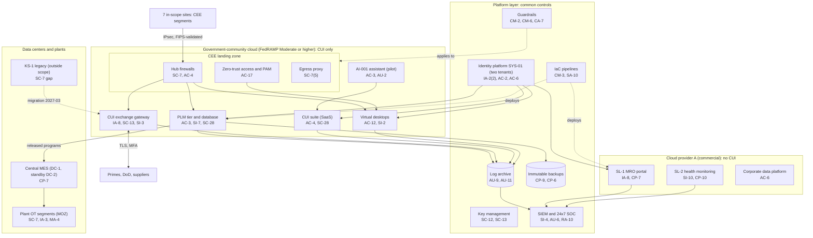

# Cloud Architecture and Control Placement: Cris Santos Company | Defense Industrial Base | Enterprise

**Organization:** Cris Santos Company, Inc. (publicly traded tier-1 aerostructures and aircraft components manufacturer) | **Tier:** Enterprise | **Provider:** Multi-cloud, vendor-agnostic: a government-community cloud offering authorized at FedRAMP Moderate or higher (for CUI), a commercial cloud provider called Cloud provider A (for non-CUI workloads), two data centers, and SaaS (see section 4)
**Owner:** Director of Cloud Platform Engineering, with the CISO and the Director, CMMC Program Office | **Date:** 2026-08-31 | **Related:** CEE SSP (P02), enterprise BIA (P05)

## 1. Architecture in layers
The estate is organized in five layers. Each lower layer provides **common controls** that the layers above inherit, so a workload team configures only what is specific to its system. The two clouds never share a network: CUI lives only in the government-community tenant, and the commercial cloud is an Out-of-Scope Asset for CMMC.

| Layer | What it is | Examples | Who runs it |
|---|---|---|---|
| **Platform** | Organization-wide services in both clouds | Guardrails, identity federation (two separate tenants), key management, log archive, SIEM and SOC, vulnerability and posture management, immutable backups, infrastructure-as-code pipelines | Cloud Platform Engineering; Security Operations; Identity team |
| **Landing zone** | The standard subscription pattern every workload lands in | Subscription vending with data-class and export tags, hub-and-spoke network with cloud firewalls, site IPsec tunnels, edge protection, zero-trust access and PAM, egress proxy | Cloud Platform Engineering; Network Engineering |
| **Workload** | Systems built or run by the company | Government-community: PLM tier, PLM database, virtual desktops, CUI exchange gateway, AI-001 assistant. Cloud provider A: SL-1 MRO portal, SL-2 aircraft health monitoring, corporate data platform | Application teams (for example, the PLM Platform Manager) |
| **SaaS** | Vendor-operated applications | CUI collaboration suite (government-community), commercial productivity suite, payroll and HR, corporate file transfer instance | Vendors, with the company's configuration and oversight |
| **Data center and OT** | Company facilities and plant systems | DC-1 (FL-1 campus), DC-2 colocation (Texas), central MES, plant OT segments, KS-1 legacy environment | IT operations; OT Engineering |

## 2. Diagram

## 3. Responsibility by service model
Sources: the government-community provider's customer responsibility matrix (CRM) for every CUI service, plus SRC-AWS-SRM, SRC-AZURE-SRM, and SRC-GCP-SRM in `00_universal-framework/sources/source-register.csv`. The published models agree on the split used here.

| Service model | Provider | Company (customer) | Shared |
|---|---|---|---|
| IaaS (PLM tier, gateway, SL-1 and SL-2 compute) | Facilities, hosts, hypervisor, physical network | Guest OS, applications, identities, data, network policy | Encryption (provider service, customer keys), logging |
| PaaS (PLM database, virtual desktops, key management, backups) | Also the platform runtime and its patching | Data, access, configuration, keys | Backups, availability configuration |
| SaaS (CUI suite, productivity suite, payroll) | Also the application | Users, roles, sharing settings, data, devices | Audit review |
| Colocation (DC-2) | Building, power, cooling, perimeter | Racks, equipment, cage access list | None |

**DFARS cloud condition.** DFARS 252.204-7012(b)(2)(ii)(D) requires a cloud service provider that stores, processes, or transmits covered defense information to meet security requirements equivalent to the FedRAMP Moderate baseline and to comply with the clause's incident reporting, malware, media preservation, and forensic access paragraphs. Only the government-community offering meets that condition here; the commercial cloud is not used for CUI or ITAR technical data, and data loss prevention scanning enforces that. For ITAR and EAR data, the offering also keeps data in the United States with U.S.-person support staff, which keeps the encrypted-data carve-outs (22 CFR 120.54(a)(5); 15 CFR 734.18(a)(5)) available.

## 4. Service categories and provider equivalents
| Service category | AWS | Microsoft Azure | Google Cloud |
|---|---|---|---|
| Government-community offering | AWS GovCloud (US) | Azure Government with Microsoft 365 GCC High | Assured Workloads (U.S. regions and support controls) |
| Organization guardrails | AWS Organizations service control policies | Azure Policy with management groups | Organization Policy Service |
| Subscription vending | AWS Control Tower account factory | Azure landing zone subscription vending | Resource Manager project creation |
| Key management | AWS KMS | Azure Key Vault | Cloud KMS |
| Audit logging | AWS CloudTrail | Azure Monitor activity log | Cloud Audit Logs |
| Threat detection and posture | Amazon GuardDuty; AWS Security Hub | Microsoft Defender for Cloud | Security Command Center |
| Virtual desktops | Amazon WorkSpaces | Azure Virtual Desktop | Third-party desktop service on Compute Engine |
| Managed relational database | Amazon RDS | Azure SQL Database | Cloud SQL |
| Backup service | AWS Backup | Azure Backup | Backup and DR Service |
| Site-to-site VPN | AWS Site-to-Site VPN | Azure VPN Gateway | Cloud VPN |

This table is for reading provider documentation only. The architecture, control map, and SSP describe service categories.

## 5. Common controls
`cloud-control-map.csv` has **59 rows** across 31 components: Platform 19, Landing zone 7, Workload 19, SaaS 7, Data center and OT 7. Responsibility: Customer 43, Shared 13, Provider 3.

**31 rows are published as common controls** (`common_control` = Yes) in the enterprise common control catalog. They map to the common control providers in the CEE SSP (P02 section 10.3): identity (CCP-02), landing zone (CCP-03), security operations (CCP-04), networks (CCP-05), and corporate security (CCP-07). A workload inherits them by being deployed through subscription vending, which applies the guardrails, logging, network, key, and backup policies automatically.

**Rules for inheriting:**
1. A workload may claim a common control only if its subscription was created by vending, carries the correct data-class tag, and passes the posture baseline.
2. Customer-side identity, data protection, and logging stay explicit at every layer: even a SaaS application has Customer rows for access (AC-3, AC-4, AU-6).
3. Provider rows in the government-community cloud cite the CRM; the Director, CMMC Program Office checks the FedRAMP Marketplace record and the CRM version each year and after any provider notice.
4. A CUI workload may never be deployed in the commercial cloud; vending refuses the CUI tag outside the government-community tenant.

## 6. Validation against the CEE SSP (P02)
Every CEE component in the SSP boundary appears here with controls from each required family, directly or inherited:
| CEE component | AC | AU | CM | IA | SC | SI |
|---|---|---|---|---|---|---|
| PLM tier and database | AC-3 | AU-9 (inherited) | CM-6 | IA-2(2) (inherited) | SC-28 | SI-2, SI-7 |
| Virtual desktops | AC-12 | AU-6 (inherited) | CM-2 (inherited) | IA-2(2) (inherited) | SC-7 (inherited) | SI-2 |
| CUI exchange gateway | AC-4 (inherited) | AU-11 (inherited) | CM-3 (inherited) | IA-8 | SC-13 | SI-3, SI-4 |
| CUI suite | AC-4 | AU-6 | CM-6 (inherited) | IA-2(2) (inherited) | SC-28 | SI-4 (inherited) |
| AI-001 assistant | AC-3 | AU-2 | CM-3 (inherited) | IA-2(2) (inherited) | SC-13 (inherited) | SI-4 (inherited) |

## 7. Findings from the mapping
1. **One file transfer product in two places.** The CEE gateway and the corporate file transfer instance run the same managed file transfer software. They are separate deployments in separate clouds, but one zero-day could reach both. This is the P08 scenario. Fixes: a vendor vulnerability notification clause, and a compensating virtual patching rule set at the web application firewall (P01 R-001, R-033).
2. **AZ-1 is the weak edge.** Every CEE cloud workload inherits strong platform controls, but AZ-1's printer segment is reachable from the corporate network, its build-prep workstations are not in the SIEM or on a baseline, and one printer manufacturer's remote tool bypasses PAM (POAM-004, POAM-005, POAM-008, POAM-012).
3. **Two tenants, two rule sets, one team.** Guardrails and logging are written once as code and applied to both clouds; the CEE tenant adds FIPS-only endpoints, U.S. regions, and the CUI tag. Differences are limited to those settings and service names (section 4).
4. **Export attributes are a workload responsibility.** No platform service checks ITAR and EAR attributes; PLM must (POAM-002).
5. **Commercial service lines stay out of CMMC scope.** SL-1 and SL-2 hold commercial maintenance data classified EAR99 or not subject to the EAR. Data loss prevention and the absence of any route to the CEE keep them Out-of-Scope Assets. SL-2's single region is an availability gap for P09.
6. **KS-1 has no cloud controls yet.** Its legacy SFTP server and flat network are outside every layer above until the migration (POAM-020).
