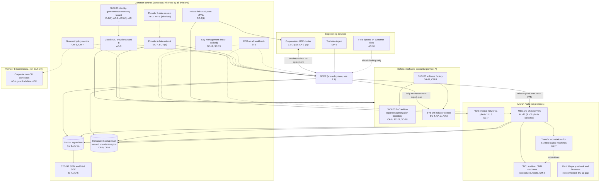
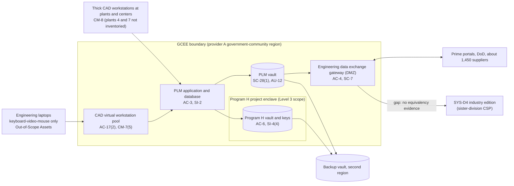

# Cloud Architecture and Control Placement: Cris Santos Company Holdings | Defense Industrial Base | Multi-Sector

**Organization:** Cris Santos Company Holdings, Inc. | **Tier:** Multi-Sector | **Providers:** two public cloud providers, called provider A (a government-community offering, FedRAMP authorized at High, used for everything that holds CUI) and provider B (a commercial offering, used only for non-CUI workloads). Vendor-agnostic; see section 6.
**Scope:** the shared corporate cloud platform (SYS-G3 landing zones), the GCEE (the SSP system in P02), and the division workloads that run on or connect to the platform.

## 1. Design in one paragraph
Corporate runs one **landing zone** per provider: identity federation from SYS-G1, a hub network, guardrail policies, a central log archive, key management, EDR, and an immutable backup vault. The **CUI rule is simple: CUI lives only in provider A's government-community offering**, and provider B guardrails and data loss rules block it. Divisions get their own accounts inside the provider A landing zone and inherit its guardrails. Provider A hosts the GCEE (shared by Aircraft Parts and Engineering Services), the Program H project enclave, the Defense Software DoD edition (SYS-D3, in its own authorization boundary) and industry edition (SYS-D4), the software factory runners (SYS-D5), and the Engineering Services HPC burst service. Three things sit outside the cloud and connect privately: the plant enclave networks with MES, DNC, and about 1,140 machines (SYS-D1); the Engineering Services on-premises HPC cluster and test systems (SYS-D2); and the Plant 9 legacy network, which is not connected yet.

## 2. Diagrams
### 2.1 Group landing zones and division workloads

### 2.2 GCEE (SSP boundary)

**Target state (POAM-006, POAM-005, POAM-013, POAM-009, due 2026-11-30 to 2027-03-31):** the SYS-D4 export is stopped and Aircraft Parts sustainment data lives in the GCEE until SYS-D4 shows FedRAMP Moderate equivalency; every thick workstation carries its CMMC asset category; Program H has its own download and egress baselines; the HPC link has an interconnection agreement and hardened nodes; Plant 9 connects only after migration.

## 3. Tenancy and identity decision
- **Decision.** All three divisions sign in through the group identity platform, SYS-G1, and get their own accounts inside the provider A landing zone. No division has its own identity tenant.
- **Split by data, not by division.** SYS-G1 has a government-community tenant for every CUI environment and a commercial tenant for other workforce use. SYS-D3 has its own authorization boundary but inherits SYS-G1 to SYS-G3, as documented in its package.
- **Why.** CUI in an external cloud must meet FedRAMP Moderate equivalency (DFARS 252.204-7012(b)(2)(ii)(D)), so the boundary is drawn around CUI. One CUI identity tenant lets group internal audit assess it once.
- **What limits blast radius.** Administrators use hardware security keys and just-in-time PAM elevation with session recording. A U.S.-person attribute is required before any CUI group. Cloud roles are federated from SYS-G1 with no long-lived user keys, and provider B guardrails block CUI. The backup vault uses a separate backup identity.
- **Known gaps.** One tenant serves every CUI system and still has global administrator roles (GR-19). 31 GCEE service accounts are still managed by hand (POAM-001).
- **Cross-division risks:** GR-01, GR-02, GR-19 in [risk-register.csv](../step-04_P01_risk-register/risk-register.csv).

## 4. Common versus division-specific controls
`cloud-control-map.csv` has 52 rows across 30 components. The `control_scope` column shows who owns each placement:

| Scope | Rows | What it means |
|---|---|---|
| Common (group) | 22 | Provided once by corporate (SYS-G1, SYS-G2, SYS-G3) and inherited by every division account. Listed in the P02 common control catalog |
| Shared system (GCEE) | 11 | Controls of the shared corporate system documented in the P02 SSP |
| Division-specific (Aircraft Parts) | 6 | Plant networks, MES and DNC logging, USB transfer, Specialized Assets, Plant 9, and the Aircraft Parts tenant in SYS-D4 |
| Division-specific (Engineering Services) | 4 | HPC cluster baseline and link, test data media, field laptops |
| Division-specific (Defense Software) | 9 | DoD edition authorization and data use, industry edition isolation and equivalency, software factory |

| Responsibility | Rows |
|---|---|
| Customer (the group or a division) | 40 |
| Shared (provider and group) | 8 |
| Provider | 4 |

**Rule of thumb.** Identity, network guardrails, logging, keys, backups, and EDR are **common**. A division cannot opt out of them, only request an exception through POL-01. What a division does with CUI, its plant and test equipment, and its customer-facing services are **division-specific**, because they depend on each division's contracts, regulators, and customers.

## 5. Layers
| Layer | Common components | Division components | Key controls | Responsibility |
|---|---|---|---|---|
| Identity | SYS-G1 government-community tenant, cloud IAM | SYS-D4 customer tenant federation, Program H access group | AC-2, AC-3, AC-6(5), IA-2(1) | Customer (configuration); vendor (service) |
| Network | Provider A hub, plant and center VPNs | Plant enclave firewalls, gateway DMZ | SC-7, SC-7(5), SC-8(1), AC-4 | Customer |
| Compute | EDR, guardrails | PLM servers, virtual workstations, HPC, SYS-D3, SYS-D4, SYS-D5 | SI-2, SI-3, CM-2, CM-6, CM-7(5), SC-4 | Customer (guest OS, images, code) |
| Data | Keys, backup vault | PLM vault, Program H vault, platform databases | SC-12, SC-13, SC-28, SC-28(1), CP-9, CP-6 | Shared: provider encrypts; group owns keys |
| Logging and monitoring | Log archive, SIEM | PLM vault logs, MES logs, tenant audit records | AU-3, AU-6, AU-9, AU-11, AU-12, SI-4 | Shared: providers generate platform logs; group retains and reviews |
| On premises and OT | Private links | Plant networks, machines, USB transfer, Plant 9 | SC-7, MP-7, CM-8, SC-13 | Customer |
| Physical | Provider data centers | Plant and center floors (in plant SSPs) | PE-3, MP-6 | Provider (inherited) for the cloud |

## 6. Service categories and provider equivalents
The design does not depend on a provider. This table gives each provider's name for each service category, for reading its shared responsibility documentation. Where CUI is involved, the group uses each provider's government-community offering, not its commercial one.

| Service category | AWS | Microsoft Azure | Google Cloud |
|---|---|---|---|
| Government-community region | AWS GovCloud (US) | Azure Government | Assured Workloads (U.S. regions) |
| Account structure and guardrails | AWS Organizations with service control policies | Management groups with Azure Policy | Resource hierarchy with Organization Policy |
| Object storage (PLM vault) | Amazon S3 | Azure Blob Storage | Cloud Storage |
| Virtual desktops | Amazon WorkSpaces | Azure Virtual Desktop | Partner solutions on Compute Engine |
| Key management | AWS KMS | Azure Key Vault | Cloud KMS |
| Audit logging | AWS CloudTrail | Azure Monitor activity log | Cloud Audit Logs |
| Backup with immutability | AWS Backup (vault lock) | Azure Backup (immutable vault) | Backup and DR Service |
| Private connectivity | AWS Direct Connect / Site-to-Site VPN | Azure ExpressRoute / VPN Gateway | Cloud Interconnect / Cloud VPN |

Shared responsibility sources: SRC-AWS-SRM, SRC-AZURE-SRM, SRC-GCP-SRM in `00_universal-framework/sources/source-register.csv`. All three agree on the split used here: for IaaS the provider owns facilities, hosts, and virtualization; for PaaS the provider also owns the runtime; for SaaS the provider owns the application. The customer always keeps identities, access decisions, data classification, and data. For CMMC, the group references each CUI-holding provider's customer responsibility matrix in the SSP (32 CFR 170.17(c)(5)(iii)).

## 7. Findings from the mapping
1. **The weakest placement is a sister division, not a vendor.** Aircraft Parts sends sustainment CUI to SYS-D4, which runs on a FedRAMP-authorized platform but is not itself FedRAMP authorized and has 23 open 3PAO findings. Under DFARS 252.204-7012(b)(2)(ii)(D) and 32 CFR 170.19(c)(2), a CSP holding CUI must meet security requirements equivalent to the FedRAMP Moderate baseline. Building on an authorized platform does not make the application authorized (SA-9, CA-2; POAM-006 and POAM-015).
2. **The OT edge is where common controls stop.** Identity, encryption, and monitoring are strong in the cloud. At the plants, MES and DNC logs are collected at only 4 of 8 connected plants (AU-12), and USB loading at 3 plants lacks device control (MP-7). Specialized Assets are inventoried but two plants' records are incomplete.
3. **Engineering Services brought systems into scope before bringing controls.** The HPC cluster connects to the GCEE without an interconnection agreement or a hardened baseline (CA-3, CM-2), and field laptops are a path for CUI to leave the GCEE (AC-20).
4. **The DoD edition is a separate legal regime.** Because it is operated on behalf of DoD, DFARS 252.204-7012(b)(1)(i) points to DFARS 252.239-7010 rather than SP 800-171, and 32 CFR 170.3(b) excludes it from CMMC. Its distinctive duty is data use: Government-related data may be used only to manage the operating environment (252.239-7010(c)(2)), which the 2026-05 model change did not respect (AC-21, CM-3; POAM-016).
5. **Common controls are strong and reused.** One identity tenant for CUI, one SIEM, one key service, and one backup design are what let group internal audit assess them once (P07). The weak link is documentation of inheritance for the Engineering Services HPC and test systems (P02, POAM-009), not the controls themselves.
