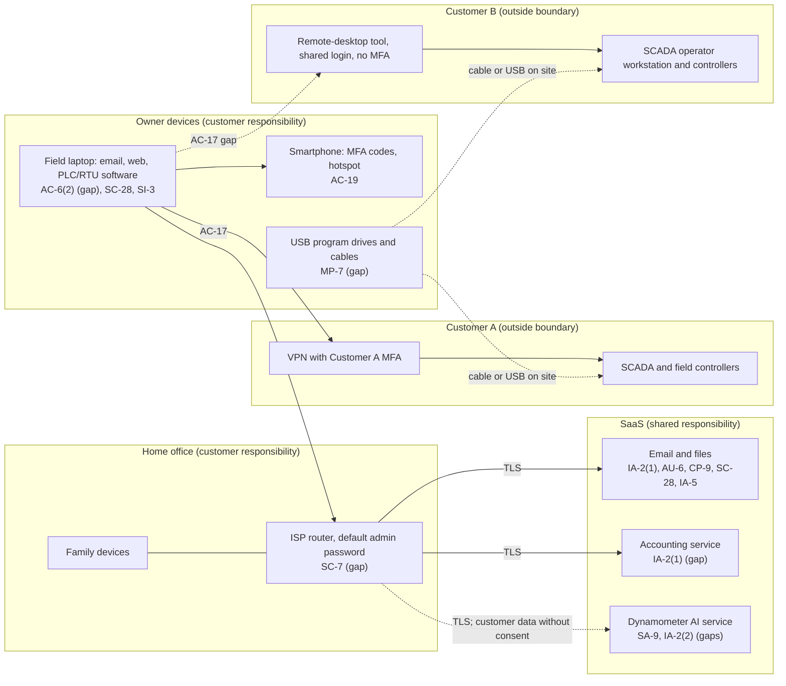

# SaaS Architecture and Control Placement: Cris Santos Company | Mining, Quarrying, and Oil and Gas Extraction | Sole Proprietorship

**Organization:** Cris Santos Company (owner-operated oilfield services contractor) | **Tier:** Sole Proprietorship | **Provider:** SaaS only (no IaaS or PaaS)
**System:** Field Service Business Systems (FSBS), as defined in the system profile (P02) | **Prepared:** 2026-07-22 by the owner-operator with the on-call IT technician | **Adopted:** 2026-08-31

## 1. Diagram
Control IDs on each node are the ones in `cloud-control-map.csv`. Dashed lines are paths with a known gap. The customers' field equipment is outside the boundary but is shown because the laptop connects to it.

## 2. Layers
| Layer | Components | Key controls | Responsibility |
|---|---|---|---|
| Identity | Email, accounting, and dynamometer accounts; customer remote access credentials | IA-2(1), IA-2(2), IA-5, AC-17 | Customer (the owner) configures; providers offer MFA; Customer A runs its own MFA |
| Data | Files and mail, invoices, dynamometer uploads, customer program copies, password spreadsheet | SC-28, CP-9, SA-9, IA-5 | Provider protects data inside its service; the owner decides what goes where and under which customer's consent |
| Endpoints | Laptop, phone, USB drives and cables | AC-6(2), SC-28, SI-3, AC-19, MP-7 | Customer |
| Network | Home router and Wi-Fi; phone hotspot | SC-7 | Customer |
| Logging | Sign-in lists and new-device alerts in the SaaS services | AU-6 | Shared: provider records, the owner reviews |
| SaaS applications and hosting | Providers' platforms | Inherited (SC-8, provider-side SC-28, CP-9 storage redundancy) | Provider |

## 3. Shared responsibility for SaaS
All three major cloud providers' shared responsibility models (SRC-AWS-SRM, SRC-AZURE-SRM, SRC-GCP-SRM) agree on the SaaS split: the provider runs the application, the platform, and the facilities; **the customer always keeps its identities and accounts, its data, and its devices.** That is why 11 of the 15 rows in the control map are the owner's alone and 3 more are shared. A provider's SOC 2 report covers none of those layers. No IaaS equivalents table is needed, because the business runs no infrastructure.

**The OT twist.** For an ordinary small business the device layer ends at the laptop. Here it does not: the same laptop opens sessions into two producers' control systems and is plugged into their controllers on site. The SaaS model says nothing about that path, so it is covered by the customer contracts (CA-3, MSA-A (2)) and by the owner's own endpoint rules (AC-6(2), MP-7, IA-5), consistent with SP 800-82 Rev. 3 guidance on remote access and portable media in OT (sections 6.2.10 and 6.2.1.2, author mapping).

## 4. Findings from the mapping
1. **Customer credentials sit in the file account.** The password spreadsheet on the laptop syncs to SYS-01, so an email account takeover would also hand over modem, controller, and remote-desktop passwords for two customers. Tracked as P01 R-002 and R-004.
2. **MFA is off where it is free to turn on** (accounting service), and the email MFA uses text-message codes. Tracked with R-002 and R-013.
3. **The laptop is an unseparated bridge.** One administrator account does email, web browsing, and control work, and the Customer B remote client had the shared password saved (removed 2026-07-23). Tracked as R-001 and R-003.
4. **A SaaS AI service received customer data without consent.** The fix is contractual (Customer A consent or the no-training tier), not technical. Tracked as R-009 and in P10.
5. **File sync is not a backup.** Version history is 30 days and sync copies encrypted files, so customer program copies need an offline copy (R-007).
