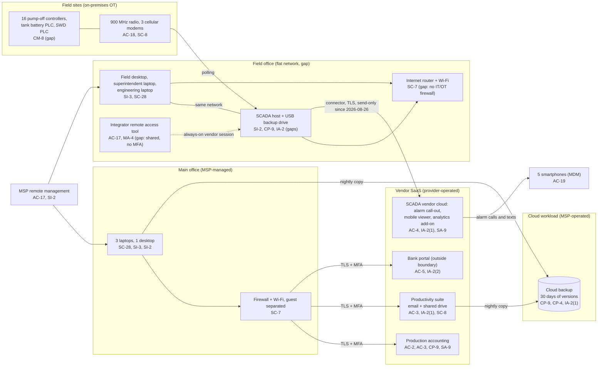

# Cloud Architecture and Control Placement: Cris Santos Company | Mining, Quarrying, and Oil and Gas Extraction | Micro

**Organization:** Cris Santos Company, LLC (independent crude oil producer, one field) | **Tier:** Micro | **Provider:** Vendor-agnostic SaaS (see section 3)
**System:** Field SCADA and Production Accounting System (FSPA), as defined in the SSP (P02) | **Prepared:** 2026-07-31 by the Office Manager with the MSP lead technician and the Field Superintendent; SCADA connector row updated 2026-08-26 | **Approved:** Owner, 2026-08-31

## 1. Diagram
The company runs no cloud servers and has no IaaS tenant. Its "cloud" is a set of SaaS services plus one cloud workload that the MSP operates for it: the cloud backup (SYS-07). The SCADA vendor's cloud service (SYS-08) matters most, because it is the only cloud service with a connection to the SCADA host.

## 2. Layers and who is responsible
| Layer | Components | Key controls | Customer (company) | MSP (on the company's behalf) | Provider (SaaS vendor) |
|---|---|---|---|---|---|
| Identity | Suite, production accounting, SCADA cloud, bank, backup console, HMI, integrator tool | AC-2, IA-2(1), IA-2(2), AC-5 | Decides who gets access; removes access; enables MFA in each service; names the bank approver | Creates and disables suite accounts; holds the backup console login | Runs sign-in and MFA services |
| Network | Main-office firewall; field office router; SCADA connector | SC-7, AC-4, SC-8 | Owns the field office network and the connector setting; approves changes | Configures and patches the main-office firewall | Secures the SaaS endpoints the connector reaches |
| Endpoints | 7 computers, 5 phones, SCADA host | SC-28, SI-2, SI-3, AC-19 | Runs the SCADA host and engineering laptop itself (today) | Encryption, antivirus, patching, and MDM on the devices it manages | Not applicable |
| SaaS applications | Production accounting, suite, SCADA cloud, bank | AC-3, AU-2, AU-6 | Roles, sharing settings, log review | Suite administration on request | Application, platform, data centers |
| Data | Owner records, shared drive, backup copies, SCADA backups | CP-9, CP-4, SC-28 | Decides retention, restore testing, and where SCADA backups live | Operates the cloud backup and runs restore tests | Encrypts and backs up its own platform |
| Vendor governance | SOC 2 review, contracts, remote access | SA-9, AC-17, MA-4 | Reviews SOC 2 and vendor evidence; sets contract terms; approves vendor sessions | Reports on its own tools and subcontractors | Provides SOC 2 reports or security documentation |

**The MSP is not a cloud provider in the shared responsibility sense.** It performs customer-side duties for the company. Anything marked "Customer (performed by MSP)" in `cloud-control-map.csv` remains the company's responsibility. The company must direct the work, receive evidence, and check it (SA-9). **The MSP contract does not cover the SCADA host or the field office network today,** so those controls rest only on the Field Technician and the integrator.

## 3. Service categories and provider equivalents
The design is vendor-agnostic. For SaaS, all three major cloud providers' shared responsibility models give the same split: the provider runs the application, platform, and infrastructure, and the customer keeps identities, access, data, and devices (SRC-AWS-SRM, SRC-AZURE-SRM, SRC-GCP-SRM in `00_universal-framework/sources/source-register.csv`). For the company's vendors, the SOC 2 report or vendor security documentation is the evidence of the provider side.

| Service category used | What it is here | Equivalent category in the large cloud providers (for reading their documentation) |
|---|---|---|
| Line-of-business SaaS | Production accounting | Industry SaaS built on any provider |
| Industrial IoT and SCADA cloud service | Alarm call-out, mobile viewer, analytics add-on | IoT and industrial data services |
| Productivity suite | Email, calendar, file storage | Productivity and collaboration SaaS |
| SaaS backup | Nightly backup of computers and the shared drive | Backup service or third-party SaaS backup |
| Remote monitoring and management | MSP device management | Device management SaaS |

SP 800-82 Rev. 3 notes that OT is increasingly connected to cloud services (section 5.1.3) and recommends a risk analysis when OT data is sent to the cloud (section 6.2.3). This mapping is that analysis for SYS-08. The company's rule, now in POL-02 B.10: **no cloud service may send commands or setpoints to field controllers.**

## 4. Findings from the mapping
1. **A cloud service could write to the field (AC-4).** The SCADA vendor's connector can accept setpoint writes from the cloud for its analytics add-on. The vendor had turned this on for 2 pilot wells, and it changed pump-off idle times 11 times in July. The Owner set the connector to send-only on 2026-08-26. Fix: keep it send-only, check the setting monthly, and require written notice of feature changes in the subscription terms. Tracked as P01 R-022 and P07 POAM-013.
2. **The cloud backup does not protect the field (CP-9, CP-4).** SYS-07 covers only the main office. The SCADA host's only backup is a USB drive plugged into it, and nobody has tried a restore. Fix: rotated offline SCADA backups, controller programs copied to the shared drive, and quarterly restore tests. Tracked as P01 R-003 and POAM-003, POAM-004.
3. **Administrator logins without MFA (IA-2(1)).** The backup console, the SCADA cloud administrator, and the integrator's remote tool use passwords only. An attacker with the backup password could delete the office backups; one with the integrator's could operate the HMI. Fix: MFA on all three. Tracked as POAM-001 and POAM-007.
4. **Customer-side controls are the weak layer.** The SaaS vendors' side is reasonably evidenced (SOC 2 for production accounting). The gaps are the company's own settings: account removal, the open Geology folder, plain-email owner exports, and unreviewed logs.
5. **The bank's dual approval is the strongest single control against payment fraud.** It does not stop a changed bank account number from entering production accounting, so the call-back rule in POL-04 4.7 is still needed (P01 R-004).
