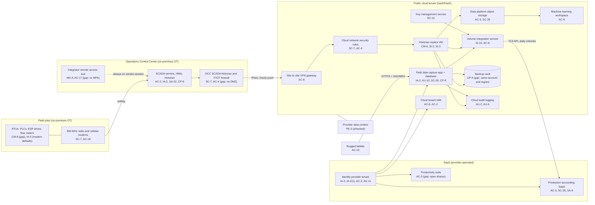

# Cloud Architecture and Control Placement: Cris Santos Company | Mining, Quarrying, and Oil and Gas Extraction | Small

**Organization:** Cris Santos Company, LLC (independent crude oil producer) | **Tier:** Small | **Provider:** Vendor-agnostic (see section 3)
**System:** Field SCADA and Production Accounting System (FSPA), as defined in the SSP (P02), plus the SaaS applications that hold royalty and reservoir data

## 1. Diagram

## 2. Layers
| Layer | Components | Key controls | Responsibility |
|---|---|---|---|
| Identity | Identity provider, cloud IAM roles, tablet enrollment | AC-2, AC-6, IA-2, IA-2(1), AC-19 | Customer (configuration), provider (service) |
| Network / edge | VPN gateway, cloud network security rules, OCC IT/OT firewall | SC-7, SC-8, AC-4 | Customer; the provider runs the gateway service |
| Compute / application | Historian replica VM (IaaS), volume integration service and field data capture app (PaaS), ML workspace (PaaS) | CM-6, SI-2, SI-3, SI-10, AU-10 | IaaS: customer owns guest OS and application. PaaS: provider owns runtime, customer owns code, configuration, and access |
| Data | Object storage, managed database, backup vault, key management | SC-28, SC-12, CP-9, AC-3 | Shared: provider encrypts and runs the services; customer sets access, retention, isolation, and key policies |
| Logging / monitoring | Cloud audit logs, identity provider sign-in logs | AU-2, AU-6, AU-11 | Shared: provider generates; customer retains and reviews |
| SaaS applications | Production accounting, productivity suite | AC-3, SC-28, SA-9 | Provider (application and infrastructure); customer (users, roles, data, and complementary user entity controls) |
| Physical / hypervisor | Provider data centers | PE-3 | Provider (inherited) |
| On-premises OT (connected, not cloud) | OCC SCADA, IT/OT firewall, field devices | SC-7, AC-4, MA-4 | Customer only; shown because the cloud tenant connects to it |

## 3. Service categories and provider equivalents
The company's design is independent of the provider. This table gives each provider's name for each service category, to use when reading its shared responsibility documentation.

| Service category | AWS | Microsoft Azure | Google Cloud |
|---|---|---|---|
| Virtual machines | Amazon EC2 | Azure Virtual Machines | Compute Engine |
| Serverless functions (integration service) | AWS Lambda | Azure Functions | Cloud Run functions |
| Managed web app hosting | AWS Elastic Beanstalk | Azure App Service | App Engine |
| Managed relational database | Amazon RDS | Azure SQL Database | Cloud SQL |
| Object storage | Amazon S3 | Azure Blob Storage | Cloud Storage |
| Machine learning workspace | Amazon SageMaker AI | Azure Machine Learning | Vertex AI |
| Backup service | AWS Backup | Azure Backup | Backup and DR Service |
| Identity and access management | AWS IAM | Azure role-based access control with Microsoft Entra ID | Cloud IAM |
| Key management | AWS KMS | Azure Key Vault | Cloud KMS |
| Audit logging | AWS CloudTrail | Azure Monitor activity log | Cloud Audit Logs |
| Site-to-site VPN | AWS Site-to-Site VPN | Azure VPN Gateway | Cloud VPN |
| Network filtering | Security groups | Network security groups | VPC firewall rules |

Shared responsibility sources: SRC-AWS-SRM, SRC-AZURE-SRM, SRC-GCP-SRM in `00_universal-framework/sources/source-register.csv`. All three models agree on the split used here:
- **IaaS:** the provider owns physical facilities, hosts, and the virtualization layer. The customer owns the guest operating system, applications, network configuration, identities, and data.
- **PaaS:** the provider also owns the operating system and runtime. The customer keeps code, configuration, identities, access, and data.
- **SaaS:** the provider also owns the application. The customer keeps identities, access, data, and devices.

No cloud service touches the field controllers. The cloud tenant only receives data from the OCC. SP 800-82 Rev. 3 notes that OT is increasingly connected to cloud services (section 5.1.3) and recommends a risk analysis when OT data is stored in the cloud (section 6.2.3). This mapping is that analysis for the historian replica and data platform. The company's rule is that nothing in the cloud may send commands to SCADA.

## 4. Findings from the mapping
1. **The cloud link reaches into the SCADA network (SC-7, AC-4).** The historian pushes data to the cloud over a VPN that terminates on the IT/OT firewall, and the tunnel allows return traffic into the SCADA network. A compromised cloud VM could therefore reach the OCC. Fix: terminate the VPN in the new OT DMZ and allow only one-way push from the historian. Tracked as P01 R-001 and P07 POAM-002.
2. **Backup isolation (CP-9).** The backup vault shares the production account, region, and administrator roles. A ransomware actor with cloud administrator rights could delete the backups. Fix: separate account with immutable retention in a second region. Tracked as P01 R-003 and POAM-003.
3. **Run ticket integrity (AU-10).** Lease operators and office staff can edit a run ticket after it is submitted, with no record of the change. Run tickets drive sales and royalties. Fix: lock after submission and reconcile monthly against SCADA tank levels (R-022).
4. **Reservoir data exposure (AC-3).** Trade-secret reservoir data sits in object storage and in the productivity suite with broad access. Fix: restrict to the geoscience group and alert on bulk downloads (R-009).
5. **Inherited controls rely on vendor SOC 2 reports.** Controls marked Provider or Shared in `cloud-control-map.csv` depend on the cloud provider's, identity provider's, and production accounting vendor's reports. The production accounting vendor's report is reviewed in P09.
