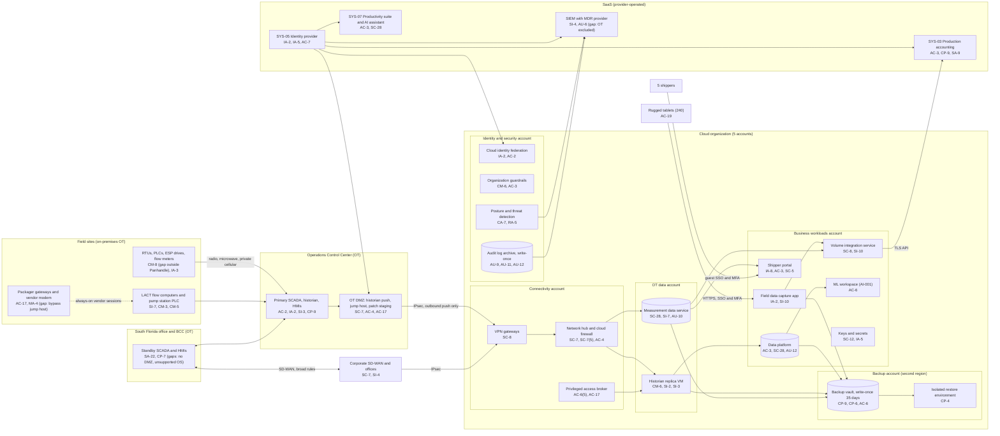

# Cloud Architecture and Control Placement: Cris Santos Company | Mining, Quarrying, and Oil and Gas Extraction | Mid-Market

**Organization:** Cris Santos Company, Inc. | **Tier:** Mid-Market | **Provider:** Vendor-agnostic public cloud (see section 4), plus SaaS
**System:** Field SCADA and Production Accounting System (FSPA), as defined in the SSP (P02), plus the SaaS applications that hold royalty, reservoir, and shipper data | **Prepared:** 2026-07-31 by the VP IT and the Security Manager; updated 2026-09-16 with P07 results
**Control map:** `cloud-control-map.csv` (54 rows, 22 components)

## 1. Diagram

## 2. Landing zone design
The landing zone separates duties across 5 accounts (subscriptions or projects, depending on the provider) under one cloud organization. OT data is kept in its own account because it is the only cloud data that comes from the SCADA network, and the rule is that **nothing in the cloud may send traffic toward SCADA**.

| Account | Purpose | Who administers | Key design decisions |
|---|---|---|---|
| **Identity and security** | Organization root, federation to SYS-05, guardrails, posture and threat detection, write-once audit log archive | Security Manager and Security Analyst | No workloads. Root credentials sealed. Guardrails apply to every other account and cannot be disabled from them |
| **Connectivity** | Network hub, cloud firewall, VPN gateways (OT DMZ tunnel, headquarters tunnel), DNS, privileged access broker | VP IT's infrastructure team | All traffic between sites, accounts, and the internet passes the hub. The OT DMZ tunnel accepts only outbound-initiated push from the historian and measurement collector |
| **OT data** | Historian replica, measurement data service | Infrastructure team; OT Security Engineer approves changes | No internet gateway (guardrail). No route back to the OT DMZ. Business workloads read through a read-only data service |
| **Business workloads** | Field data capture app, volume integration service, shipper portal, data platform, ML workspace, keys and secrets | Infrastructure team; app contractor for the field data capture app; data science firm only inside the ML workspace | Separate subnets per workload. Shipper portal is the only internet-facing service, behind the provider's web front door |
| **Backup** | Backup vault with 35-day write-once retention in a second region; isolated restore environment | 2 named backup administrators | Separate credentials not federated to everyday accounts. Workload accounts can write backups but cannot delete them |

## 3. Layers and shared responsibility per service
| Layer | Components | Key controls | Service model | Responsibility |
|---|---|---|---|---|
| Identity | Cloud federation, break-glass accounts, privileged access broker, SYS-05, guardrail roles | IA-2, IA-2(1), AC-2, AC-3, AC-6(5), AC-7, IA-5, IA-8 | IaaS / PaaS / SaaS | Customer configures identities, roles, MFA, and reviews; provider runs the identity services |
| Network | Hub, cloud firewall, VPN gateways, shipper portal front door | SC-7, SC-7(5), AC-4, SC-8, SC-5, AC-17 | PaaS | Customer designs routes, rules, and one-way flows; provider runs the gateway and firewall services |
| Compute | Historian replica VM, field data capture app, volume integration service, shipper portal, ML workspace | CM-6, SI-2, SI-3, SI-10, IA-2, AC-6 | IaaS / PaaS | IaaS: customer owns guest OS and applications. PaaS: provider owns runtime; customer owns code, configuration, and access |
| Data | Measurement data service, data platform, keys and secrets, backup vault, production accounting data | SC-28, SC-12, SI-7, AU-10, CP-9, CP-6, CP-4, AC-3 | PaaS / SaaS | Shared: provider encrypts and runs the services; customer controls keys, access, retention, isolation, integrity checks, and restore testing |
| Logging and monitoring | Audit log archive, posture service, SIEM with the MDR provider | AU-2, AU-6, AU-9, AU-11, AU-12, CA-7, RA-5, SI-4 | PaaS / SaaS | Shared: provider generates logs and detections; customer enables, retains, forwards, and acts on them; MDR provider monitors IT |
| SaaS applications | Identity provider, production accounting, productivity suite and AI assistant | AC-3, CP-9, SA-9, SC-28, AU-2 | SaaS | Provider runs the application and infrastructure; customer keeps users, roles, data, and complementary user entity controls |
| Physical | Provider data centers | PE-3, PE-13 | All | Provider (inherited, evidenced by SOC 2 reports) |
| On-premises OT (connected, not cloud) | OCC, OT DMZ, BCC, field devices, vendor gateways | SC-7, AC-4, AC-17, MA-4, SA-22 | n/a | Customer only; shown because the OT data account connects to it |

**Responsibility counts in `cloud-control-map.csv`:** 33 Customer, 15 Shared, 6 Provider. By service model: 14 IaaS, 30 PaaS, 10 SaaS rows. Every one of the 22 components has at least one Customer or Shared row, because identity, data protection, and logging stay with the company under all three providers' shared responsibility models.

## 4. Service categories and provider equivalents
The design is independent of the provider. This table gives each provider's name for the service category, for reading its shared responsibility documentation (SRC-AWS-SRM, SRC-AZURE-SRM, SRC-GCP-SRM in `00_universal-framework/sources/source-register.csv`).

| Service category | AWS | Microsoft Azure | Google Cloud |
|---|---|---|---|
| Multi-account organization and guardrails | AWS Organizations, service control policies | Management groups, Azure Policy | Resource Manager folders, organization policies |
| Account, subscription, or project | Account | Subscription | Project |
| Cloud identity federation | IAM Identity Center | Microsoft Entra ID with Azure RBAC | Cloud Identity with IAM |
| Network hub | Transit Gateway | Virtual WAN hub or hub virtual network | Network Connectivity Center or shared VPC |
| Cloud firewall | AWS Network Firewall | Azure Firewall | Cloud NGFW |
| Site-to-cloud VPN | Site-to-Site VPN | VPN Gateway | Cloud VPN |
| Virtual machines | EC2 | Virtual Machines | Compute Engine |
| Managed web app hosting | Elastic Beanstalk | App Service | App Engine |
| Serverless functions | Lambda | Functions | Cloud Run functions |
| Managed relational database | RDS | Azure SQL Database | Cloud SQL |
| Object storage with write-once retention | S3 with Object Lock | Blob Storage with immutability policies | Cloud Storage with bucket lock |
| Machine learning workspace | SageMaker AI | Azure Machine Learning | Vertex AI |
| Backup service | AWS Backup (vault lock) | Azure Backup (immutable vault) | Backup and DR Service |
| Key management and secrets | KMS and Secrets Manager | Key Vault | Cloud KMS and Secret Manager |
| Audit logging | CloudTrail | Azure Monitor activity log | Cloud Audit Logs |
| Posture and threat detection | Security Hub, GuardDuty | Microsoft Defender for Cloud | Security Command Center |
| Web front door with denial-of-service protection | CloudFront with Shield | Front Door with DDoS Protection | Cloud Load Balancing with Cloud Armor |

**Service model split used here (all three providers agree):**
- **IaaS** (virtual machines, networks): the provider owns facilities, hosts, and virtualization. The customer owns the guest OS, applications, network configuration, identities, and data.
- **PaaS** (managed database, web hosting, functions, backup, key service): the provider also owns the platform software and its patching. The customer owns code, access, keys, data, and configuration.
- **SaaS** (identity provider, production accounting, productivity suite, SIEM): the provider also owns the application. The customer keeps identities, roles, data, and complementary user entity controls.

SP 800-82 Rev. 3 notes that OT is increasingly connected to cloud services (section 5.1.3) and recommends a risk analysis when OT data is stored in the cloud (section 6.2.3). This mapping is that analysis for the historian replica and the measurement data service.

## 5. Findings from the mapping
1. **The cloud side is segmented; the on-premises side is not (SC-7, AC-4).** The OT data account accepts only an outbound push from the OT DMZ. But the BCC and the South Florida office reach the hub through the corporate SD-WAN tunnel, so a compromised corporate host could reach the BCC and from there the OCC. The fix is on-premises: extend the OT DMZ pattern to the BCC and South Florida (P01 R-001; P07 POAM-003).
2. **Measurement integrity is designed in the cloud but not at the source (SI-7, AU-10).** Tickets are hashed and edits are recorded in the measurement data service, which supports SOC 2 Processing Integrity. Flow computer configuration changes upstream, including those through the flow computer vendor's modem, are not captured (P01 R-007; POAM-007).
3. **Backups are the strongest cloud control (CP-9, CP-6).** Separate account, second region, write-once retention, delete-proof cross-account role, and quarterly restore tests. They do not cover the on-premises SCADA images, which is the recovery gap that matters most (P05 finding 2; POAM-004).
4. **Owner data is over-shared in the data platform (AC-3).** A full owner deck copy with Social Security numbers is readable by all engineers, although analytics need only owner counts and decimal interests (P01 R-037; POAM-013).
5. **OT monitoring is the gap in the logging layer (SI-4).** Cloud, identity, and corporate logs reach the SIEM with 24x7 MDR coverage; OT sensor alerts do not (P01 R-011; POAM-009).
6. **Boundary check.** Every in-scope FSPA component that runs in the cloud or SaaS appears in the diagram and has at least one row in the control map. Each cloud account has controls from at least 2 of the AC, AU, CM, IA, SC, and SI families or inherits them from the identity and security account.
7. **Inherited controls rely on SOC 2 reports.** Provider and Shared rows for the cloud provider, identity provider, production accounting vendor, and MDR provider depend on their SOC 2 Type 2 reports and the complementary user entity controls reviewed in P09 `vendor-soc2-review.csv`.
