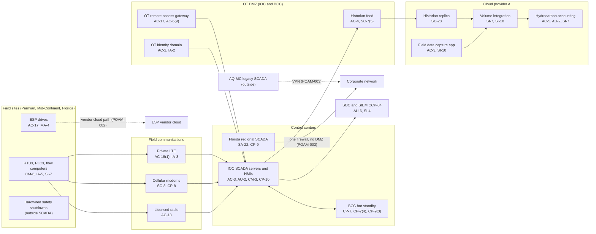

# System Security Plan: Field SCADA and Production Accounting System (FSPA)

**Organization:** Cris Santos Company, Inc. (publicly traded independent crude oil producer) | **Tier:** Enterprise | **Vertical:** Mining, Quarrying, and Oil and Gas Extraction
**Outline:** NIST SP 800-18 Rev. 2, System Security Plan Outline Example (June 2026) | **Version:** 3.0, 2026-09-14

## 1. System Name and Identifier
Field SCADA and Production Accounting System (**FSPA**), identifier CSC-SYS-FSPA-001. Tier-1 system in the enterprise application inventory and the company's highest-value system in the BIA (P05: BP-01 to BP-05 and BP-08 to BP-10 depend on it).

## 2. System Overview
The FSPA lets the company watch and control about 7,200 wells and their facilities on the enterprise SCADA platform, and turns what the fields produce into sales, royalty payments, and partner bills. It runs 24x7 from the Integrated Operations Center (IOC) in Midland, Texas, with hot standby at the Backup Control Center (BCC) in Oklahoma City and a regional control room in Florida. About 1,400 people use it: about 70 Production Controllers across shifts, lease operators with tablets, automation technicians and engineers, gathering and water operators, and about 140 revenue accounting staff.

**Major components:**
- **SYS-01 enterprise SCADA platform:** SCADA master servers at the IOC with hot standby at the BCC; regional SCADA servers at the Florida control room; historians; about 140 HMIs; 40 engineering workstations; a simulator and test rack at the IOC
- **SYS-02 field devices and communications (on the enterprise platform):** about 9,300 RTUs, PLCs, pump controllers, and flow computers (including 16 LACT units); about 1,800 ESP drives; private LTE in the Permian core; licensed radio in the Mid-Continent and Florida; about 5,400 cellular modems
- **SYS-07 (part):** the OT DMZs at the IOC and BCC (historian replica feed, patch staging, jump hosts, OT remote access gateway, OT identity domain) and the Florida IT/OT firewall
- **FSPA workloads on Cloud provider A:** historian replica, volume integration service, field data capture app (web app and managed database)
- **SYS-03 hydrocarbon accounting:** commercial software, customer-managed on Cloud provider A, for volumes, allocations, revenue distribution, joint interest billing, and state production and tax reports

**What the system does not do:** it does not perform safety functions. Gas detection, tank high-level, compressor emergency shutdown, and gathering line high-pressure shutdown are hardwired or run in separate safety controllers at each site and act without SCADA. This design choice limits how much harm a SCADA compromise can cause. It is also why integrity, not availability, drives the categorization in section 6: a wrong setpoint or a silently altered volume does more harm than a few hours of lost visibility, which manual operations can cover.

## 3. Laws, Regulations, and Policies Affecting the System
| ID | Requirement | Citation | How it affects the FSPA |
|---|---|---|---|
| N21-BM | NIST CSF 2.0 with NIST SP 800-82 Rev. 3, including the SP 800-82 Rev. 3 OT overlay (Appendix F) | NIST CSWP 29; SP 800-82 Rev. 3 | Voluntary benchmark adopted by the company (P03); the source of the regulatory driver column |
| SEC | Cybersecurity disclosure | Form 8-K Item 1.05; 17 CFR 229.106 (Item 106) | A material FSPA incident goes through the P08 materiality step; FSPA risk processes are described in Item 106 |
| SOX | Internal control over financial reporting | Sarbanes-Oxley Act section 404 (company SOX program) | Hydrocarbon accounting and volume integration are in scope for IT general controls |
| PHMSA | Gathering line duties | 49 CFR 195.11 (regulated rural gathering, 44 miles); 195.15 (reporting-regulated-only); 195.50, 195.52, 195.54 | The FSPA monitors gathering lines; SCADA data supports the initial release estimate (195.52(c)) |
| EPA | Oil discharge notice; SPCC overfill alarm option | 40 CFR 110.6; 40 CFR 112.9(c)(4)(iv) | SCADA high-level alarms are the SPCC overfill measure at 31 tank batteries; a SCADA-caused release reaching water is reportable |
| State | State breach notification and data security laws | Each state where affected individuals reside (Florida worked example: Fla. Stat. 501.171) | Royalty owner and partner personal information in hydrocarbon accounting |
| Contract | SL-1 and SL-2 commitments; crude purchase and transportation agreements | P09 | Availability and processing integrity of statements, payments, and water tickets |
| Internal | POL-01 to POL-05 and standards | P06 | Enterprise policy hierarchy |

**Not applicable** (see P03 section 1):
- N21-R01, the USCG Marine Transportation System cyber rule (33 CFR 101.605): no vessel, MTSA facility, or OCS facility.
- N21-R02, TSA Security Directive Pipeline-2021-02G: TSA has not notified the company that any of its pipelines is critical.
- N21-R03, CIRCIA: proposed only. As proposed, the company would be covered by the size test (12,000 employees against the 1,250-employee SBA standard), so the FSPA incident process is being prepared for 72-hour reporting (P08), but nothing is required today.
- PHMSA control room management (49 CFR 195.446): applies to operators of pipeline facilities controlled through SCADA, but the duties for regulated rural gathering lines are those listed in 195.11(b), which do not include 195.446, and the company has no non-rural gathering lines. The company follows parts of it voluntarily (for example point-to-point verification, CM-4(2)).

## 4. System Status
### 4.1 System Security Plan Approval
Prepared by the Vice President, Operations Technology and Automation, with the Director of OT Security and the GRC team. Reviewed by the CISO, the Vice President, Production and Revenue Accounting, and the Vice President, Health, Safety, and Environment. Approved by the Chief Operating Officer on 2026-09-14.
### 4.2 System Authorization Decision
The company is not a federal agency, so there is no formal ATO. The equivalent internal decision:
- **Authorizing official equivalent:** Chief Operating Officer, with the CISO's recommendation.
- **Decision (2026-09-14):** continue operation with conditions, based on the Internal Audit assessment (P07) and the risk register (P01).
- **Conditions:** remove default credentials and internet exposure on field devices (POAM-008 by 2026-10-31); disable remote setpoint write on ESP drives and bring the ESP vendor path under the remote access gateway (POAM-002 by 2026-12-31); restrict the AQ-MC VPN and build the Florida OT DMZ (POAM-003 by 2027-03-31); prove the 4-hour RTO in a repeat failover test (POAM-004 by 2027-02-28); close the OT change control gaps (POAM-006 by 2027-03-31).
- **Reauthorization:** annually, or after a major change (the AQ-MC migration onto the platform in 2027 is a major change).
### 4.3 System Operational Status
Operational. Planned major modifications: migration of the AQ-MC wells onto the enterprise platform (due 2027-06-30); Florida OT DMZ and server replacement (POAM-003, POAM-009); automated change enforcement and integrity response (CM-3(1), SI-7(2), SI-7(5)).

## 5. Role Identification and Responsible Personnel
| Role | Title | Responsibility |
|---|---|---|
| System owner | Vice President, Operations Technology and Automation | Accountable for the SCADA platform, field automation, and field communications |
| Authorizing official (equivalent) | Chief Operating Officer | Accepts residual risk to operate |
| Data owner (volumes, owner and partner data) | Vice President, Production and Revenue Accounting | Hydrocarbon accounting configuration, allocation integrity, owner records |
| Operations owners | Vice Presidents of Permian, Mid-Continent, and Florida Operations; Vice President, Midstream and Water | Manual operations, shut-in decisions, gathering and water systems |
| OT security lead | Director of OT Security | OT security program (CCP-10), OT change board security review |
| Information security | CISO; Director of Security Operations | Program oversight; SOC monitoring; incident response |
| Safety and environment | Vice President, Health, Safety, and Environment | SPCC plans, release reporting, alarm philosophy sign-off |
| Common control providers | See section 10.3 | Operate inherited controls |
| Independent assessor | Chief Audit Executive (Internal Audit) | Annual assessment (P07) |

## 6. System Information Types and System Categorization
Information types come from NIST SP 800-60 Vol. 2 Rev. 1, which gives provisional impact levels for federal systems; the company adjusted them for its own operations as the publication allows. Impact levels follow FIPS 199.

| Information type | Confidentiality | Integrity | Availability | Rationale |
|---|---|---|---|---|
| Energy Production (D.7.4): process data, setpoints, alarm limits, controller logic | Moderate | **High (treated)** | Moderate | Changed logic or setpoints could cause a loss of containment on a tank battery or gathering line before hardwired protection acts. Manual operations cover loss of visibility for up to 12 hours (P05 BP-01), so availability stays Moderate |
| Energy Supply (D.7.1): LACT tickets, run tickets, custody transfer volumes, sales | Low | High (treated) | Moderate | Wrong volumes misstate revenue (SOX), royalties, and severance taxes |
| Payments (C.3.2.5): owner and partner distributions and bank details | Moderate | Moderate | Low | Owner records include taxpayer identification numbers and bank accounts covered by state breach laws; payments can be repeated from the prior run (P05 BP-09) |
| Information security (audit logs, firewall rules, credentials) | Moderate | Moderate | Moderate | Protects the evidence for integrity and the IT/OT boundary |
| **FSPA category** | **Moderate** | **Moderate baseline, integrity supplemented** | **Moderate, availability supplemented** | See the decision below |

**Categorization decision.** A strict FIPS 199 high-water mark would make the system High because of integrity. The company is not a federal agency and uses FIPS 199 as a model. The risk committee approved this tailoring on 2026-09-10:
- The FSPA uses the **SP 800-53B Moderate baseline**, tailored with the **SP 800-82 Rev. 3 OT overlay** (Appendix F), where OT limits a control (for example no HMI screen lock, AC-11; no HMI lockout, AC-7; named accounts with badge-controlled rooms in place of MFA at the console, IA-2(2)).
- It adds **10 High-baseline controls** that protect integrity and recovery: CM-3(1), CM-4(1), CM-5(1), CP-2(5), CP-4(2), CP-7(4), CP-9(3), SC-7(18), SI-7(2), SI-7(5).
- The decision is reviewed annually. If the integrity POA&M items (POAM-006, POAM-017) are not closed by 2027-06-30, the CISO will recommend full High categorization.

**Documented controls.** `control-implementation.csv` documents **232 controls**: 222 from the Moderate baseline and 10 High-baseline supplements. The remaining 65 Moderate-baseline controls (mostly enhancements in the AC, AU, CM, IA, PE, SA, SC, and SI families, plus privacy-related controls) are fully inherited from the common control catalog (section 10.3) or covered by the enterprise privacy program, and are listed there rather than repeated here.

**OT overlay tailoring register (TR-01 to TR-07):** TR-01 PIV not used (IA-2(12)); TR-02 HMI session lock replaced by staffed, badge-only rooms (AC-11); TR-03 no lockout on HMI operator logins, failed attempts alert the SOC (AC-7); TR-04 vulnerability scanning in OT is passive or vendor-approved only (RA-5); TR-05 MFA at the HMI console replaced by named accounts and physical access control (IA-2(2)); TR-06 legacy serial and radio protocols without encryption are compensated by private networks and monitoring until replaced (SC-8); TR-07 patches only after vendor qualification on the test rack (SI-2).

## 7. Authorization Boundary Description
**Inside the boundary:** the IOC and BCC SCADA servers, historians, HMIs, and engineering workstations; the Florida regional SCADA servers and HMIs; field devices and communications connected to the enterprise platform (Permian, legacy Mid-Continent, Florida); the OT DMZs and the Florida IT/OT firewall; the FSPA workloads on Cloud provider A; and the hydrocarbon accounting system.

**Outside the boundary (common control providers and interconnected systems):**
- Landing zone services on Cloud provider A (network hub, key management, log archive, backup accounts, standby region): CCP-03
- Identity platform (SYS-05): CCP-02; the OT identity domain is inside the boundary
- SOC, SIEM, EDR, passive OT monitoring: CCP-04
- AQ-MC legacy SCADA (SYS-13), until migration; crude purchaser and pipeline systems; the ESP vendor cloud; the cellular carrier network; Integrator A's own network; the SL-1 portal (a separate workload that reads from hydrocarbon accounting)

The enterprise multi-cloud diagram is in P04 `cloud-architecture.md`.

## 8. Information Exchanges Summary
| Connected system / party | Direction | Data | Agreement |
|---|---|---|---|
| Corporate network (SYS-07) | Through the OT DMZ (IOC, BCC); one firewall at Florida | Historian data out; patches and jump host sessions in | Internal; **Florida rules include direct corporate-to-SCADA flows (POAM-003)** |
| Historian replica and volume integration (Cloud A) | Outbound from the OT DMZ | Process data; daily allocated volumes | Internal |
| Crude purchasers and pipelines (3 major) | Bidirectional | LACT tickets, run tickets, nominations | Purchase and transportation agreements; **one ticket exchange has no security terms** |
| SCADA Integrator A | Inbound through the OT remote access gateway | Platform support | Master services agreement with security schedule and incident notice |
| ESP vendor | Outbound from drives to the vendor cloud; vendor commands back | Drive data; setpoint writes on 260 drives | Service agreement; **no security schedule; outside the gateway (POAM-002)** |
| AQ-MC legacy SCADA (SYS-13) | Read-only data link to the IOC historian | Production data for allocation | Transition services agreement with the seller; **network path also reaches the enterprise WAN (POAM-003)** |
| Cellular carrier | Transport | Polling for about 5,400 modems | Carrier contract; **12% on public APN (POAM-013); no priority restoration (POAM-019)** |
| Bank (owner payments) | Outbound | Payment files | Bank agreement; SOC 1 reviewed |
| SL-1 owner and partner portal | Outbound from hydrocarbon accounting | Statements, tax forms | Internal (P09) |

## 9. System Component Inventory
| Component | Type | Location / provider | Owner |
|---|---|---|---|
| SCADA master servers (IOC primary, BCC standby) and historians | On-premises servers | IOC and BCC | Vice President, Operations Technology and Automation |
| Florida regional SCADA servers (2) and 18 HMIs | On-premises servers and workstations (**unsupported OS**) | Florida control room | Vice President, Operations Technology and Automation |
| HMIs (about 140) and engineering workstations (40) | Workstations | IOC, BCC, Florida, field offices | Vice President, Operations Technology and Automation |
| OT DMZ hosts (jump hosts, remote access gateway, patch staging, OT directory) | Servers and appliances | IOC and BCC | Director of OT Security |
| Field controllers (about 9,300) and LACT flow computers (16) | Field devices | Field sites | Regional operations with automation teams |
| Private LTE core, radio network, cellular modems | Communications | IOC, BCC, towers, field sites | Director of Network Engineering |
| Historian replica, volume integration service, field data capture app | IaaS VM, PaaS functions, PaaS web app and database | Cloud provider A | Vice President, Operations Technology and Automation |
| Hydrocarbon accounting | Commercial software on IaaS and managed database | Cloud provider A | Vice President, Production and Revenue Accounting |
| Rugged tablets (about 3,500) | Mobile endpoints | Field staff | Director of Endpoint Engineering |

The field device inventory is 82% complete by model and firmware (POAM-007).

## 10. Control Implementation Details
### 10.1 Control implementation status
See `control-implementation.csv` (232 controls).

| Status | Count |
|---|---|
| Implemented | 192 |
| Partially implemented | 37 |
| Planned | 3 |
| **Total** | **232** |

| Inheritance | Count |
|---|---|
| Common (fully inherited from a common control provider) | 132 |
| Hybrid (shared between a provider and the FSPA team) | 54 |
| System-specific | 46 |

The Planned controls are High-baseline supplements: CM-3(1), SI-7(2), SI-7(5). Partially implemented controls (37): AC-2, AC-2(3), AC-4, AC-17, AT-3, AU-6, AU-12, CA-3, CM-2, CM-3, CM-6, CM-8, CM-8(3), CP-2, CP-4, CP-8, CP-9, CP-10, IA-2, IA-3, IA-5, IR-4, IR-8, MA-4, PS-4, RA-5, SA-9, SA-22, SC-7, SC-8, SI-2, SI-4, SI-7, SR-6, CM-5(1), CP-4(2), CP-7(4).

### 10.2 Control assessment status
Internal Audit assessed 44 of these controls from 2026-07-13 to 2026-08-28 using SP 800-53A Rev. 5 procedures and statistical sampling (P07 `assessment-plan.md`, `assessment-results.csv`). Weaknesses are in P07 `poam.csv`.

### 10.3 Common control providers and inheritance
Common and hybrid controls are inherited from the enterprise platform. Each provider publishes its controls in the enterprise **common control catalog** (maintained by the GRC team in the GRC platform) and is assessed on its own cycle; the FSPA inherits the results.

| Provider | Name | Accountable role | Controls provided | Rows in this plan | Evidence of operation |
|---|---|---|---|---|---|
| CCP-01 | Enterprise GRC program | CISO (with the Chief Risk Officer and Chief Audit Executive) | Policies and standards (P06), risk methodology, assessment, POA&M, continuous monitoring, contingency planning program | 25 | Annual Internal Audit assessment (P07); GRC platform |
| CCP-02 | Identity platform (SYS-05) | Director of Identity and Access Management | SSO, MFA, PAM, identity governance, PKI | 25 | SOX IT general control testing; P07 AC-2, IA-2 results |
| CCP-03 | Cloud landing zone (Cloud provider A) | Director of Cloud Platform Engineering | Guardrails, key management, encryption, backups, log archive, standby region | 8 | Posture reports; provider SOC 2 Type 2 (physical and hypervisor) |
| CCP-04 | Security operations | Director of Security Operations | 24x7 SOC with OT analysts, SIEM, EDR, passive OT monitoring, incident response, threat intelligence | 32 | SOC metrics; P07 SI-4, AU-6, IR results |
| CCP-05 | Enterprise network and IT/OT boundary | Director of Network Engineering | WAN, OT DMZ firewalls, private LTE core, DNS, transport encryption | 24 | Rule reviews; P07 SC-7 test |
| CCP-06 | Endpoint engineering | Director of Endpoint Engineering | Corporate endpoints, tablets, media control, disposal | 12 | Compliance and patch reports |
| CCP-07 | Corporate security and facilities | Vice President, Corporate Security and Facilities | Control room and data center physical access, field site physical security, power | 8 | Badge reviews; site inspections; colocation SOC 2 reports |
| CCP-08 | Human resources and training | Chief Human Resources Officer | Screening, terminations, sanctions, training, acknowledgments | 14 | HR and learning system reports |
| CCP-09 | Third-party risk management | Director of Third-Party Risk Management | Vendor tiering, contract security schedules, supplier assessments | 11 | Vendor register; SOC report reviews |
| CCP-10 | OT security program | Director of OT Security | OT asset inventory, OT baselines and change security review, OT remote access gateway, OT vulnerability management, OT backups | 27 | OT metrics; P07 CM-8, RA-5, AC-17 results |

**Inheritance rules:**
- A Common control is fully inherited; the FSPA team verifies only that FSPA components are onboarded (for example, log forwarding and gateway enrollment).
- A Hybrid control names both parts in the implementation statement: the provider's part and the FSPA team's part.
- If a provider's assessment finds a weakness, the finding is linked to every inheriting system's POA&M. Example: POAM-001 (OT account certification and terminations) is a CCP-02 and CCP-08 weakness that affects the FSPA because OT accounts give control access.
- CCP-10 also serves the AQ-MC legacy SCADA, where most of its controls are not yet in place; that gap is tracked against the integration program, not the FSPA.

## 11. Digital Identity Acceptance Statement
- **Corporate and accounting users:** SSO with MFA (authenticator app with number matching, or a FIDO2 security key). Privileged users use FIPS-validated FIDO2 keys through PAM. This is comparable to NIST SP 800-63 AAL2 for users and AAL3-like protection for privileged users.
- **Production Controllers and engineers:** named accounts in the OT identity domain. Console logins in the badge-controlled IOC, BCC, and Florida control rooms use passwords without MFA (tailoring TR-05); all access from outside the control rooms requires MFA at the OT remote access gateway. Shared operator logins remain at Florida and AQ-MC until POAM-014 closes.
- **Vendors:** individual named accounts with MFA at the OT remote access gateway, session approval, and recording. The ESP vendor path does not yet meet this (POAM-002).
- **Owners and partners** do not use the FSPA directly. They use the SL-1 portal, which has its own identity controls (P09).

## 12. Referenced Artifacts
Scenario facts (`../00_company-facts.md`), BIA (P05), multi-cloud architecture and control map (P04), enterprise risk register (P01), regulatory gap analysis (P03), policy hierarchy and policies (P06), Internal Audit assessment and POA&M (P07), ransomware runbook (P08), SOC 2 readiness for SL-1 and SL-2 (P09), AI portfolio including AI-001 (P10), FSPA contingency plan v3, OT tailoring register, enterprise common control catalog.

## 13. Acronym List and Glossary
- **AO:** authorizing official
- **BCC:** Backup Control Center (Oklahoma City)
- **CCP:** common control provider
- **DMZ:** demilitarized zone, a buffer network between IT and OT
- **ESP:** electric submersible pump
- **FSPA:** Field SCADA and Production Accounting System
- **HMI:** human-machine interface
- **IOC:** Integrated Operations Center (Midland, Texas)
- **LACT:** lease automatic custody transfer unit
- **OT:** operational technology
- **PAM:** privileged access management
- **PLC / RTU:** programmable logic controller / remote terminal unit
- **POA&M:** plan of action and milestones
- **SPCC:** spill prevention, control, and countermeasure (40 CFR Part 112)

## 14. System Security Plan Review and Change Records
| Version | Date | Change | Author |
|---|---|---|---|
| 1.0 | 2024-09-20 | Initial plan (Moderate baseline with OT overlay) | Vice President, Operations Technology and Automation |
| 2.0 | 2025-11-14 | AQ-MC interconnection added after the acquisition | Vice President, Operations Technology and Automation |
| 3.0 | 2026-09-14 | Integrity and recovery supplementation; common control provider mapping; 2026 assessment results | Vice President, Operations Technology and Automation with the GRC team |
