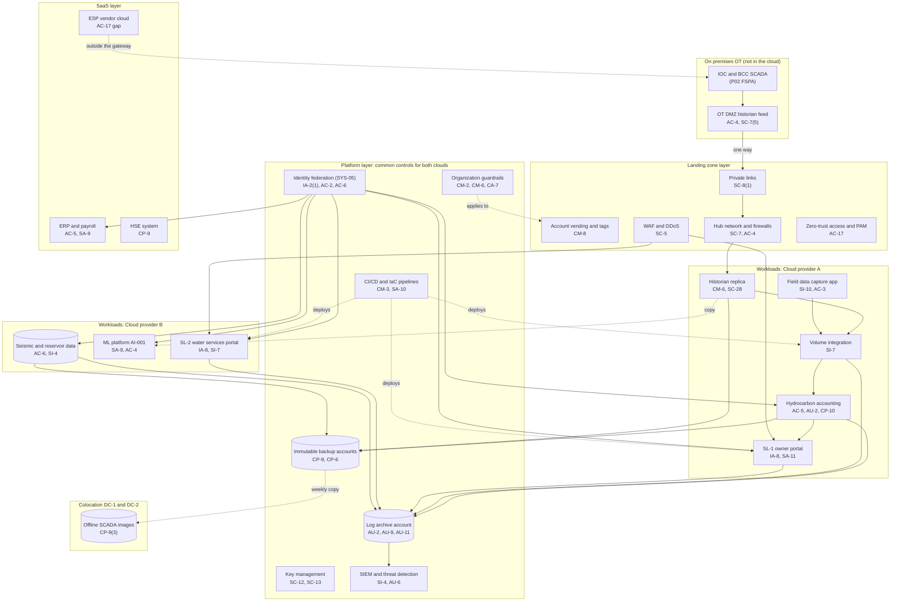

# Cloud Architecture and Control Placement: Cris Santos Company | Mining, Quarrying, and Oil and Gas Extraction | Enterprise

**Organization:** Cris Santos Company, Inc. (publicly traded independent crude oil producer) | **Tier:** Enterprise | **Provider:** Multi-cloud, vendor-agnostic: two public cloud providers (called Cloud provider A and Cloud provider B), two colocation data centers, and SaaS (see section 4)
**Owner:** Director of Cloud Platform Engineering, with the CISO and the Director of OT Security | **Date:** 2026-08-31 | **Related:** FSPA SSP (P02), enterprise BIA (P05)

## 1. Architecture in layers
The estate is organized in four layers plus colocation. Each lower layer provides **common controls** that the layers above inherit, so a workload team configures only what is specific to its system. The SCADA network itself is **not in the cloud**: field control stays on premises at the IOC, BCC, and Florida control room, and the cloud receives copies of OT data one way through the OT DMZ.

| Layer | What it is | Examples | Who runs it |
|---|---|---|---|
| **Platform** | Organization-wide services in both clouds | Guardrails, identity federation, key management, log archive, SIEM feeds, vulnerability and posture management, immutable backup accounts, CI/CD pipelines | Cloud Platform Engineering; Security Operations; Identity team |
| **Landing zone** | The standard account (subscription or project) pattern every workload lands in | Account vending with mandatory tags, hub-and-spoke network with cloud firewalls, private links to the OT DMZ, colocation, and WAN, WAF and DDoS protection, private DNS, zero-trust and PAM access | Cloud Platform Engineering; Network Engineering |
| **Workload** | Systems built or run by the company | Cloud A: historian replica, volume integration, field data capture app, hydrocarbon accounting, SL-1 portal. Cloud B: seismic and reservoir data platform, ML platform, SL-2 water services portal, drilling real-time data | Application teams (for example, the FSPA team under the Vice President, Operations Technology and Automation) |
| **SaaS** | Vendor-operated applications | ERP and payroll, productivity suite, HSE system, fleet telematics, ESP vendor monitoring cloud, rig data aggregation, generative AI assistant | Vendors, with the company's configuration and oversight |
| **Colocation** | DC-1 (Florida) and DC-2 (Texas) | Network core, offline backup copies, offline SCADA images | Network Engineering; Corporate Security and Facilities |

## 2. Diagram

## 3. Responsibility by service model
Sources: SRC-AWS-SRM, SRC-AZURE-SRM, and SRC-GCP-SRM in `00_universal-framework/sources/source-register.csv`. The three published models agree on the split used here, so the design does not depend on which two providers the company uses.

| Service model | Provider | Company (customer) | Shared |
|---|---|---|---|
| IaaS (historian replica, hydrocarbon accounting servers) | Facilities, hosts, hypervisor, physical network | Guest OS, applications, identities, data, network policy | Encryption (provider service, customer keys), logging |
| PaaS (databases, functions, ML service, portals) | Also the platform runtime and its patching | Data, access, configuration, keys, application code | Backups, availability configuration |
| SaaS (ERP, HSE, telematics, ESP vendor cloud) | Also the application | Users, roles, data, oversight of the vendor | Audit review (complementary user entity controls) |
| Colocation | Building, power, cooling, perimeter | Racks, equipment, cage access lists | None |

## 4. Service categories and provider equivalents
| Service category | AWS | Microsoft Azure | Google Cloud |
|---|---|---|---|
| Organization guardrails | AWS Organizations service control policies | Azure Policy with management groups | Organization Policy Service |
| Account vending | AWS Control Tower account factory | Azure landing zone subscription vending | Resource Manager project creation |
| Key management | AWS KMS | Azure Key Vault | Cloud KMS |
| Audit logging | AWS CloudTrail | Azure Monitor activity log | Cloud Audit Logs |
| Threat detection | Amazon GuardDuty | Microsoft Defender for Cloud | Security Command Center |
| Managed relational database | Amazon RDS | Azure SQL Database | Cloud SQL |
| Serverless functions | AWS Lambda | Azure Functions | Cloud Run functions |
| Machine learning platform | Amazon SageMaker AI | Azure Machine Learning | Vertex AI |
| Web application firewall | AWS WAF | Azure Web Application Firewall | Cloud Armor |
| Backup service | AWS Backup | Azure Backup | Backup and DR Service |

This table is for reading provider documentation only. The architecture, control map, and SSP describe service categories.

## 5. Common controls
`cloud-control-map.csv` has **62 rows** across 33 components: Platform 22, Landing zone 7, Workload 20, SaaS 10, Colocation 3. Responsibility: Customer 41, Shared 15, Provider 6.

**28 rows are published as common controls** (`common_control` = Yes) in the enterprise common control catalog. They map to the common control providers in the FSPA SSP (P02 section 10.3): identity (CCP-02), landing zone (CCP-03), security operations (CCP-04), network (CCP-05), and facilities (CCP-07). A workload inherits them by being deployed through account vending, which applies the guardrails, logging, network, key, and backup policies automatically.

**Rules for inheriting:**
1. A workload may claim a common control only if its account was created by account vending and passes the posture baseline.
2. Customer-side identity, data protection, and logging stay explicit at every layer: even a SaaS application has Customer rows for access because those are always the company's responsibility.
3. SaaS rows cite the vendor's SOC report, reviewed by the third-party risk team (P09 evidence map). A SaaS vendor with no SOC report (the ESP vendor cloud, rig data aggregation) is flagged, not inherited.
4. **Nothing in the cloud may hold a path back into the SCADA network.** OT data flows out through the OT DMZ; no cloud workload, ML model, or SaaS connector may write to SCADA or field devices.

## 6. Validation against the FSPA SSP (P02)
Every FSPA component that lives in the cloud appears here with controls from each required family, directly or inherited:
| FSPA component | AC | AU | CM | IA | SC | SI |
|---|---|---|---|---|---|---|
| Historian replica | AC-4 (inherited) | AU-2 (inherited) | CM-6 | IA-2(1) (inherited) | SC-28 | SI-2 |
| Volume integration service | AC-6 (inherited) | AU-2 (inherited) | CM-3 (inherited) | IA-2(1) (inherited) | SC-8(1) (inherited) | SI-7 |
| Field data capture app | AC-3 | AU-2 (inherited) | CM-3 (inherited) | IA-2(1) (inherited) | SC-5 (inherited) | SI-10 |
| Hydrocarbon accounting | AC-5 | AU-2 | CM-2 (inherited) | IA-2(1) (inherited) | SC-28 | SI-7 (P02) |

The on-premises FSPA components (SCADA servers, HMIs, field devices, OT DMZ) are mapped in the P02 control implementation, not here.

## 7. Findings from the mapping
1. **The ESP vendor cloud is a SaaS path into the field.** It sits outside the landing zone and the OT remote access gateway, and its remote setpoint-write feature reaches 260 drives. Fix: disable write now and bring vendor access under the gateway (POAM-002).
2. **One-way OT data flow holds in the cloud.** The posture baseline found no route from any cloud account back to the OT DMZ. The ML platform reads copies of historian data only (P10 AI-001).
3. **Volume integrity is a workload responsibility.** No platform service can reconcile LACT tickets with accounting; the FSPA and accounting teams own SI-7 (POAM-017).
4. **Two clouds, one control set.** Guardrails, logging, and key policies are written once as code and applied to both clouds. Differences are limited to service names (section 4).
5. **SaaS assurance gaps.** The rig data aggregation SaaS and the ESP vendor cloud have no SOC report on file (POAM-016).
