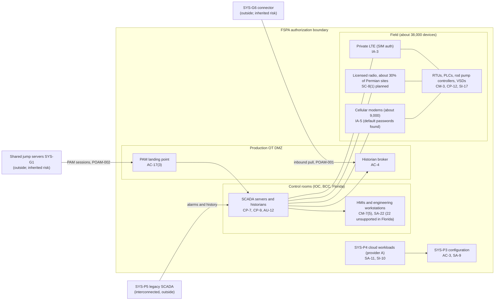

# Cloud Architecture and Control Placement: Cris Santos Company Holdings | Mining, Quarrying, and Oil and Gas Extraction | Multi-Sector

**Organization:** Cris Santos Company Holdings, Inc. | **Tier:** Multi-Sector | **Providers:** two public cloud providers, called provider A and provider B (vendor-agnostic; see section 6)
**Scope:** the shared corporate cloud platform (SYS-G3 landing zones and the SYS-G6 group data platform), the division workloads that run on it, and the paths between the cloud and each division's on-premises OT. The SSP system (P02) is the Field SCADA and Production Accounting System (FSPA).

## 1. Design in one paragraph
Corporate runs one **landing zone** per provider: identity federation from SYS-G1, a hub network, guardrail policies, a central log archive, key management, EDR, and an immutable backup vault. Divisions get their own **accounts** (subscriptions or projects) inside the landing zone and inherit these guardrails. Provider A hosts the corporate hub, the group data platform (SYS-G6), the FSPA cloud workloads (SYS-P4), the seismic platform (SYS-P6), the Power Generation market servers (SYS-E3), and the Crude Logistics shipper services platform (SYS-M3). Provider B hosts disaster recovery replicas and the backup vault. **Control systems are not in the cloud:** the field SCADA (SYS-P1), plant control systems and the Generation Control Center (SYS-E1, SYS-E2), and the pipeline SCADA (SYS-M1) run on premises in each division's OT network behind an OT DMZ. The cloud matters to OT only through the paths that cross those OT DMZs, and those paths are the main finding of this mapping.

## 2. Diagrams
### 2.1 Group landing zone, division workloads, and the paths into OT

```mermaid
flowchart TB
  subgraph Common["Common controls (corporate; inherited by all divisions)"]
    IDP["Group identity platform SYS-G1<br/>IA-2(1), AC-2, AC-6(5)"]
    JMP["Shared OT support jump servers SYS-G1<br/>AC-17 (gap: shared by 3 divisions)"]
    HUB["Landing-zone hub network<br/>SC-7, SC-7(5)"]
    WAN["Private WAN to control centers and plants<br/>SC-8"]
    GRD["Guardrail policy service<br/>CM-6, CM-7"]
    LOG[("Central log archive<br/>AU-9, AU-11")]
    SOC["Group SIEM and SOC SYS-G2<br/>SI-4, AU-6"]
    KMS["Key management<br/>SC-12"]
    BK[("Immutable backup vault, provider B<br/>CP-9, CP-6")]
  end
  subgraph GDP["Group data platform SYS-G6 (provider A)"]
    CON["Historian connector<br/>AC-4, IA-5 (gap: one account, write rights)"]
    ML["ML workspace and model serving<br/>CM-4 (predictive maintenance model)"]
  end
  subgraph PRDC["Production accounts (provider A)"]
    P4["SYS-P4 field data capture and volume integration<br/>SA-11, SI-10"]
    P6["SYS-P6 seismic platform<br/>SC-28"]
  end
  P3["SYS-P3 hydrocarbon accounting SaaS<br/>SA-9, AC-3"]
  subgraph PGC["Power Generation account (provider A)"]
    E3["SYS-E3 market servers<br/>CP-10, SC-7"]
  end
  OEM["Turbine OEM remote service<br/>AC-17 (gap at Plant P3)"]
  subgraph MLC["Crude Logistics accounts (provider A)"]
    M3["SYS-M3 shipper services platform<br/>CM-3, SA-11, SC-28"]
  end
  M4["SYS-M4 telematics SaaS<br/>SA-9"]
  subgraph OT["On-premises OT (not in the cloud)"]
    PDMZ["Production OT DMZ<br/>(IOC, BCC)"]
    EDMZ["Power Generation OT DMZ<br/>(GCC, plants)"]
    MDMZ["Crude Logistics OT DMZ<br/>(PCC)"]
    P5["SYS-P5 legacy SCADA<br/>(no DMZ, no SIEM feed)"]
  end
  VDI["Corporate virtual desktop pool"]
  IDP --> HUB
  HUB --> PRDC
  HUB --> PGC
  HUB --> MLC
  HUB --> GDP
  VDI -->|gap: routes allowed| JMP
  JMP --> PDMZ
  JMP --> EDMZ
  JMP --> MDMZ
  JMP --> P5
  CON -->|pull with read and write| PDMZ
  CON -->|pull with read and write| EDMZ
  CON -->|pull with read and write| MDMZ
  ML -.->|advisory only since 2026-09-03| PDMZ
  WAN --> PDMZ
  WAN --> EDMZ
  WAN --> MDMZ
  P4 --> P3
  OEM --> EDMZ
  M3 --> M4
  PRDC --> LOG
  PGC --> LOG
  MLC --> LOG
  GDP --> LOG
  LOG --> SOC
  PDMZ -.->|OT sensors| SOC
  EDMZ -.->|OT sensors| SOC
  MDMZ -.->|OT sensors| SOC
  PRDC --> BK
  MLC --> BK
  GDP --> BK
  GRD -.-> PRDC
  GRD -.-> PGC
  GRD -.-> MLC
  KMS -.-> P6
  KMS -.-> M3
```

### 2.2 FSPA boundary (SSP system) and its seams

**Target state (POAM-001 and POAM-002, due 2027-03-31 and 2026-12-31):** each OT DMZ pushes historian data outward over a one-way, read-only path to SYS-G6, so no cloud identity can connect into any OT DMZ; each division has its own jump server set, reachable only from privileged access workstations and never from the virtual desktop pool; SYS-P5 is reachable only through the Production jump servers until it migrates.

## 3. Tenancy and identity decision
- **Decision.** All three divisions federate to the group identity platform, SYS-G1, and get their own accounts (subscriptions or projects) inside each landing zone. No division has a separate tenant or identity provider.
- **OT stays out.** Control systems run on premises behind each division's OT DMZ. FSPA controllers sign in to SCADA consoles with named local accounts tied to SYS-G1 identifiers, so control does not depend on SYS-G1 being available.
- **Why.** One identity platform lets group internal audit assess it once. Because OT is not in the cloud, the identity paths that matter are the ones that cross the OT DMZs.
- **What limits blast radius.** Phishing-resistant MFA for administrators, just-in-time PAM elevation with session recording, and quarterly certification. Division administrators cannot delete the write-once log archive. The machine learning workspace has no route to any OT DMZ.
- **Known gaps.** Five jump servers shared by OT support staff of all three divisions are reachable from the virtual desktop pool (POAM-002; target is one jump server set per division). One SYS-G6 service account can write to the historian brokers in all three OT DMZs (POAM-001; target is a one-way, read-only push). One identity platform serves 45,000 users and every division application (GR-08).
- **Cross-division risks:** GR-01, GR-02, GR-03, GR-08, GR-12 in [risk-register.csv](../step-04_P01_risk-register/risk-register.csv).

## 4. Common versus division-specific controls
`cloud-control-map.csv` has 47 rows across 30 components. The `control_scope` column shows who owns each placement:

| Scope | Rows | What it means |
|---|---|---|
| Common (group) | 22 | Provided once by corporate (SYS-G1, SYS-G2, SYS-G3) and inherited by every division account. Listed in the P02 common control catalog |
| Shared system (group data platform) | 5 | Controls of SYS-G6, a shared corporate system that touches all three divisions' OT DMZs |
| Division-specific (Crude Oil Production, FSPA) | 8 | FSPA cloud workloads, tablets, accounting SaaS, seismic platform |
| Division-specific (Power Generation) | 4 | Market servers, bidding SaaS, OEM remote service |
| Division-specific (Crude Logistics) | 8 | Shipper services platform, run ticket app, telematics |

| Responsibility | Rows |
|---|---|
| Customer (the group or a division) | 30 |
| Shared (provider and group) | 14 |
| Provider | 3 |

**Rule of thumb.** Identity, network guardrails, logging, keys, backups, and EDR are **common**: a division cannot opt out, only request an exception under POL-01. Anything that crosses into OT (the jump servers, the historian connector, vendor remote access) is also governed by the group OT DMZ standard, owned by the Group OT Security Director, because a weakness there affects every division at once. Application behavior and customer-facing identity are **division-specific**, because they depend on each division's regulators and customers.

## 5. Layers
| Layer | Common components | Division components | Key controls | Responsibility |
|---|---|---|---|---|
| Identity | SYS-G1, PAM, shared jump servers, cloud IAM | Shipper portal identity; field tablets | AC-2, AC-3, AC-6(5), AC-17, IA-2(1) | Customer (configuration); vendor (service) |
| Network | Hub network, private WAN | SYS-E3 spoke; shipper portal web application firewall | SC-7, SC-7(5), SC-8, SC-5 | Customer, with provider DDoS protection shared |
| Compute | EDR, guardrails | SYS-P4 services, SYS-M3 containers, ML workspace | SI-3, CM-3, CM-4, CM-6, SA-11 | Customer (guest OS, containers, code, models) |
| Data | Keys, backup vault | Historian connector, data lake, shipper database, seismic data | AC-4, SC-12, SC-28, CP-9, CP-6, CP-10 | Shared: provider encrypts; group owns keys, flows, and retention |
| Logging and monitoring | Log archive, SIEM, OT sensor feeds | Application logs; seismic download alerts | AU-6, AU-9, AU-11, SI-4 | Shared: providers generate platform logs; group retains and reviews |
| SaaS dependencies | Identity and SIEM vendors | Hydrocarbon accounting, bidding, telematics, turbine OEM service | SA-9, AC-17 | Provider for the service; customer for use and oversight |
| Physical | Provider data centers | none in the cloud (control rooms and plants are covered in the division plans) | PE-3, MP-6 | Provider (inherited) |

## 6. Service categories and provider equivalents
The design does not depend on a provider. This table gives each provider's name for each service category, for reading its shared responsibility documentation.

| Service category | AWS | Microsoft Azure | Google Cloud |
|---|---|---|---|
| Account structure and guardrails | AWS Organizations with service control policies | Management groups with Azure Policy | Resource hierarchy with Organization Policy |
| Hub network and private connectivity | Transit Gateway; Direct Connect | Virtual WAN; ExpressRoute | Network Connectivity Center; Cloud Interconnect |
| Object storage (data lake) | Amazon S3 | Azure Blob Storage / Data Lake Storage | Cloud Storage |
| Managed containers | Amazon EKS | Azure Kubernetes Service | Google Kubernetes Engine |
| Machine learning workspace | Amazon SageMaker | Azure Machine Learning | Vertex AI |
| Key management | AWS KMS | Azure Key Vault | Cloud KMS |
| Audit logging | AWS CloudTrail | Azure Monitor activity log | Cloud Audit Logs |
| Backup with immutability | AWS Backup (vault lock) | Azure Backup (immutable vault) | Backup and DR Service |

Shared responsibility sources: SRC-AWS-SRM, SRC-AZURE-SRM, SRC-GCP-SRM in `00_universal-framework/sources/source-register.csv`. All three agree on the split used here: for IaaS the provider owns facilities, hosts, and virtualization; for PaaS the provider also owns the runtime; for SaaS the provider owns the application. The customer always keeps identities, access decisions, data classification, and data.

## 7. Findings from the mapping
1. **The cloud reaches into OT in two places, and both are shared.** The SYS-G6 historian connector pulls from all three OT DMZs with one account that can write (AC-4; P01 GR-01; POAM-001), and the shared jump servers reach all three OT DMZs from a pool that the corporate virtual desktops can route to (AC-17; GR-02; POAM-002). Each is acceptable for one division; shared across three, a single compromise crosses every division's IT/OT boundary. Both are the spread path in the P08 scenario.
2. **A model wrote to field equipment through the cloud.** The predictive maintenance model's speed changes travelled from the ML workspace through the SCADA interface to 640 rod pump controllers (CM-4; P10; POAM-021). It is now advisory only. A write path from the cloud to OT needs the same safety management of change as any field logic change.
3. **Vendor remote access is a cloud-to-OT path too.** The turbine OEM's remote service at Plant P3 is a standing vendor path that the CIP-003-9 low impact plan does not yet monitor for malicious communications (POAM-013).
4. **Common controls are strong and reused.** One identity platform, one SIEM, one backup design, one guardrail set. This is what lets group internal audit assess them once (P07). The weak link is documentation of inheritance for Crude Logistics (P02, POAM-019), not the controls themselves.
5. **Owner data leaves the SaaS boundary.** SYS-P3 is well controlled by its vendor, but monthly exports to a finance file share move about 190,000 owners' data into a far less controlled place (AC-3; POAM-023).
