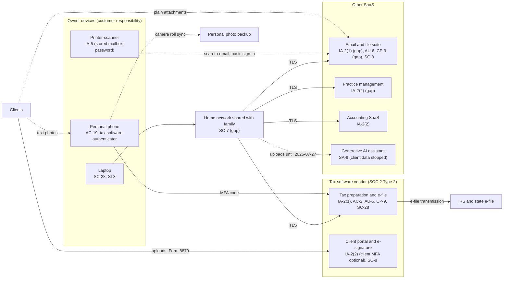

# SaaS Architecture and Control Placement: Cris Santos Company | Professional, Scientific, and Technical Services | Sole Proprietorship

**Organization:** Cris Santos Company (CPA and tax preparation practice) | **Tier:** Sole Proprietorship | **Provider:** SaaS only (no IaaS or PaaS)
**System:** Tax Practice Systems Profile (TPSP), as defined in the system profile (P02) | **Mapped:** 2026-07-29 with the IT consultant; adopted 2026-08-31

## 1. Diagram
Control IDs on each node are the ones in `cloud-control-map.csv`. Dashed lines are flows that carry client information without the protection the firm's policy now requires.

## 2. Layers
| Layer | Components | Key controls | Responsibility |
|---|---|---|---|
| Identity | Tax software, portal, email suite (also the admin account), practice management, accounting logins | IA-2(1), IA-2(2), AC-2, IA-5 | Customer configures; vendors provide MFA |
| Data | Returns and portal documents, mailbox attachments, client folders, laptop downloads, phone photos, AI chat history | SC-28, SC-8, CP-9, SA-9 | Vendor protects data inside its service; customer decides where client data goes and how it travels |
| Endpoints | Laptop, printer-scanner, phone | SC-28, SI-3, IA-5, AC-19 | Customer |
| Network | Home network and router | SC-7 | Customer (router supplied by the internet provider) |
| Logging | Tax software activity log, email sign-in history and mailbox rules | AU-2 (vendors), AU-6 (customer) | Shared: vendors record, customer reviews |
| SaaS applications and hosting | Tax software, portal, suite, and other platforms | Inherited (AU-2, CP-9 and SC-28 for the tax software, PE family) | Provider |

## 3. Shared responsibility for SaaS
All three major cloud providers' shared responsibility models (SRC-AWS-SRM, SRC-AZURE-SRM, SRC-GCP-SRM) agree on the SaaS split: the provider runs the application, the platform, and the facilities; **the customer always keeps its identities and accounts, its data, and its devices.** That is why 14 of the 19 rows in the control map are the owner's alone, 3 are shared, and only 2 (the tax software vendor's backups and encryption at rest) are the provider's. The vendor's SOC 2 report covers none of the customer rows. No IaaS equivalents table is needed, because the practice runs no infrastructure.

## 4. Findings from the mapping
1. **The most exposed identity is the mailbox, not the tax software.** The tax software enforces MFA, but the mailbox holds years of client attachments, is the suite administrator, and has no MFA. MFA was turned off for a printer-scanner convenience (`../00_company-facts.md` section 7). Tracked as P01 R-001.
2. **Client data leaves the protected path at the edges.** Plain email attachments, text-message photos synced to a personal photo backup, and uploads to the AI assistant all sit outside the portal the firm already pays for (R-004, R-006).
3. **One password opens two services.** The email password is reused on the practice management SaaS and stored in the printer-scanner (IA-5).
4. **The owner's phone is part of the security boundary.** It holds the tax software's only second factor and client document photos. Losing it is both a disclosure risk (R-014) and a lockout risk in filing season (R-009).
5. **Inherited tax software controls depend on the owner's own controls.** The vendor's SOC 2 report lists complementary user entity controls (remove users promptly, protect MFA devices, review activity, report suspected compromise) that the owner did not run before 2026 (P09).
