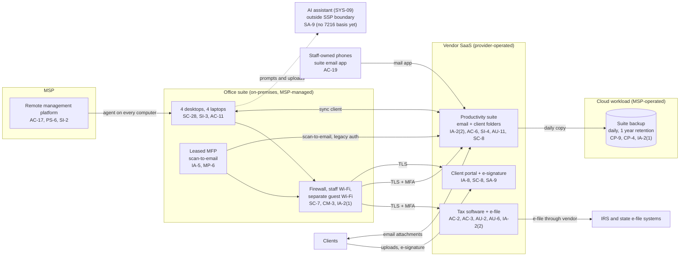

# Cloud Architecture and Control Placement: Cris Santos Company | Professional, Scientific, and Technical Services | Micro

**Organization:** Cris Santos Company, LLC (CPA and tax preparation firm) | **Tier:** Micro | **Provider:** Vendor-agnostic SaaS (see section 3)
**System:** Client Tax Platform (CTP), as defined in the SSP (P02) | **Prepared:** 2026-07-17 by the Office Manager (Qualified Individual) with the MSP lead technician; updated 2026-08-05 with P07 findings | **Approved:** Owner CPA, 2026-08-31

## 1. Diagram
The firm runs no servers and no IaaS tenant. Its "cloud" is a set of SaaS services plus one cloud workload that the MSP operates for it: the SaaS-to-SaaS backup of the productivity suite (SYS-08).

## 2. Layers and who is responsible
| Layer | Components | Key controls | Customer (firm) | MSP (on the firm's behalf) | Provider (SaaS vendor) |
|---|---|---|---|---|---|
| Identity | Tax software, portal, suite, and backup accounts; firewall and MFP logins | AC-2, AC-6, IA-2(1), IA-2(2), IA-5, IA-8 | Decides who gets access; removes leavers; turns on number matching; requires client MFA | Creates and disables suite accounts; holds backup and firewall admin logins | Runs sign-in, MFA, and e-signature identity checks |
| Network | Firewall, Wi-Fi, internet line | SC-7, CM-3 | Approves changes | Configures, patches, and monitors | Not applicable |
| Endpoints | 8 computers, MFP, staff phones | SC-28, SI-3, SI-2, AC-11, AC-19, MP-6 | Approves exceptions; keeps the inventory; plans the MFP drive wipe | Encryption, antivirus, patching, screen lock | Not applicable |
| SaaS applications | Tax software, portal, suite | AC-3, AU-2, SC-8, SI-4 | Roles, sharing, alert policies, portal-only delivery of returns | Suite settings on request | Application, platform, data centers |
| Data | Client folders, backup copies, scans on the MFP | CP-9, CP-4, SC-28, SI-12 | Decides retention, disposal, and restore testing | Operates the backup and runs restore tests | Encrypts and backs up its own platform |
| Logging | Tax software audit trail, suite sign-in and mailbox logs, firewall logs | AU-2, AU-6, AU-11 | **Reviews logs monthly (gap today)** | Keeps firewall logs; forwards alerts | Generates and stores logs |
| Vendor governance | Contracts, SOC 2 review, MSP review, IRC 7216 notices | SA-9, PS-6 | Reviews SOC 2 and MSP evidence; gives the written 7216 notice; sets contract terms | Holds the backup vendor relationship | Provides SOC 2 reports and terms |

**The MSP is not a cloud provider in the shared responsibility sense.** It performs customer-side duties for the firm. Anything marked "Customer (performed by MSP)" in `cloud-control-map.csv` remains the firm's responsibility under the Safeguards Rule. The MSP is a service provider the firm must oversee (16 CFR 314.4(f)), and because its technicians can see client files, it is also a contractor that must receive the written IRC 6713 and 7216 notice (26 CFR 301.7216-2(d)(2)).

## 3. Service categories and provider equivalents
The design is vendor-agnostic. The shared responsibility split for SaaS is the same in all three major cloud providers' models: the provider runs the application, platform, and infrastructure; the customer keeps identities, access, data, and devices (SRC-AWS-SRM, SRC-AZURE-SRM, SRC-GCP-SRM in `00_universal-framework/sources/source-register.csv`). For the firm's vendors, a SOC 2 report or vendor security documentation is the evidence of the provider side.

| Service category used | What it is here | Equivalent category in the large cloud providers (for reading their documentation) |
|---|---|---|
| Line-of-business SaaS | Tax software with e-file; client portal with e-signature | Industry SaaS built on any provider |
| Productivity suite | Email, calendar, file storage, sync client | Productivity and collaboration SaaS |
| SaaS-to-SaaS backup | Daily copy of mailboxes and cloud storage | Backup service or third-party SaaS backup |
| Remote monitoring and management | MSP device management | Device management SaaS |
| Generative AI assistant | Business-plan AI chat and document tool (outside the boundary) | Managed generative AI service |

## 4. Findings from the mapping
1. **Email is the soft layer (IA-2(2), SI-4, AU-11).** The tax software is protected by vendor-enforced MFA, but the suite holds the same client documents in mailboxes and folders, with push MFA, no alerts, and logs that expire in under a year. A BEC attacker gets everything a tax thief needs without touching the tax software. Tracked as P01 R-001 and P07 POAM-002 and POAM-005.
2. **The MFP opens a back door (IA-2(2), IA-5).** P07 testing found that scan-to-email uses a "scanner" mailbox with an app password over legacy authentication, which MFA does not cover, and that the MFP's administration page still had the default password. Fix: switch scan-to-email to a send-only connector or scan-to-portal, block legacy authentication, and change the password (P01 R-024; POAM-002).
3. **MSP-held administrator logins have no MFA (IA-2(1)).** The backup console and the firewall management login use passwords only. One stolen MSP password could delete the backups. Fix: MFA on both and named MSP accounts by 2026-09-30 (POAM-003).
4. **Sync is not backup, and backup is not proven (CP-9, CP-4).** The desktops sync the client folders, so ransomware on one desktop spreads encrypted files to cloud storage. SYS-08 keeps a year of daily copies, but nobody has restored more than a single file. Fix: confirm immutable retention, run a full restore test by 2026-09-30, and repeat quarterly (P01 R-022; POAM-008, POAM-009).
5. **The MSP's reach is total, and unnotified (AC-17, PS-6).** The remote management platform can run commands on every computer and its technicians can open client files, yet the contract has no security terms and the technicians never received the IRC 7216 notice. Fix: contract amendment, written notice, and an annual MSP review (P01 R-006, R-025).
6. **The AI assistant sits outside the boundary on purpose.** It holds client content today without an IRC 7216 basis. It is mapped here only to show the SA-9 gap and enters the boundary only after the P10 conditions are met.
