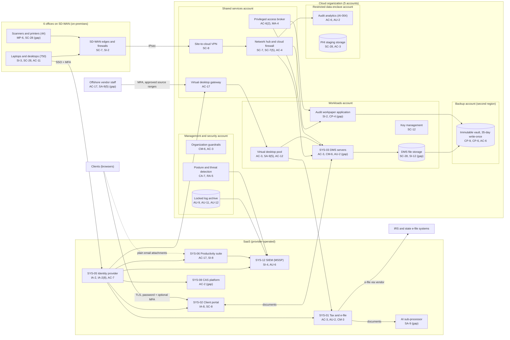

# Cloud Architecture and Control Placement: Cris Santos Company | Professional, Scientific, and Technical Services | Mid-Market

**Organization:** Cris Santos Company, Inc. | **Tier:** Mid-Market | **Provider:** Vendor-agnostic public cloud (see section 4), plus SaaS
**System:** Tax and Client Data Platform (TCDP), as defined in the SSP (P02) | **Prepared:** 2026-07-31 by the Chief Information Officer's infrastructure team and the GRC Manager; updated 2026-09-22 with P07 results
**Control map:** `cloud-control-map.csv` (55 rows, 26 components)

## 1. Diagram

## 2. Landing zone design
The landing zone separates duties across 5 accounts (subscriptions or projects, depending on the provider) under one cloud organization. Each account limits what an attacker can do from any other.

| Account | Purpose | Who administers | Key design decisions |
|---|---|---|---|
| **Management and security** | Organization root, guardrails, posture management and threat detection, locked log archive | Director of Information Security and 1 security engineer | No workloads. Root credentials sealed. Guardrails apply to every other account and cannot be changed from them |
| **Shared services** | Network hub, cloud firewall, site-to-cloud VPN, virtual desktop gateway, privileged access broker, patch and image service | Chief Information Officer's infrastructure team | All traffic between offices, workloads, the enclave, and the internet passes the hub |
| **Workloads** | DMS servers and storage, virtual desktop pool (offshore vendor and remote seasonal staff), audit workpaper application, key management | Infrastructure team; the Attest Firm owns the workpaper application | Separate subnets per workload. No internet ingress. Company-managed keys |
| **Restricted data enclave** | Audit analytics (AI-004) on client general ledger extracts; staging for PHI from health care engagements | 2 named administrators; 22 named assurance analysts | Built in 2026. No internet egress except the vendor update endpoint. Separate keys. PHI has not yet been moved here (gap 13) |
| **Backup** | Immutable vault with 35-day write-once retention in a second region | 2 named backup administrators | Separate credentials not federated to daily accounts. Backups are pulled by a cross-account role that can write but not delete |

## 3. Layers and shared responsibility per service
| Layer | Components | Key controls | Service model | Responsibility |
|---|---|---|---|---|
| Identity | Cloud federation, break-glass accounts, privileged access broker, SYS-05 | IA-2, IA-2(1), IA-2(8), AC-2, AC-6(2), AC-6(5), AC-7 | PaaS / SaaS | Customer configures identities, roles, MFA, and reviews; provider runs the identity services |
| Governance | Organization guardrails | CM-6, AC-3 | PaaS | Shared: provider enforces; customer defines the policies |
| Network | Hub, cloud firewall, VPN, virtual desktop gateway | SC-7, SC-7(5), SC-8, AC-4, AC-17, SI-4 | PaaS | Customer designs routes, rules, and segmentation; provider runs the gateway services |
| Compute | DMS servers, virtual desktop pool, workpaper application, analytics servers | CM-6, SI-2, SI-3, AC-3, AC-12, AU-2, CP-10 | IaaS / PaaS | Customer (guest OS, applications, EDR, desktop policy); provider (hosts, hypervisor, and the managed desktop service) |
| Data | DMS storage, PHI staging, keys, backups | SC-28, SC-12, SI-12, CP-9, CP-6, AC-6 | PaaS | Shared: provider encrypts and operates storage; customer controls keys, access, retention, isolation, and restore testing |
| Logging and monitoring | Posture service, log archive, SIEM | CA-7, RA-5, AU-9, AU-11, AU-12, SI-4 | PaaS / SaaS | Shared: provider generates logs and detections; customer enables, retains, forwards, and acts on them; MSSP monitors |
| SaaS applications | Tax software and its AI sub-processor, portal, productivity suite, CAS platform | AC-3, AU-2, CM-3, SA-9, IA-8, SC-8, AC-17, SI-8, AC-2 | SaaS | Provider runs the application and infrastructure; customer keeps users, roles, settings (MFA, forwarding, AI features), audit review, and data |
| Physical | Provider data centers | PE-3 | All | Provider (inherited, evidenced by SOC 2 reports) |

**Responsibility counts in `cloud-control-map.csv`:** 31 Customer, 20 Shared, 4 Provider. By service model: 12 IaaS, 30 PaaS, and 13 SaaS rows. Across every service model the customer side is the same: identity, data protection, configuration choices, and logging.

## 4. Service categories and provider equivalents
The design does not depend on a particular provider. This table gives each provider's name for each service category, for reading its shared responsibility documentation (SRC-AWS-SRM, SRC-AZURE-SRM, and SRC-GCP-SRM in `00_universal-framework/sources/source-register.csv`).

| Service category | AWS | Microsoft Azure | Google Cloud |
|---|---|---|---|
| Multi-account organization and guardrails | AWS Organizations, service control policies | Management groups, Azure Policy | Resource Manager folders, organization policies |
| Account, subscription, or project | Account | Subscription | Project |
| Cloud identity federation | IAM Identity Center | Microsoft Entra ID with Azure RBAC | Cloud Identity with IAM |
| Network hub | Transit Gateway | Virtual WAN hub or hub virtual network | Network Connectivity Center or shared VPC |
| Cloud firewall | AWS Network Firewall | Azure Firewall | Cloud NGFW |
| Site-to-cloud VPN | Site-to-Site VPN | VPN Gateway | Cloud VPN |
| Managed virtual desktops | Amazon WorkSpaces | Azure Virtual Desktop | Partner virtual desktop services on Compute Engine |
| Virtual machines | EC2 | Virtual Machines | Compute Engine |
| Managed file storage | Amazon FSx | Azure Files | Filestore |
| Object storage with write-once retention | S3 with Object Lock | Blob Storage with immutability policies | Cloud Storage with bucket lock |
| Backup service | AWS Backup (vault lock) | Azure Backup (immutable vault) | Backup and DR Service |
| Key management | AWS KMS | Azure Key Vault | Cloud KMS |
| Audit logging | CloudTrail | Azure Monitor activity log | Cloud Audit Logs |
| Posture and threat detection | Security Hub, GuardDuty | Microsoft Defender for Cloud | Security Command Center |

**Service model split used here (all three providers agree):**
- **IaaS** (virtual machines): the provider owns facilities, hosts, and virtualization. The customer owns the guest OS, applications, network configuration, identities, and data.
- **PaaS** (managed desktops, file storage, backup, key service, firewall, VPN): the provider also owns the platform software and its patching. The customer owns access, keys, data, and configuration.
- **SaaS** (tax software, portal, productivity suite, identity provider, CAS platform, SIEM): the provider also owns the application. The customer keeps identities, roles, settings, audit review, and data.

## 5. Findings from the mapping
1. **The offshore pool is a data-location control, not only an access control (SA-9(5), AC-4).** Hosting the virtual desktops in U.S. regions keeps the data in the United States, but offshore staff still view scanned documents that show SSNs, and the desktop subnet can reach the whole DMS. Under 26 CFR 301.7216-3(b)(4), SSNs of Form 1040 filers must be masked before disclosure to a preparer outside the United States unless the IRS-defined safeguards are met. Fix: an offshore-only DMS view of masked images and a route limited to assigned returns (P01 R-011; P03 G-050).
2. **SaaS settings are the Company's responsibility (CM-3, IA-8, AC-17).** Optional client MFA, mailbox access from unmanaged devices, and the AI drafting feature were all Company choices in vendor-run services. Fix: SaaS baselines under STD-01 and change control for tenant settings (P01 R-006, R-029).
3. **Application logs stop at the vendor (AU-2, SI-4).** The tax software, portal, DMS, and CAS platform keep their own logs, and none reach the SIEM. Fix: onboard all four by 2027-01-15 (P01 R-005, R-030).
4. **The CAS platform sits partly outside identity (AC-2).** Local accounts in the payroll and bill-pay services bypass the identity provider and its leaver process (P07 finding; P01 R-051).
5. **Backups are the strongest control (CP-9, CP-6).** They are isolated in a separate account and region, write-once, and under separate credentials. Recovery is proven only for the DMS. The workpaper application restore test is due 2026-11-17 (P01 R-018).
6. **The enclave exists but holds no PHI yet.** It was built in 2026 for audit analytics. Moving PHI from the general DMS is due 2027-03-31 (P01 R-022).
7. **Boundary check.** Every in-scope component in the SSP (P02 section 9) appears in the diagram. Every cloud account has rows in the control map with controls from at least 2 of the AC, AU, CM, IA, SC, and SI families. Every SaaS component relies on a vendor SOC 2 report, reviewed in P09 `vendor-soc2-review.csv`.
