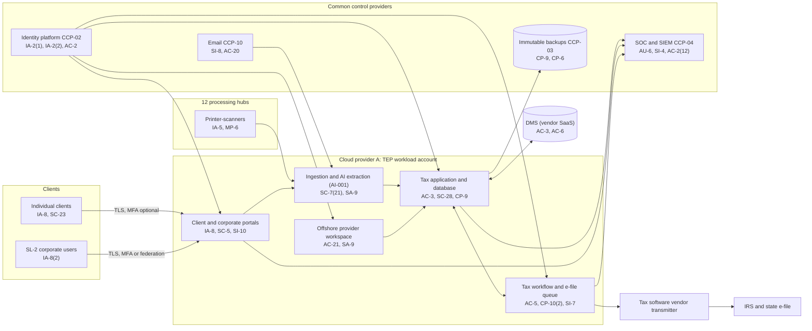

# System Security Plan: Tax Engagement Platform (TEP)

**Organization:** Cris Santos Company, LLP (national CPA and tax firm; privately owned by its partners) | **Tier:** Enterprise | **Vertical:** Professional, Scientific, and Technical Services
**Outline:** NIST SP 800-18 Rev. 2, System Security Plan Outline Example (June 2026) | **Version:** 3.0, 2026-09-14

## 1. System Name and Identifier
Tax Engagement Platform (**TEP**), identifier CSC-SYS-TEP-001. Tier-1 system in the enterprise application inventory. The TEP is the firm's implementation of the registry's "tax preparation software and client document portal," scoped for a firm of this size.

## 2. System Overview
The TEP supports the whole tax practice: individual and private client returns, business and international returns, and the tax compliance outsourcing service line (SL-2). It receives client source documents through the client document portal, email intake, and mail scanning at 12 processing hubs; extracts data with an AI-assisted pipeline (AI-001); supports preparation and review in the commercial tax application; collects electronic signatures on Forms 8879 and 8878, engagement letters, and IRC 7216 consents; and releases returns and extensions to the tax software vendor's transmitter for e-file. Volume: about 420,000 individual and 96,000 business returns a year, with peak days above 18,000 e-files.

**Why confidentiality matters most.** The TEP holds names, SSNs, income, bank account numbers, and identity documents for about 2.9 million consumers. Stolen tax documents are used for refund fraud and identity theft, and unauthorized disclosure is also a crime for preparers under IRC 7216. A breach would trigger FTC notice (16 CFR 314.4(j)), IRS reporting (Pub. 1345), and the breach laws of every state where affected individuals reside.

**Major components:**
- Tax preparation and e-file software (commercial, licensed), customer-managed on Cloud provider A virtual machines with its database on the provider's managed relational database service
- Client document portal and corporate tax portal (firm-built web application on managed containers behind the landing zone web application firewall)
- Tax workflow and e-file queue (firm-built services on managed containers)
- Document management system connector and the DMS tax repositories (DMS is vendor SaaS)
- Document ingestion and AI extraction pipeline (firm-built orchestration calling a cloud AI service under contract, U.S.-only processing)
- Offshore provider secure workspace: virtual desktops in the firm's Cloud provider A account, used by the offshore tax outsourcing provider's staff
- Printer-scanners (about 140) at the 12 processing hubs

Users: about 6,300 workforce TEP accounts in season (preparers, reviewers, intake and e-file staff), about 410 offshore provider accounts, and about 760,000 client portal accounts (including about 9,400 SL-2 corporate users).

## 3. Laws, Regulations, and Policies Affecting the System
| ID | Requirement | Citation | How it affects the TEP |
|---|---|---|---|
| N54-R01 | FTC Safeguards Rule | 16 CFR Part 314 | Every 314.4 element applies; the TEP holds most of the firm's customer information |
| N54-R02 | IRC 7216 preparer disclosure and use limits | 26 U.S.C. 7216; 26 CFR 301.7216-1 to -3 | Every disclosure outside the firm needs a 301.7216-2 permission or a prior written consent; SSNs of Form 1040 filers may not go to preparers outside the United States except under IRS-defined safeguards (301.7216-3(b)(4)) |
| N54-R03 | IRS e-file and WISP expectations | IRS Pub. 1345 (Rev. 12-2025); Pub. 4557 (Rev. 6-2024); Pub. 5708 (Rev. 8-2024) | Next-business-day security incident reporting; e-signature identity verification; Forms 8878 and 8879 retention |
| State | State breach and data security laws | Each state where affected individuals reside (Florida worked example: Fla. Stat. 501.171) | Reasonable security measures, disposal, third-party agent notice, and breach notification (P08) |
| Contract | SL-2 client agreements; SOC 2 readiness | P09 | Availability, confidentiality, and privacy commitments to corporate clients and their assignees |
| Internal | POL-01 to POL-05 and standards | P06 | Enterprise policy hierarchy |

Not applicable to the TEP: N54-R04 (FAR 52.204-21 applies to the government services practice's environment, not the TEP), N54-R05 (no DoD work), N54-R06 (PHI is held in the audit platform and consulting data rooms, not the TEP), N54-R07 (no law practice), N54-R08 (professional standard, noted in P03), N54-R09 (CIRCIA is proposed only).

## 4. System Status
### 4.1 System Security Plan Approval
Prepared by the Director of Tax Technology and the GRC team. Reviewed by the CISO (Qualified Individual), the Chief Privacy Officer, and the National Tax Leader. Approved by the Chief Operating Officer on 2026-09-14.
### 4.2 System Authorization Decision
The firm is not a federal agency, so there is no formal ATO. The equivalent internal decision:
- **Authorizing official equivalent:** Chief Operating Officer, with the CISO's recommendation.
- **Decision (2026-09-14):** continue operation with conditions, based on the Internal Audit assessment (P07) and the risk register (P01).
- **Conditions:** before the 2027 filing season, deploy phishing-resistant MFA and device-bound sessions for tax staff (POAM-001 by 2027-01-15), make client MFA mandatory (POAM-002 by 2027-01-15), close the offshore consent and masking exceptions (POAM-008 by 2026-12-31), and rerun the DR test to prove the 8-hour RTO (POAM-011 by 2027-01-08).
- **Reauthorization:** annually, or after a major change (for example, the tax application version upgrade planned for 2027-06).
### 4.3 System Operational Status
Operational. Planned major modifications: isolation of the AI extraction pipeline (SC-7(21)) and phishing-resistant authentication for all tax staff (IA-2(2)).

## 5. Role Identification and Responsible Personnel
| Role | Title | Responsibility |
|---|---|---|
| System owner | National Tax Leader (Vice Chair, Tax) | Accountable for the TEP and SL-2; approves access roles; owns the IRC 7216 consent program |
| Authorizing official (equivalent) | Chief Operating Officer | Accepts residual risk to operate |
| System administrator | Director of Tax Technology | Day-to-day administration, release management, client portal |
| e-file program | Director of e-file Operations | EFIN and Responsible Official coordination; e-signature and consent workflows; IRS incident reporting |
| Information security | CISO (Qualified Individual); Director of Security Operations | Program oversight; SOC monitoring; incident response |
| Privacy | Chief Privacy Officer | Data inventory, retention, breach determinations with the General Counsel |
| Common control providers | See section 10.3 | Operate inherited controls |
| Independent assessor | Chief Audit Executive (Internal Audit) | Annual assessment (P07) |

## 6. System Information Types and System Categorization
Information types are modeled on NIST SP 800-60 Vol. 2 Rev. 1 categories, using the firm's own type names. Impact levels follow FIPS 199.

| Information type | Confidentiality | Integrity | Availability | Rationale |
|---|---|---|---|---|
| Taxpayer return information and customer information (source documents, returns, SSNs, bank accounts) | **High (treated)** | Moderate | Moderate | A mass disclosure could cause severe harm through identity theft and refund fraud, and disclosure is a criminal matter for preparers (IRC 7216). Errors in returns are caught by review and acknowledgments, so integrity is Moderate. Deadline workarounds exist, so availability stays Moderate (P05 BP-01, BP-02: MTD 24 h, RTO 8 h) |
| Client account and consent records (portal identities, e-signatures, IRC 7216 consents) | Moderate | Moderate | Moderate | Consents must be provable; identity records support e-signature |
| Information security (audit logs, keys, credentials) | Moderate | Moderate | Moderate | Protects the evidence for investigations and notices |
| **TEP category** | **Moderate baseline, confidentiality supplemented** | **Moderate** | **Moderate** | See the decision below |

**Categorization decision.** Under a strict FIPS 199 high-water mark, treating confidentiality at High would make the whole system High. The firm is not a federal agency and uses FIPS 199 as a model. The Audit and Risk Committee approved this tailoring on 2026-09-15, after the CISO approved it provisionally on 2026-09-14:
- The TEP uses the **SP 800-53B Moderate baseline**.
- It adds **10 High-baseline controls** that protect confidentiality: AC-2(12), AU-6(5), CA-8, CA-8(1), MP-6(1), PS-4(2), RA-5(4), SC-7(21), SI-4(12), SI-4(20). CA-8 and CA-8(1) also carry the annual penetration test required by 16 CFR 314.4(d)(2)(i).
- The decision is reviewed annually. If the confidentiality POA&M items (POAM-001, POAM-003, POAM-004, POAM-008) are not closed by 2027-06-30, the CISO will recommend full High categorization.

**Documented controls.** `control-implementation.csv` documents **248 controls**: 238 from the Moderate baseline and 10 High-baseline supplements. The other 49 Moderate-baseline controls (mostly physical and environmental protection, media transport, maintenance tools, personnel, acquisition, and supply chain enhancements) are fully inherited from the common control catalog (CCP-03, CCP-07, CCP-08, and CCP-09; section 10.3) and are listed there rather than repeated here.

## 7. Authorization Boundary Description
**Inside the boundary:** the tax application servers and database, the client and corporate tax portals, the tax workflow and e-file queue, the DMS connector and DMS tax repositories, the ingestion and AI extraction pipeline (orchestration, queues, and the contracted AI service endpoint configuration), the offshore provider secure workspace, and the processing hub printer-scanners.

**Outside the boundary (common control providers and interconnected systems):**
- Landing zone services (network hub, key management, log archive, backup accounts, standby region): CCP-03
- Identity platform (SYS-04): CCP-02
- SOC, SIEM, EDR, scanners: CCP-04
- Productivity suite and email filtering (SYS-05): CCP-10
- Tax software vendor's transmitter, IRS and state e-file systems, identity verification service, AI model provider, offshore provider's own network, AF-05 and AF-06 legacy systems

The enterprise multi-cloud diagram is in P04 `cloud-architecture.md`.

## 8. Information Exchanges Summary
| Connected system / party | Direction | Data | Agreement |
|---|---|---|---|
| Tax software vendor's transmitter (Authorized IRS e-file Provider) | Outbound returns; inbound acknowledgments (TLS) | Federal and state returns and extensions | License and transmission agreement; vendor is a U.S. preparer under 301.7216-2(d)(1) |
| AI model provider (cloud AI service) | Outbound document images; inbound extracted fields | Source documents with SSNs and income data | Contract with U.S.-only processing, no training, no human review of content, 30-day deletion (P10) |
| Offshore tax outsourcing provider | Remote sessions into the firm's virtual desktops | Business return data, masked SSNs, with taxpayer consent | Services agreement with IRC 7216 terms; **consent and masking exceptions (POAM-008)** |
| Identity verification service | Outbound identity attributes; inbound result | Client identity data for e-signature | Contract; **no SOC report reviewed (POAM-015)** |
| DMS vendor | Bidirectional (API over TLS) | Source documents, workpapers, returns | Enterprise agreement; SOC 2 Type 2 reviewed 2026-03 |
| Productivity suite (email intake mailbox) | Inbound | Client-emailed documents | Enterprise agreement; SOC 2 Type 2 reviewed 2026-04 |
| SL-2 corporate clients' identity providers | Inbound federation | Authentication assertions | Client agreements |
| Lenders and other third parties named in consents | Outbound (portal release) | Returns released with signed IRC 7216 consent | Consent workflow (AC-21) |

## 9. System Component Inventory
| Component | Type | Location / provider | Owner |
|---|---|---|---|
| Tax application servers (12) | IaaS virtual machines | Cloud provider A, primary region; standby in second region | Director of Tax Technology |
| Tax application database | Managed relational database (PaaS) | Cloud provider A | Director of Tax Technology |
| Client and corporate portals | Web application on managed containers | Cloud provider A | Director of Tax Technology |
| Tax workflow and e-file queue | Services on managed containers | Cloud provider A | Director of Tax Technology |
| Ingestion and AI extraction pipeline | Managed queues, functions, and a contracted cloud AI service | Cloud provider A | Director of Tax Technology |
| Offshore provider workspace (about 410 virtual desktops) | Virtual desktop service (PaaS) | Cloud provider A | Director of Tax Technology |
| DMS tax repositories | Vendor SaaS | DMS vendor | National Tax Leader (content); Director of Tax Technology (configuration) |
| Printer-scanners (about 140) | Office devices | 12 processing hubs | Director of Endpoint Engineering |

## 10. Control Implementation Details
### 10.1 Control implementation status
See `control-implementation.csv` (248 controls).

| Status | Count |
|---|---|
| Implemented | 213 |
| Partially implemented | 31 |
| Planned | 2 |
| Not applicable | 2 |
| **Total** | **248** |

| Inheritance | Count |
|---|---|
| Common (fully inherited from a common control provider) | 169 |
| Hybrid (shared between a provider and the TEP team) | 33 |
| System-specific | 46 |

The Planned controls are High-baseline supplements: MP-6(1) and SC-7(21). The Not applicable controls are IA-2(12) and IA-8(1), which concern federal PIV credentials. Partially implemented controls: AC-2, AC-2(3), AC-2(12), AC-3, AC-6, AC-20, AT-2, AT-3, AU-6, CM-3, CM-8, CM-12(1), CP-2, CP-8(2), CP-10, IA-2(2), IA-5, IA-8, IR-3, IR-6(3), IR-8, MP-6, PS-4, PS-4(2), RA-5, SA-9, SC-8, SI-2, SI-4, SI-12, SR-6.

### 10.2 Control assessment status
Internal Audit assessed 44 of these controls from 2026-07-13 to 2026-08-28 using SP 800-53A Rev. 5 procedures and statistical sampling (P07 `assessment-plan.md`, `assessment-results.csv`). Weaknesses are in P07 `poam.csv`.

### 10.3 Common control providers and inheritance
Common and hybrid controls are inherited from the enterprise platform. Each provider publishes its controls in the enterprise **common control catalog** (maintained by the GRC team in the GRC platform) and is assessed on its own cycle; the TEP inherits the results.

| Provider | Name | Accountable role | Controls provided | Rows in this plan | Evidence of operation |
|---|---|---|---|---|---|
| CCP-01 | Enterprise GRC program | CISO (with the Chief Risk Officer and Chief Audit Executive for assessment) | Policies and standards (P06), risk methodology, assessment, POA&M, continuous monitoring | 25 | Annual Internal Audit assessment (P07); GRC platform |
| CCP-02 | Identity platform (SYS-04) | Director of Identity and Access Management | SSO, MFA, PAM, identity governance, account lifecycle | 33 | Quarterly certifications; P07 AC-2, IA-2, IA-5 results |
| CCP-03 | Cloud landing zone (Cloud provider A) | Director of Cloud Platform Engineering | Account guardrails, network policies, key management, encryption, backups, log archive, standby region | 41 | Posture management reports; provider SOC 2 Type 2 (physical and hypervisor) |
| CCP-04 | Security operations | Director of Security Operations | 24x7 SOC, SIEM, user behavior analytics, EDR management, vulnerability management, penetration testing, incident response | 42 | SOC metrics; P07 SI-4, RA-5, IR results |
| CCP-05 | Enterprise network (SYS-09) | Director of Network Engineering | SD-WAN, zero-trust access, wireless, DNS, carrier redundancy | 14 | Network configuration reviews |
| CCP-06 | Endpoint engineering (SYS-10) | Director of Endpoint Engineering | Laptop baselines, EDR agents, encryption, application control, mobile management | 15 | Configuration compliance and patch reports |
| CCP-07 | Facilities and physical security; colocation providers | Vice President, Facilities and Workplace | Processing hub and file room access, shredding and disposal, colocation physical controls | 5 | Badge reviews; certificates of destruction; colocation SOC 2 reports |
| CCP-08 | Human resources and learning | Chief Human Resources Officer | Screening, terminations, sanctions, training, acknowledgments | 13 | HR and learning system reports |
| CCP-09 | Third-party risk management | Director of Third-Party Risk Management | Vendor tiering, contract terms, SOC report reviews, supply chain risk management | 10 | Vendor register; SOC report reviews |
| CCP-10 | Messaging and collaboration platform (SYS-05) | Director of Collaboration Services | Email filtering, external sender tagging, conditional access for email, mailbox audit settings | 4 | Mail flow and conditional access reports |

**Inheritance rules:**
- A Common control is fully inherited; the TEP team verifies only that the TEP is onboarded (for example, SSO integration and log forwarding).
- A Hybrid control names both parts in the implementation statement: the provider's part and the TEP team's part.
- If a provider's assessment finds a weakness, the finding is linked to every inheriting system's POA&M. Example: POAM-001 (phishing-resistant MFA) is a CCP-02 weakness that affects the TEP because tax staff sign in with push MFA.

## 11. Digital Identity Acceptance Statement
- **Workforce users:** SSO with MFA. Privileged users and partners use phishing-resistant FIDO2 keys; other staff use authenticator push with number matching until POAM-001 closes. This is comparable to NIST SP 800-63 AAL2 for staff; privileged access is phishing-resistant.
- **Client users:** individual clients sign in with a password and optional MFA (64% enrolled); mandatory MFA is due by 2027-01-15 (POAM-002). SL-2 corporate users must use MFA or federate their own identity provider.
- **E-signature identity proofing:** clients signing Forms 8879 and 8878 electronically are verified through the identity verification service, meeting the Pub. 1345 requirement for identity verification before electronic signature.
- **Offshore provider staff:** named accounts in the firm's identity platform, MFA required, access only through the firm's virtual desktops from the provider's registered network.

## 12. Referenced Artifacts
Scenario facts (`../00_company-facts.md`), BIA (P05), multi-cloud architecture and control map (P04), enterprise risk register (P01), regulatory gap analysis (P03), policy hierarchy and policies (P06), Internal Audit assessment and POA&M (P07), business email compromise runbook (P08), SOC 2 readiness for SL-2 (P09), AI portfolio including AI-001 (P10), TEP contingency plan v3, enterprise common control catalog, IRC 7216 consent procedures.

## 13. Acronym List and Glossary
- **AO:** authorizing official
- **CCP:** common control provider
- **EFIN:** electronic filing identification number
- **ERO:** electronic return originator
- **PAM:** privileged access management
- **POA&M:** plan of action and milestones
- **PTIN:** preparer tax identification number
- **SL-2:** tax compliance outsourcing service line
- **Tax return information:** all information furnished for, or derived from, return preparation (26 CFR 301.7216-1(b)(3))

## 14. System Security Plan Review and Change Records
| Version | Date | Change | Author |
|---|---|---|---|
| 1.0 | 2024-09-20 | Initial plan (Moderate baseline) | Director of Tax Technology |
| 2.0 | 2025-09-12 | Added AI extraction pipeline and offshore provider workspace | Director of Tax Technology |
| 3.0 | 2026-09-14 | Confidentiality supplementation; common control provider mapping; 2026 assessment results | Director of Tax Technology with GRC team |
