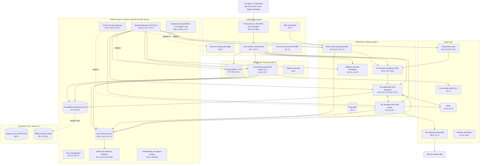

# Cloud Architecture and Control Placement: Cris Santos Company | Professional, Scientific, and Technical Services | Enterprise

**Organization:** Cris Santos Company, LLP (national CPA and tax firm) | **Tier:** Enterprise | **Provider:** Multi-cloud, vendor-agnostic: two public cloud providers (called Cloud provider A and Cloud provider B), two colocation data centers, and SaaS (see section 4)
**Owner:** Director of Cloud Platform Engineering, with the CISO | **Date:** 2026-08-31 | **Related:** Tax Engagement Platform SSP (P02), enterprise BIA (P05)

## 1. Architecture in layers
The estate is organized in four layers. Each lower layer provides **common controls** that the layers above inherit, so a workload team configures only what is specific to its system.

| Layer | What it is | Examples | Who runs it |
|---|---|---|---|
| **Platform** | Organization-wide services in both clouds | Organization guardrails (including a U.S.-regions-only rule), identity federation, key management, log archive, SIEM and behavior analytics, vulnerability and attack surface management, immutable backup accounts, CI/CD pipelines | Cloud Platform Engineering; Security Operations; Identity team |
| **Landing zone** | The standard account pattern every workload lands in | Account vending with mandatory tags, hub-and-spoke network with cloud firewalls, private links to SD-WAN and colocation, WAF and DDoS protection, private DNS, zero-trust and PAM access | Cloud Platform Engineering; Network Engineering |
| **Workload** | Systems built or run by the firm | Cloud A: Tax Engagement Platform (tax application, portals, tax workflow, AI extraction pipeline, offshore provider workspace), data lake. Cloud B: client accounting and payroll engine (SL-1), audit platform, cloud AI services | Application teams (for example, the Director of Tax Technology) |
| **SaaS** | Vendor-operated applications | DMS, productivity suite, tax software vendor transmitter, identity verification service, accounting SaaS for SL-1, HR and payroll | Vendors, with the firm's configuration and oversight |

Colocation DC-1 (Florida) and DC-2 (outside Florida) host the legacy archive (2004 to 2014 files), legacy audit applications, and offline copies of the immutable backups.

## 2. Diagram

## 3. Responsibility by service model
Sources: SRC-AWS-SRM, SRC-AZURE-SRM, and SRC-GCP-SRM in `00_universal-framework/sources/source-register.csv`. The three published models agree on the split used here, so the design does not depend on which two providers the firm uses.

| Service model | Provider | Firm (customer) | Shared |
|---|---|---|---|
| IaaS (tax application servers, audit platform) | Facilities, hosts, hypervisor, physical network | Guest OS, applications, identities, data, network policy | Encryption (provider service, customer keys), logging |
| PaaS (databases, containers, virtual desktops, AI services) | Also the platform runtime and its patching | Data, access, configuration, keys, application code | Backups, availability configuration |
| SaaS (DMS, email, transmitter, identity verification, accounting SaaS) | Also the application | Users, roles, data, oversight of the vendor | Audit review (complementary user entity controls) |
| Colocation | Building, power, cooling, perimeter | Racks, equipment, cage access lists, media sanitization | None |

## 4. Service categories and provider equivalents
| Service category | AWS | Microsoft Azure | Google Cloud |
|---|---|---|---|
| Organization guardrails | AWS Organizations service control policies | Azure Policy with management groups | Organization Policy Service |
| Account vending | AWS Control Tower account factory | Azure landing zone subscription vending | Resource Manager project creation |
| Key management | AWS KMS | Azure Key Vault | Cloud KMS |
| Audit logging | AWS CloudTrail | Azure Monitor activity log | Cloud Audit Logs |
| Threat detection | Amazon GuardDuty | Microsoft Defender for Cloud | Security Command Center |
| Managed relational database | Amazon RDS | Azure SQL Database | Cloud SQL |
| Managed containers | Amazon EKS | Azure Kubernetes Service | Google Kubernetes Engine |
| Virtual desktops | Amazon WorkSpaces | Azure Virtual Desktop | No first-party equivalent (partner solutions) |
| Web application firewall | AWS WAF | Azure Web Application Firewall | Cloud Armor |
| Backup service | AWS Backup | Azure Backup | Backup and DR Service |

This table is for reading provider documentation only. The architecture, control map, and SSP describe service categories.

## 5. Common controls
`cloud-control-map.csv` has **65 rows** across 32 components: Platform 22, Landing zone 8, Workload 21, SaaS 11, Colocation 3. Responsibility: Customer 46, Shared 16, Provider 3.

**33 rows are published as common controls** (`common_control` = Yes) in the enterprise common control catalog. They map to the common control providers in the TEP SSP (P02 section 10.3): GRC program (CCP-01, guardrail and pipeline rows), identity (CCP-02), landing zone (CCP-03), security operations (CCP-04), network (CCP-05), colocation (CCP-07), and messaging (CCP-10). A workload inherits them by being deployed through account vending, which applies the guardrails, logging, network, key, and backup policies automatically.

**Rules for inheriting:**
1. A workload may claim a common control only if its account was created by account vending and passes the posture baseline.
2. Customer-side identity, data protection, and logging stay explicit at every layer: even a SaaS application has Customer rows for access (AC-3, AU-6) because those are always the firm's responsibility.
3. SaaS rows cite the vendor's SOC 2 report, reviewed by the third-party risk team (P09 evidence map). A SaaS vendor without a reviewed report (the identity verification service) cannot be treated as a source of inherited controls until POAM-015 closes.
4. **U.S.-only regions.** The organization guardrail blocks resources outside U.S. regions in both clouds. This supports the IRC 7216 rules: disclosure to a preparer without consent requires the preparer to be in the United States (301.7216-2(d)(1)), and SSNs of Form 1040 filers may not go to preparers outside the United States except under IRS-defined safeguards (301.7216-3(b)(4)). The guardrail controls where data is stored, not who views it; the offshore provider workspace is handled by consent and masking (AC-21).

## 6. Validation against the TEP SSP (P02)
Every TEP component in the SSP boundary appears here with controls from each required family, directly or inherited:
| TEP component | AC | AU | CM | IA | SC | SI |
|---|---|---|---|---|---|---|
| Tax application servers | AC-3, AC-5 | AU-2, AU-9 (inherited) | CM-6, CM-2 (inherited) | IA-2(1) (inherited) | SC-7 (inherited) | SI-2 |
| Tax application database | AC-6 (inherited) | AU-2 (inherited) | CM-6 (inherited) | IA-2(1) (inherited) | SC-28 | SI-4 (inherited) |
| Client and corporate portals | AC-6 (inherited) | AU-2 (inherited) | CM-3 (inherited) | IA-8 | SC-5 (inherited), SC-23 | SI-10 |
| Tax workflow and e-file queue | AC-4 (inherited) | AU-2 (inherited) | CM-3 (inherited) | IA-2(1) (inherited) | SC-8(1) (inherited) | SI-7 |
| AI extraction pipeline | AC-4 (inherited) | AU-2 (inherited) | CM-5 (inherited) | IA-2(1) (inherited) | SC-7(21) (planned) | SA-11 and SI-4 (inherited) |
| Offshore provider workspace | AC-20, AC-21 | AU-2 (inherited) | CM-6 (inherited) | IA-2(1) (inherited) | SC-8 (inherited) | SI-4 (inherited) |

## 7. Findings from the mapping
1. **Email sits outside the cloud guardrails.** The productivity suite is SaaS, so business email compromise controls (conditional access, session protection, phishing-resistant MFA) are tenant settings, not landing zone guardrails. Browser access from unmanaged devices is the main gap (POAM-001).
2. **Data location versus data access.** U.S.-region guardrails keep tax data stored in the United States, but the offshore provider views data from outside the United States through the firm's virtual desktops. That access is an IRC 7216 disclosure and needs consent and SSN masking; P07 found exceptions (POAM-008).
3. **Two clouds, one control set.** Guardrails, logging, and key policies are written once as code and applied to both clouds. Differences are limited to service names (section 4).
4. **Acquired firms are outside the estate.** AF-05 and AF-06 run their own tenants and file servers, so none of the platform common controls reach them until migration (POAM-005).
5. **The transmitter is SaaS with no platform fallback.** E-file concentration must be handled by contract and procedure, not architecture (POAM-019).
6. **AI services** run under no-training, U.S.-only terms; the AI governance committee reviews each new model deployment (P10). The extraction pipeline will be isolated in its own account (SC-7(21), planned).
