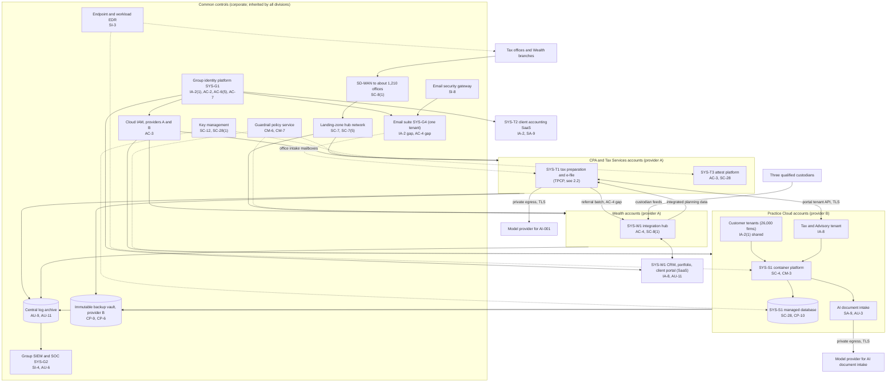
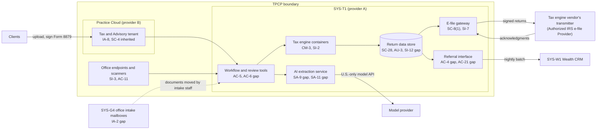

# Cloud Architecture and Control Placement: Cris Santos Company Holdings | Professional Services | Multi-Sector

**Organization:** Cris Santos Company Holdings, Inc. | **Tier:** Multi-Sector | **Providers:** two public cloud providers, called provider A and provider B (vendor-agnostic; see section 6)
**Scope:** the shared corporate cloud platform (SYS-G3 landing zones, SD-WAN, backup vault) and shared SaaS (SYS-G1 identity, SYS-G4 email), plus the division workloads that run on them. The SSP system (P02) is the Tax Preparation and Client Portal Platform (TPCP).

## 1. Design in one paragraph
Corporate runs one **landing zone** per provider: identity federation from SYS-G1, a hub network, guardrail policies, a central log archive, key management, EDR, and the immutable backup vault (in provider B). Divisions get their own **accounts** (subscriptions or projects) inside the landing zones and inherit these guardrails. Provider A hosts the corporate hub, the TPCP (SYS-T1), the attest platform (SYS-T3), and the Wealth integration hub (SYS-W1). Provider B hosts Practice Cloud (SYS-S1, primary and warm standby regions) and the backup vault. Several systems are SaaS outside the landing zones: SYS-G1 identity, SYS-G4 email, SYS-T2 client accounting, and the Wealth CRM, portfolio, and portal applications. **Tax and Advisory's client portal is a tenant of Practice Cloud**, so the TPCP crosses both providers and inherits platform controls from a sister division.

## 2. Diagrams
### 2.1 Group landing zones and division workloads

### 2.2 Tax Preparation and Client Portal Platform (SSP boundary)

**Target state (POAM-009 and POAM-022, due 2026-12-31 and 2027-03-31):** the referral interface reads a consent register and sends only the fields each client's consent names, and only after the consent is recorded; Wealth analytics stops building statistical compilations from referral data unless a consent covers that use; office intake mailboxes are retired in favor of portal upload, and until then lose legacy authentication (POAM-002).

## 3. Tenancy and identity decision
- **Decision.** All three divisions sign in through the group identity platform, SYS-G1, and get their own accounts inside the landing zones. No division has its own identity tenant.
- **Two shared tenants.** One email tenant (SYS-G4) serves every division and the seasonal staff. Tax and Advisory's client portal is a tenant of Practice Cloud (SYS-S1), a sister division's multi-tenant service.
- **Why.** One identity platform lets group internal audit assess it once. Practice Cloud acts as a provider to Tax and Advisory: tenant isolation (SC-4) is a Practice Cloud control, evidenced by its SOC 2 Type 2 report.
- **What limits blast radius.** Phishing-resistant MFA for administrators and just-in-time PAM elevation with session recording. HR-driven identity governance enforces seasonal end dates. The backup vault uses a separate backup identity. The Tax division sets its own tenant administrators and requires client MFA. Practice Cloud support access needs a customer ticket and time-limited approval.
- **Known gaps.** The shared email tenant still allows legacy authentication on 1,150 office intake mailboxes (POAM-002) and external forwarding for 212 mailboxes (POAM-007). Tax office mailboxes have no inbox-rule alerting (POAM-004).
- **Cross-division risks:** GR-02, GR-06, GR-07, GR-11, GR-18 in [risk-register.csv](../step-04_P01_risk-register/risk-register.csv).

## 4. Common versus division-specific controls
`cloud-control-map.csv` has 55 rows across 30 components. The `control_scope` column shows who owns each placement:

| Scope | Rows | What it means |
|---|---|---|
| Common (group) | 24 | Provided once by corporate (SYS-G1 to SYS-G4, landing zones, backup vault) and inherited by every division. Listed in the P02 common control catalog |
| Shared system (TPCP) | 15 | Controls of the SSP system, including two placements in its Practice Cloud tenant |
| Division-specific (CPA and Tax Services) | 4 | Client accounting SaaS and the attest platform |
| Division-specific (Wealth) | 4 | Integration hub, client portal, communications archive |
| Division-specific (Practice Cloud) | 8 | Multi-tenant service, AI feature, support console |

| Responsibility | Rows |
|---|---|
| Customer (the group or a division) | 42 |
| Shared (provider and group) | 9 |
| Provider | 4 |

**Rule of thumb.** Identity, network guardrails, logging, keys, backups, EDR, and email filtering are **common**: a division cannot opt out of them, only request an exception through POL-01. Application behavior, data sharing out of a division, and client-facing identity are **division-specific**, because they depend on each division's regulator (FTC and IRS, SEC, or customer contracts).

**A division as a provider.** Practice Cloud is a provider to Tax and Advisory in the same way a cloud provider is to the group. Tenant isolation (SC-4) and portal backups are Practice Cloud controls that the TPCP inherits, evidenced by the Practice Cloud SOC 2 Type 2 report. Tax and Advisory still owns its tenant settings (client MFA, administrator roles) and its data.

## 5. Layers
| Layer | Common components | Division components | Key controls | Responsibility |
|---|---|---|---|---|
| Identity | SYS-G1, cloud IAM | Client portal identities (Tax tenant, Wealth portal), Practice Cloud customer tenants | AC-2, AC-3, AC-6(5), IA-2, IA-2(1), IA-8 | Customer (configuration); vendor (service) |
| Network | Hub network, SD-WAN | E-file gateway private egress, integration hub | SC-7, SC-7(5), SC-8(1) | Customer, with provider DDoS protection shared |
| Compute | EDR on all hosts and workstations | Tax engine and workflow containers, Practice Cloud platform | SI-2, SI-3, CM-3, SC-4 | Customer (images, containers, code) |
| Data | Keys, backup vault | Return data store, Practice Cloud database, attest file store | SC-12, SC-28, SC-28(1), CP-9, CP-6, SI-12, AC-4, AC-21 | Shared: provider encrypts; group owns keys, retention, and data flows |
| Logging and monitoring | Log archive, SIEM | Application logs, communications archive | AU-3, AU-6, AU-9, AU-11, SI-4 | Shared: providers generate platform logs; group retains and reviews |
| SaaS dependencies | Identity, email, SIEM vendors | Tax engine vendor and transmitter, model providers, client accounting SaaS, Wealth SaaS | SA-9, IA-2, SI-8 | Provider for the service; customer for use and oversight |
| Physical | Provider data centers | Tax offices (outside the cloud) | PE-3, MP-6 | Provider (inherited) for data centers; group for offices |

## 6. Service categories and provider equivalents
The design does not depend on a provider. This table gives each provider's name for each service category, for reading its shared responsibility documentation.

| Service category | AWS | Microsoft Azure | Google Cloud |
|---|---|---|---|
| Account structure and guardrails | AWS Organizations with service control policies | Management groups with Azure Policy | Resource hierarchy with Organization Policy |
| Managed Kubernetes | Amazon EKS | Azure Kubernetes Service | Google Kubernetes Engine |
| Managed relational database | Amazon RDS | Azure SQL Database | Cloud SQL |
| Object storage | Amazon S3 | Azure Blob Storage | Cloud Storage |
| Key management | AWS KMS | Azure Key Vault | Cloud KMS |
| Audit logging | AWS CloudTrail | Azure Monitor activity log | Cloud Audit Logs |
| Backup with immutability | AWS Backup (vault lock) | Azure Backup (immutable vault) | Backup and DR Service |
| Private connectivity | AWS Direct Connect / PrivateLink | Azure ExpressRoute / Private Link | Cloud Interconnect / Private Service Connect |

Shared responsibility sources: SRC-AWS-SRM, SRC-AZURE-SRM, SRC-GCP-SRM in `00_universal-framework/sources/source-register.csv`. All three agree on the split used here: for IaaS the provider owns facilities, hosts, and virtualization; for PaaS the provider also owns the runtime; for SaaS the provider owns the application. The customer always keeps identities, access decisions, data classification, and data.

## 7. Findings from the mapping
1. **Data leaving a division is the weak point, not storage.** Encryption, keys, and backups are sound (SC-28, SC-12, CP-9). The gaps are flows: the referral interface sends tax return information to Wealth without checking consent (AC-4, AC-21; P01 GR-01; POAM-009), and office intake mailboxes bring client documents in through email with legacy authentication (IA-2; POAM-002).
2. **Email is shared by every division.** One tenant serves tax offices, advisers, Practice Cloud, and corporate. A compromised tax office mailbox can send trusted internal mail to Wealth advisers. This is why the P08 scenario spans divisions and why tax office inbox-rule alerting matters (SI-4; POAM-004).
3. **Two model providers are new external dependencies.** AI-001 in the TPCP and the AI document intake feature in Practice Cloud each send client documents to a hosted model (SA-9). The TPCP contract has U.S.-only and no-training terms; the Practice Cloud provider is not even on the published sub-processor list (POAM-020).
4. **Practice Cloud controls protect Tax and Advisory too.** A tenant isolation failure in SYS-S1 would expose the Tax and Advisory tenant as well as outside customers. The TPCP relies on the Practice Cloud SOC 2 report for SC-4 and portal backups, and Tax and Advisory reviews that report as a user entity each year (P09).
5. **Common controls are strong and reused.** One identity platform, one SIEM, one backup design. This is what lets group internal audit assess them once (P07). The weak links are seasonal account lifecycle (AC-2) and email exceptions (IA-2, AC-4), not the platforms themselves.
