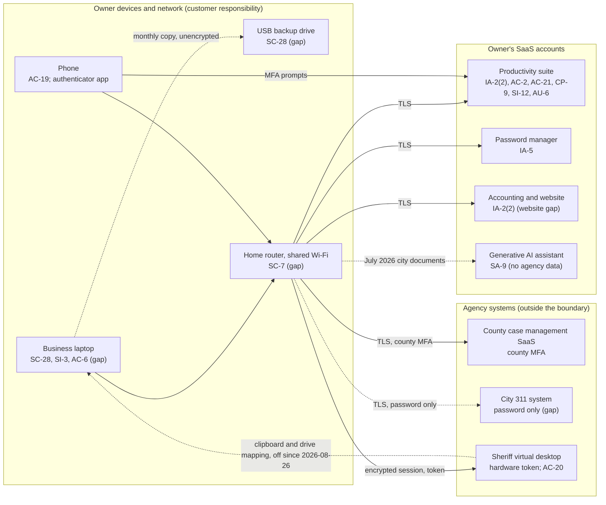

# SaaS Architecture and Control Placement: Cris Santos Company | Public Administration | Sole Proprietorship

**Organization:** Cris Santos Company (independent GovTech consultant) | **Tier:** Sole Proprietorship | **Provider:** SaaS only (no IaaS or PaaS)
**System:** Consulting Delivery Environment (CDE), as defined in the system profile (P02) | **Mapped:** 2026-08-12 by the owner-consultant with the on-call IT technician

## 1. Diagram
Control IDs on each node are the ones in `cloud-control-map.csv`. Dashed lines are flows with a gap. The three agency systems on the right are outside the CDE boundary.

## 2. Layers
| Layer | Components | Key controls | Responsibility |
|---|---|---|---|
| Identity | Productivity suite, password manager, accounting, website, agency accounts | IA-2(2), AC-2, IA-5 | Owner configures; providers and agencies supply MFA |
| Data | Cloud files and mail, USB drive, agency extracts, AI conversations | SC-28, CP-9, AC-21, SI-12, SA-9 | Provider protects data inside its service; the owner decides what agency data goes where, and deletes it on time |
| Compute (endpoints) | Laptop, phone | SC-28, SI-3, AC-6, AC-19 | Owner |
| Network | Home router and Wi-Fi | SC-7 | Owner (ISP supplies the hardware) |
| Logging | Productivity suite sign-in and sharing reports | AU-2 (provider), AU-6 (owner) | Shared: provider records, owner reviews |
| Agency systems | County SaaS, city 311, sheriff virtual desktop | AC-20, IA-2(2), AC-2 | Agency; the owner follows each agency's terms |

## 3. Shared responsibility for SaaS
All three major cloud providers' shared responsibility models (SRC-AWS-SRM, SRC-AZURE-SRM, SRC-GCP-SRM) agree on the SaaS split: the provider runs the application, platform, and facilities; **the customer always keeps its identities and accounts, its data, and its devices.** That is why 13 of the 21 rows in the control map are the owner's alone, 5 are shared, and only 3 sit fully with a provider or agency. No IaaS provider equivalents table is needed, because the consultancy runs no infrastructure.

The agency systems add a second layer of sharing. Each agency is the "provider" of its own system and sets the terms for contractor access (for the sheriff, CJISSECPOL v6.1 AC-20 lets the agency set terms for external systems or prohibit them). The owner's side of that bargain is to use only the agency's access path and to keep agency data out of places the agency did not approve.

## 4. Findings from the mapping
1. **Agency data sits in four places the agencies never approved in writing:** the laptop, the cloud sync folder, the USB drive (unencrypted), and the AI assistant (July 2026). Only a deletion routine and a written data-location rule can fix this; the SaaS model cannot. Tracked as P01 R-003, R-004, and R-005.
2. **MFA is off where it is free to turn on** (website builder, found in this mapping). The city 311 system offers contractors no MFA at all; only the city can fix that.
3. **The phone is part of the security boundary.** It holds the authenticator for every service except the sheriff's token. Losing it is a lockout risk (R-009).
4. **The sheriff's virtual desktop was a one-way door that opened both ways.** The design keeps CJI on the sheriff's side, but this mapping noted that clipboard and drive mapping were allowed. P07 testing then found CJI that had left that way in May 2026 (R-015), and the sheriff closed the path on 2026-08-26.
