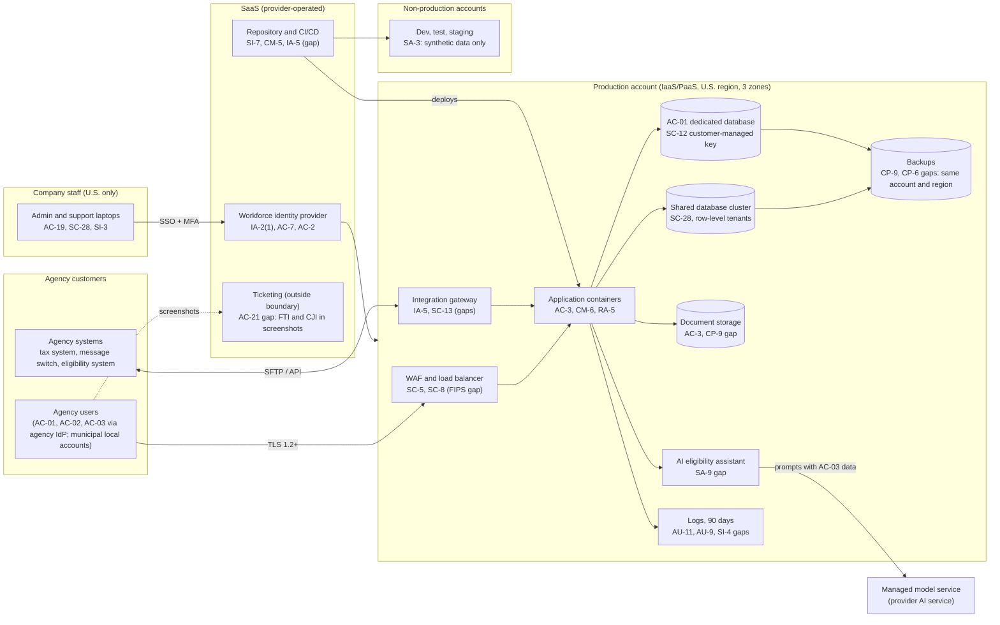

# Cloud Architecture and Control Placement: Cris Santos Company | Public Administration | Small

**Organization:** Cris Santos Company, LLC (GovTech systems integrator) | **Tier:** Small | **Provider:** Vendor-agnostic, FedRAMP Moderate authorized services in U.S. regions (see section 3)
**System:** Agency Case Management Platform (ACMP), as defined in the SSP (P02)

## 1. Diagram

## 2. Layers
| Layer | Components | Key controls | Responsibility |
|---|---|---|---|
| Identity | Workforce identity provider, cloud IAM, agency federation, municipal local accounts | IA-2(1), IA-8, AC-2, AC-6, AC-7 | Customer configures; providers run the services; agencies own their users |
| Network / edge | WAF and load balancer, virtual network rules, integration gateway | SC-5, SC-7, SC-8, SC-13, AC-4 | Shared: provider runs the services; company sets rules and TLS |
| Compute / application | Managed container service, application code | CM-6, SI-2, RA-5, AC-3 | Provider runs hosts and control plane; company owns images, code, and settings |
| Data | Shared database, AC-01 dedicated database, document storage, backups, keys | SC-28, SC-12, CP-9, CP-6 | Shared: provider encrypts and stores; company chooses keys, isolation, retention, and backup placement |
| Logging / monitoring | Cloud audit logs, application audit logs | AU-2, AU-9, AU-11, SI-4 | Shared: provider generates; company retains, protects, and reviews |
| SaaS | Identity provider, repository and pipeline, ticketing, managed model service | SI-7, CM-5, SA-9, AC-21 | Provider runs the application; company controls users, data sent, and settings |
| Physical / hypervisor | Provider data centers | PE family, MP-6 | Provider (inherited through FedRAMP Moderate authorization) |

## 3. Service categories and provider equivalents
The design is independent of the provider. This table gives each provider's name for each service category, for reading its shared responsibility documentation.

| Service category | AWS | Microsoft Azure | Google Cloud |
|---|---|---|---|
| Managed containers | Amazon ECS / EKS | Azure Kubernetes Service | Google Kubernetes Engine |
| Managed relational database | Amazon RDS | Azure SQL Database | Cloud SQL |
| Object storage | Amazon S3 | Azure Blob Storage | Cloud Storage |
| Key management | AWS KMS | Azure Key Vault | Cloud KMS |
| Web application firewall | AWS WAF | Azure Web Application Firewall | Cloud Armor |
| Audit logging | AWS CloudTrail | Azure Monitor activity log | Cloud Audit Logs |

Shared responsibility sources: SRC-AWS-SRM, SRC-AZURE-SRM, SRC-GCP-SRM in `00_universal-framework/sources/source-register.csv`. All three agree on the split used here:
- **IaaS:** the provider owns facilities, hosts, and virtualization; the customer owns the guest configuration, applications, network rules, identities, and data.
- **PaaS:** the provider also runs the operating system and platform software (container control plane, database engine); the customer owns configuration, access, keys it chooses to manage, and data.
- **SaaS:** the provider also owns the application; the customer keeps identities, access, settings, and the data it puts in.

**Regulatory overlay on the split.** Pub. 1075 section 3.3.1 allows FTI only in FedRAMP-authorized clouds, in U.S. locations, with FIPS 140 validated encryption in transit and at rest and data isolation from other cloud customers. CJISSECPOL SC-28 allows CJI storage only in clouds within APB-member countries. The FedRAMP authorization covers the provider's half of these; the encryption mode, key ownership, and isolation are the company's half.

## 4. Findings from the mapping
1. **Backups sit inside the blast radius (CP-9, CP-6).** Backups share the production account, region, and administrator roles, and are not immutable. An attacker with a cloud administrator session could delete them (P01 R-001). Fix: immutable copies in a separate account and second U.S. region, with a separate administrator group. POAM-003.
2. **Logs are short-lived and deletable (AU-9, AU-11).** 90-day retention in the production account. Fix: write-once archive in a separate log account for 7 years, which meets both CJIS (1 year) and Pub. 1075 (7 years). POAM-005.
3. **TLS at the edge is not FIPS-validated (SC-8, SC-13).** The provider's managed services use validated modules, but the company's ingress and gateway libraries do not run in validated mode. CJI in transit needs FIPS 140-3 certified modules, and CJIS stops accepting FIPS 140-2 certificates after 2026-09-21. Fix: switch to validated modules on AC-02 paths by that date, then everywhere. POAM-008.
4. **Outbound traffic is unrestricted (SC-7, AC-4).** Any container can reach any internet address, which makes data theft easy (P01 R-002). Fix: egress allow-list through a proxy.
5. **AC-01 isolation is sound (AC-3, SC-12).** The dedicated database with a customer-managed key meets the Pub. 1075 isolation requirement. Add a rotation schedule and extend customer-managed keys to AC-02.
6. **Two services outside the boundary carry regulated data.** The ticketing service receives FTI and CJI in screenshots (AC-21, SA-9), and the managed model service receives AC-03 applicant data (SA-9). Neither has been reviewed; the first is not an IRS-approved subcontractor. See P03 PB-04 and P10.
