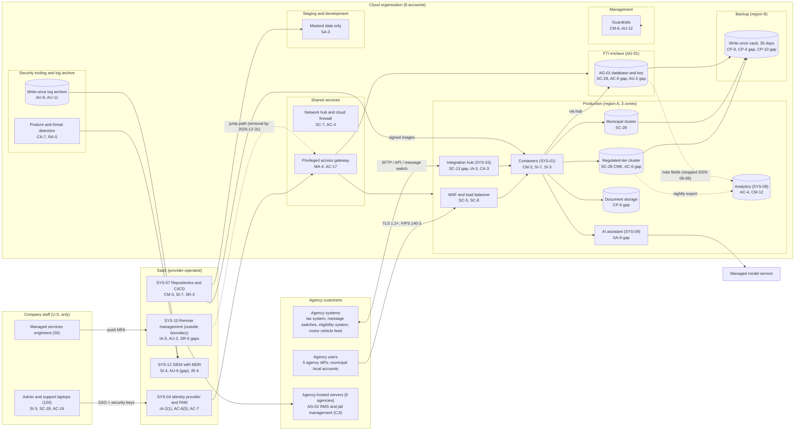

# Cloud Architecture and Control Placement: Cris Santos Company | Public Administration | Mid-Market

**Organization:** Cris Santos Company, Inc. | **Tier:** Mid-Market | **Provider:** Vendor-agnostic public cloud, FedRAMP Moderate authorized services in U.S. regions (see section 4), plus SaaS
**System:** Agency Case Management Cloud (ACMC), as defined in the SSP (P02) | **Prepared:** 2026-07-31 by the Director of Cloud Operations and the GRC Manager; updated 2026-09-17 with P07 results
**Control map:** `cloud-control-map.csv` (59 rows, 25 components)

## 1. Diagram

## 2. Landing zone design
The landing zone separates duties across 8 accounts (subscriptions or projects, depending on the provider) under one cloud organization. Each account limits the damage an attacker can do from any other.

| Account | Purpose | Who administers | Key design decisions |
|---|---|---|---|
| **Management** | Organization root and guardrails | Director of Cloud Operations and Director of Information Security (2 people, dual control) | No workloads. Root credentials sealed. Guardrails force logging, encryption, and U.S. regions in every other account and cannot be disabled from them |
| **Security tooling and log archive** | Posture management, threat detection, write-once log archive | Security Operations Manager's team | Production administrators have no rights here. Cloud audit logs kept 7 years |
| **Shared services** | Network hub, cloud firewall, DNS, privileged access gateway | Cloud operations | All traffic between accounts, and all administrator sessions, pass through here |
| **Production** | ACMC application tier, regulated-tier and municipal clusters, document storage, integration hub, analytics, AI assistant | Cloud operations through just-in-time elevation | Customer-managed keys for the regulated tier. No direct host access |
| **FTI enclave** | AG-01 database instance and key | 6-person enclave administrator group, all with Pub. 1075 background investigations | No internet route. Only the application tier and the gateway can connect. Named in AG-01's IRS 45-day notification with the cloud provider |
| **Staging** and **Development** | Testing with masked or synthetic data | Engineering | The masking pipeline is the only way production-derived data enters. FTI is never copied |
| **Backup** | Write-once vault in region B | 2 named backup administrators | Separate credentials not federated to everyday accounts. Production can write but not delete |

## 3. Layers and shared responsibility per service
| Layer | Components | Key controls | Service model | Responsibility |
|---|---|---|---|---|
| Identity | Identity provider and PAM, guardrails, break-glass, privileged access gateway, agency federation | IA-2(1), AC-2, AC-6(5), AC-7, IA-8, MA-4, AC-17 | SaaS / PaaS / IaaS | Customer configures identities, roles, MFA, and reviews; providers run the services; agencies own their users |
| Network | Hub, cloud firewall, WAF, DNS, integration hub | SC-7, AC-4, SC-5, SC-8, SC-13, IA-3, CA-3, SC-20 | IaaS / PaaS | Customer designs routes, rules, TLS modules, and interface terms; provider runs the services |
| Compute | Managed containers | CM-2, SI-3, SI-7, SC-39 | PaaS | Provider runs hosts and the control plane; customer owns images, code, and runtime settings |
| Data | Database clusters, FTI enclave, document storage, analytics, keys, backups, model service | SC-28, SC-12, SC-4, AC-3, AC-5, AC-6, CP-6, CP-9, CP-4, CP-10, CM-12, SA-9 | PaaS / SaaS | Shared: provider encrypts and runs storage and engines; customer controls keys, access, isolation, data flows, retention, and restore testing |
| Logging and monitoring | Posture service, log archive, SIEM with MDR | AU-2, AU-6, AU-9, AU-11, AU-12, CA-7, RA-5, SI-4, IR-4 | PaaS / SaaS | Shared: provider generates logs and detections; customer enables, retains, forwards, reviews, and acts |
| SaaS applications | Identity provider, repositories and pipeline, SIEM, remote management platform | CM-3, IA-5, SR-3, SR-6 | SaaS | Provider runs the application; customer keeps users, secrets, settings, and supplier oversight |
| Physical | Provider data centers in regions A and B | PE-3, MP-6 | All | Provider (inherited, evidenced by the FedRAMP authorization and SOC 2 report) |

**Responsibility counts in `cloud-control-map.csv`:** 36 Customer, 17 Shared, 6 Provider. By service model: 37 PaaS, 15 SaaS, 7 IaaS rows. The customer side is always identity, data protection, and logging, as the three providers' shared responsibility models agree.

## 4. Service categories and provider equivalents
The design is independent of the provider. This table gives each provider's name for the service category, for reading its shared responsibility documentation (SRC-AWS-SRM, SRC-AZURE-SRM, SRC-GCP-SRM in `00_universal-framework/sources/source-register.csv`).

| Service category | AWS | Microsoft Azure | Google Cloud |
|---|---|---|---|
| Multi-account organization and guardrails | AWS Organizations, service control policies | Management groups, Azure Policy | Resource Manager folders, organization policies |
| Account, subscription, or project | Account | Subscription | Project |
| Network hub and cloud firewall | Transit Gateway, AWS Network Firewall | Virtual WAN hub, Azure Firewall | Network Connectivity Center, Cloud NGFW |
| Managed containers | Amazon ECS / EKS | Azure Kubernetes Service | Google Kubernetes Engine |
| Managed relational database | Amazon RDS | Azure SQL Database | Cloud SQL |
| Object storage with write-once retention | S3 with Object Lock | Blob Storage with immutability policies | Cloud Storage with bucket lock |
| Managed data warehouse | Amazon Redshift | Azure Synapse | BigQuery |
| Key management | AWS KMS | Azure Key Vault | Cloud KMS |
| Backup service | AWS Backup (vault lock) | Azure Backup (immutable vault) | Backup and DR Service |
| Web application firewall | AWS WAF | Azure Web Application Firewall | Cloud Armor |
| Audit logging | CloudTrail | Azure Monitor activity log | Cloud Audit Logs |
| Posture and threat detection | Security Hub, GuardDuty | Microsoft Defender for Cloud | Security Command Center |
| Managed large language model service | Amazon Bedrock | Azure AI Foundry | Vertex AI |

**Service model split used here (all three providers agree):**
- **IaaS** (networks, firewall, data center): the provider owns facilities, hosts, and virtualization. The customer owns network configuration, identities, and data.
- **PaaS** (containers, databases, storage, keys, backup, warehouse): the provider also owns the platform software and its patching. The customer owns access, keys it manages, data, and configuration.
- **SaaS** (identity provider, pipeline, SIEM, remote management, model service as consumed): the provider also owns the application. The customer keeps identities, settings, secrets, and the data it sends.

**Regulatory overlay on the split.** Pub. 1075 section 3.3.1 allows FTI only in FedRAMP-authorized clouds, in U.S. locations, with FIPS 140 validated encryption in transit and at rest and isolation from other cloud customers. CJISSECPOL v6.1 SC-28 allows CJI storage only in clouds within APB-member countries, and SC-13 requires FIPS 140-3 certified modules for CJI in transit. The FedRAMP authorization covers the provider's half. The encryption mode on each path, key ownership, isolation, and what flows between accounts are the company's half, and that is where the findings below sit.

## 5. Findings from the mapping
1. **FTI left the enclave through the analytics export (AC-4, CM-12).** The enclave design is sound, but a nightly export job copied AG-01 free-text note fields, which can carry FTI, to the analytics service in the production account. 14 analysts without Pub. 1075 investigations could query them. The job was stopped on 2026-09-08 and the copies are being purged; the AG-01 disclosure officer decides on reporting (P03 PB-09; P01 R-035; POAM-004).
2. **The managed services platform bridges into the landing zone (AC-17, MA-4).** SYS-10 sits outside the ACMC boundary, but engineers can still reach the shared services jump hosts through it with push MFA. An attacker who takes over SYS-10 would land next to the privileged access gateway (P01 R-001, R-050). Fix: remove the path by 2026-12-31 and require security keys for every route into the gateway.
3. **CJI paths are not all FIPS 140-3 (SC-13, IA-7).** The web ingress and the AG-01 file transfer use certified modules; the AG-02 and AG-39 message-switch connectors do not, and CJIS stops accepting FIPS 140-2 certificates after 2026-09-21. POAM-007.
4. **Recovery is isolated but not fast enough (CP-4, CP-6, CP-10).** The write-once vault in a separate account and region is the strongest control in the environment (P07 CP-9 fully satisfied). But document storage is not in it, and the largest tenant restore took 14 hours against the 8-hour contract RTO. POAM-009.
5. **Monitoring stops at the application (AU-2, AU-6, SI-4).** The MDR provider sees the cloud control plane and identities, but not who reads FTI, CJI, or motor vehicle records, and not SYS-10 sessions. POAM-006.
6. **Boundary check.** Every in-scope component in the SSP (P02 section 9) appears in the diagram. Every cloud account has rows in the control map, and each has controls from at least 2 of the AC, AU, CM, IA, SC, and SI families or inherits them. The model service and the SIEM are mapped as external services with the company's half of each control.
7. **Inherited controls rely on the provider's FedRAMP authorization and SOC 2 report.** Rows marked Provider or Shared depend on them and on the complementary customer controls, reviewed each year in P09 `vendor-soc2-review.csv`.
