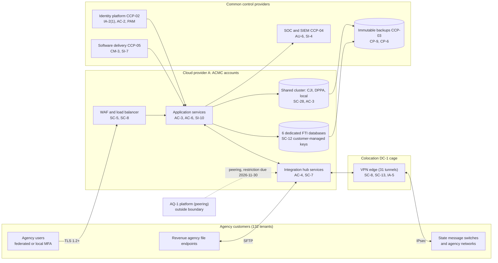

# System Security Plan: Agency Case Management Cloud (ACMC)

**Organization:** Cris Santos Company, Inc. (publicly traded GovTech systems integrator) | **Tier:** Enterprise | **Vertical:** Public Administration
**Outline:** NIST SP 800-18 Rev. 2, System Security Plan Outline Example (June 2026) | **Version:** 3.0, 2026-09-10

## 1. System Name and Identifier
Agency Case Management Cloud (**ACMC**), identifier CSC-SYS-ACMC-001. Tier-1 system in the enterprise application inventory; GovRAMP Authorized (Moderate) since 2025.

## 2. System Overview
ACMC is the company's multi-tenant case management service for state and local agencies. About 132 agency tenants in 16 states use it, with about 31,000 agency user accounts and records on about 22 million individuals:
- **Justice and public safety (CJI):** pretrial and probation supervision for 15 criminal justice agencies, including the AG-02 sheriff's office (P05 BP-01).
- **Revenue (FTI):** tax compliance casework for 6 state revenue agencies, including AG-01 (BP-02). Each runs in a dedicated FTI tenant.
- **Motor vehicles (DPPA):** driver license hearings and suspensions for AG-05 (BP-03).
- **Local government:** constituent services, permits, and code enforcement for about 110 counties and cities (BP-04).

**Major components:**
- **SYS-01:** web and application services on managed containers in Cloud provider A (primary U.S. region with a warm standby region); a shared managed relational database cluster with row-level tenant separation; 6 dedicated database instances for FTI tenants with customer-managed keys; object storage for documents; message queues
- **SYS-02:** the integration hub: cloud integration services (about 640 interfaces) plus an on-premises edge in colocation DC-1 that terminates 31 site-to-site VPN tunnels to agency sites (state message switches, sheriff and court networks)
- **SYS-13 (ACMC portion):** development, test, and staging accounts with synthetic or masked data

The system inherits common controls from the enterprise platform (section 10.3): the identity platform (SYS-04), security operations (SYS-07), the software delivery platform (SYS-06), endpoints (SYS-08), and the Cloud provider A landing zone (P04).

## 3. Laws, Regulations, and Policies Affecting the System
| ID | Requirement | Citation | How it reaches ACMC |
|---|---|---|---|
| Contract | NIST SP 800-53 Rev. 5 (Release 5.2.0) Moderate baseline | SP 800-53B Moderate baseline | Every agency contract |
| N92-R02 | FBI CJIS Security Policy | CJISSECPOL v6.1 (06/25/2026); 28 CFR 20.33(a)(7) | CJIS Security Addendum in the 15 criminal justice tenants' contracts; binds the company to "all subsequent versions" (Addendum sec. 3.01) |
| N92-R01 | IRS Publication 1075 (FTI safeguards) | 26 U.S.C. 6103(p)(4); 26 CFR 301.6103(n)-1; Pub. 1075 (Rev. 11-2021) | Exhibit 7 language in the 6 revenue agency contracts; each agency's 45-day notification to the IRS |
| N92-R05 | Driver's Privacy Protection Act | 18 U.S.C. 2721-2725 | Directly: a contractor of a state motor vehicle department may not knowingly disclose personal information except for permitted uses (2721(a)) |
| State | Florida Cybersecurity Standards | Rule 60GG-2, F.A.C.; Fla. Stat. 282.318(4)(h) | Security terms in Florida state agency contracts (AG-01) |
| State | Florida Information Protection Act and other states' breach laws | Fla. Stat. 501.171(2) and (6); each state where affected individuals reside | Directly, as a third-party agent (P08) |
| SEC | Cybersecurity disclosure | Form 8-K Item 1.05; 17 CFR 229.106 | A material ACMC incident goes through the P08 materiality step |
| N92-R08 | GovRAMP (formerly StateRAMP) | GovRAMP program (not law) | ACMC holds Authorized status; annual third-party assessment |
| Assurance | SOC 2 Type 2 | AICPA Trust Services Criteria | Annual report since 2024 (P09 SL-1) |
| Internal | POL-01 to POL-05 and standards | P06 | Enterprise policy hierarchy |

Not applicable to ACMC:
- HIPAA Security Rule (N92-R03): ACMC holds no ePHI. The company's only business associate scope is the AG-04 IES environment (SYS-03), which is outside this boundary.
- Medicaid safeguards (N92-R04): no Medicaid data in ACMC (IES only).
- FTI outside the 6 revenue tenants: prohibited by POL-04; human services data does not run on ACMC.
- FedRAMP: no federal agency uses ACMC. CIRCIA (N92-R07): proposed rule only. SLCGP (N92-R06): a grant condition on governments, not the company.

## 4. System Status
### 4.1 System Security Plan Approval
Prepared by the ACMC Security Lead and the GRC team. Reviewed by the CISO, the Director of Regulated Data Compliance, and the Vice President, ACMC Platform Operations. Approved by the President, State and Local Platforms on 2026-09-10.
### 4.2 System Authorization Decision
The company is not a federal agency, so there is no federal authorization to operate. The equivalent decisions:
- **Authorizing official equivalent:** President, State and Local Platforms, on the CISO's recommendation.
- **Decision (2026-09-10):** continue operation with conditions, based on the Internal Audit assessment (P07) and the enterprise risk register (P01).
- **Conditions:** replace the 7 FIPS 140-2 VPN appliances before the CJIS cutoff, or shut down their tunnels (POAM-006, due 2026-09-18); change the default appliance passwords (POAM-007, due 2026-09-15); restrict the AQ-1 peering (POAM-004, due 2026-11-30); complete screening reconciliation for staff with CJI access (POAM-002, due 2026-10-31); keep FTI tenant tickets in U.S.-only queues (POAM-009, due 2026-09-30).
- **External authorizations:** GovRAMP Authorized status is maintained through the program's continuous monitoring; agencies receive this SSP, the P07 report, and the POA&M on request under their contracts (CA-6).
- **Reauthorization:** annually, or after a major change (for example, retiring the DC-1 VPN edge in 2027).
### 4.3 System Operational Status
Operational. Planned major modifications: a second VPN edge in DC-2 (CP-7), replacement of the 7 legacy VPN appliances (SC-13), and tenant-scoped just-in-time support access (AC-6).

## 5. Role Identification and Responsible Personnel
| Role | Title | Responsibility |
|---|---|---|
| Authorizing official (equivalent) | President, State and Local Platforms | Accepts residual risk to operate |
| System owner | Vice President, ACMC Platform Operations | Accountable for ACMC operations and its POA&M |
| System security lead | ACMC Security Lead | Day-to-day security engineering; maintains this SSP |
| Regulated data compliance | Director of Regulated Data Compliance | CJIS and Pub. 1075 terms, agency security contacts, Security Addendum certifications, agency notices |
| Information security | CISO; Director of Security Operations | Program oversight; 24x7 SOC monitoring; incident response |
| Privacy | Chief Privacy Officer | Breach determinations; DPPA and state privacy questions |
| Integration hub | Integration Engineering Manager | Interface agreements and hub operations |
| Common control providers | See section 10.3 | Operate inherited controls |
| Independent assessor | Chief Audit Executive (Internal Audit, with a co-sourced firm); GovRAMP third-party assessor | Annual assessment (P07) |
| Agency counterparts | Revenue agency disclosure officers; local agency security officers at criminal justice agencies; AG-05 records officer | Receive notices; approve agency users; hold Security Addendum certifications |

## 6. System Information Types and System Categorization
Information types were modeled on the mission-based categories in NIST SP 800-60 Vol. 2 Rev. 1. Impact levels follow FIPS 199 and were agreed with the agencies that hold FTI and CJI.

| Information type | Confidentiality | Integrity | Availability | Rationale |
|---|---|---|---|---|
| Criminal justice supervision records (CJI, CHRI) | Moderate | Moderate | Moderate | Disclosure harms supervisees and is restricted by 28 CFR Part 20; wrong conditions or violation data could lead to a wrongful arrest; agencies run about one shift on printed rosters (P05 BP-01: MTD 8 h) |
| Taxation management records with FTI | Moderate | Moderate | Moderate | Unauthorized disclosure carries criminal and civil penalties (IRC 7213, 7213A, 7431); contract RTO 8 h (BP-02) |
| Driver records with DPPA personal information | Moderate | Moderate | Low | Highly restricted personal information (18 U.S.C. 2725(4)); hearings can be rescheduled (BP-03) |
| Constituent service records | Low | Low | Low | Names, addresses, complaints; paper workaround for 3 days (BP-04) |
| System and security information (credentials, keys, logs) | Moderate | Moderate | Moderate | Compromise gives access to every tenant |
| **ACMC category (high-water mark)** | **Moderate** | **Moderate** | **Moderate** | |

**Baseline:** the SP 800-53B **Moderate** baseline, required by every agency contract: 177 base controls with 110 enhancements. `control-implementation.csv` has one row per base control, and each statement covers the control's Moderate enhancements. Tailoring decisions:
- **Not applicable (2):** AC-18 (no wireless in the boundary) and SC-15 (no collaborative computing devices).
- **Overlay values:** where CJISSECPOL v6.1 or Pub. 1075 sets a stricter value, the stricter value governs and is recorded as the organization-defined value (for example, AC-7: 5 attempts in 15 minutes with administrator release; AU-11: 1 year online and 7 years archived; SC-13: FIPS 140-3 certified modules for CJI in transit).
- IA-2(12) has no effect because no users hold PIV credentials.

## 7. Authorization Boundary Description
**Inside the boundary:** the ACMC production accounts in Cloud provider A (application services, databases, object storage, queues, keys used only by ACMC), the integration hub cloud services and its DC-1 edge (VPN appliances and edge firewalls in the company's cage), the ACMC non-production accounts, and ACMC's configuration of the inherited services.

**Outside the boundary (common control providers and interconnected systems):**
- Landing zone services (network hub, key management service, log archive account, backup account, standby region): CCP-03
- Identity platform (SYS-04): CCP-02; security operations (SYS-07): CCP-04; software delivery (SYS-06): CCP-05; endpoints (SYS-08): CCP-06
- Agency systems at the other end of each interface, agency identity providers, the AQ-1 platform (SYS-15, connected by peering), the ticketing system and help desk subcontractor (SYS-12)

The enterprise multi-cloud diagram is in P04 `cloud-architecture.md`.

## 8. Information Exchanges Summary
| Connected system / party | Direction | Data | Agreement |
|---|---|---|---|
| State message switches (15 criminal justice tenants) | Bidirectional over site-to-site VPN | CJI including CHRI | Interface agreements; CJIS Security Addendum |
| Revenue agency tax systems (6) | Inbound nightly SFTP; outbound case status | FTI and state tax data | Contracts with Exhibit 7; IRS 45-day notifications |
| AG-05 driver record system | Bidirectional API | DPPA personal information | Interface agreement with DPPA use codes |
| Agency identity providers (about 40 agencies) | Inbound assertions | User identity and roles | Federation terms in contracts |
| AQ-1 e-filing platform (SYS-15) | Bidirectional over network peering | Court filing status and CJI in criminal filings | **No interconnection agreement yet; restriction due 2026-11-30 (POAM-004)** |
| Ticketing system and tier-1 help desk subcontractor (SYS-12) | Inbound from agency users | Ticket text and screenshots (**FTI observed; POAM-009**) | Subcontract; U.S.-only routing for FTI tenants since 2026-08-20 |
| Cloud provider A (FedRAMP Moderate authorized) | Hosting | All ACMC data | Provider agreement; FedRAMP package reviewed |

## 9. System Component Inventory
| Component | Type | Location / provider | Owner |
|---|---|---|---|
| Web and application services | Managed containers | Cloud provider A, primary and standby U.S. regions | Vice President, ACMC Platform Operations |
| Shared database cluster | Managed relational database | Cloud provider A | Vice President, ACMC Platform Operations |
| FTI database instances (6) | Managed relational database with customer-managed keys | Cloud provider A | Director of Regulated Data Compliance (data); platform operations (service) |
| Document storage | Object storage | Cloud provider A | Vice President, ACMC Platform Operations |
| Integration hub services | Managed integration and file transfer services | Cloud provider A | Integration Engineering Manager |
| Integration hub edge | 12 VPN appliances (7 with FIPS 140-2 modules) and 2 edge firewalls | DC-1 cage | Director of Network and Data Center Operations |
| Non-production accounts | Separate accounts | Cloud provider A | Chief Technology Officer |

## 10. Control Implementation Details
### 10.1 Control implementation status
See `control-implementation.csv` (177 base controls).

| Status | Count |
|---|---|
| Implemented | 153 |
| Partially implemented | 22 |
| Not applicable | 2 |
| **Total** | **177** |

| Inheritance | Count |
|---|---|
| Common (fully inherited from a common control provider) | 101 |
| Hybrid (shared between a provider and the ACMC team) | 38 |
| System-specific | 38 |

Partially implemented controls: AC-2, AC-4, AC-6, AC-21, AT-3, AU-6, CA-2, CM-3, IA-5, IR-3, IR-6, IR-8, MP-6, PS-3, PS-7, RA-5, SA-9, SC-7, SC-8, SC-13, SI-12, SR-6. Each names its gap and POA&M item in the statement.

### 10.2 Control assessment status
Internal Audit, with a co-sourced firm, assessed 44 controls from 2026-07-13 to 2026-08-28 using SP 800-53A Rev. 5 procedures and statistical sampling (P07 `assessment-plan.md`, `assessment-results.csv`). Weaknesses are in P07 `poam.csv`. The P03 gap analysis rated all 177 controls across the enterprise's hosted environments, plus the CJIS, Pub. 1075, and other overlays.

### 10.3 Common control providers and inheritance
Common and hybrid controls are inherited from the enterprise platform. Each provider publishes its controls in the enterprise **common control catalog** in the GRC platform and is assessed on its own cycle; ACMC inherits the results.

| Provider | Name | Accountable role | Controls provided | Rows in this plan | Evidence of operation |
|---|---|---|---|---|---|
| CCP-01 | Enterprise GRC program | CISO (with the Chief Risk Officer and Chief Audit Executive) | Policies and standards (P06), risk method, assessment, POA&M, continuous monitoring | 28 | Internal Audit assessment (P07); GRC platform |
| CCP-02 | Identity platform (SYS-04) | Director of Identity and Access Management | SSO, MFA, PAM, identity governance, account lifecycle | 9 | SOX IT general control testing; P07 AC-2, IA-2 results |
| CCP-03 | Cloud landing zone (Cloud provider A) | Director of Cloud Platform Engineering | Account guardrails, network, key management, encryption, backups, log archive, standby region | 23 | Posture reports; provider FedRAMP package |
| CCP-04 | Security operations (SYS-07) | Director of Security Operations | 24x7 SOC, SIEM, EDR, vulnerability management, incident response | 21 | SOC metrics; P07 SI-4, RA-5, IR results |
| CCP-05 | Software delivery platform (SYS-06) | Chief Technology Officer | Pipelines, change control, image signing, code scanning | 6 | Pipeline reports |
| CCP-06 | Endpoint engineering (SYS-08) | Director of Endpoint Engineering | Laptop baselines, EDR agents, device management | 6 | Configuration compliance reports |
| CCP-07 | Cloud provider A and colocation providers (physical) | Director of Network and Data Center Operations | Physical and environmental protection, media, maintenance of DC-1 edge | 22 | Provider FedRAMP package; colocation SOC 2 reports |
| CCP-08 | Human resources and workforce screening | Chief Human Resources Officer (with the Director of Regulated Data Compliance) | CJIS and FTI screening, training, agreements, terminations | 13 | HR and learning system reports; agency certification lists |
| CCP-09 | Third-party risk management | Director of Third-Party Risk Management | Vendor tiering, subcontract flowdown, supplier reviews | 11 | Vendor register; SOC report reviews |

**Inheritance rules:**
- A Common control is fully inherited; the ACMC team verifies only that ACMC is onboarded (for example, SSO integration and log forwarding).
- A Hybrid control names both parts in the implementation statement.
- If a provider's assessment finds a weakness, the finding is linked to every inheriting system's POA&M. Example: POAM-010 (subcontractor flowdown) is a CCP-09 weakness that affects ACMC because subcontractor staff support FTI tenants.

## 11. Digital Identity Acceptance Statement
- **Workforce users:** SSO with MFA; privileged users use phishing-resistant security keys through PAM, comparable to NIST SP 800-63 AAL2 for users and AAL3-like protection for administrators. This meets CJISSECPOL IA-2(1) and IA-2(2) ([Priority 1]) and the Pub. 1075 multi-factor requirements.
- **Agency users:** identity is proofed by each agency. About 40 agencies federate with their own identity providers, which enforce MFA; the rest use ACMC local accounts, which require MFA (authenticator app) for all users since 2026-03. Shared agency accounts are prohibited by contract.
- **AQ-1 users** do not sign in to ACMC; AQ-1 systems connect only through the integration hub interfaces.

## 12. Referenced Artifacts
Scenario facts (`../00_company-facts.md`), BIA (P05), multi-cloud architecture and control map (P04), enterprise risk register (P01), regulatory gap analysis (P03), policy hierarchy and policies (P06), Internal Audit assessment and POA&M (P07), ransomware runbook (P08), SOC 2 readiness (P09), AI governance (P10), ACMC contingency plan v5, interface register, enterprise common control catalog.

## 13. Acronym List and Glossary
- **ACMC:** Agency Case Management Cloud
- **CCP:** common control provider
- **CHRI:** criminal history record information
- **CJI:** criminal justice information
- **CJISSECPOL:** FBI CJIS Security Policy
- **DPPA:** Driver's Privacy Protection Act
- **FTI:** federal tax information
- **PAM:** privileged access management
- **POA&M:** plan of action and milestones

## 14. System Security Plan Review and Change Records
| Version | Date | Change | Author |
|---|---|---|---|
| 1.0 | 2024-02-16 | Initial plan for SOC 2 and agency contracts | ACMC Security Lead |
| 2.0 | 2025-05-30 | GovRAMP authorization package; common control provider mapping | ACMC Security Lead with GRC team |
| 3.0 | 2026-09-10 | CJISSECPOL v6.1 overlay values; AQ-1 peering; 2026 Internal Audit results | ACMC Security Lead with GRC team |
