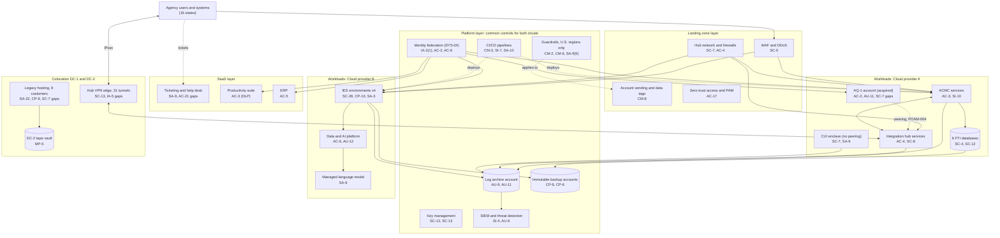

# Cloud Architecture and Control Placement: Cris Santos Company | Public Administration | Enterprise

**Organization:** Cris Santos Company, Inc. (publicly traded GovTech systems integrator) | **Tier:** Enterprise | **Provider:** Multi-cloud, vendor-agnostic: two public cloud providers (Cloud provider A and Cloud provider B, both using FedRAMP Moderate authorized services in U.S. regions), two colocation data centers, and SaaS (see section 4)
**Owner:** Director of Cloud Platform Engineering, with the CISO | **Date:** 2026-08-31 | **Related:** ACMC SSP (P02), enterprise BIA (P05)

## 1. Architecture in layers
The estate is organized in five layers. Each lower layer provides **common controls** that the layers above inherit, so a workload team configures only what is specific to its system.

| Layer | What it is | Examples | Who runs it |
|---|---|---|---|
| **Platform** | Organization-wide services in both clouds | Organization guardrails (U.S. regions only), identity federation, key management, log archive, SIEM feeds, immutable backup accounts, CI/CD pipelines, vulnerability and posture management | Cloud Platform Engineering; Security Operations; Identity team |
| **Landing zone** | The standard account pattern every workload lands in | Account vending with regulated-data tags (FTI, CJI, ePHI, DPPA), hub-and-spoke networks with cloud firewalls, WAF and DDoS protection, zero-trust access and PAM, private connectivity to DC-1 | Cloud Platform Engineering; Network and Data Center Operations |
| **Workload** | Systems the company builds or runs | Cloud A: ACMC, the integration hub services, the AQ-1 account, the CUI enclave. Cloud B: the four IES environments and the data and AI platform | Application teams (for example, ACMC Platform Operations) |
| **SaaS** | Vendor-operated applications | Identity platform, EDR, ticketing and the help desk subcontractor, productivity suite, ERP, source repositories | Vendors, with the company's configuration and oversight |
| **Colocation** | Company equipment in leased cages | DC-1: the integration hub VPN edge and most legacy hosting. DC-2: 3 legacy customers and the tape vault | Network and Data Center Operations; colocation providers for the building |

**Why two clouds.** ACMC and AQ-1 were built on Cloud provider A; the IES business was won on contracts that named Cloud provider B. The company did not consolidate because each agency's IRS notification or contract names the provider. One control set, written as code, applies to both.

## 2. Diagram

## 3. Responsibility by service model
Sources: SRC-AWS-SRM, SRC-AZURE-SRM, and SRC-GCP-SRM in `00_universal-framework/sources/source-register.csv`. The three published models agree on the split used here, so the design does not depend on which two providers the company uses.

| Service model | Provider | Company (customer) | Shared |
|---|---|---|---|
| IaaS (AQ-1 servers, CUI enclave hosts) | Facilities, hosts, hypervisor, physical network | Guest OS, applications, identities, data, network policy | Encryption (provider service, company keys), logging |
| PaaS (ACMC containers and databases, IES, integration services) | Also the platform runtime and its patching | Data, access, configuration, keys, application code | Backups, availability configuration |
| SaaS (identity, EDR, ticketing, productivity, ERP, model service) | Also the application | Users, roles, data sent, routing, oversight of the vendor | Audit review, incident notice terms |
| Colocation | Building, power, cooling, perimeter | Racks, appliances, servers, cage access list | None |

**Regulatory overlay on the split.** Pub. 1075 section 3.3.1 allows FTI only in FedRAMP-authorized clouds, in U.S. locations, with all access from the United States, FIPS 140 validated encryption, and isolation from other cloud customers. CJISSECPOL v6.1 SC-28 allows CJI storage only in clouds in APB-member countries, and SC-13 requires FIPS 140-3 certified modules for CJI in transit (FIPS 140-2 certificates are not acceptable after 2026-09-21). DFARS 252.204-7012(b)(2)(ii)(D) requires a cloud provider holding CUI to meet the FedRAMP Moderate baseline. The FedRAMP authorizations cover the providers' half of these duties; the encryption mode, key ownership, region policy, U.S.-only access, and isolation are the company's half.

## 4. Service categories and provider equivalents
| Service category | AWS | Microsoft Azure | Google Cloud |
|---|---|---|---|
| Organization guardrails | AWS Organizations service control policies | Azure Policy with management groups | Organization Policy Service |
| Account vending | AWS Control Tower account factory | Azure landing zone subscription vending | Resource Manager project creation |
| Key management | AWS KMS | Azure Key Vault | Cloud KMS |
| Audit logging | AWS CloudTrail | Azure Monitor activity log | Cloud Audit Logs |
| Threat detection | Amazon GuardDuty | Microsoft Defender for Cloud | Security Command Center |
| Managed relational database | Amazon RDS | Azure SQL Database | Cloud SQL |
| Managed containers | Amazon EKS | Azure Kubernetes Service | Google Kubernetes Engine |
| Web application firewall | AWS WAF | Azure Web Application Firewall | Cloud Armor |
| Backup service | AWS Backup | Azure Backup | Backup and DR Service |
| Managed language model service | Amazon Bedrock | Azure OpenAI Service | Vertex AI |

This table is for reading provider documentation only. Government-region offerings differ by provider; the company checks each service on the FedRAMP Marketplace before use. The architecture, control map, and SSP describe service categories.

## 5. Common controls
`cloud-control-map.csv` has **64 rows** across 31 components: Platform 19, Landing zone 6, Workload 22, SaaS 8, Colocation 9. Responsibility: Customer 43, Shared 20, Provider 1.

**30 rows are published as common controls** (`common_control` = Yes) in the enterprise common control catalog. They map to the common control providers in the ACMC SSP (P02 section 10.3): identity (CCP-02), landing zone (CCP-03), security operations (CCP-04), software delivery (CCP-05), and colocation (CCP-07). A workload inherits them by being deployed through account vending, which applies the guardrails, logging, network, key, and backup policies automatically.

**Rules for inheriting:**
1. A workload may claim a common control only if its account was created by account vending and passes the posture baseline. **The AQ-1 account was not**, so it inherits nothing until it is re-vended during integration (POAM-001).
2. Customer-side identity, data protection, and logging stay explicit at every layer: even a SaaS application has Customer rows for access and routing.
3. SaaS rows cite the vendor's SOC 2 report, reviewed by Third-Party Risk Management (P09 evidence map).
4. Accounts tagged FTI must be in a region and service on the FedRAMP Marketplace at Moderate or higher, and only U.S.-based staff may hold roles in them.

## 6. Validation against the ACMC SSP (P02)
Every ACMC component in the SSP boundary appears here with controls from each required family, directly or inherited:
| ACMC component | AC | AU | CM | IA | SC | SI |
|---|---|---|---|---|---|---|
| Application services | AC-3 | AU-9 (inherited) | CM-6, CM-3 (inherited) | IA-2(1) (inherited) | SC-7 (inherited) | SI-10, SI-7 (inherited) |
| Shared database cluster | AC-3 | AU-6 (inherited) | CM-2 (inherited) | IA-2(1) (inherited) | SC-28 | SI-4 (inherited) |
| FTI database instances | AC-3 | AU-6 | CM-6 | IA-2(1) (inherited) | SC-4, SC-12 | SI-4 (inherited) |
| Integration hub services | AC-4 | AU-11 (inherited) | CM-3 (inherited) | IA-2(1) (inherited) | SC-8 | SI-4 (inherited) |
| Integration hub VPN edge (DC-1) | AC-4 (inherited) | AU-9 (inherited) | CM-8 (inherited) | IA-5 | SC-13 | SI-4 (inherited) |

## 7. Findings from the mapping
1. **The AQ-1 account sits outside the landing zone.** It was acquired as-is: own directory, 90-day logs, no SIEM feed, and a network peering into the integration hub that allows any port. Internal Audit reached hub management ports from an AQ-1 host (P07 SC-7). Fix: restrict the peering to 4 named endpoints now (POAM-004), then re-vend AQ-1 into the landing zone (POAM-001, POAM-003).
2. **The integration hub's on-premises edge is the weakest link in ACMC.** It is a single site, 7 of its 12 appliances use FIPS 140-2 modules on CJI paths, and 2 had default vendor passwords (POAM-006, POAM-007). A second edge in DC-2 is planned for 2027.
3. **Two clouds, one control set.** Guardrails, logging, and key policies are written once as code and applied to both clouds. Differences are limited to service names (section 4).
4. **Legacy hosting cannot inherit cloud controls.** Its 64 unsupported servers, flat management network, and non-immutable backups need their own fixes (POAM-005, POAM-024, POAM-008).
5. **SaaS is where regulated data leaks.** The ticketing system received FTI screenshots, and the help desk subcontractor's overnight tier outside the United States could see them (POAM-009). Architecture alone cannot stop users attaching data, so the fix combines blocking attachments for FTI tenants with routing and contract terms.
6. **The CUI enclave is isolated by design.** No peering, separate identity groups, and FedRAMP Moderate services meet DFARS 252.204-7012(b)(2)(ii)(D); its open items are SP 800-171 requirements, not architecture (POAM-023).
7. **AI services** run in the IES account with no training on prompts and confirmed FedRAMP scope; the AI governance committee reviews each new model deployment (P10).
