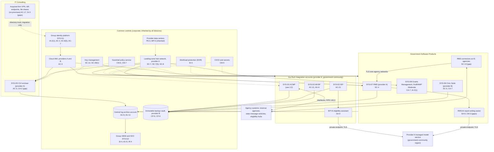
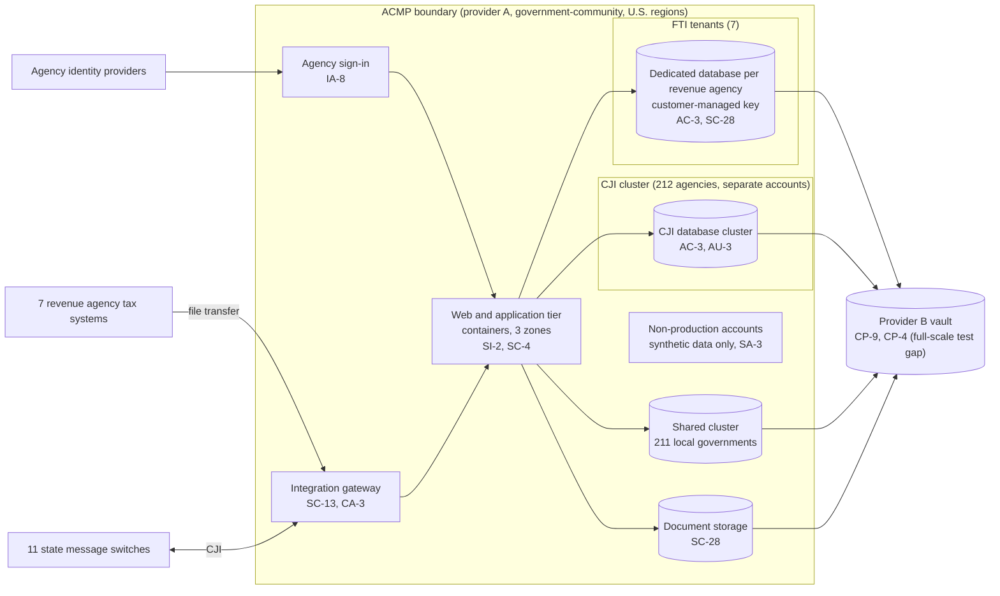

# Cloud Architecture and Control Placement: Cris Santos Company Holdings | Public Administration | Multi-Sector

**Organization:** Cris Santos Company Holdings, Inc. | **Tier:** Multi-Sector | **Providers:** two public cloud providers, called provider A and provider B (vendor-agnostic; see section 6)
**Scope:** the shared corporate cloud platform (SYS-G3 landing zones, key management, log archive, backup vault, and CI/CD) plus the division workloads that run on it. The SSP system (P02) is the GovTech Integration division's Agency Case Management Platform (ACMP).

## 1. Design in one paragraph
Corporate runs one **landing zone** per provider: identity federation from SYS-G1, a hub network, guardrail policies, a central log archive, key management, EDR, and CI/CD. **Provider A** is used in its government-community regions, where every service the group uses is FedRAMP High authorized; it hosts every workload with CJI, FTI, CUI, Medicaid data, or federal data: the ACMP, the IEP, the MVSP, the RMS, Grants Management, and the IT Consulting CUI enclave. **Provider B** is used in commercial U.S. regions with FedRAMP Moderate authorized services; it hosts the Civic Suite and the immutable backup vault for every regulated workload. Divisions get their own **accounts** inside the landing zones and inherit the guardrails. Two estates sit outside the platform: the acquired consulting firm's on-premises VPN, identity provider, endpoints, and file shares (until migration in 2027), and the RMS connectors installed at 41 agencies' premises.

## 2. Diagrams
### 2.1 Group landing zones and division workloads

### 2.2 ACMP (SSP boundary)

**Target state (POAM-002, POAM-005, POAM-011, due by 2027-03-31):** 7-year retention for every log that touches the FTI tenants; all service accounts in identity governance; and parallel restore automation so the CJI cluster and FTI tenants can be rebuilt from the vault inside the 8-hour contract RTO. For the wider estate: the acquired firm's VPN and directory trust are retired at migration (POAM-018), the RMS connectors move to FIPS 140-3 certified modules (POAM-021), and CUI moves off the acquired file shares into the enclave (POAM-020).

## 3. Tenancy and identity decision
- **Decision.** All three divisions sign in through the group identity platform, SYS-G1, and get their own accounts inside the landing zones. No division has its own identity tenant by design.
- **Split by data, not by division.** Every workload with CJI, FTI, CUI, Medicaid data, or federal data runs in provider A's government-community regions, including the IT Consulting CUI enclave (SYS-D5). The one exception is transitional: the acquired consulting firm still runs its own identity provider, with a live directory trust to the group directory, until migration (due 2027-03-31).
- **Why.** CUI in an external cloud must meet FedRAMP Moderate equivalency (DFARS 252.204-7012(b)(2)(ii)(D)). For FTI, Pub. 1075 section 3.3.1 requires FedRAMP authorized, U.S.-located cloud services isolated from other customers.
- **What limits blast radius.** No standing administrator rights: just-in-time PAM elevation with approval and session recording, and hardware keys for administrators. CJI tenants run in a separate cluster and accounts, with support only by staff screened for the tenant's state. Each FTI tenant has customer-managed keys. Agency users sign in through their agencies' identity providers. The backup vault uses a separate backup identity, and only pipelines deploy to production.
- **Known gaps.** The acquired firm's directory trust and SMS-code VPN (GR-05, POAM-018). 41 ACMP service accounts still managed by script (POAM-005). 212 of about 860 shared-service staff lack required screening (GR-02).
- **Cross-division risks:** GR-01, GR-02, GR-05, GR-14, GR-18 in [risk-register.csv](../step-04_P01_risk-register/risk-register.csv).

## 4. Common versus division-specific controls
`cloud-control-map.csv` has 51 rows across 30 components. The `control_scope` column shows who owns each placement:

| Scope | Rows | What it means |
|---|---|---|
| Common (group) | 23 | Provided once by corporate (SYS-G1, SYS-G2, SYS-G3) or inherited from the providers, and used by every division account. Listed in the P02 common control catalog where corporate provides them |
| Shared system (ACMP) | 11 | Controls of the SSP system documented in the P02 SSP |
| Division-specific (GovTech) | 4 | IEP data sharing and AI assistant; MVSP permitted-use controls |
| Division-specific (IT Consulting) | 4 | CUI enclave and the acquired firm's estate |
| Division-specific (Software) | 9 | RMS, its connectors and AI assist, Civic Suite, and Grants Management |

| Responsibility | Rows |
|---|---|
| Customer (the group or a division) | 39 |
| Shared (provider and group) | 10 |
| Provider | 2 |

**Rule of thumb.** Identity, network guardrails, logging, keys, backups, and EDR are **common**. A division cannot opt out of them; it can only request an exception under POL-01. Application behavior, data access inside the application, agency-facing identity, and anything an agency regulator audits directly (CJIS connectors, FTI tenancy, DPPA permitted uses, FedRAMP continuous monitoring) are **division-specific**, because each division answers to different agencies and programs.

## 5. Layers
| Layer | Common components | Division components | Key controls | Responsibility |
|---|---|---|---|---|
| Identity | SYS-G1, cloud IAM | ACMP agency sign-in; Grants Management federal federation; acquired firm VPN and identity provider | AC-2, AC-3, AC-6(5), AC-7, IA-2(1), IA-8, AC-17 | Customer (configuration); vendor (service) |
| Network | Hub networks | Integration gateway; RMS connectors on agency premises | SC-7, SC-7(5), SC-8, SC-13, CA-3 | Customer, with the provider's backbone shared |
| Compute | EDR, guardrails, CI/CD | ACMP, IEP, RMS containers; acquired firm endpoints | SI-2, SI-3, SC-4, CM-5, CM-6, CM-7 | Customer (images, code, configuration) |
| Data | Keys, backup vault | FTI databases, CJI cluster, IEP, MVSP, CUI enclave | SC-12, SC-28, SC-28(1), CP-9, CP-6, CP-4, AC-21 | Shared: the provider encrypts storage; the group owns keys, tenancy, and retention |
| Logging and monitoring | Log archive, SIEM | Application audit records; MVSP lookup reviews; FedRAMP and GovRAMP continuous monitoring | AU-3, AU-6, AU-9, AU-11, SI-4, CA-7 | Shared: providers generate platform logs; the group keeps and reviews them |
| AI services | None (no group AI platform yet) | IEP assistant and RMS assist on the provider's managed model service | SA-9, CM-3 | Shared: the provider runs the model; the division owns prompts, data minimization, and testing |
| Physical | Provider data centers | RMS connector appliances at agencies (agency facilities) | PE-3, MP-6 | Provider (inherited); agencies for their premises |

## 6. Service categories and provider equivalents
The design does not depend on a provider. This table gives each provider's name for each service category, for reading its shared responsibility documentation.

| Service category | AWS | Microsoft Azure | Google Cloud |
|---|---|---|---|
| Government-community regions | AWS GovCloud (US) | Azure Government | Assured Workloads (U.S. regions) |
| Account structure and guardrails | AWS Organizations with service control policies | Management groups with Azure Policy | Resource hierarchy with Organization Policy |
| Managed containers | Amazon EKS | Azure Kubernetes Service | Google Kubernetes Engine |
| Managed relational database | Amazon RDS | Azure Database / Azure SQL | Cloud SQL |
| Key management | AWS KMS | Azure Key Vault | Cloud KMS |
| Audit logging | AWS CloudTrail | Azure Monitor activity log | Cloud Audit Logs |
| Backup with immutability | AWS Backup (vault lock) | Azure Backup (immutable vault) | Backup and DR Service |
| Managed large language model service | Amazon Bedrock | Azure OpenAI Service | Vertex AI |

Shared responsibility sources: SRC-AWS-SRM, SRC-AZURE-SRM, SRC-GCP-SRM in `00_universal-framework/sources/source-register.csv`. All three agree on the split used here: for IaaS the provider owns facilities, hosts, and virtualization; for PaaS the provider also owns the runtime; for SaaS the provider owns the application. The customer always keeps identities, access decisions, data classification, and data. For FTI, Pub. 1075 section 3.3.1 adds that the cloud services must be FedRAMP authorized, in the United States, and isolated from other cloud customers; the group checks each service's authorization on the FedRAMP Marketplace before use.

## 7. Findings from the mapping
1. **Common controls are strong and reused.** One identity platform, one SIEM, one key service, and one backup design serve all three divisions. This is what lets group internal audit assess them once (P07). The weak spots are coverage and retention, not design: the acquired firm's estate is outside SIEM and EDR (SI-4, SI-3), and common control logs are kept 2 years where FTI systems need 7 (AU-11; POAM-002).
2. **The ACMP's design isolates FTI and CJI well** (AC-3, SC-28, SC-13). Its weak point is recovery at scale (CP-4; POAM-011): the vault is sound, but rebuilding about 430 tenants has never been rehearsed.
3. **Two estates sit outside the landing zones** and carry most of the cross-division risk: the acquired firm's VPN and directory trust (AC-17), which is the entry path in the P08 scenario, and the RMS connectors on agency premises (SC-13), which will miss the CJIS FIPS 140-3 date of 2026-09-21.
4. **AI features share one external dependency.** Both the IEP assistant and the RMS assist call the provider's managed model service. The IEP confirmed no-training and retention terms; the RMS beta sent CJI before a CJIS review (SA-9; POAM-022). A group AI platform pattern (private endpoints, data minimization, logging) is proposed in P10.
5. **Federal and state assurance programs need change discipline.** The Civic Suite changed its logging design without telling GovRAMP (CA-7; POAM-023). Grants Management's FedRAMP continuous monitoring is on track and is the model for the others.
