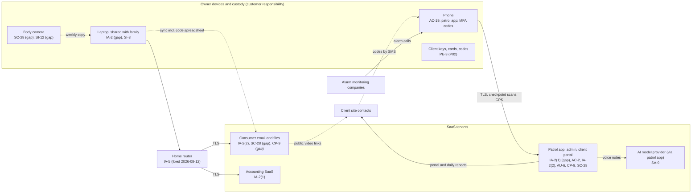

# SaaS Architecture and Control Placement: Cris Santos Company | Emergency Services | Sole Proprietorship

**Organization:** Cris Santos Company (unarmed private security patrol) | **Tier:** Sole Proprietorship | **Provider:** SaaS only (no IaaS or PaaS)
**System:** Patrol Business SaaS Stack (PBS), as defined in the system profile (P02)

## 1. Diagram
Control IDs on each node are the ones in `cloud-control-map.csv`. Dashed lines are flows that carry client access codes or personal information without adequate protection today.

## 2. Layers
| Layer | Components | Key controls | Responsibility |
|---|---|---|---|
| Identity | Patrol app admin and client portal accounts, email account, accounting account, laptop account | IA-2(1), IA-2(2), AC-2, IA-2 | Customer configures; vendors provide MFA |
| Data | Patrol records, code spreadsheet, files, video | SC-28, CP-9, SI-12 | Vendor protects data inside its service; customer decides where codes and video go and how long they are kept |
| Endpoints | Laptop, phone, body camera | SI-3, AC-19, SC-28 | Customer |
| Network | Home router and Wi-Fi; phone hotspot in the vehicle | IA-5 | Customer (ISP supplies and updates the router) |
| Logging | Patrol app audit trail, email sign-in history | AU-2 (vendor), AU-6 (customer) | Shared: vendor records, customer reviews |
| SaaS applications and hosting | Patrol app platform, AI model provider, email and accounting platforms | Inherited (AC-3, AU-2, SC-28, CP-9 at the vendor), SA-9 for oversight | Provider |
| Physical access devices | Client keys, cards, codes | PE-3 (P02, P07) | Customer (held in trust for clients; outside any cloud model) |

## 3. Shared responsibility for SaaS
The three major cloud providers' shared responsibility models (SRC-AWS-SRM, SRC-AZURE-SRM, SRC-GCP-SRM) agree on the SaaS split: the provider runs the application, the platform, and the facilities; **the customer always keeps its identities and accounts, its data, and its devices.** That is why 14 of the 17 rows in the control map are the owner's. A vendor's SOC 2 report never covers those three layers. No IaaS provider equivalents table is needed, because the business runs no infrastructure.

The patrol app has one more layer of sharing: its AI report assistant sends voice notes to a third-party AI model provider that the vendor's SOC 2 report carves out. The owner's only levers there are the vendor's settings (training opt-out, set 2026-08-12) and the decision about what to dictate (P10).

## 4. Findings from the mapping
1. **The client access codes live in the wrong places.** They sit in a spreadsheet in the consumer drive, a phone note, client text threads, and the patrol app's post orders. Any one account takeover exposes every client site. Tracked as P01 R-003; the fix is one encrypted vault and one sealed paper copy.
2. **MFA is off where the most data is.** The patrol app admin account had a reused password and no MFA, while the accounting SaaS, which holds no codes, enforces MFA. Tracked as R-002.
3. **The phone is the business.** It runs the patrol app, receives alarm calls, holds MFA codes, and receives codes by text. Losing it is both a disclosure risk (R-005) and an outage (R-007).
4. **Sync is not backup.** Ransomware on the shared laptop would encrypt the synced drive, including the code spreadsheet (R-001). A versioned backup the laptop cannot overwrite is needed.
5. **Video leaves by public links.** 14 clips are reachable by anyone with the link, with no expiry (R-006).
