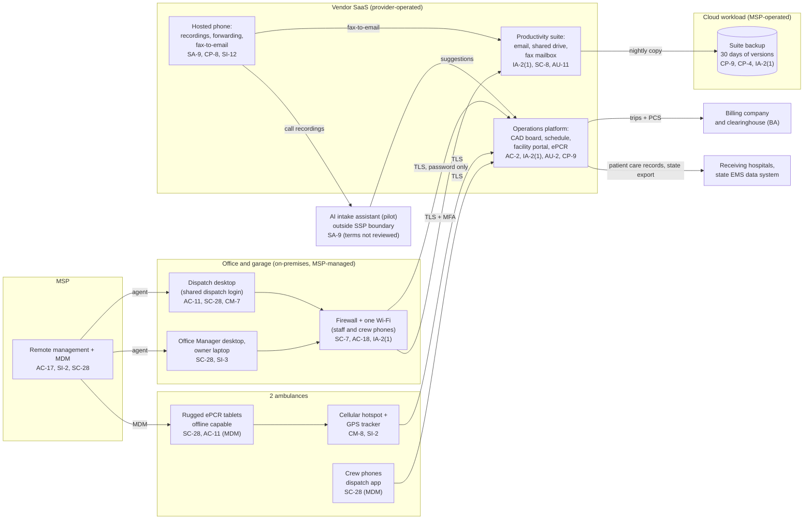

# Cloud Architecture and Control Placement: Cris Santos Company | Emergency Services | Micro

**Organization:** Cris Santos Company, LLC (licensed BLS ambulance service, non-emergency transport only) | **Tier:** Micro | **Provider:** Vendor-agnostic SaaS (see section 3)
**System:** Transport Operations Platform (TOP), as defined in the SSP (P02) | **Prepared:** 2026-08-07 by the Office Manager with the MSP lead technician; updated 2026-08-19 after P07 testing | **Approved:** Owner, 2026-09-04

## 1. Diagram
The company runs no servers and no cloud tenant of its own. Its "cloud" is a set of SaaS services plus one cloud workload that the MSP operates for it: the backup of the productivity suite (SYS-08). The dispatch board, schedule, and patient care reports all live in the operations platform vendor's SaaS.

## 2. Layers and who is responsible
| Layer | Components | Key controls | Customer (company) | MSP (on the company's behalf) | Provider (SaaS vendor) |
|---|---|---|---|---|---|
| Identity | Platform, suite, phone, and backup accounts; facility portal accounts; firewall login | AC-2, IA-2, IA-2(1), IA-5 | Decides who gets access; creates platform and facility accounts; enables MFA | Creates suite and device accounts; holds backup and firewall admin logins | Runs the sign-in and MFA service |
| Network | Firewall, Wi-Fi, internet line, vehicle hotspots | SC-7, AC-18, SI-2 | Approves changes; **owns the hotspots, which nobody manages today** | Configures, patches, and monitors the firewall and Wi-Fi | Carrier runs the cellular network |
| Endpoints | 2 desktops, 1 laptop, 3 tablets, 4 phones | SC-28, SI-3, AC-11, CM-7, CM-8 | Approves exceptions (the dispatch screen lock); keeps the inventory | Encryption, antivirus, patching, MDM, software control | Not applicable |
| SaaS applications | Operations platform, suite, phone | AC-3, AC-12, AU-2, SC-8 | Users, roles, sharing settings, recording announcement, retention settings | Suite administration on request | Application, platform, data centers |
| Data | Trip and ePCR records, suite data, recordings, backup copies, unsynced tablet records | CP-9, CP-4, SC-28, SI-12 | Decides retention; orders restore tests | Operates the suite backup and runs restore tests | Encrypts and backs up its own platform |
| Logging | Platform access and export logs, suite logs, firewall logs | AU-2, AU-6, AU-11 | **Reviews logs (never done; weekly export check from 2026-09-08)** | Keeps firewall logs; forwards alerts | Generates and stores logs |
| Vendor governance | BAAs, SOC 2 review, MSP review, AI feature terms | SA-9 | Signs BAAs; reviews SOC 2 and MSP evidence | Holds subcontractor BAAs (backup vendor) | Provides SOC 2 reports and BAAs |

**The MSP is not a cloud provider in the shared responsibility sense.** It performs customer-side duties for the company. Anything marked "Customer (performed by MSP)" in `cloud-control-map.csv` remains the company's responsibility under HIPAA. The company must direct the work, receive evidence, and check it (164.308(b); SA-9).

## 3. Service categories and provider equivalents
The design is vendor-agnostic. The shared responsibility split for SaaS is the same in all three major cloud providers' models: the provider runs the application, platform, and infrastructure; the customer keeps identities, access, data, and devices (SRC-AWS-SRM, SRC-AZURE-SRM, SRC-GCP-SRM in `00_universal-framework/sources/source-register.csv`). For the company's vendors, the SOC 2 report or vendor security documentation is the evidence of the provider side.

| Service category used | What it is here | Equivalent category in the large cloud providers (for reading their documentation) |
|---|---|---|
| Line-of-business SaaS | Ambulance operations platform (CAD board, schedule, ePCR) | Industry SaaS built on any provider |
| Productivity suite | Email, file storage, sync client | Productivity and collaboration SaaS |
| Cloud communications | Hosted phone, call recording, fax-to-email | Contact center and cloud communications services, offered by each of AWS, Azure, and Google Cloud |
| SaaS-to-SaaS backup | Nightly backup of suite mailboxes and the shared drive | Backup service or third-party SaaS backup |
| Speech-to-text and language model service | AI intake assistant inside the platform | Managed speech and generative AI services |
| Remote monitoring and management; mobile device management | MSP device management | Device management SaaS |

## 4. Findings from the mapping
1. **The most important SaaS has the weakest sign-in (IA-2, IA-2(1)).** The operations platform holds every trip and patient care record, yet it accepts a password alone, and the dispatch board uses one shared password known to former schedulers. A phished or reused password reaches about 5,200 patients' records. Fix: MFA for every user and named dispatch accounts by 2026-10-31 (P01 R-002, R-007; POAM-002, POAM-003).
2. **Sync is not backup (CP-9, CP-4).** The office desktops sync the shared drive, and SYS-08 copies it every night with 30 days of versions. If ransomware encrypts a desktop's synced folder, the encrypted files flow to the suite and then to the backup. Nobody has tried a restore, and one MSP password can delete the versions. Fix: immutable 90-day versions, MFA on the console, and a restore test by 2026-09-30 (R-005; POAM-009, POAM-010).
3. **Unmanaged things sit at the edges.** P07 testing found a free remote desktop tool on the dispatch desktop, outside MSP control (removed 2026-08-19; R-023). The vehicle hotspots are on no inventory and have no updates since 2022. Fix: approved software list and MSP management of the hotspots (POAM-014; R-018).
4. **Call recordings and faxes were outside any BAA until 2026-08-21 (SA-9).** They hold PHI from facility calls and certification statements. The BAA is now signed, and recordings are now kept 2 years instead of indefinitely (set 2026-08-28; R-004).
5. **The AI intake assistant sits outside the boundary on purpose.** It receives recorded calls from the phone system and returns suggestions to the platform. Its terms allow the vendor to use transcripts to improve its models. It is mapped here only to show the SA-9 gap; it enters the SSP boundary only after the P10 conditions are met.
