# Cloud Architecture and Control Placement: Cris Santos Company | Emergency Services | Small

**Organization:** Cris Santos Company, LLC (licensed private ambulance service) | **Tier:** Small | **Provider:** Vendor-agnostic (see section 3)
**System:** Dispatch and Patient Care Platform (DPCP), as defined in the SSP (P02)

## 1. Diagram

```mermaid
flowchart LR
  subgraph HQ["Headquarters and Station 2 (on-premises)"]
    DC["Dispatch consoles<br/>SI-2, SC-28, SI-3"]
    OFF["Office endpoints<br/>AC-11, SC-28"]
    FW["Site firewalls<br/>SC-7"]
  end
  subgraph Fleet["9 ambulances"]
    RT["Vehicle routers<br/>IA-5, CM-7"]
    MDC["MDCs and ePCR tablets<br/>AC-19, SC-28"]
    MON["Cardiac monitors"]
  end
  subgraph SaaS["SaaS (provider-operated)"]
    IDP["Identity provider<br/>IA-2, IA-2(1), AC-2"]
    EPCR["ePCR<br/>AC-3, AU-6, SI-7, CP-9"]
    BILL["Billing and clearinghouse (BA)"]
    PHONE["Hosted phone and recording<br/>SA-9 (gap: no BAA)"]
    AI["AI triage service<br/>SA-9 (gap: BAA pending)"]
  end
  subgraph Tenant["Public cloud tenant (IaaS/PaaS)"]
    VPN["VPN gateway<br/>SC-8"]
    CAD["CAD application server VM<br/>IA-2, SI-2, SI-3, CM-6"]
    DB[("CAD managed database<br/>CP-9, SC-28, AU-9")]
    IE["Integration engine VM<br/>SC-7, SC-8, SI-4"]
    REC[("Call recording archive<br/>SC-28, AC-3")]
    BK[("Backup vault<br/>CP-9 (gap: same account)")]
    LOG["Cloud audit logging<br/>AU-2, AU-6, AU-11"]
  end
  COUNTY["County CAD (PSAP)"]
  DC --> FW
  OFF --> FW
  FW -->|IPsec| VPN
  RT -->|IPsec over cellular| VPN
  MDC --> RT
  MON -->|12-lead ECG| RELAY["Monitor relay (BA)"]
  VPN --> CAD
  CAD --> DB
  CAD <--> IE
  COUNTY <-->|CAD-to-CAD over TLS| IE
  IE -->|incident push| EPCR
  EPCR -->|trip data| IE
  IE -->|claims data| BILL
  PHONE -->|nightly copy| REC
  PHONE -->|live audio| AI
  AI -->|suggested priority| CAD
  MDC -->|SSO + MFA| IDP
  IDP --> EPCR
  DB --> BK
  IE --> BK
  REC --> BK
  CAD --> LOG
  IE --> LOG
```

## 2. Layers
| Layer | Components | Key controls | Responsibility |
|---|---|---|---|
| Identity | Identity provider, cloud IAM roles, CAD local accounts | AC-2, AC-6, IA-2, IA-2(1), IA-5 | Customer (configuration and CAD accounts), provider (service) |
| Network / edge | Site firewalls, site-to-site and vehicle VPN, cloud network rules, vehicle routers | SC-7, SC-8, CM-7 | Customer |
| Compute / application | CAD application server VM, integration engine VM, dispatch consoles, MDCs | CM-6, SI-2, SI-3, SI-4, AC-19 | Customer (guest OS and application); CAD vendor supports the application |
| Data | CAD managed database, call recording archive, backup vault | SC-28, CP-9, CP-4, AU-9, AC-3 | Shared: provider encrypts and runs database backups; customer configures keys, retention, and isolation |
| Logging / monitoring | Cloud audit logs, identity sign-in logs, CAD and ePCR audit | AU-2, AU-6, AU-11 | Shared: provider generates, customer retains and reviews |
| SaaS applications | ePCR, billing, hosted phone, AI triage, productivity suite | AC-3, SI-7, SA-9, SC-8 | Provider (application and infrastructure), customer (users, roles, data, contracts) |
| Physical / hypervisor | Provider data centers | PE family | Provider (inherited) |

## 3. Service categories and provider equivalents
The company's design is independent of the provider. This table gives each provider's name for each service category, to use when reading its shared responsibility documentation.

| Service category | AWS | Microsoft Azure | Google Cloud |
|---|---|---|---|
| Virtual machines | Amazon EC2 | Azure Virtual Machines | Compute Engine |
| Managed relational database | Amazon RDS | Azure SQL Database | Cloud SQL |
| Object storage | Amazon S3 | Azure Blob Storage | Cloud Storage |
| Backup service | AWS Backup | Azure Backup | Backup and DR Service |
| Identity and access management | AWS IAM | Azure role-based access control with Microsoft Entra ID | Cloud IAM |
| Key management | AWS KMS | Azure Key Vault | Cloud KMS |
| Audit logging | AWS CloudTrail | Azure Monitor activity log | Cloud Audit Logs |
| Site-to-site VPN | AWS Site-to-Site VPN | Azure VPN Gateway | Cloud VPN |
| Network filtering | Security groups | Network security groups | VPC firewall rules |

Shared responsibility sources: SRC-AWS-SRM, SRC-AZURE-SRM, SRC-GCP-SRM in `00_universal-framework/sources/source-register.csv`. All three models agree on the split used here:
- **IaaS:** the provider owns physical facilities, hosts, and the virtualization layer. The customer owns the guest operating system, applications (CAD, integration engine), network configuration, identities, and data.
- **PaaS (managed database):** the provider also owns the database engine, its patching, and automated backups. The customer owns database users, data, key choices, backup retention, and copies outside the account.
- **SaaS:** the provider also owns the application. The customer keeps identities, access, data, devices, and the contract terms (BAAs).

## 4. Findings from the mapping
1. **The CAD is customer-operated, not SaaS (CM-6, SI-2, SI-3).** Because the CAD runs on a virtual machine in the company's tenant, the guest OS, antivirus, hardening, and patching are the company's job. The provider covers none of it. This is why the P08 scenario is plausible: ransomware that reaches the tenant through the MSP tool (P01 R-021) or a VPN endpoint can encrypt the CAD server. Tracked as POAM-006 and POAM-020.
2. **Backup isolation (CP-9).** The backup vault and database snapshots share the production account, region, and administrator roles. A ransomware actor with cloud admin rights could delete them. Fix: a separate backup account with immutable retention and a second region. Tracked as P01 R-002 and POAM-004.
3. **Vehicles are part of the network (CM-7, IA-5).** Each router holds a VPN tunnel into the tenant. Three routers exposed web administration to the internet with default passwords until 2026-08-14. Tracked as P01 R-007 and POAM-012.
4. **Two SaaS services carry PHI without a BAA (SA-9).** The hosted phone system and the AI triage service both receive call audio. Tracked as POAM-011.
5. **Inherited controls rely on vendor SOC 2 reports.** Control statements marked "Common/Inherited" in P02 depend on the ePCR, identity, and cloud providers' SOC 2 reports. The ePCR vendor's report is reviewed in P09.
6. **The county link is a boundary (SC-7, CA-3).** The integration engine listener accepts traffic only from the county address range. Moving it to a site-to-site VPN and signing interconnection security terms with the county are planned (P01 R-032).
