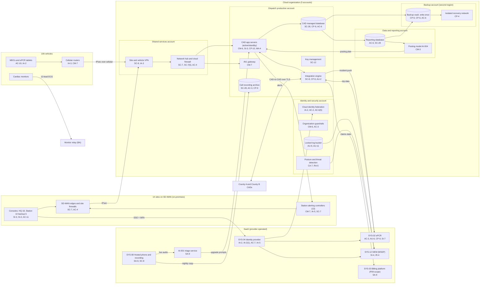

# Cloud Architecture and Control Placement: Cris Santos Company | Emergency Services | Mid-Market

**Organization:** Cris Santos Company, Inc. (licensed private ambulance service) | **Tier:** Mid-Market | **Provider:** Vendor-agnostic public cloud (see section 4), plus SaaS
**System:** Dispatch and Patient Care Platform (DPCP), as defined in the SSP (P02) | **Prepared:** 2026-07-31 by the Security Manager and the Director of IT; updated 2026-09-16 with P07 results
**Control map:** `cloud-control-map.csv` (55 rows, 23 components)

## 1. Diagram

## 2. Landing zone design
The landing zone has 5 accounts (subscriptions or projects, depending on the provider) under one cloud organization. The split keeps dispatch, which must never stop, apart from reporting and analytics, and keeps backups out of reach of production administrators.

| Account | Purpose | Who administers | Key design decisions |
|---|---|---|---|
| **Identity and security** | Organization root, cloud identity federation to SYS-04, guardrails, posture and threat detection, locked log bucket | Security Manager (2 people) | No workloads. Root credentials sealed. Guardrails apply to every other account and cannot be disabled from them |
| **Shared services** | Network hub, cloud firewall, VPN gateway for 14 sites and 106 vehicles, DNS, patch service | Director of IT's infrastructure team | All traffic between sites, vehicles, workloads, and the internet passes the hub |
| **Dispatch production** | CAD application servers, CAD database, AVL gateway, integration engine, call recording archive, key management | Infrastructure team; CAD vendor for the CAD application under contract | No internet ingress except the county address ranges to the integration engine. Company-managed keys |
| **Data and reporting** | Reporting database for county and state reports, analytics, and the posting model (AI-004) | Infrastructure team; analysts have read access | Receives a copy of CAD data; never writes back to CAD except the posting plan through an approved interface |
| **Backup** | Backup vault with write-once retention in a second region; isolated recovery network | 2 named backup administrators | Separate administrator credentials, not federated to everyday accounts. Cross-account role can write but not delete |

## 3. Layers and shared responsibility per service
| Layer | Components | Key controls | Service model | Responsibility |
|---|---|---|---|---|
| Identity | Cloud federation, guardrails, SYS-04 | IA-2, IA-2(1), AC-2, AC-6(5), AC-7, IA-5 | PaaS / SaaS | Customer configures identities, roles, MFA, and reviews; provider runs the identity services |
| Network | Hub, cloud firewall, VPN gateway, site edges, vehicle routers, station alerting segments | SC-7, SC-7(5), SC-8, AC-4, IA-3, SI-4(4) | IaaS / PaaS | Customer designs routes, rules, and segmentation; provider runs the gateway services |
| Compute | CAD servers, AVL gateway, integration engine, posting model | CM-6, CM-7, SI-2, SI-3, CP-10, MA-4, CM-3 | IaaS / PaaS | Customer owns the guest OS, CAD application operation, EDR, and vendor access; CAD vendor supports the application; provider owns hosts and hypervisor |
| Data | CAD database, recording archive, reporting database, keys, backups | SC-28, SC-12, CP-9, CP-6, CP-4, AC-3, AC-6 | IaaS / PaaS | Shared: provider encrypts and operates storage and database engines; customer controls keys, access, retention, isolation, and restore testing |
| Logging and monitoring | Locked log bucket, posture service, SIEM | AU-2, AU-9, AU-11, AU-12, CA-7, RA-5, SI-4, IR-4 | PaaS / SaaS | Shared: provider generates logs and findings; customer enables, retains, forwards, and acts on them; MSSP monitors |
| SaaS applications | ePCR, identity provider, hosted phone, SIEM, billing platform | AC-3, AU-6, CP-9, SI-7, SA-9, SC-8 | SaaS | Provider runs the application and infrastructure; customer keeps users, roles, audit review, data, and BAAs |
| Physical | Provider data centers | PE-3 | All | Provider (inherited, evidenced by SOC 2 reports) |

**Responsibility counts in `cloud-control-map.csv`:** 32 Customer, 17 Shared, 6 Provider. By service model: 17 IaaS, 27 PaaS, 11 SaaS rows. As in all three providers' shared responsibility models, the customer side is always identity, data protection, and logging.

## 4. Service categories and provider equivalents
The design is independent of the provider. This table gives each provider's name for the service category, for reading its shared responsibility documentation (SRC-AWS-SRM, SRC-AZURE-SRM, SRC-GCP-SRM in `00_universal-framework/sources/source-register.csv`).

| Service category | AWS | Microsoft Azure | Google Cloud |
|---|---|---|---|
| Multi-account organization and guardrails | AWS Organizations, service control policies | Management groups, Azure Policy | Resource Manager folders, organization policies |
| Account, subscription, or project | Account | Subscription | Project |
| Cloud identity federation | IAM Identity Center | Microsoft Entra ID with Azure RBAC | Cloud Identity with IAM |
| Network hub and cloud firewall | Transit Gateway, AWS Network Firewall | Virtual WAN hub, Azure Firewall | Network Connectivity Center, Cloud NGFW |
| Site and vehicle VPN | Site-to-Site VPN | VPN Gateway | Cloud VPN |
| Virtual machines | EC2 | Virtual Machines | Compute Engine |
| Managed relational database | Amazon RDS | Azure SQL Database | Cloud SQL |
| Object storage with write-once retention | S3 with Object Lock | Blob Storage with immutability policies | Cloud Storage with bucket lock |
| Backup service | AWS Backup (vault lock) | Azure Backup (immutable vault) | Backup and DR Service |
| Key management | AWS KMS | Azure Key Vault | Cloud KMS |
| Audit logging | CloudTrail | Azure Monitor activity log | Cloud Audit Logs |
| Posture and threat detection | Security Hub, GuardDuty | Microsoft Defender for Cloud | Security Command Center |

**Service model split used here (all three providers agree):**
- **IaaS** (virtual machines, object storage, networks): the provider owns facilities, hosts, and virtualization. The customer owns the guest OS, applications (CAD, integration engine), network configuration, identities, and data.
- **PaaS** (managed database, backup, key service, gateways): the provider also owns the platform software and its patching. The customer owns access, keys, data, and configuration.
- **SaaS** (ePCR, identity provider, phone, SIEM, billing): the provider also owns the application. The customer keeps identities, roles, audit review, data, and contract terms.

## 5. Findings from the mapping
1. **CAD is customer-operated, so recovery is the company's job (CP-10, CP-9, CP-4).** Because the CAD runs on virtual machines in the dispatch production account, the cloud provider covers none of the guest OS, application, or rebuild work. The CAD database is protected well (point-in-time restore plus write-once copies in the backup account), but the integration engine and the recording archive are backed up only inside production, and the servers have never been rebuilt in a test. This is why the P08 ransomware scenario could last days (P01 R-001, R-003; POAM-012).
2. **Both communications centers share one CAD (CP-7).** The landing zone has one CAD stack. A warm standby in the backup region, administered separately from production, is the planned answer (due 2027-06-30; POAM-011).
3. **Vehicles and stations are part of the network (IA-3, CM-7, SC-7).** 106 routers hold VPN tunnels into the shared services account. 35 are outside central management, and station alerting controllers share a flat segment with crew Wi-Fi at 9 stations (P01 R-007, R-023, R-050; POAM-010, POAM-018).
4. **Logging gaps sit in the dispatch production account (AU-2, AU-12).** CAD and integration engine logs stay on the servers for 30 and 14 days and never reach the SIEM, so a breach investigation may not be able to show what was accessed (P01 R-041; POAM-006).
5. **The data and reporting account is the likely exfiltration path (SI-4(4), AC-6).** It holds a full copy of CAD incident data, and extracts are not restricted or alerted on (P01 R-036).
6. **Boundary check.** Every in-scope component in the SSP (P02 section 9) appears in the diagram. Every cloud component has at least one row in the control map, and each account has controls from at least 2 of the AC, AU, CM, IA, SC, and SI families or inherits them. The billing platform appears for context only; its controls are scoped in P09.
7. **Inherited controls rely on SOC 2 reports.** Rows marked Provider or Shared for the ePCR, identity provider, cloud provider, phone vendor, and MSSP depend on their SOC 2 Type 2 reports and complementary user entity controls, which are reviewed each year in P09 `vendor-soc2-review.csv`.
