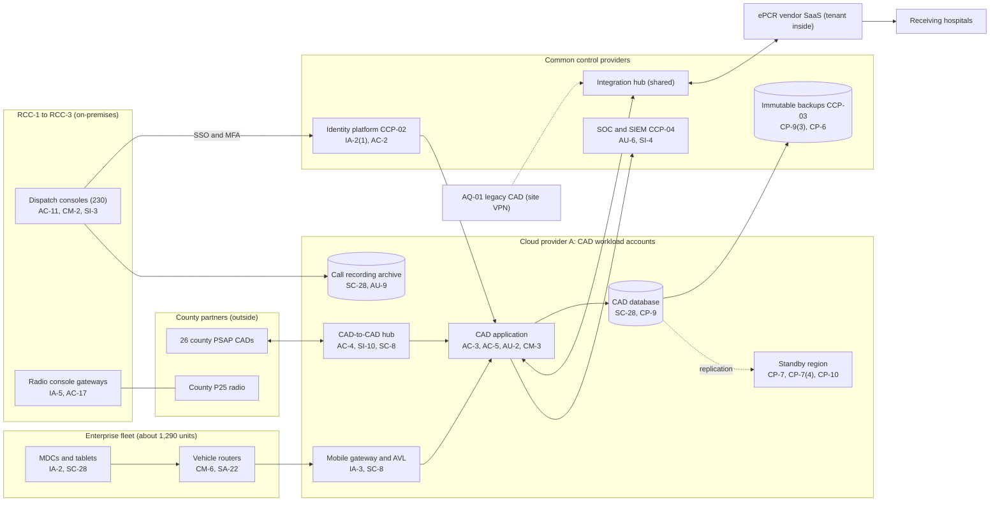

# System Security Plan: Enterprise Dispatch and Patient Care Platform (EDPCP)

**Organization:** Cris Santos Company, Inc. (publicly traded private ambulance provider; FL, GA, AL, SC, TN) | **Tier:** Enterprise | **Vertical:** Emergency Services
**Outline:** NIST SP 800-18 Rev. 2, System Security Plan Outline Example (June 2026) | **Version:** 3.0, 2026-09-14

## 1. System Name and Identifier
Enterprise Dispatch and Patient Care Platform (**EDPCP**), identifier CSC-SYS-EDPCP-001. Tier-1 system in the enterprise application inventory.

## 2. System Overview
The EDPCP supports every step of an ambulance response at the three enterprise communications centers (RCC-1 to RCC-3): receiving incidents from 26 county PSAPs over CAD-to-CAD interfaces and from transferred callers, triage with the emergency medical dispatch protocol, unit recommendation from automatic vehicle location (AVL), dispatch and tracking through mobile data computers (MDCs), patient care documentation on ePCR tablets, and delivery of the patient care record to the receiving hospital. Volume is about 4,300 911 responses a day across 23 counties plus about 2,200 interfacility trips a day.

**Why availability matters most.** A dispatch outage can delay an ambulance to a cardiac arrest, stroke, or major trauma. Manual dispatch keeps the service running, but at full volume it stays safe for about 2 hours (P05 BP-01: MTD 2 h, RTO 1 h). County agreements also set response-time standards with penalties.

**Major components:**
- Enterprise CAD (SYS-01): vendor-licensed CAD software, customer-managed on Cloud provider A virtual machines, with a managed relational database; active in one region with a warm standby in a second region
- CAD-to-CAD hub (SYS-01): interface adapters for 26 county PSAPs, which drop law enforcement fields from inbound messages
- Mobile gateway and AVL service (SYS-01): receives positions and status from vehicle routers and MDCs
- Integration hub (shared service): CAD-to-ePCR, ePCR-to-billing, and hospital delivery interfaces
- Call recording archive (object storage) for dispatch audio
- ePCR tenant (SYS-02): the company's configuration, roles, and data in the ePCR vendor's SaaS
- Dispatch consoles at RCC-1 to RCC-3 (230 positions) with radio console gateways to county P25 systems
- Fleet mobile systems for the enterprise fleet (SYS-07): about 1,290 vehicle routers and MDCs and about 3,500 ePCR tablets

Users: about 1,900 CAD accounts (dispatchers, supervisors, field supervisors, CAD administrators, quality reviewers), about 1,290 MDC clients, about 9,800 ePCR accounts (field clinicians, clinical quality, billing export), and about 2,600 hospital staff accounts on the ePCR hospital receiving portal.

## 3. Laws, Regulations, and Policies Affecting the System
| ID | Requirement | Citation | How it affects the EDPCP |
|---|---|---|---|
| C-EMERGENCY-R04 | HIPAA Security Rule | 45 CFR Part 164, Subpart C. The company is a covered entity (45 CFR 160.103) | ePHI safeguards for CAD incidents, call recordings, and patient care records; availability is central (164.308(a)(7)) |
| Related | HIPAA Breach Notification Rule | 45 CFR 164.400-164.414 | Breach response for CAD, recording, and ePCR data (P08) |
| C-EMERGENCY-R05 | CIRCIA (proposed, not in force) | Proposed 6 CFR 226 (89 FR 23644) | Tracked only (P03 section 6) |
| Related | HIPAA Security Rule NPRM (proposed, not in force) | 90 FR 898 (2025-01-06) | Tracked only (P03 section 6) |
| Medicare | Ambulance coverage and documentation | 42 CFR 410.40(e); 410.41(c); 424.516(f) | ePCR data drives medical necessity documentation and claims |
| State | EMS records and patient care records | Each state's EMS rules; Florida worked example: Fla. Stat. 401.30; Rule 64J-1.014, F.A.C. | Record of each emergency call; patient care record available to the receiving hospital; retention |
| State | Call recording | Each state's interception law; Florida worked example: Fla. Stat. 934.03(2)(g) (licensed ambulance service) | Recording of incoming calls on dispatch lines |
| Federal | Section 1557 patient care decision support tools | 45 CFR 92.210 | Dispatch protocol software and the AI call triage pilot (P10) |
| SEC | Cybersecurity disclosure | Form 8-K Item 1.05; 17 CFR 229.106 | A material EDPCP incident would go through the P08 materiality step |
| Contract | County agreements | 27 county and municipal agreements | CAD-to-CAD interfaces, response-time reporting, outage notice |
| Internal | POL-01 to POL-05 and standards | P06 | Enterprise policy hierarchy |

Not applicable:
- FBI CJIS Security Policy (C-EMERGENCY-R01) and 28 CFR 20.21 and Part 23 (C-EMERGENCY-R02, R03): the EDPCP does not store, process, or view criminal justice information. The CAD-to-CAD hub drops law enforcement fields, and the 3 counties that share premise hazard notes confirmed in writing that the notes contain no criminal justice information. See P03 section 1.
- FCC EAS rules (C-EMERGENCY-R06): the company is not an EAS participant and does not originate public alerts.
- 42 CFR Part 2: the company runs no federally assisted substance use disorder program.

## 4. System Status
### 4.1 System Security Plan Approval
Prepared by the Director of CAD and Dispatch Systems and the GRC team. Reviewed by the CISO, the Chief Medical Officer, and the Vice President, Communications Centers. Approved by the Chief Operating Officer on 2026-09-14.
### 4.2 System Authorization Decision
The company is not a federal agency, so there is no formal ATO. The equivalent internal decision:
- **Authorizing official equivalent:** Chief Operating Officer, with the CISO's recommendation.
- **Decision (2026-09-14):** continue operation with conditions, based on the Internal Audit assessment (P07) and the risk register (P01).
- **Conditions:** prove the 1-hour CAD RTO and test RCC-3 failover (POAM-011 by 2027-01-31); put independent validation on response plan and unit recommendation changes (POAM-006 by 2026-12-15); change the default passwords on the radio console gateways (POAM-012, done 2026-08-14, verification by 2026-10-31); cut AQ-01's site VPN off from the integration hub (POAM-016 by 2027-01-31).
- **Reauthorization:** annually, or after a major change (for example, migrating AQ-01 onto the enterprise CAD, due 2027-03-31).
### 4.3 System Operational Status
Operational. Planned major modifications: automated regional failover and interface cutover (CP-10(4)), AQ-01 migration onto the enterprise CAD, and replacement of end-of-support vehicle routers.

## 5. Role Identification and Responsible Personnel
| Role | Title | Responsibility |
|---|---|---|
| System owner | Vice President, Communications Centers | Accountable for the EDPCP; approves CAD access roles |
| Authorizing official (equivalent) | Chief Operating Officer | Accepts residual risk to operate |
| Clinical owner | Chief Medical Officer, with the Medical Director for Communications | Dispatch protocols, response plans, patient care record content |
| System administrator | Director of CAD and Dispatch Systems | Day-to-day CAD administration and change control |
| ePCR administrator | ePCR Application Manager | ePCR tenant configuration, roles, and hospital portal accounts |
| Information security | CISO; Director of Security Operations (HIPAA Security Officer) | Program oversight; SOC monitoring; incident response |
| Privacy | Chief Privacy Officer (HIPAA Privacy Officer) | Privacy Rule, breach determinations |
| Common control providers | See section 10.3 | Operate inherited controls |
| Independent assessor | Chief Audit Executive (Internal Audit) | Annual assessment (P07) |

## 6. System Information Types and System Categorization
Information types come from NIST SP 800-60 Vol. 2 Rev. 1. Impact levels follow FIPS 199.

| Information type | Confidentiality | Integrity | Availability | Rationale |
|---|---|---|---|---|
| Emergency response (call, incident, and unit data) | Moderate | Moderate | **High** | A CAD outage can delay an ambulance and contribute to loss of life. Manual dispatch reduces but does not remove that harm (P05 BP-01: MTD 2 h) |
| Health care delivery services (patient care records, call recordings) | Moderate | Moderate | Moderate | Disclosure triggers breach duties; wrong data could affect hospital care; paper records cover short outages (P05 BP-05: MTD 24 h) |
| Health care administration (trip data for billing) | Moderate | Moderate | Low | Financial and identity data; claims can queue (P05 BP-08) |
| Information security (audit logs, credentials, interface keys) | Moderate | Moderate | Moderate | Protects evidence and access to dispatch |
| **EDPCP category** | **Moderate** | **Moderate** | **High** | See the decision below |

**Categorization decision.** Under the FIPS 199 high-water mark, the High availability rating makes the EDPCP a High system. The company is not a federal agency and uses FIPS 199 and SP 800-53B as models. The risk committee of the board approved this tailoring on 2026-09-10:
- The EDPCP uses the **SP 800-53B Moderate baseline**, because confidentiality and integrity are Moderate.
- It adds **12 High-baseline availability controls**: CP-2(2), CP-2(5), CP-3(1), CP-4(2), CP-6(2), CP-7(4), CP-8(3), CP-8(4), CP-9(3), CP-9(5), CP-10(4), PE-11(1).
- The decision is reviewed annually. If the availability POA&M items (POAM-011, POAM-019) are not closed by 2027-06-30, the CISO will recommend adopting the full High baseline.

**Documented controls.** `control-implementation.csv` documents **144 controls**: 132 from the Moderate baseline and the 12 High-baseline availability supplements. The remaining Moderate-baseline enhancements (mostly for AC, AU, CM, IA, SC, and SI) are fully inherited from the enterprise common control catalog (section 10.3) and listed there rather than repeated here. Privacy-baseline controls are documented in the enterprise privacy program.

## 7. Authorization Boundary Description
**Inside the boundary:** the CAD application and database servers in the CAD workload accounts (Cloud provider A, primary and standby regions), the CAD-to-CAD hub, the mobile gateway and AVL service, the CAD and ePCR interfaces configured on the shared integration hub, the dispatch call recording archive, the ePCR tenant configuration and roles, the dispatch consoles and radio console gateways at RCC-1 to RCC-3, and the enterprise fleet's vehicle routers, MDCs, and tablets.

**Outside the boundary (common control providers and interconnected systems):**
- Landing zone services (network hub, key management, log archive, backup accounts, standby region): CCP-03
- Identity platform (SYS-04): CCP-02
- SOC, SIEM, EDR, scanners: CCP-04
- The ePCR vendor's platform, the telephony and contact center platform (SYS-11), the cardiac monitor relay, the revenue cycle platform (SYS-03)
- County PSAP CADs and county P25 radio systems (county-operated), receiving hospitals, state EMS data systems
- AQ-01's legacy CAD at RCC-4 (SYS-12), connected to the integration hub over a site VPN until migration

The enterprise multi-cloud diagram is in P04 `cloud-architecture.md`.

## 8. Information Exchanges Summary
| Connected system / party | Direction | Data | Agreement |
|---|---|---|---|
| County PSAP CADs (26) | Bidirectional (CAD-to-CAD over TLS on private circuits; 4 legacy links unencrypted) | Incident type, address, callback number, notes, unit assignments, status | County agreements with interface exhibits; **4 legacy links (POAM-017)** |
| County P25 radio systems | Voice through radio console gateways | Dispatch voice traffic | County radio subscriber agreements |
| ePCR vendor | Bidirectional (TLS API through the integration hub) | Incident and patient demographics to ePCR; times back to CAD | BAA and SOC 2 Type 2 |
| Receiving hospitals (about 300) | Outbound (ePCR hospital portal) | Patient care records | Hospital portal terms; **shared logins and inactive accounts (POAM-002)** |
| Revenue cycle platform (SYS-03) | Outbound nightly | Trip and billing data | BAA |
| Telephony and contact center platform (SYS-11) | Inbound | Transferred callers; ANI and callback numbers | Contract and BAA |
| State EMS data systems (5) | Outbound | Incident-level EMS data | State data agreements |
| AQ-01 legacy CAD | Bidirectional (site VPN to the integration hub) | Mutual-aid requests and unit status | Internal; **flat network reachability (POAM-016)** |
| CAD software vendor | Remote support (through PAM) | Troubleshooting access | BAA and support agreement |
| Radio console gateway vendor | Remote support | Gateway diagnostics | Service agreement; **always-on tool outside PAM (POAM-004)** |

## 9. System Component Inventory
| Component | Type | Location / provider | Owner |
|---|---|---|---|
| CAD application servers (6) | IaaS virtual machines | Cloud provider A, primary region; standby images in the second region | Director of CAD and Dispatch Systems |
| CAD database | Managed relational database (PaaS) with cross-region replica | Cloud provider A | Director of CAD and Dispatch Systems |
| CAD-to-CAD hub and mobile gateway | Containers on the managed container service | Cloud provider A | Director of CAD and Dispatch Systems |
| Call recording archive | Object storage | Cloud provider A | Vice President, Communications Centers |
| ePCR tenant | SaaS configuration | ePCR vendor | ePCR Application Manager |
| Dispatch consoles (230) | Workstations | RCC-1 to RCC-3 | Director of Endpoint and Mobile Engineering |
| Radio console gateways (12) | Network appliances | RCC-1 to RCC-3 | Vice President, Communications Centers |
| Vehicle routers (about 1,290; about 160 on end-of-support firmware) | Network devices | Enterprise fleet | Director of Endpoint and Mobile Engineering |
| MDCs (about 1,290) and ePCR tablets (about 3,500) | Mobile endpoints | Enterprise fleet | Director of Endpoint and Mobile Engineering |

## 10. Control Implementation Details
### 10.1 Control implementation status
See `control-implementation.csv` (144 controls).

| Status | Count |
|---|---|
| Implemented | 116 |
| Partially implemented | 25 |
| Planned | 3 |
| **Total** | **144** |

| Inheritance | Count |
|---|---|
| Common (fully inherited from a common control provider) | 86 |
| Hybrid (shared between a provider and the EDPCP team) | 22 |
| System-specific | 36 |

The Planned controls are High-baseline availability supplements: CP-2(2), CP-3(1), CP-10(4). Partially implemented controls: AC-2, AC-2(3), AC-17, AU-6, CM-2, CM-3, CM-6, CM-8, CP-2, CP-4(2), CP-8(4), CP-10, IA-2, IA-5, IA-8, IR-4, IR-8, PS-4, RA-5, SA-9, SA-22, SC-7, SC-8, SI-2, SI-4.

### 10.2 Control assessment status
Internal Audit assessed 44 of these controls from 2026-07-13 to 2026-08-28 using SP 800-53A Rev. 5 procedures and statistical sampling (P07 `assessment-plan.md`, `assessment-results.csv`). Weaknesses are in P07 `poam.csv`.

### 10.3 Common control providers and inheritance
Common and hybrid controls are inherited from the enterprise platform. Each provider publishes its controls in the enterprise **common control catalog** (maintained by the GRC team in the GRC platform) and is assessed on its own cycle; the EDPCP inherits the results.

| Provider | Name | Accountable role | Controls provided | Rows in this plan | Evidence of operation |
|---|---|---|---|---|---|
| CCP-01 | Enterprise GRC program | CISO (with the Chief Risk Officer and Chief Audit Executive for assessment) | Policies and standards (P06), risk methodology, assessment, POA&M, continuous monitoring, records schedule | 20 | Annual Internal Audit assessment (P07); GRC platform |
| CCP-02 | Identity platform (SYS-04) | Director of Identity and Access Management | SSO, MFA, PAM, identity governance, account lifecycle | 17 | SOX IT general control testing; P07 AC-2, IA-2, IA-5 results |
| CCP-03 | Cloud landing zone (Cloud provider A) | Director of Cloud Platform Engineering | Account guardrails, network policies, key management, encryption, backups, log archive, standby region | 19 | Posture management reports; provider SOC 2 Type 2 (physical and hypervisor) |
| CCP-04 | Security operations | Director of Security Operations (HIPAA Security Officer) | 24x7 SOC, SIEM, EDR monitoring, vulnerability management, incident response | 13 | SOC metrics; P07 SI-4, RA-5, IR results |
| CCP-05 | Enterprise network (SYS-08) | Director of Network Engineering | SD-WAN, segmentation, remote access gateway, carrier diversity, transport encryption | 8 | Network configuration reviews |
| CCP-06 | Endpoint and mobile engineering | Director of Endpoint and Mobile Engineering | Console and server baselines, EDR agents, patching, device enrollment, vehicle router and MDC management | 12 | Configuration compliance and patch reports |
| CCP-07 | Facilities and physical security; colocation provider | Vice President, Facilities | Communications center physical access, power, and environment; DC-1 physical controls | 5 | Badge reviews; generator load tests; colocation SOC 2 report |
| CCP-08 | Human resources and workforce training | Chief Human Resources Officer | Screening, terminations, sanctions, training, acknowledgments | 8 | HR and learning system reports |
| CCP-09 | Third-party risk management | Director of Third-Party Risk Management | Vendor tiering, BAAs, SOC report reviews, supply chain risk, provider contingency plans | 6 | Vendor register; SOC report reviews |

**Inheritance rules:**
- A Common control is fully inherited; the EDPCP team verifies only that the EDPCP is onboarded (for example, SSO integration and log forwarding).
- A Hybrid control names both parts in the implementation statement: the provider's part and the EDPCP team's part.
- If a provider's assessment finds a weakness, the finding is linked to every inheriting system's POA&M. Example: POAM-001 (AQ-01 terminations) is a CCP-02 and CCP-08 weakness that affects the EDPCP because AQ-01 field staff hold ePCR accounts.

## 11. Digital Identity Acceptance Statement
- **Workforce users:** SSO with MFA (authenticator app with number matching, or a FIDO2 security key). Dispatchers authenticate once at the start of a shift on the console. Tablets use a device certificate plus a user PIN. Privileged users use phishing-resistant FIDO2 keys through PAM. This is comparable to NIST SP 800-63 AAL2 for users and AAL3-like protection for privileged users.
- **MDCs:** named sign-in through SSO in about 85% of the enterprise fleet. The remaining units use shared vehicle logins until POAM-003 closes (2026-12-31); actions from those units are attributed to the vehicle and the crew roster.
- **Hospital users (ePCR hospital portal):** the hospital administrator requests accounts under the portal terms. MFA is required by policy; shared logins at 7 hospitals and inactive accounts are being removed under POAM-002 by 2026-12-31.
- **County PSAP systems:** system-to-system authentication with certificates on the CAD-to-CAD hub (4 legacy links rely on private circuits until POAM-017 closes).

## 12. Referenced Artifacts
Scenario facts (`../00_company-facts.md`), BIA (P05), multi-cloud architecture and control map (P04), enterprise risk register (P01), regulatory gap analysis (P03), policy hierarchy and policies (P06), Internal Audit assessment and POA&M (P07), CAD ransomware runbook (P08), SOC 2 readiness (P09), AI portfolio including AI-001 call triage (P10), EDPCP contingency plan v5, CAD interface register, enterprise common control catalog.

## 13. Acronym List and Glossary
- **ALS / BLS:** advanced and basic life support
- **AVL:** automatic vehicle location
- **CAD:** computer-aided dispatch
- **CCP:** common control provider
- **MDC:** mobile data computer
- **P25:** a public safety land mobile radio standard
- **PSAP:** public safety answering point (county 911 center)
- **RCC:** regional communications center
- **Response plan / run card:** CAD rules that pick which unit types respond to which incident types and areas

## 14. System Security Plan Review and Change Records
| Version | Date | Change | Author |
|---|---|---|---|
| 1.0 | 2024-09-20 | Initial plan for the enterprise CAD (Moderate baseline) | Director of CAD and Dispatch Systems |
| 2.0 | 2025-09-12 | Added the ePCR tenant and fleet mobile systems to the boundary | Director of CAD and Dispatch Systems |
| 3.0 | 2026-09-14 | High availability categorization with supplements; common control provider mapping; 2026 assessment results | Director of CAD and Dispatch Systems with GRC team |
