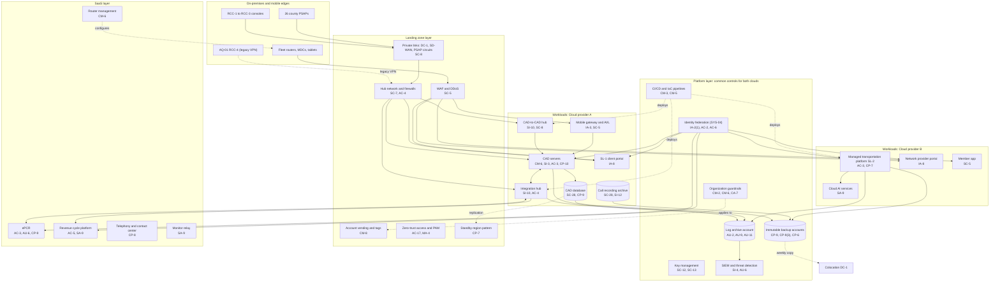

# Cloud Architecture and Control Placement: Cris Santos Company | Emergency Services | Enterprise

**Organization:** Cris Santos Company, Inc. (publicly traded private ambulance provider) | **Tier:** Enterprise | **Provider:** Multi-cloud, vendor-agnostic: two public cloud providers (called Cloud provider A and Cloud provider B), one colocation data center, and SaaS (see section 4)
**Owner:** Director of Cloud Platform Engineering, with the CISO | **Date:** 2026-08-31 | **Related:** EDPCP SSP (P02), enterprise BIA (P05)

## 1. Architecture in layers
The estate is organized in four layers. Each lower layer provides **common controls** that the layers above inherit, so a workload team configures only what is specific to its system.

| Layer | What it is | Examples | Who runs it |
|---|---|---|---|
| **Platform** | Organization-wide services in both clouds | Cloud organization guardrails, identity federation, key management, log archive, SIEM feeds, vulnerability and posture management, immutable backup accounts, CI/CD pipelines | Cloud Platform Engineering; Security Operations; Identity team |
| **Landing zone** | The standard account (subscription or project) pattern every workload lands in | Account vending with mandatory tags, hub-and-spoke network with cloud firewalls, private connectivity to DC-1, SD-WAN, and county PSAP circuits, WAF and DDoS protection, zero-trust and PAM access, a standby region pattern for tier-1 workloads | Cloud Platform Engineering; Network Engineering |
| **Workload** | Systems built or run by the company | Cloud A: enterprise CAD and CAD database, CAD-to-CAD hub, mobile gateway and AVL, call recording archive, integration hub, SL-1 client portal, data platform. Cloud B: managed transportation platform (SL-2), network provider portal, member app, cloud AI services | Application teams (for example, the Director of CAD and Dispatch Systems) |
| **SaaS** | Vendor-operated applications | ePCR, revenue cycle platform, telephony and contact center, vehicle router management, cardiac monitor relay, ERP and payroll, productivity suite, CAD vendor AI triage service | Vendors, with the company's configuration and oversight |

Colocation DC-1 (Georgia) hosts the network core, telephony gateways, and an offline copy of the immutable backups. The communications centers and the fleet are on-premises and mobile edges of the EDPCP; they connect to the cloud through the landing zone (SD-WAN and the mobile gateway).

## 2. Diagram

## 3. Responsibility by service model
Sources: SRC-AWS-SRM, SRC-AZURE-SRM, and SRC-GCP-SRM in `00_universal-framework/sources/source-register.csv`. The three published models agree on the split used here, so the design does not depend on which two providers the company uses.

| Service model | Provider | Company (customer) | Shared |
|---|---|---|---|
| IaaS (CAD servers) | Facilities, hosts, hypervisor, physical network | Guest OS, CAD application, identities, data, network policy | Encryption (provider service, customer keys), logging |
| PaaS (CAD database, containers, AI services) | Also the platform runtime and its patching | Data, access, configuration, keys, application code | Backups, availability configuration |
| SaaS (ePCR, revenue cycle, telephony, router management) | Also the application | Users, roles, data, oversight of the vendor | Audit review (complementary user entity controls) |
| Colocation | Building, power, cooling, perimeter | Racks, equipment, cage access lists | None |

## 4. Service categories and provider equivalents
| Service category | AWS | Microsoft Azure | Google Cloud |
|---|---|---|---|
| Organization guardrails | AWS Organizations service control policies | Azure Policy with management groups | Organization Policy Service |
| Account vending | AWS Control Tower account factory | Azure landing zone subscription vending | Resource Manager project creation |
| Key management | AWS KMS | Azure Key Vault | Cloud KMS |
| Audit logging | AWS CloudTrail | Azure Monitor activity log | Cloud Audit Logs |
| Threat detection | Amazon GuardDuty | Microsoft Defender for Cloud | Security Command Center |
| Managed relational database with cross-region replica | Amazon RDS | Azure SQL Database | Cloud SQL |
| Managed containers | Amazon EKS | Azure Kubernetes Service | Google Kubernetes Engine |
| Web application firewall | AWS WAF | Azure Web Application Firewall | Cloud Armor |
| Backup service | AWS Backup | Azure Backup | Backup and DR Service |

This table is for reading provider documentation only. The architecture, control map, and SSP describe service categories.

## 5. Common controls
`cloud-control-map.csv` has **65 rows** across 35 components: Platform 20, Landing zone 8, Workload 22, SaaS 12, Colocation 3. Responsibility: Customer 43, Shared 16, Provider 6.

**30 rows are published as common controls** (`common_control` = Yes) in the enterprise common control catalog. They map to the common control providers in the EDPCP SSP (P02 section 10.3): identity (CCP-02), landing zone (CCP-03), security operations (CCP-04), network (CCP-05), and colocation (CCP-07). A workload inherits them by being deployed through account vending, which applies the guardrails, logging, network, key, and backup policies automatically.

**Rules for inheriting:**
1. A workload may claim a common control only if its account was created by account vending and passes the posture baseline.
2. Customer-side identity, data protection, and logging stay explicit at every layer: even a SaaS application has Customer rows for access (AC-3, AU-6) because those are always the company's responsibility.
3. SaaS rows cite the vendor's SOC report, reviewed by the third-party risk team (P09 evidence map). Where no SOC report exists (the cardiac monitor relay), the row says so.

## 6. Validation against the EDPCP SSP (P02)
Every cloud component in the SSP boundary appears here with controls from each required family, directly or inherited:
| EDPCP component | AC | AU | CM | IA | SC | SI / CP |
|---|---|---|---|---|---|---|
| CAD application servers | AC-3 | AU-2, AU-9 (inherited) | CM-6, CM-2 (inherited) | IA-2(1) (inherited) | SC-7 (inherited) | SI-3, CP-10 |
| CAD database | AC-6 (inherited) | AU-2 (inherited) | CM-6 (inherited) | IA-2(1) (inherited) | SC-28 | CP-9, SI-2 (provider) |
| CAD-to-CAD hub | AC-4 (inherited) | AU-2 (inherited) | CM-3 (inherited) | IA-2(1) (inherited) | SC-8 | SI-10 |
| Mobile gateway and AVL | AC-4 (inherited) | AU-2 (inherited) | CM-3 (inherited) | IA-3 | SC-5 | SI-4 (inherited) |
| Call recording archive | AC-6 (inherited) | AU-9 (inherited) | CM-6 (inherited) | IA-2(1) (inherited) | SC-28 | SI-12 |
| ePCR tenant | AC-3 | AU-6 | Vendor | IA-2(1) (inherited) | Vendor | CP-9 (vendor) |

## 7. Findings from the mapping
1. **Acquired-operation connectivity.** AQ-01's site VPN lands on the hub and can reach the integration hub subnet, bypassing SD-WAN segmentation (P07 SC-7). Fix: restrict the VPN to named hosts now, then migrate AQ-01 to SD-WAN and the enterprise CAD (POAM-016).
2. **Failover is a workload responsibility.** The landing zone provides the standby region, but only the CAD team can cut over 26 PSAP interfaces and DNS. That manual step is why the 2026-05-14 test missed the 1-hour RTO (POAM-011).
3. **Two clouds, one control set.** Guardrails, logging, and key policies are written once as code and applied to both clouds. Differences are limited to service names (section 4).
4. **Fleet devices sit behind a SaaS control plane.** The router management service configures about 1,290 routers, but its SOC report excludes the firmware pipeline and about 160 routers are past end of support (POAM-009; POAM-015).
5. **PSAP links are a shared boundary.** 4 legacy PSAP links do not support TLS; the private circuit is the only protection until the counties upgrade (POAM-017).
6. **AI services** run under the cloud provider's BAA with no training on customer data. The AI governance committee reviews each new model deployment (P10).
