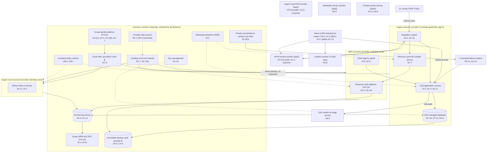
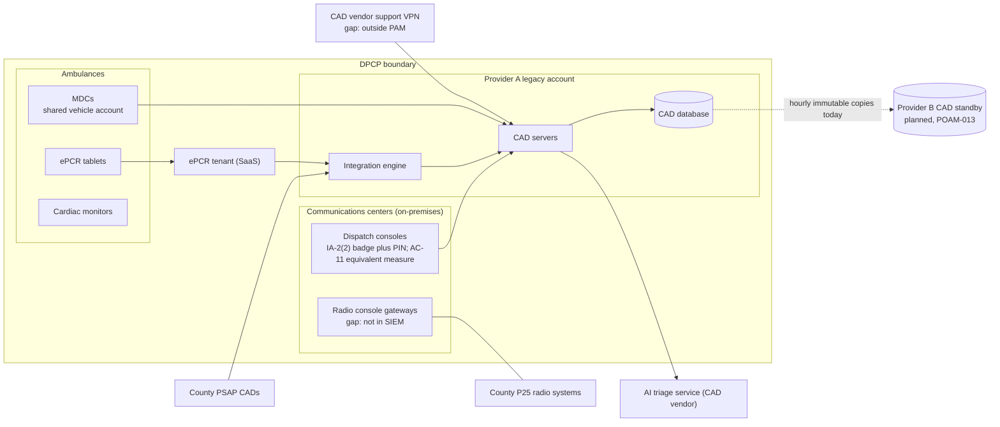

# Cloud Architecture and Control Placement: Cris Santos Company Holdings | Emergency Services | Multi-Sector

**Organization:** Cris Santos Company Holdings, Inc. | **Tier:** Multi-Sector | **Providers:** two public cloud providers, called provider A and provider B (vendor-agnostic; see section 5)
**Scope:** the shared corporate cloud platform (SYS-G3 landing zones) plus the division workloads that run on it or beside it. The SSP system (P02) is the Dispatch and Patient Care Platform (DPCP).

## 1. Design in one paragraph
Corporate runs one **landing zone** per provider: identity federation from SYS-G1, a hub network with inspection, guardrail policies, a central log archive, key management, EDR, and an immutable backup vault in provider B. Divisions get their own accounts inside the landing zone and inherit these guardrails. The exception is the **legacy account** created in 2019: it holds the CAD servers, the CAD database, the integration engine, and the BDS revenue cycle file transfer servers on one shared management subnet, peers directly with the hub without inspection, and is outside the guardrails (gap 3). Most other division systems are vendor SaaS: the ePCR and the cardiac monitor relay (Ambulance Services), the EHR and telehealth service (Urgent Care), and the contact-center service and the CAD vendor's AI triage service (BDS). Communications center equipment and about 2,400 vehicles' mobile systems are on-premises or in the field.

## 2. Diagrams
### 2.1 Group landing zone and division workloads

### 2.2 Dispatch and Patient Care Platform (SSP boundary)

**Target state (POAM-003, POAM-012, POAM-013):** the CAD, its database, and the integration engine move to a dedicated DPCP account in the provider A landing zone, inspected by the hub and covered by guardrails; the revenue cycle file transfer servers move to a separate BDS account with no route to the CAD management network; CAD vendor support uses group PAM with recorded sessions; and a warm CAD standby in provider B can take over within the 1-hour RTO.

## 3. Common versus division-specific controls
`cloud-control-map.csv` has 50 rows across 28 components. The `control_scope` column shows who owns each placement:

| Scope | Rows | What it means |
|---|---|---|
| Common (group) | 20 | Provided once by corporate (SYS-G1, SYS-G2, SYS-G3) and inherited by every division account. Listed in the P02 common control catalog |
| Shared system (DPCP) | 11 | Controls of the shared dispatch platform documented in the P02 SSP |
| Division-specific (Ambulance Services) | 7 | ePCR, tablets, vehicle routers, MDCs, monitor relay |
| Division-specific (Urgent Care) | 5 | EHR customer duties, online check-in, telehealth |
| Division-specific (BDS) | 7 | Revenue cycle platform, file transfer servers, contact-center service, communications center equipment |

| Responsibility | Rows |
|---|---|
| Customer (the group or a division) | 38 |
| Shared (provider and group) | 7 |
| Provider | 5 |

**Rule of thumb.** Identity, network guardrails, logging, keys, backups, and EDR are **common**. A division cannot opt out of them, only request an exception through POL-01. Application behavior, client partitions, field devices, and customer-facing identity are **division-specific**, because they depend on each division's regulators, clients, and counties.

## 4. Layers
| Layer | Common components | Division components | Key controls | Responsibility |
|---|---|---|---|---|
| Identity | SYS-G1, cloud IAM | MDC vehicle accounts, client agency users, patient check-in identity | AC-2, AC-3, AC-6(5), IA-2, IA-2(1), IA-8 | Customer (configuration); vendor (service) |
| Network | Hub network, private links | Legacy account peering, vehicle tunnels, county interfaces | SC-7, SC-7(5), SC-8(1), AC-4, IA-3 | Customer, with provider DDoS protection shared |
| Compute | EDR on all servers | CAD servers, integration engine, file transfer servers | SI-2, SI-3, AC-17, CA-3 | Customer (guest OS and applications) |
| Data | Keys, backup vault | CAD database, revenue cycle platform | SC-12, SC-28, CP-9, CP-6, CP-10 | Shared: provider encrypts; group owns keys, retention, and restores |
| Logging and monitoring | Log archive, SIEM | CAD audit records, console logs | AU-3, AU-6, AU-9, AU-11, AU-12, SI-4 | Shared: providers generate platform logs; group retains and reviews |
| SaaS dependencies | Identity and SIEM vendors | ePCR, EHR, telehealth, monitor relay, contact center, AI triage | SA-9, CP-9, AU-6, AU-9 | Provider for the service; customer for use and oversight |
| Physical | Provider data centers | Communications centers | PE-3, PE-11, MP-6 | Provider (data centers); BDS (centers) |

## 5. Service categories and provider equivalents
The design does not depend on a provider. This table gives each provider's name for each service category, for reading its shared responsibility documentation.

| Service category | AWS | Microsoft Azure | Google Cloud |
|---|---|---|---|
| Account structure and guardrails | AWS Organizations with service control policies | Management groups with Azure Policy | Resource hierarchy with Organization Policy |
| Virtual machines (CAD servers) | Amazon EC2 | Azure Virtual Machines | Compute Engine |
| Managed relational database (CAD database) | Amazon RDS | Azure SQL Database | Cloud SQL |
| Key management | AWS KMS | Azure Key Vault | Cloud KMS |
| Audit logging | AWS CloudTrail | Azure Monitor activity log | Cloud Audit Logs |
| Backup with immutability | AWS Backup (vault lock) | Azure Backup (immutable vault) | Backup and DR Service |
| Private connectivity | AWS Direct Connect / Site-to-Site VPN | Azure ExpressRoute / VPN Gateway | Cloud Interconnect / Cloud VPN |

Shared responsibility sources: SRC-AWS-SRM, SRC-AZURE-SRM, SRC-GCP-SRM in `00_universal-framework/sources/source-register.csv`. All three agree on the split used here: for IaaS the provider owns facilities, hosts, and virtualization; for PaaS the provider also owns the runtime; for SaaS the provider owns the application. The customer always keeps identities, access decisions, data classification, and data.

## 6. Findings from the mapping
1. **The legacy account is the weak point, not the providers.** Encryption, keys, and backups are sound (SC-28, SC-12, CP-9). The CAD and the revenue cycle file transfer servers share a management subnet that bypasses hub inspection and guardrails (AC-4, SC-7, CM-6). An attacker in either system can reach the other. This is the path the P08 scenario uses (P01 GR-02; POAM-012).
2. **Recovery stops at the provider A boundary.** The CAD database restores to any point in 35 days, but only inside provider A. Hourly copies reach the provider B vault, but there is nothing in provider B to run them on (CP-10; P01 GR-01; POAM-013).
3. **Field devices are the largest unmanaged estate.** About 2,400 routers and MDCs connect straight to the CAD with a shared tunnel key and shared vehicle accounts (IA-3, IA-2, CM-6). They are division-specific rows because the Ambulance fleet team runs them, which is also why their inheritance is not documented (P02 section 10.2).
4. **SaaS dependencies carry regulated decisions and data.** The AI triage service receives live call audio from internal and client agency callers (SA-9; gap 6), and the contact-center service holds recordings that may contain card numbers (AU-9; gap 9).
5. **Common controls are strong and reused.** One identity platform, one SIEM, one backup design, assessed once by group internal audit (P07).
