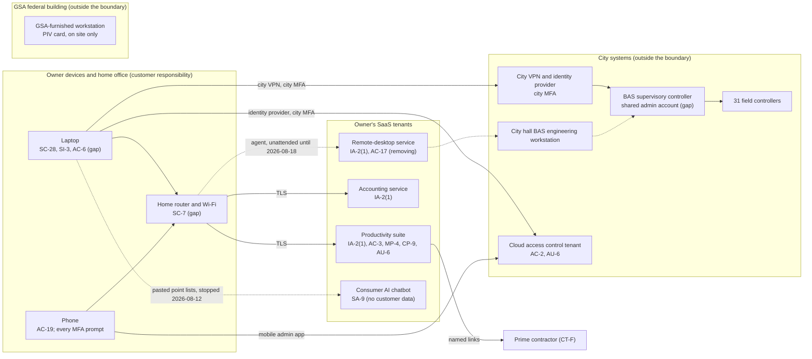

# SaaS Architecture and Control Placement: Cris Santos Company | Government Services and Facilities | Sole Proprietorship

**Organization:** Cris Santos Company (facilities support contractor operating government buildings) | **Tier:** Sole Proprietorship | **Provider:** SaaS only (no IaaS or PaaS)
**System:** Building Systems Support Environment (BSSE), as defined in the system profile (P02) | **Mapped:** 2026-08-12, with the on-call IT technician | **Adopted:** 2026-09-04

## 1. Diagram
Control IDs on each node are the ones in `cloud-control-map.csv`. Solid lines are approved paths. Dashed lines are paths being closed. The city's and GSA's systems are drawn for context; they are outside the BSSE boundary.

The owner's laptop never connects to GSA's Building Systems Network. GSA's BAS is used only on site, on the GSA-furnished workstation, with the owner's PIV card.

## 2. Layers
| Layer | Components | Key controls | Responsibility |
|---|---|---|---|
| Identity | Suite, accounting, remote-desktop, and city accounts; the phone as the MFA device | IA-2(1), AC-2, AC-19 | Owner configures and protects; providers and the city supply MFA |
| Data | Drawings, cardholder exports, CUI, controller programs | AC-3, MP-4, SC-28, CP-9 | Providers encrypt and keep versions; the owner decides where data goes, who gets a link, and what is backed up |
| Endpoints | Laptop, phone | SC-28, SI-3, AC-6, AC-19 | Owner |
| Network | Home router and Wi-Fi; city VPN | SC-7, AC-17 | Owner at home; the city for the VPN |
| Logging | Suite sign-ins, remote-desktop sessions, access control audit trail | AU-6 (owner), AU-2 (providers and city) | Shared: providers and the city record, the owner reviews |
| SaaS platforms and hosting | Suite, accounting, remote-desktop, chatbot, access control platforms | Inherited (SC-5, SC-28, PE family) | Providers |

## 3. Shared responsibility for SaaS
All three major cloud providers' shared responsibility models (SRC-AWS-SRM, SRC-AZURE-SRM, SRC-GCP-SRM) agree on the SaaS split: the provider runs the application, the platform, and the data centers; **the customer always keeps its identities and accounts, its data, and its devices.** That is why 12 of the 19 rows in the control map are the owner's, 5 are shared, and only 2 are the provider's alone. No IaaS equivalents table is needed, because the business runs no infrastructure.

Two rows are a special case. The **city's access control tenant and VPN** are the city's SaaS and network, not the owner's. The city is the customer of those vendors. The owner is a privileged user inside them, so the owner's duties there are account hygiene, MFA, and reviewing what the owner's own account did.

## 4. Findings from the mapping
1. **"Anyone with the link" was the default for new sharing links.** One such link, created in June 2025 to send a CUI drawing set to the prime, was still active. The owner changed the tenant default to named people, disabled the link on 2026-08-12, and told the prime's security officer the same day (BTTRG 1.6.1 path; P01 R-008).
2. **The remote-desktop path is the biggest exposure in the whole boundary.** It was set up in November 2024 with the facilities manager's verbal approval, but the city IT manager never knew, it skipped the city VPN and its MFA, and the account had a password only. No SaaS setting fixes an unapproved path; only removing it does (P01 R-001).
3. **Controller programs have no cloud copy.** The engineering folder is excluded from sync, so the only copy of each controller program and door schedule export is on the laptop (P01 R-005).
4. **The phone is part of the security boundary.** It holds every MFA prompt and the access control mobile administrator app. Losing it is both a lockout and an exposure risk (P01 R-007).
5. **The consumer AI chatbot had its model-improvement setting on** while city point lists and a door schedule excerpt were pasted into it. The owner turned the setting off and deleted the chat history on 2026-08-12 (P01 R-013; P10).
6. **The home router is not managed** (default administrator password, old firmware, shared with family devices) (P01 R-012).
