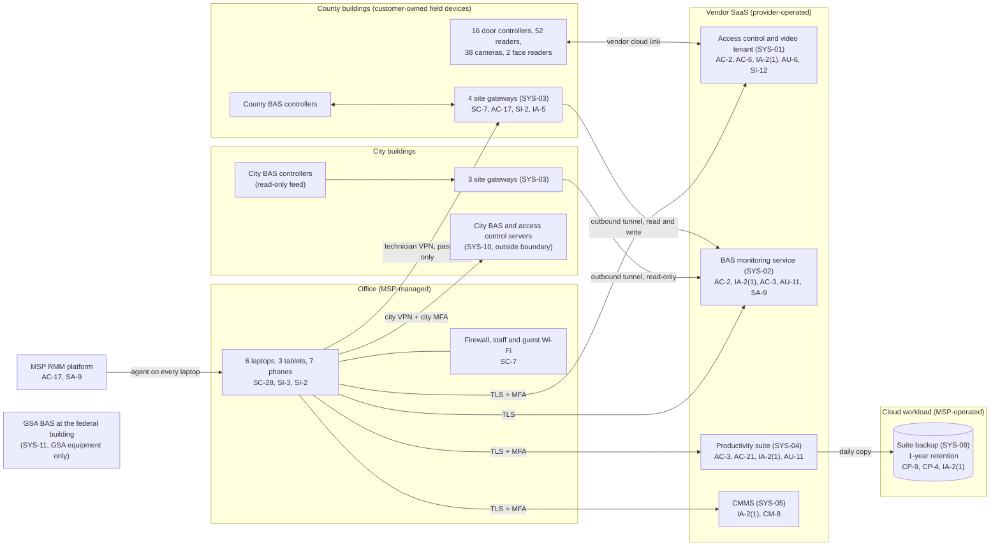

# Cloud Architecture and Control Placement: Cris Santos Company | Government Services and Facilities | Micro

**Organization:** Cris Santos Company, LLC (facilities support contractor operating government buildings) | **Tier:** Micro | **Provider:** Vendor-agnostic SaaS (see section 3)
**System:** Building Systems Operations Platform (BSOP), as defined in the SSP (P02) | **Prepared:** 2026-07-24 by the Office and Compliance Manager with the Lead Controls Technician and the MSP lead technician | **Approved:** owner, 2026-08-31

## 1. Diagram
The company runs no servers and no IaaS tenant. Its "cloud" is two operational SaaS platforms (access control and BAS monitoring), the office SaaS, and one cloud workload that the MSP operates for it: the SaaS-to-SaaS backup of the productivity suite (SYS-08). The only company hardware outside the office is the 7 site gateways (SYS-03) in customer buildings.

## 2. Layers and who is responsible
| Layer | Components | Key controls | Customer (the company) | MSP (on the company's behalf) | Provider (SaaS vendor) |
|---|---|---|---|---|---|
| Identity | SYS-01, SYS-02, suite, CMMS, backup console, gateway logins | AC-2, IA-2(1), IA-5 | Decides who gets access; removes it; enforces MFA settings; owns gateway passwords | Creates and disables suite and laptop accounts; holds the backup console login | Runs the sign-in and MFA services |
| Network | Site gateways, office firewall, Wi-Fi | SC-7, AC-17, SI-2 | Configures and patches the gateways (Lead Controls Technician) | Office firewall and Wi-Fi only | Not applicable |
| Endpoints | Laptops, tablets, phones | SC-28, SI-3, SI-2, AC-6 | Approves local administrator use; keeps the inventory | Encryption, antivirus, patching | Not applicable |
| SaaS applications | SYS-01, SYS-02, suite, CMMS | AC-3, AC-6, AC-21, AU-2 | Roles, site write settings, sharing settings, alarm rules | Suite settings on request | Application, platform, data centers |
| Data | Cardholder records, face templates, video, drawings, CUI, controller programs | CP-9, SC-28, SI-12 | Retention, CUI folder, engineering repository, restore testing | Runs the suite backup and restore tests | Encrypts and backs up its own platform |
| Logging | SYS-01 audit trail, SYS-02 audit log, suite logs, gateway logs | AU-2, AU-6, AU-11 | **Reviews logs weekly and exports them monthly (gap today)** | Antivirus alerts in business hours | Generates and stores logs for the plan's period |
| Vendor governance | SOC 2 review, questionnaires, contract terms | SA-9 | Reviews SOC 2 reports; signs security terms | Holds the backup provider relationship | Provides SOC 2 reports (SYS-01 only) |

**The MSP is not a cloud provider in the shared responsibility sense.** It performs customer-side duties for the company. Anything marked "Customer (performed by MSP)" in `cloud-control-map.csv` stays the company's responsibility under the county exhibit. The company must direct the work, receive evidence, and check it (SA-9).

**The gateways are not cloud at all.** They are company-owned devices inside customer buildings and the only company equipment on customer networks. They are mapped here because they are the bridge between the cloud services and the customers' operational technology, and because no provider takes any responsibility for them.

## 3. Service categories and provider equivalents
The design is vendor-agnostic. For SaaS, all three major cloud providers' shared responsibility models split the work the same way: the provider runs the application, platform, and infrastructure; the customer keeps identities, access, data, and devices (SRC-AWS-SRM, SRC-AZURE-SRM, SRC-GCP-SRM in `00_universal-framework/sources/source-register.csv`). The vendor's SOC 2 report or security documentation is the evidence for the provider side.

| Service category used | What it is here | Equivalent category in the large cloud providers (for reading their documentation) |
|---|---|---|
| Industry SaaS (physical security) | Cloud access control and video management (SYS-01) | Industry SaaS built on any provider |
| Industry SaaS (building operations) | BAS monitoring and alarm service (SYS-02) | IoT and industrial data services |
| Productivity suite | Email, files, chat | Productivity and collaboration SaaS |
| SaaS-to-SaaS backup | Suite backup (SYS-08) | Backup service or third-party SaaS backup |
| Work order management | CMMS (SYS-05) | Line-of-business SaaS |
| Remote monitoring and management | MSP device management | Device management SaaS |

## 4. Findings from the mapping
1. **The company's own side is the weak layer.** The two operational SaaS platforms are sound, and SYS-01 is evidenced by a SOC 2 report. The gaps are in what the company configures: a shared password-only account on SYS-02 with write access to county buildings (R-001), full administrator rights for every technician on SYS-01 (R-002), and no review of either platform's audit log (R-014).
2. **The gateways have no owner on the provider side and too little on the customer side (SC-7, AC-17, SI-2).** No vendor patches them, the MSP does not touch them, and the technician VPN uses a password alone and reaches the whole building network. Fix: MFA with device certificates, VPN limited to the supervisory and engineering ports, and quarterly firmware review (R-004, R-023).
3. **Backup covers the wrong things (CP-9, CP-4).** SYS-08 backs up the suite, which already has vendor resilience, but not the controller programs and configuration exports that exist only on laptops. Fix: an engineering repository inside the suite so SYS-08 picks it up, monthly SYS-01 and SYS-02 configuration exports, and quarterly restore tests (R-006).
4. **CUI sits in a general SaaS folder (AC-3, AC-21).** A restricted folder for 4 named people, with "anyone" links blocked, fixes most of it (R-007).
5. **The MSP's reach is total and unevidenced (AC-17, SA-9).** The RMM can run commands on every laptop, and a laptop holds the gateway VPN profile. Fix: a security addendum with MFA on the RMM and 24-hour incident notice (R-010).
6. **The face verification module sits inside SYS-01 but outside the vendor's SOC 2 period.** The vendor's controls for templates are unevidenced until the next report or a vendor letter (P09, P10).
