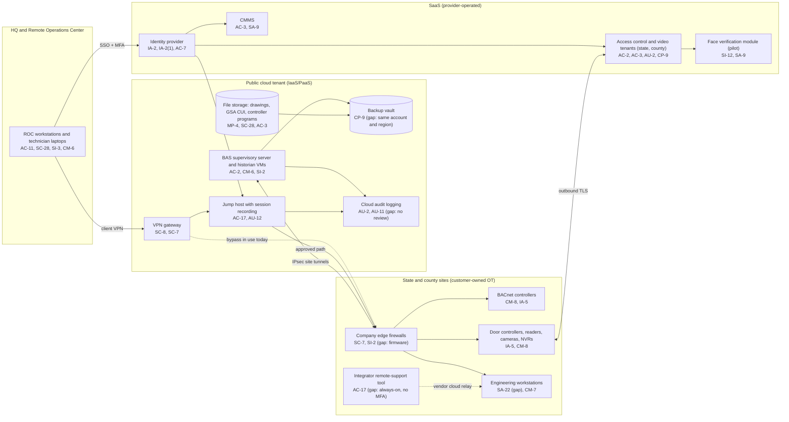

# Cloud Architecture and Control Placement: Cris Santos Company | Government Services and Facilities | Small

**Organization:** Cris Santos Company, LLC (facilities support contractor operating government buildings) | **Tier:** Small | **Provider:** Vendor-agnostic (see section 3)
**System:** Facility Operations Technology Platform (FOTP), as defined in the SSP (P02)

## 1. Diagram

The federal building is not in the diagram. Its BAS runs on GSA servers on the GSA Building Systems Network, reached only through GSA's virtual desktop with a PIV card. GSA provides that boundary, its logging, and its scanning (BTTRG v3.0, sections 1.1 and 1.2).

## 2. Layers
| Layer | Components | Key controls | Responsibility |
|---|---|---|---|
| Identity | Identity provider, cloud IAM, supervisory server accounts, access control administrator accounts | AC-2, AC-6, IA-2, IA-2(1), IA-5 | Company (configuration and accounts); providers (service) |
| Remote access | Client VPN, jump host, integrator tool (to be removed) | AC-17, MA-4, AU-12 | Company |
| Network / edge | Cloud network rules, VPN gateway, site edge firewalls | SC-7, SC-8, SI-2 | Company; the provider runs the VPN gateway service |
| Compute / application | Supervisory server and historian VMs, jump host VM | CM-6, CM-7, SI-2, SI-3 | Company (guest OS and application) |
| Data | Object storage (drawings, CUI, programs), VM disks, backup vault | SC-28, CP-9, MP-4, SC-13 | Shared: provider encrypts; company sets keys, access, retention, and isolation |
| Logging / monitoring | Cloud audit logs, identity sign-in logs, jump host recordings, access control audit trail | AU-2, AU-6, AU-11, SI-4 | Shared: providers generate; company retains and reviews |
| SaaS applications | Access control and video, face verification module, CMMS | AC-3, AU-3, CP-9, SA-9 | Provider (application and infrastructure); company (users, roles, door schedules, data) |
| On-site OT | Edge firewalls and workstations (company); controllers and cameras (customer) | CM-8, IA-5, SA-22 | Company for its devices; customers own field devices, company maintains them under contract |
| Physical / hypervisor | Provider data centers | PE family | Provider (inherited) |

## 3. Service categories and provider equivalents
The design does not depend on one provider. This table gives each provider's name for the service category, for reading its shared responsibility documentation.

| Service category | AWS | Microsoft Azure | Google Cloud |
|---|---|---|---|
| Virtual machines | Amazon EC2 | Azure Virtual Machines | Compute Engine |
| Object storage | Amazon S3 | Azure Blob Storage | Cloud Storage |
| Backup service | AWS Backup | Azure Backup | Backup and DR Service |
| Identity and access management | AWS IAM | Azure role-based access control with Microsoft Entra ID | Cloud IAM |
| Key management | AWS KMS | Azure Key Vault | Cloud KMS |
| Audit logging | AWS CloudTrail | Azure Monitor activity log | Cloud Audit Logs |
| Site-to-site and client VPN | AWS Site-to-Site VPN and Client VPN | Azure VPN Gateway | Cloud VPN |
| Network filtering | Security groups | Network security groups | VPC firewall rules |

Shared responsibility sources: SRC-AWS-SRM, SRC-AZURE-SRM, SRC-GCP-SRM in `00_universal-framework/sources/source-register.csv`. All three agree on the split used here:
- **IaaS:** the provider owns facilities, hosts, and virtualization. The company owns guest operating systems, applications, network rules, identities, and data.
- **SaaS:** the provider also owns the application. The company keeps identities, roles, configuration (door schedules, alarm routing), and data.

## 4. Findings from the mapping
1. **Remote access bypasses the jump host (AC-17).** The client VPN routes straight to the site edge firewalls, so technicians skip the jump host and its recording. The integrator's remote-support tool reaches a county workstation through the vendor's own cloud relay, outside every company control. Fix: VPN routes only to the jump host; site firewalls accept management traffic only from the jump host; remove the tool (P01 R-001, POA&M POAM-001).
2. **Backup isolation (CP-9).** The backup vault shares the production account, region, and administrator roles. Fix: separate backup account, immutable retention, second region (R-006).
3. **CUI in general storage (MP-4).** GSA CUI drawings sit in the same storage container as other files, readable by all staff. Fix: a separate container with named access, customer-managed key, and access logging (R-010).
4. **Logs exist but no one reads them (AU-6, AU-11).** Retention runs from 7 days (edge firewalls) to 1 year (access control). Fix: export to a log workspace with 1-year retention and weekly review (R-017).
5. **SaaS controls depend on the vendor's report.** Controls marked "Provider" or "Shared" for the access control platform rely on the vendor's SOC 2 Type 2 report and its complementary user entity controls, reviewed in P09.
6. **Face templates live in the SaaS platform (SYS-12).** The company controls enrollment, retention settings, and deletion; the vendor stores the templates. Retention and deletion settings are part of the P10 conditions.
